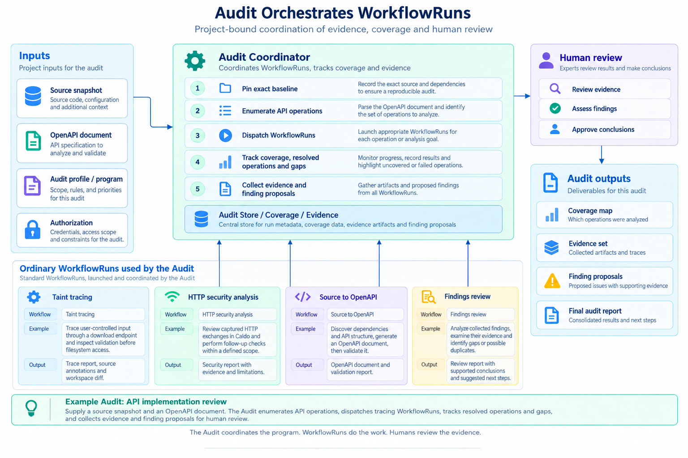
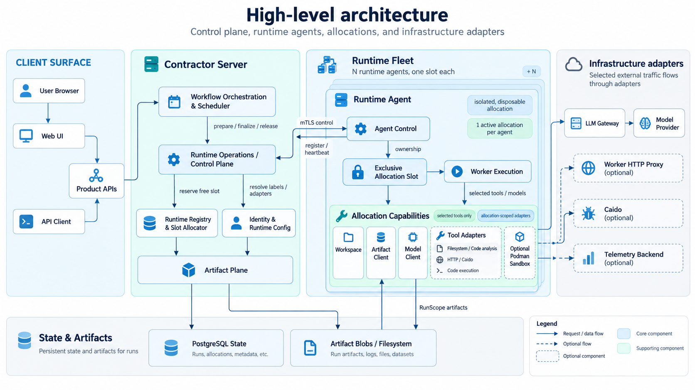

# Contractor

Contractor is an **Application Security orchestration platform** for defining,
running and coordinating AI-assisted security checks.

**Workflows** define individual checks and supporting analyses: source security
review, HTTP/Caido-assisted analysis, taint tracing, OpenAPI operation analysis
and findings review. OpenAPI and LikeC4 generation provide supporting artifacts.
The catalog is extensible through versioned Workflows, agent definitions, tools
and Skills. Each Workflow declares its Stages, inputs, outputs and transitions;
a **Run** is one execution of that definition.

An **Audit** is a higher-level abstraction over Workflows. Within a Project, it
coordinates WorkflowRuns against a shared baseline and scope, tracks coverage,
collects evidence and findings, and supports review and reporting. A versioned
AuditProfile selects the Workflows and assessment rules for a checklist, a
standards-based review or another supported assessment program. Workflows can
also run independently of an Audit.

For an API implementation review, a source snapshot and an OpenAPI document
become the pinned baseline. The review also defines its authorization context:
credentials, access scope and execution constraints.
The Audit builds a worklist from API operations,
dispatches the Workflows selected by its profile, and gathers results into a
coverage map and evidence set. Finding proposals and unresolved gaps remain
available for human review and the final Audit report. See the
[Audit walkthrough](docs/guides/audits.md) for a runnable example.

The Go Server schedules Stages, and each Stage's Planner coordinates Workers
inside Python Runtime Agents. Versioned configuration and pinned artifact
revisions keep each Run's inputs and execution settings explicit.

The application can run on one host: Server, PostgreSQL, one or more Runtime
Agents, and an optional independently built React UI served by Node. Model
calls go through an external OpenAI-compatible Gateway. Artifact payloads use
PostgreSQL by default or a configured filesystem backend.

## Get started

Follow [deployment](docs/deployment.md) to install and run Contractor, or the
[CLI guide](docs/guides/cli.md) to connect to an existing Server. To build from
source, start with [development setup](docs/development.md).

## Documentation

[Guides and references](docs/README.md) · [Specification](docs/spec/README.md) ·
[Configuration catalog](configs/README.md)

## Repository map

| Path | Contents |
| --- | --- |
| [`cmd/`](cmd/) and [`internal/`](internal/) | Go CLI, Server and execution services |
| [`runtime/`](runtime/README.md) | Python Runtime Agent and toolsets |
| [`ui/`](ui/README.md) | React UI and Node static service |
| [`api/`](api/README.md) | Public OpenAPI, private schemas and shared fixtures |
| [`configs/`](configs/README.md) | Versioned Workflows, policies, instructions and Skills |
| [`deploy/`](deploy/) | Deployment examples |
| [`docs/`](docs/README.md) | Guides, specifications and research |
| [`tests/`](tests/) and [`testdata/`](testdata/) | Integration tests, evaluations and fixtures |
| [`tasks/`](tasks/index.yml) | Implementation status and verification evidence |

The v2 [working specifications](docs/spec/README.md) define accepted contracts;
individual task files record their implementation and verification status.
