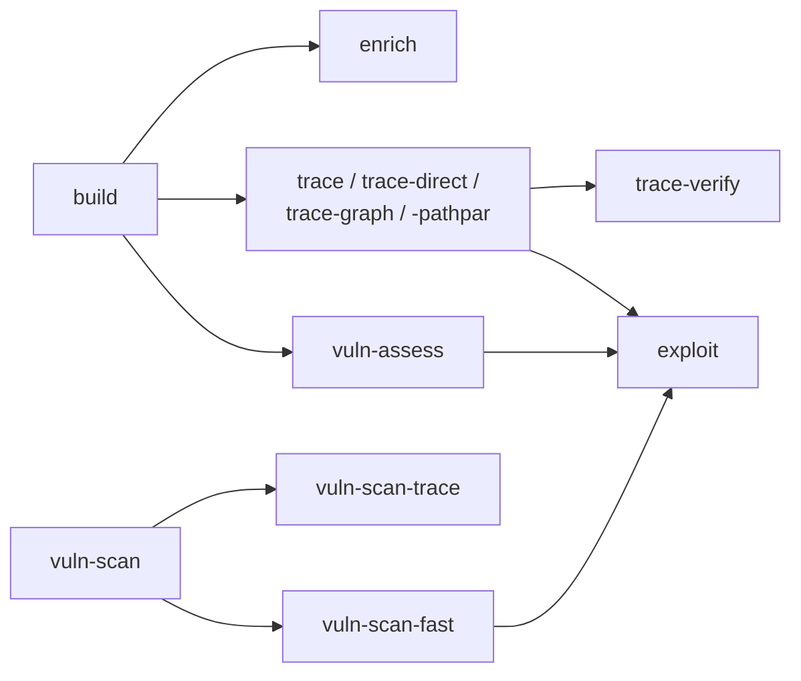

# Workflows

Each subfolder here is one workflow: a `workflow.py` (the thin assembler that
builds `TaskInvocation`s and hands them to a runner), a `config.yaml` (its
tunable budgets / tasks / per-agent tool options), an `__init__.py` re-exporting
the public `*Workflow` class, and a `README.md` describing it. The registry lives
in [`__init__.py`](__init__.py) (`get_workflows()`); the typed config loader is
[`config.py`](config.py) (`WorkflowConfig.load(__file__)`).

See the repo [CLAUDE.md](../../CLAUDE.md) for the cross-cutting invariants
(artifacts-only task communication, `iterations` vs `max_attempts`, the strict
subtask state machine, the sandboxed / overlay filesystem).

## Registry

| CLI alias | Folder | What it does |
|-----------|--------|--------------|
| `build` | [`oas_building`](oas_building/README.md) | Generate an OpenAPI spec from source. |
| `enrich` | [`oas_enrichment`](oas_enrichment/README.md) | Deepen an existing OpenAPI spec. |
| `likec4` | [`likec4_building`](likec4_building/README.md) | Build a LikeC4 architecture model. |
| `trace` | [`trace_annotation`](trace_annotation/README.md) | Planner-driven per-path source tracing + vuln reporting. |
| `trace-direct` | [`trace_annotation_direct`](trace_annotation_direct/README.md) | Same, planner-free (one agent call per operation). |
| `trace-graph` | [`trace_graph`](trace_graph/README.md) | `trace-direct` with call-graph tools (production default). |
| `trace-graph-pathpar` | [`trace_graph_pathpar`](trace_graph_pathpar/README.md) | `trace-graph` with paths run in parallel. |
| `trace-verify` | [`trace_verify`](trace_verify/README.md) | Static (code-only) verification of trace findings. |
| `vuln-scan` | [`vuln_scan`](vuln_scan/README.md) | Single breadth-first vuln scan pass. |
| `vuln-scan-trace` | [`vuln_scan_trace`](vuln_scan_trace/README.md) | BFS scan → DFS trace per finding. |
| `vuln-scan-fast` | [`vuln_scan_fast`](vuln_scan_fast/README.md) | High-recall scan → dedup → trace-confirm → exploit ("Workflow B"). |
| `vuln-assess` | [`vuln_assess`](vuln_assess/README.md) | Full spec-driven assess: OAS → trace → exploit ("Workflow A"). |
| `exploit` | [`exploitability`](exploitability/README.md) | Probe a live target to confirm findings. |
| `router` | [`router`](router/README.md) | Prompt-driven dispatch to specialist sub-agents. |

## How they relate

The OpenAPI artifact (`oas-openapi-building`) produced by `build` is the shared
input for `enrich`, the whole `trace*` family, and `vuln-assess`. The
`vuln-scan*` family instead works directly off the raw codebase. `exploit` is the
terminal live-verification stage reused by several pipelines.
