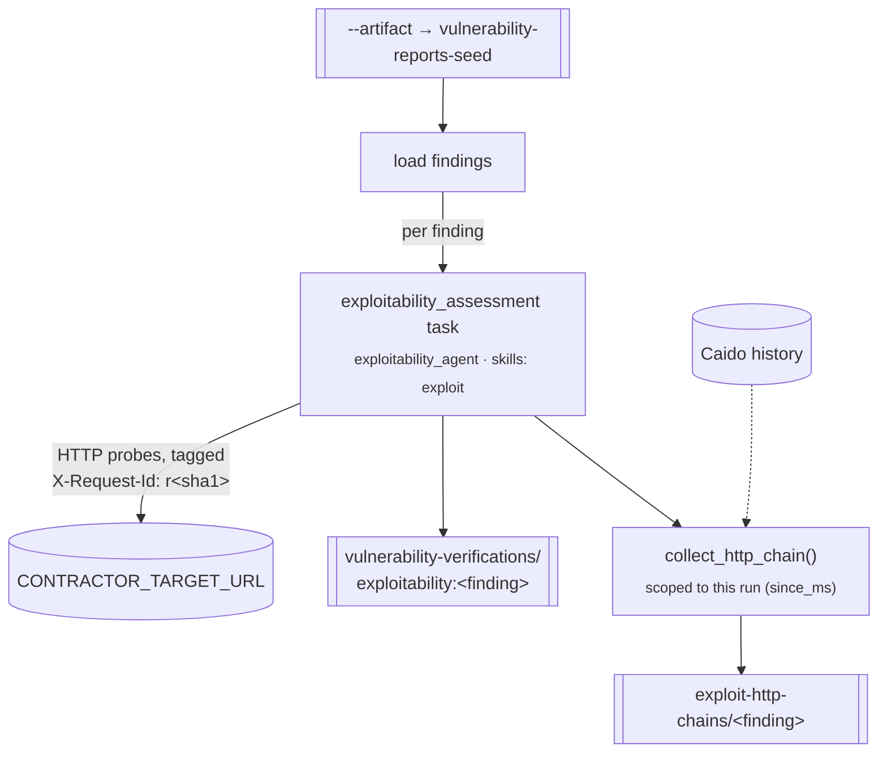

# `exploitability` — dynamic exploitability assessment

**CLI alias:** `exploit` &nbsp;·&nbsp; **Class:** `ExploitabilityWorkflow` &nbsp;·&nbsp; **Runner:** `TaskRunner`

Takes pre-computed vulnerability findings and **probes a live target** to confirm
or refute each one. For every finding the `exploitability_agent` issues HTTP
requests (optionally through Caido/a proxy), captures evidence, and persists a
verdict. After the agent runs, the workflow collects the proof request/response
chain from Caido history and materializes it as an artifact.

> **Requires** the `CONTRACTOR_TARGET_URL` env var (the live target). Caido
> integration is optional and read from `Settings` (`caido_url` / `caido_auth_token`).
> Findings are seeded from `ctx.artifact` (the `--artifact` flag).

## Per-finding evidence collection

- Each finding gets a deterministic, opaque tag prefix
  (`r` + `sha1(finding_name)[:10]`) — no LLM, no randomness, so the vuln identity
  never leaks into the `X-Request-Id` header value and the same prefix can be
  re-derived anywhere.
- A run-start timestamp (`since_ms`) scopes Caido collection to the current run,
  so a stale same-prefix request left over from an earlier run is ignored.
- `collect_http_chain()` prefers the proof `request_ids` the agent cited, folds
  in any **anomalous** responses (5xx, or body size far from the run median) as a
  safety net, and falls back to the full tagged sequence when the agent cited
  nothing. Capped at `_MAX_CHAIN_EXCHANGES` (50). Best-effort — never fatal.

> `collect_http_chain()` is module-level and shared with the exploitability eval
> so both exercise the identical collection path.

## Tuning (`config.yaml`)

- `budgets.max_tokens` — agent context budget (80k).
- `tasks.assess` — `iterations` / `max_attempts` / `max_steps` (25).

## Artifacts

- **In:** `vulnerability-reports-seed` (from `--artifact`).
- **Out:** `user:vulnerability-verifications/exploitability:<finding>` (verdicts),
  `user:exploit-http-chains/<finding>` (raw proof chains).
