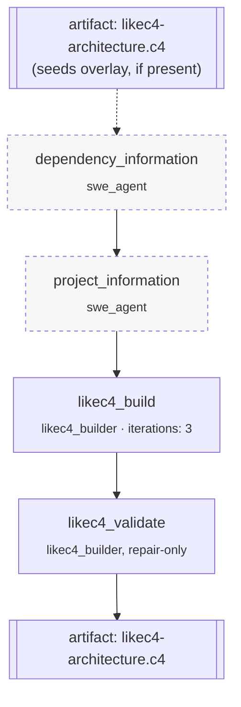

# `likec4_building` — architecture model generation

**CLI alias:** `likec4` &nbsp;·&nbsp; **Class:** `LikeC4BuildingWorkflow` &nbsp;·&nbsp; **Runner:** `TaskRunner`

Builds a [LikeC4](https://likec4.dev/) architecture model of the project,
focused on security-relevant facts: external interactions, trust boundaries, and
data classes. Structurally a sibling of [`build`](../oas_building/README.md) —
the same two SWE discovery passes feed a builder + a repair-only validation pass
— but the artifact is a `.c4` model instead of an OpenAPI spec.

## Persistence model

The LikeC4 source lives in a **single overlay-backed file** at
`DEFAULT_LIKEC4_PATH` (`contractor.tools.likec4`):

- **Before** the run, `_seed_overlay_from_artifact` writes the previously-saved
  `likec4-architecture.c4` artifact into that path (resume / incremental builds).
- **After** the run (`_cleanup`), the file is read back and saved as the artifact.
  If the agents never wrote it, the prior artifact is left untouched.

## Stages

| Task | Worker | Consumes | Purpose |
|------|--------|----------|---------|
| `dependency_information` | `swe_agent` | — | Deps inventory. Idempotent → skippable. |
| `project_information` | `swe_agent` | `dependency_information/result` | Project structure. Idempotent → skippable. |
| `likec4_build` | `likec4_builder` | both analyses | Author the `.c4` model (`iterations: 3`). |
| `likec4_validate` | `likec4_builder` | the above + `likec4_build/result` | Repair-only validation pass. |

## Tuning (`config.yaml`)

- `budgets.{swe,builder}_max_tokens` — per-agent context budgets.
- `tasks.<name>` — retry/iteration/step budgets.

## Artifacts

- **In:** optional `likec4-architecture.c4` (to extend a prior model).
- **Out:** `likec4-architecture.c4`, plus `<task>/result` per task.
