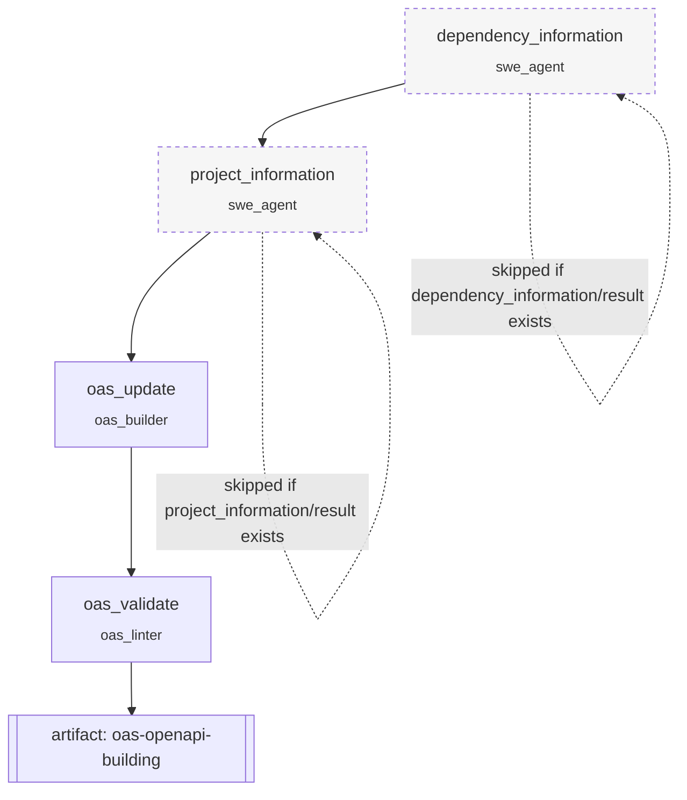

# `oas_building` — OpenAPI spec generation

**CLI alias:** `build` &nbsp;·&nbsp; **Class:** `OasBuildingWorkflow` &nbsp;·&nbsp; **Runner:** `TaskRunner`

Generates an OpenAPI spec for a target codebase from scratch. A pair of SWE
analysis passes characterise the project, then the OAS builder drafts the spec
and the linter validates it. This is the upstream of almost every other
workflow — `enrich`, the `trace*` family, and `vuln-assess` all consume the
`oas-openapi-building` artifact it produces.

## Stages

| Task | Worker | Consumes | Purpose |
|------|--------|----------|---------|
| `dependency_information` | `swe_agent` | — | Inventory deps / frameworks. Idempotent → skipped if its artifact exists. |
| `project_information` | `swe_agent` | `dependency_information/result` | Map project structure, routes, entrypoints. Idempotent → skippable. |
| `oas_update` | `oas_builder` | both `*_information/result` | Draft / extend the OpenAPI spec (`iterations: 2`). |
| `oas_validate` | `oas_linter` | the above + `oas_update/result` | Lint the spec and repair errors. |

Each task spawns a fresh planner+worker pair per attempt (see the repo
[CLAUDE.md](../../../CLAUDE.md) "Workflows never call agents directly").
Tasks communicate only via the declared `artifacts:` — the runner re-injects
each upstream `…/result` into the next task's memory namespace.

## Tuning (`config.yaml`)

- `budgets.{swe,builder,validator}_max_tokens` — context-retention budget passed
  to each `build_<agent>` (summarization trigger, not a generation cap).
- `tasks.<name>` — `iterations` / `max_attempts` / `max_steps` per task.

## Artifacts

- **In:** none (operates directly on the sandboxed project FS).
- **Out:** `oas-openapi-building` (the spec), plus `<task>/result` for each task.
