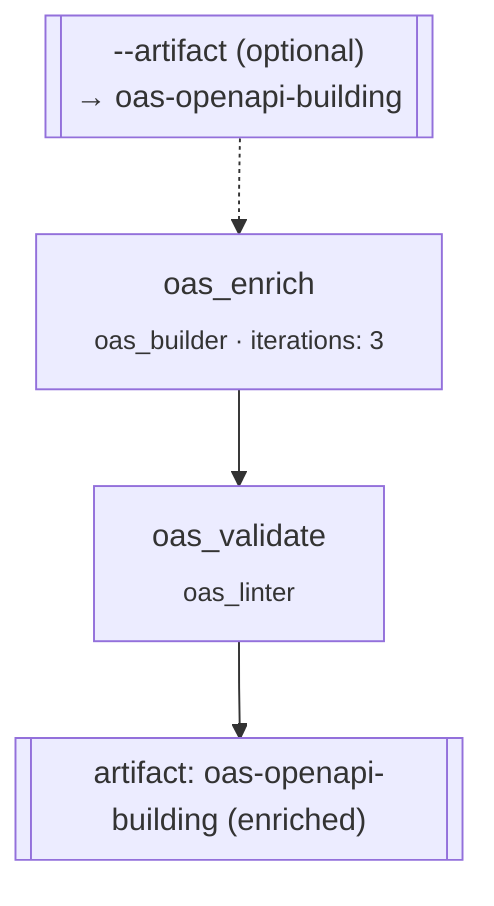

# `oas_enrichment` — enrich an existing OpenAPI spec

**CLI alias:** `enrich` &nbsp;·&nbsp; **Class:** `OasEnrichmentWorkflow` &nbsp;·&nbsp; **Runner:** `TaskRunner`

Takes an OpenAPI spec that already exists (from a prior `build` run, or seeded
via `--artifact`) and deepens it — fleshing out schemas, parameters, security
schemes, and examples — then re-validates. Unlike `build` it does **not** rerun
the expensive SWE discovery passes; it expects `dependency_information/result`
and `project_information/result` to already be in the artifact store.

## Stages

| Task | Worker | Consumes | Purpose |
|------|--------|----------|---------|
| `oas_enrich` | `oas_builder` | `dependency_information/result`, `project_information/result` | Expand the spec in place (`iterations: 3`, `max_attempts: 6`). |
| `oas_validate` | `oas_linter` | the above + `oas_enrich/result` | Lint + repair the enriched spec. |

`persist_seed_artifact()` writes `ctx.artifact` (the `--artifact` flag) to
`oas-openapi-building` before the run, so the spec can be supplied externally
instead of relying on a previous in-store build. `--artifact` is optional — if a
spec is already persisted, the seed step is a no-op.

## Tuning (`config.yaml`)

- `budgets.{builder,validator}_max_tokens` — higher than `build` (120k) since
  enrichment carries the whole existing spec in context.
- `tasks.oas_enrich` / `tasks.oas_validate` — retry/iteration/step budgets.

## Artifacts

- **In:** `oas-openapi-building` (+ the two `*_information/result` analyses).
- **Out:** `oas-openapi-building` (overwritten with the enriched spec).
