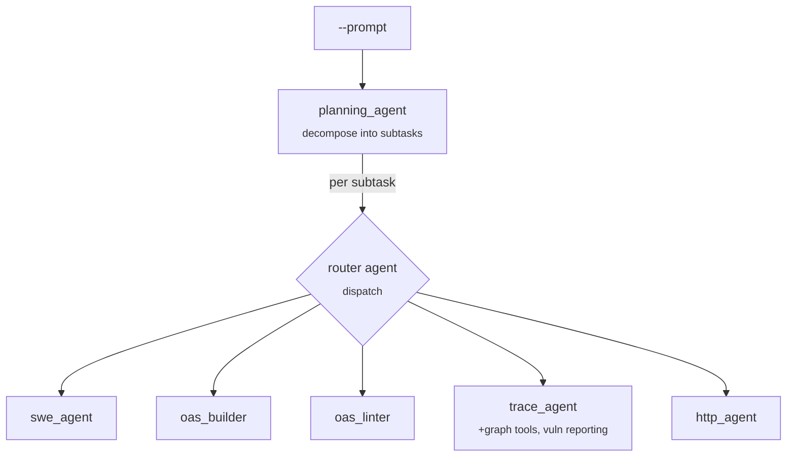

# `router` — prompt-driven dispatch

**CLI alias:** `router` &nbsp;·&nbsp; **Class:** `RouterWorkflow` &nbsp;·&nbsp; **Runner:** `AgentRunner`

The one free-form workflow: instead of a fixed task chain it takes a natural-
language `--prompt` and lets a planner decompose it into subtasks, each handed
to a **router** agent that dispatches to the right specialist sub-agent. Use it
for ad-hoc, mixed-intent requests ("build the spec for `src/`, then trace the
`/login` path"). When `--prompt` is omitted the CLI opens an interactive prompt.

## How it differs from the other workflows

- **No `TaskRunner`.** It builds the planner + router + sub-agents directly and
  drives a single `AgentRunner.run(...)` over the whole prompt.
- **Router is the planner's worker.** `build_planning_agent(worker=router)` —
  the planner emits `Subtask`s, the router returns `SubtaskExecutionResult`.
  `instrument_worker` is intentionally skipped (`worker_instrumentation=False`)
  because the router already has its own dispatch protocol in `prompts/v1.md`.
- **Sub-agents share one namespace** (`ROUTER_NAMESPACE = "router"`) and the
  `trace` skill bundle is pre-injected so trace dispatches have their reference
  material.

## Tuning (`config.yaml`)

- `budgets.max_tokens` — per-agent context budget (shared across all sub-agents).
- `budgets.max_steps` — planner subtask cap.
- `agents.trace_agent.with_graph_tools: true` — attaches the trailmark call-graph
  tools to the trace sub-agent.

## Artifacts

- **In:** none required (driven by the prompt); operates on the project FS.
- **Out:** whatever the dispatched sub-agents write (specs, trace diffs, vuln
  reports) under the `router` namespace.
