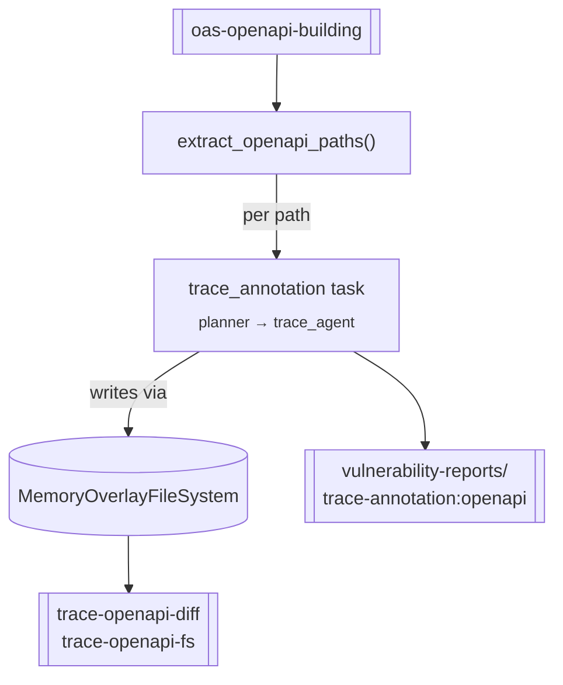

# `trace_annotation` — planner-driven source tracing

**CLI alias:** `trace` &nbsp;·&nbsp; **Class:** `TraceAnnotationWorkflow` &nbsp;·&nbsp; **Runner:** `TaskRunner`

Annotates the source code behind an OpenAPI spec. The spec is split into paths;
for each path the `trace_agent` traces the request → handler → sink code path,
writes inline `@trace` annotations, and reports vulnerabilities. Writes land in
a `MemoryOverlayFileSystem` so they are captured as a **diff artifact** rather
than mutating the host filesystem.

This is the *canonical / planner-driven* trace variant. The
[`trace_annotation_direct`](../trace_annotation_direct/README.md) and
[`trace_graph`](../trace_graph/README.md) variants share its OpenAPI-splitting
helpers (`extract_openapi_paths`, `OpenApiPath`, `OpenApiOperation`) but skip the
planner layer.

## Flow

1. Load `oas-openapi-building`, resolve `$ref`s, and group operations by path
   (all methods on a path collapse into one task payload).
2. Seed the overlay FS from a prior `trace-openapi-fs` artifact (resume support).
3. For each path, run one `trace_annotation` task (`skills: ["trace"]`) through a
   fresh planner + `trace_agent`.
4. On cleanup, persist the overlay as `trace-openapi-fs` (state) and
   `trace-openapi-diff` (a 4-line-context unified diff of all annotations).

## Tuning (`config.yaml`)

- `budgets.max_tokens` — trace agent context budget.
- `tasks.annotate` — `iterations` / `max_attempts` / `max_steps`.
- `agents.trace_agent.with_graph_tools: true` — call-graph tools enabled.

## Artifacts

- **In:** `oas-openapi-building`; optionally `trace-openapi-fs` (to resume).
- **Out:** `trace-openapi-fs` (overlay state), `trace-openapi-diff` (annotation
  diff), and vuln findings under `user:vulnerability-reports/trace-annotation:openapi`
  (this variant runs every path under one shared namespace).
