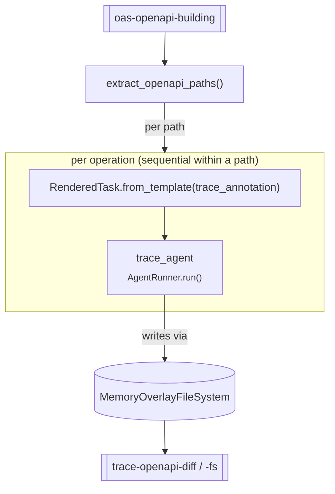

# `trace_annotation_direct` — planner-free source tracing

**CLI alias:** `trace-direct` &nbsp;·&nbsp; **Class:** `TraceAnnotationDirectWorkflow` &nbsp;·&nbsp; **Runner:** `AgentRunner`

A variant of [`trace_annotation`](../trace_annotation/README.md) that **skips the
planning_agent layer**. Each OpenAPI operation is rendered directly from the
`trace_annotation` task template and handed to a freshly built `trace_agent`
via `AgentRunner`. It keeps the identical overlay-FS / artifact contract, so its
output can be compared head-to-head with the planner-driven variant.

## How it differs from `trace`

| | `trace` (planner) | `trace-direct` |
|---|---|---|
| Planner | yes — decomposes into subtasks | **no** — one agent call per operation |
| Granularity | one task per path | one run per **operation** |
| Overlay persistence | once at cleanup | after **each path** (finer resume) |
| Runner | `TaskRunner` | `AgentRunner` |

The shared overlay is reloaded before each path and re-saved after it, so later
operations see earlier annotations.

## Tuning (`config.yaml`)

- `budgets.max_tokens` — trace agent context budget (100k).
- `agents.trace_agent.with_graph_tools: true` — call-graph tools enabled.

> No `tasks:` block — there is no `TaskRunner`, so retry/iteration budgets don't
> apply; each operation is a single `AgentRunner.run` call.

## Artifacts

- **In:** `oas-openapi-building`; optionally `trace-openapi-fs` (resume).
- **Out:** `trace-openapi-fs`, `trace-openapi-diff`, and per-path
  `user:vulnerability-reports/trace-annotation:openapi:<path_key>`.
