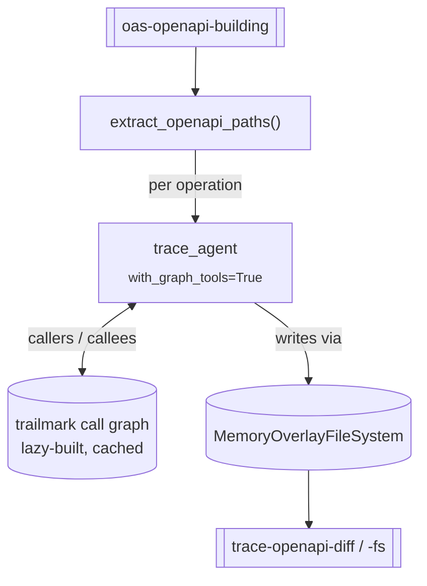

# `trace_graph` — trace-direct with call-graph tools

**CLI alias:** `trace-graph` &nbsp;·&nbsp; **Class:** `TraceGraphWorkflow` &nbsp;·&nbsp; **Runner:** `AgentRunner`

A thin variant of [`trace-direct`](../trace_annotation_direct/README.md):
identical task template, identical per-operation loop, identical overlay-FS /
artifact contract. The **only** difference is that each `trace_agent` is built
with the trailmark-backed call-graph tools enabled (`with_graph_tools=True`),
so the agent can navigate callers/callees structurally instead of by grep alone.

It exists as a clean A/B preset: graph-equipped vs. the prompt-only baseline on
the same fixture. (Per the project's eval notes, `trace-graph` is the current
production default — same quality on small fixtures, decisive win on large ones.)

Trailmark parses the project on the first agent call (lazy build inside
`attach_graph_tools_if_local`); subsequent operations reuse the cached engine.

## Relationship to siblings

- [`trace-direct`](../trace_annotation_direct/README.md) — same loop, graph
  tools **off** (baseline).
- [`trace-graph-pathpar`](../trace_graph_pathpar/README.md) — same as this, but
  runs independent paths **in parallel**.

## Tuning (`config.yaml`)

- `budgets.max_tokens` — trace agent context budget (100k).
- `agents.trace_agent.with_graph_tools: true`.

## Artifacts

- **In:** `oas-openapi-building`; optionally `trace-openapi-fs` (resume).
- **Out:** `trace-openapi-fs`, `trace-openapi-diff`, and per-path
  `user:vulnerability-reports/trace-graph:openapi:<path_key>`.
