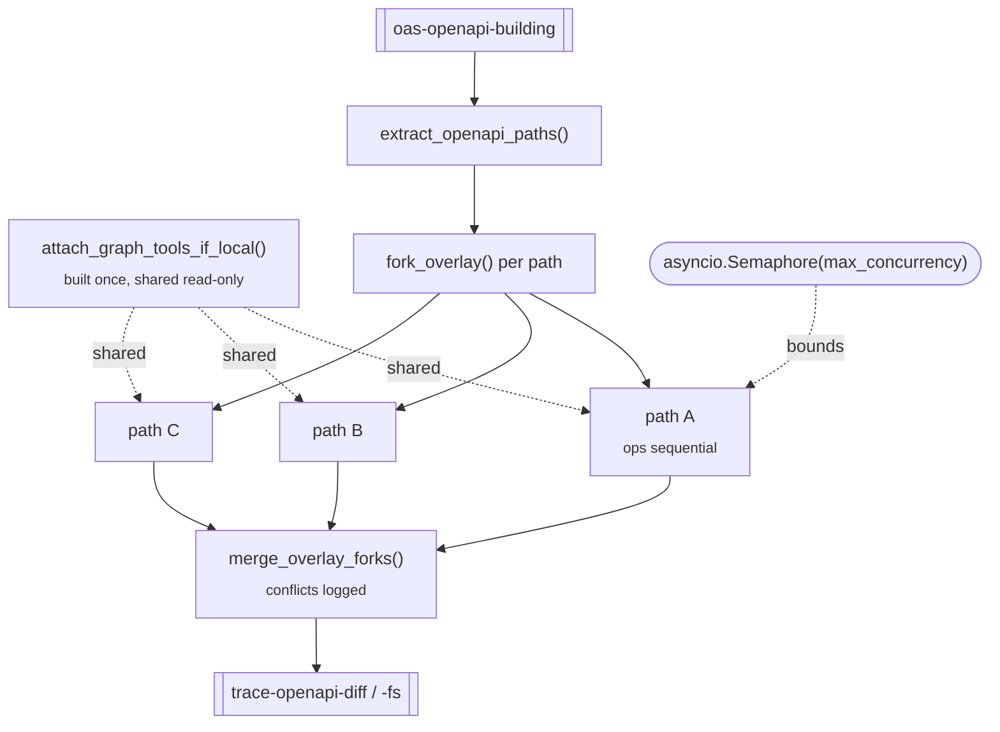

# `trace_graph_pathpar` — parallel-by-path trace

**CLI alias:** `trace-graph-pathpar` &nbsp;·&nbsp; **Class:** `TraceGraphPathParWorkflow` &nbsp;·&nbsp; **Runner:** `AgentRunner`

The path-parallel variant of [`trace-graph`](../trace_graph/README.md). Identical
annotation semantics — same prompt, same graph tools, same overlay contract —
but **independent API paths run concurrently**, bounded by a semaphore. This is
the trace stage `vuln-assess` invokes internally.

## Concurrency model

- Each path gets its **own forked** `MemoryOverlayFileSystem` (via `fork_overlay`),
  so parallel writes don't collide.
- Operations **within** a path stay sequential — the fork is shared across
  sibling operations, so later ops see earlier annotations (same as `trace-graph`).
- The trailmark call-graph engine is built **once** against the read-only base FS
  and the tool closures are shared across all forks.
- After every path finishes, forks are merged back into the main overlay
  (`merge_overlay_forks`); any conflicting files are logged as a warning.
- `asyncio.TaskGroup` + a `Semaphore(max_concurrency)` cap simultaneous paths.

## Tuning (`config.yaml`)

- `budgets.max_tokens` — trace agent context budget (100k).
- `budgets.max_concurrency` — max paths running at once (default `3`; also a
  constructor override).

## Artifacts

- **In:** `oas-openapi-building`; optionally `trace-openapi-fs` (resume).
- **Out:** `trace-openapi-fs`, `trace-openapi-diff` (merged), and per-path
  `user:vulnerability-reports/trace-graph-pathpar:openapi:<path_key>`.
