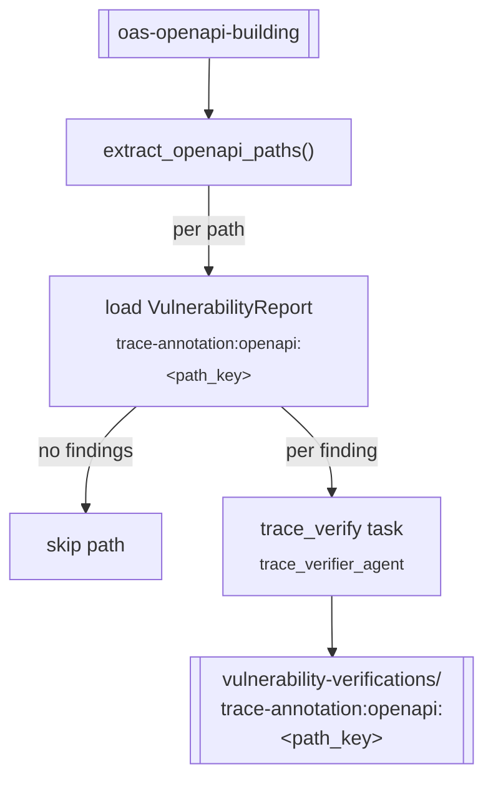

# `trace_verify` — static verification of trace findings

**CLI alias:** `trace-verify` &nbsp;·&nbsp; **Class:** `TraceVerifyWorkflow` &nbsp;·&nbsp; **Runner:** `TaskRunner`

A code-evidence-only second pass (OpenAnt "Stage-2" style) over the
vulnerability findings produced by a prior [`trace-direct`](../trace_annotation_direct/README.md)
run. For each finding it spawns a `trace_verifier_agent` that re-examines the
source — **no HTTP probes** — and records a verdict. Verdicts are persisted
under a sibling namespace so the report and its verification pair up 1:1.



## Flow

1. Load `oas-openapi-building`, split into paths.
2. For each path, read `user:vulnerability-reports/trace-annotation:openapi:<path_key>`
   (the artifact written by `trace-direct`). Paths with no findings are skipped.
3. Queue one `trace_verify` task per finding, passing the finding fields
   (`name`, `title`, `place`, `severity`, `confidence`, `summary`, …) as task
   params. The verifier writes verdicts via `verification_tools` under the **same
   namespace** as the upstream findings.

## Pairing

```
user:vulnerability-reports/trace-annotation:openapi:{path_key}        ← from trace-direct
user:vulnerability-verifications/trace-annotation:openapi:{path_key}  ← written here
```

## Tuning (`config.yaml`)

- `budgets.max_tokens` — verifier context budget (80k).
- `tasks.verify` — `iterations` / `max_attempts` / `max_steps`.

## Artifacts

- **In:** `oas-openapi-building`, `user:vulnerability-reports/trace-annotation:openapi:<path_key>`.
- **Out:** `user:vulnerability-verifications/trace-annotation:openapi:<path_key>`.
