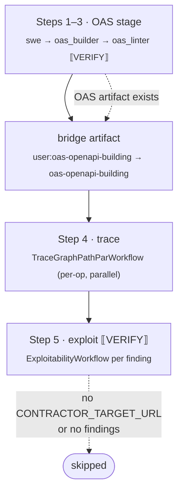

# `vuln_assess` — full vulnerability assessment ("Workflow A")

**CLI alias:** `vuln-assess` &nbsp;·&nbsp; **Class:** `VulnAssessWorkflow` &nbsp;·&nbsp; **Runner:** composes sub-workflows

The end-to-end pipeline: discover the API surface, trace it for vulnerabilities,
then verify exploitability against a live target. Unlike `vuln-scan-fast` (which
scans the raw codebase), this is **spec-driven** — it builds an OpenAPI spec
first and traces per-operation. It stitches together the OAS stage,
[`trace-graph-pathpar`](../trace_graph_pathpar/README.md), and
[`exploitability`](../exploitability/README.md).

## Steps

| # | Step | Delegates to | Notes |
|---|------|--------------|-------|
| 1–2 | discovery + OAS build | `swe_agent`, `oas_builder` (`TaskRunner`) | skipped if `user:oas-openapi-building` already exists; individual analyses skip on their own artifacts. |
| 3 | `oas_validate` `[VERIFY]` | `oas_linter` | lint + repair the spec. |
| — | **bridge** | — | copy `user:oas-openapi-building` → `oas-openapi-building` (builder writes the user-scoped key; the trace stage reads the bare key). |
| 4 | trace + vuln reporting | `TraceGraphPathParWorkflow` | per-operation tracing, paths in parallel. |
| 5 | exploit `[VERIFY]` | `ExploitabilityWorkflow` | merges all `user:vulnerability-reports/*` into one seed, then probes the live target. **Skipped** without `CONTRACTOR_TARGET_URL` or with no findings. |

`_collect_vuln_reports` re-derives the per-path report keys from the OpenAPI
paths and merges them (plus any `vulnerability-reports-seed`) into a single YAML
that seeds the exploit stage.

## How it differs from `vuln-scan-fast`

| | `vuln-assess` (A) | `vuln-scan-fast` (B) |
|---|---|---|
| Discovery basis | **OpenAPI spec** (build first) | raw codebase grep sweep |
| Trace granularity | per OAS operation (parallel) | per scan finding |
| Dedup gate | — | programmatic file+CWE dedup |

## Tuning (`config.yaml`)

Mirrors `oas_building`'s budgets/tasks (the OAS stage is inlined here). The trace
and exploit stages read **their own** `config.yaml` from their respective folders.

## Artifacts

- **In:** optional `--artifact` seed; `CONTRACTOR_TARGET_URL` enables step 5.
- **Out:** `oas-openapi-building`, per-path trace vuln reports + diffs, and
  exploitability verdicts / HTTP chains.
