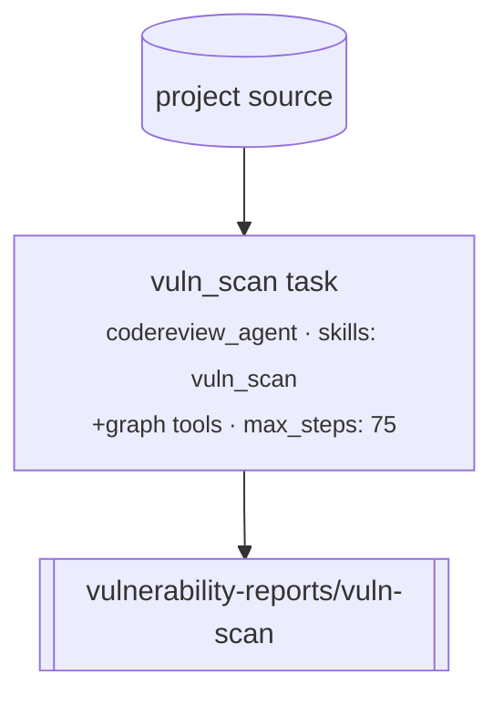

# `vuln_scan` — rapid breadth-first vuln discovery

**CLI alias:** `vuln-scan` &nbsp;·&nbsp; **Class:** `VulnScanWorkflow` &nbsp;·&nbsp; **Runner:** `TaskRunner`

The simplest vulnerability workflow: a **single** `codereview_agent` pass that
sweeps the codebase breadth-first (grep-driven, with call-graph tools) and
reports findings. No discovery, no verification, no exploitation — just fast
recall. Use it as a quick first look, or as the discovery phase that the larger
`vuln-scan-trace` / `vuln-scan-fast` workflows wrap with downstream stages.

## Flow

A single `vuln_scan` task (`ref="vuln-scan:full"`, `skills: ["vuln_scan"]`) runs
under the `vuln-scan` namespace with a generous `max_steps: 75` so one pass can
cover the whole tree. Findings are written via the report tool to
`user:vulnerability-reports/vuln-scan`.

## Tuning (`config.yaml`)

- `budgets.scan_max_tokens` — agent context budget (80k).
- `tasks.scan` — `iterations` / `max_attempts` / `max_steps` (75).
- `agents.codereview_agent.with_graph_tools: true` — call-graph tools enabled.

## Artifacts

- **In:** none (operates on the project FS).
- **Out:** `user:vulnerability-reports/vuln-scan`.
