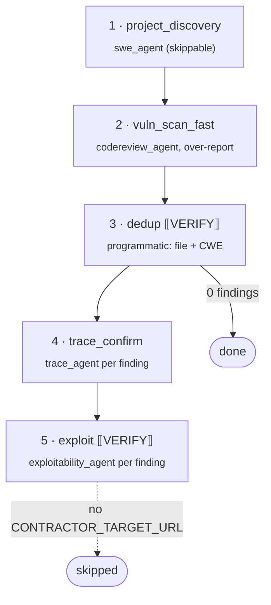

# `vuln_scan_fast` — high-recall scan with verification chain ("Workflow B")

**CLI alias:** `vuln-scan-fast` &nbsp;·&nbsp; **Class:** `VulnScanFastWorkflow` &nbsp;·&nbsp; **Runner:** `TaskRunner` + `AgentRunner`

A high-recall scan that deliberately over-reports, then narrows down through a
programmatic dedup, a per-finding trace confirmation, and (when a live target is
configured) an exploitability check. The full five-step funnel from a noisy
breadth-first sweep to confirmed, optionally-exploited findings.

## Steps

| # | Step | Engine | Notes |
|---|------|--------|-------|
| 1 | `project_discovery` | `swe_agent` (`TaskRunner`) | deps + structure; each task skipped if its artifact exists. |
| 2 | `vuln_scan_fast` | `codereview_agent` (`TaskRunner`) | high-recall, over-report; writes `user:vulnerability-reports/vuln-scan-fast`. |
| 3 | **dedup** `[VERIFY]` | pure Python (`_dedup`) | merge findings sharing `(file, CWE)`, keep highest confidence. |
| 4 | `trace_confirm` | `trace_agent` (`AgentRunner`, per finding) | confirm/deny each finding by tracing its code path; shared overlay FS. |
| 5 | **exploit** `[VERIFY]` | `ExploitabilityWorkflow` | live probing; **skipped** unless `CONTRACTOR_TARGET_URL` is set. |

Step 3 is the cheap, deterministic gate that keeps the expensive steps 4–5 from
re-processing duplicate reports. If dedup leaves zero findings, the workflow
returns early.

## Tuning (`config.yaml`)

- `budgets.scan_max_tokens` / `budgets.swe_max_tokens` — context budgets.
- `tasks.{dependency_information,project_information,scan}` — retry/step budgets.
- `agents.{codereview_agent,trace_agent}.with_graph_tools: true`.

## Artifacts

- **In:** none required (`CONTRACTOR_TARGET_URL` enables step 5).
- **Out:** `user:vulnerability-reports/vuln-scan-fast` (raw scan), per-finding
  trace reports under `trace-confirm:<finding>`, and (step 5) exploitability
  verdicts + HTTP chains (see [`exploitability`](../exploitability/README.md)).
