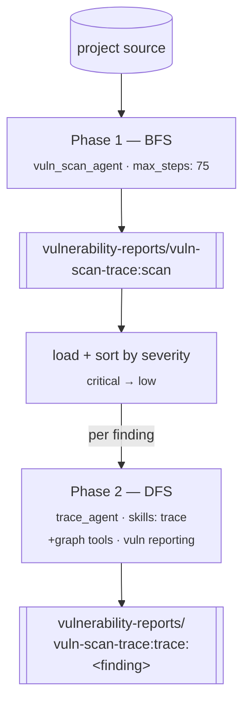

# `vuln_scan_trace` — BFS discovery → DFS confirmation

**CLI alias:** `vuln-scan-trace` &nbsp;·&nbsp; **Class:** `VulnScanTraceWorkflow` &nbsp;·&nbsp; **Runner:** `TaskRunner`

Two phases: a breadth-first `vuln_scan_agent` sweep discovers candidate findings,
then a `trace_agent` deep-traces **each** finding to produce annotated evidence
chains and control checklists. Static only — no live target involved.

## Flow

1. **Phase 1 (BFS).** One `vuln_scan` task under namespace `vuln-scan-trace:scan`
   sweeps the tree. Findings load from `user:vulnerability-reports/vuln-scan-trace:scan`.
   If empty, the trace phase is skipped.
2. Findings are sorted critical → high → medium → low.
3. **Phase 2 (DFS).** For each finding a `trace_annotation` task runs under
   `vuln-scan-trace:trace:<finding>`, with the finding fields packed into the
   task's `operation_schema` so the trace agent confirms / annotates that
   specific code path. Per-finding trace failures are logged, not fatal.

## Relationship to siblings

- [`vuln-scan`](../vuln_scan/README.md) — Phase 1 only.
- [`vuln-scan-fast`](../vuln_scan_fast/README.md) — adds programmatic dedup
  between scan and trace, plus a live `exploit` stage.

## Tuning (`config.yaml`)

- `budgets.scan_max_tokens` / `budgets.trace_max_tokens` — per-phase context budgets.
- `tasks.scan` (max_steps 75) / `tasks.trace` (max_steps 30).
- `agents.{vuln_scan_agent,trace_agent}.with_graph_tools: true`.

## Artifacts

- **In:** none.
- **Out:** `user:vulnerability-reports/vuln-scan-trace:scan` (raw findings) and
  per-finding `user:vulnerability-reports/vuln-scan-trace:trace:<finding>` (traced).
