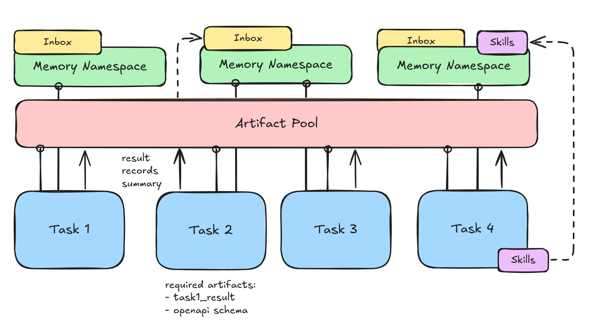
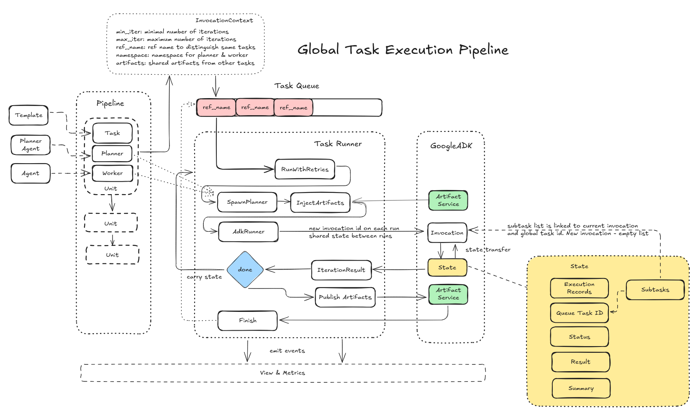
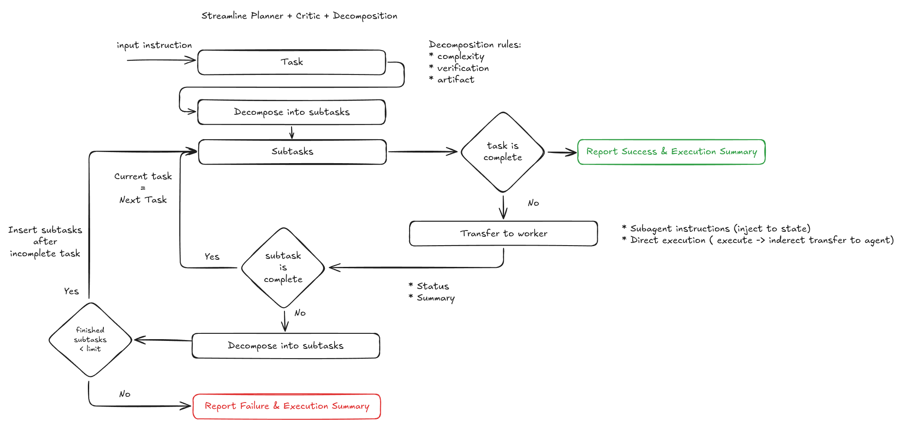
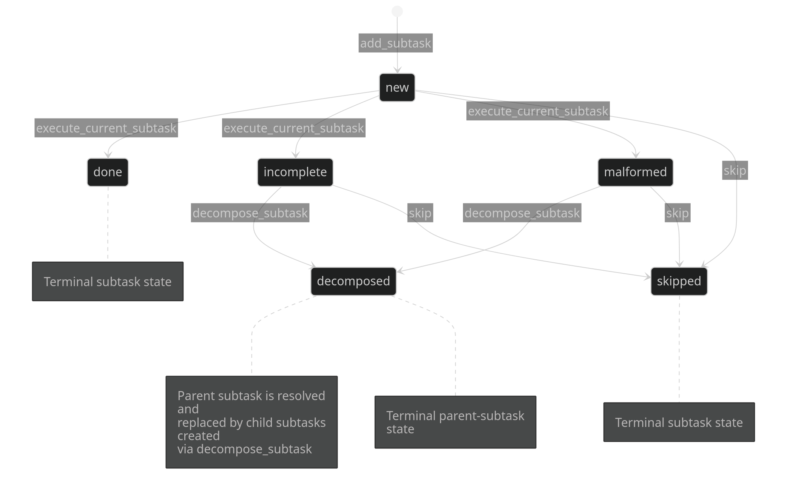

# Contractor — Core Architecture & Planner Internals

This document describes how Contractor is organised internally: how the
runtime is layered, how tasks flow between agents, how artifacts and
memory are shared, and how the planning agent (the "streamline planner")
drives multi-step execution.

It is meant for contributors working on the runner, planner, or new
workflows — not for end users. For usage-level docs see the [top-level
README](../README.md).

---

## 1. Conceptual layers

Contractor is built as a small stack of independent layers:

```
┌─────────────────────────────────────────────────────┐
│  CLI                 cli/main.py, contractor/workflows/    │  user-facing
├─────────────────────────────────────────────────────┤
│  Workflows           contractor/workflows/*/workflow.py             │  orchestration
├─────────────────────────────────────────────────────┤
│  Task Runner         contractor/runners/            │  execution
│   ├─ Planning Agent  contractor/agents/planning_agent
│   └─ Worker Agents   contractor/agents/*            │
├─────────────────────────────────────────────────────┤
│  Tools / Memory      contractor/tools/              │  capabilities
├─────────────────────────────────────────────────────┤
│  Google ADK + LiteLLM                               │  model layer
└─────────────────────────────────────────────────────┘
```

Each layer is intentionally narrow:

- **CLI** wires the user's flags into a `WorkflowContext`.
- **Workflows** declare *which tasks*, in which order, with which
  worker agents, run for a given mode (`oas_build`, `oas_update`, `trace`,
  `router`).
- **Task Runner** turns each queued task into one or more attempts of a
  *planner + worker* pair, persists artifacts, and emits lifecycle
  events.
- **Planning Agent** runs the streamline planner loop on top of an ADK
  `LlmAgent` worker.
- **Tools & Memory** provide the capability surface that workers and
  planners share (filesystem, HTTP, OpenAPI editor, memory store,
  task-control tools).

---

## 2. Data flow between tasks

A workflow is a *sequence of tasks*. Tasks do not call each other
directly — they communicate through two shared substrates:

- **Artifact Pool** — durable, content-addressable outputs of every
  task: `result`, `summary`, `records`. The next task declares which
  artifacts it needs in its template (`artifacts:` list) and the runner
  loads them automatically.
- **Memory Namespace** — a structured, taggable note store, scoped per
  task ref. The planner and the worker share one namespace, plus an
  *Inbox* (artifacts injected from previous tasks) and *Skills*
  (markdown reference material loaded into memory before the run).



What the diagram shows:

- Each blue **Task** consumes inputs from the Artifact Pool and pushes
  three things back: `result`, `records`, `summary`.
- Each task gets its own **Memory Namespace**. The namespace is reset
  per task ref (so tasks do not leak intermediate notes), but the
  *Artifact Pool* persists across the whole workflow run.
- An **Inbox** is the set of memories the runner pre-injects into a
  namespace before the planner starts. Inbox entries come from artifacts
  produced by earlier tasks, e.g. `task1_result` or an `openapi schema`.
- **Skills** are bundles of markdown notes (under
  [contractor/skills/](../contractor/skills/)) that get injected into
  memory at start of a task as reusable reference material. They are
  loaded by [contractor/runners/skills.py](../contractor/runners/skills.py).

The relevant code:

- Artifact persistence: `TaskRunner._publish_task_artifacts` in
  [contractor/runners/task_runner.py](../contractor/runners/task_runner.py)
- Inbox injection: `TaskRunner._inject_artifacts` (same file)
- Skill injection: `TaskRunner._inject_skills` (same file)
- Task template loading & rendering:
  [contractor/runners/models.py](../contractor/runners/models.py)
  (`TaskTemplate`, `RenderedTask`)

---

## 3. Global task execution workflow

The Task Runner is the spine of every workflow. For each queued task it
materialises a *planner* (with a worker attached as a tool), creates a
fresh ADK session, runs the planner-worker loop, and persists the
artifacts so downstream tasks can pick them up.



### 3.1 Key objects

Defined in [contractor/runners/models.py](../contractor/runners/models.py):

| Object             | Purpose                                                         |
| ------------------ | --------------------------------------------------------------- |
| `TaskTemplate`     | YAML-loaded blueprint: title, objective, instructions, default artifacts, default skills, iterations, output format. Versioned: `contractor/tasks/<name>.yml` is a manifest (`active:` + `versions:`) pointing at per-version bodies under `<name>/`; pin one via `add_task(version=...)` or `CONTRACTOR_TASK_VERSION_<NAME>`. |
| `TaskInvocation`   | A queued instance of a template: ref, params, model, namespace, retry budget, artifact key, worker builder. |
| `RenderedTask`     | A `TaskTemplate` with all `{var}` placeholders substituted from variables, params, and loaded artifact contents. |
| `TaskRunnerEvent`  | Lifecycle event emitted to the UI/metrics: `task_started`, `iteration_finished`, `task_failed`, etc. |
| `TaskScopedKeys`   | Helper for the `task::{id}::{field}` keyspace inside the ADK session state. |

### 3.2 Per-task lifecycle

`TaskRunner._run_task_with_retries` (in
[task_runner.py](../contractor/runners/task_runner.py)) is the per-task
state machine:

1. **Render** — `_render_task` substitutes variables, params, and the
   contents of all required input artifacts into the template.
2. **Emit `TASK_STARTED`** — UI sees the new task immediately.
3. **`_inject_skills` and `_inject_artifacts`** — populate the memory
   namespace with reference notes and the Inbox. This happens once per
   task: the namespace, skill list, and artifact texts are invariant
   across attempts.
4. **For each attempt up to `max_attempts`**:
   1. `_spawn_planning_agent` — fresh planner + worker pair.
   2. `_build_task_initial_state` — prime the ADK session state with
      the per-task keys (`status=running`, empty `result/summary/pool`,
      etc.), carrying forward the previous attempt's state minus the
      stale planner-internal subtask keys.
   3. `_run_single_iteration` — run the ADK Runner against the planner
      until it terminates or hits the step budget.
   4. Emit `ITERATION_RESULT`. An exception raised by an iteration
      consumes an attempt (reported on the event) instead of aborting
      the whole workflow.
   5. If `state[TaskScopedKeys.status] == DONE`, publish artifacts via
      `_publish_task_artifacts` under the invocation's artifact key
      (`artifact_key` on `add_task`; default: the template key — fan-out
      workflows queuing several tasks from one template must pass a
      unique key per task). After `iterations` successful runs in
      total (cumulative across attempts, not necessarily consecutive),
      emit `TASK_FINISHED` and return.
5. **Exhausted retries** — emit `TASK_FAILED` and raise
   `TaskNotCompletedError`.

Two runner-level guarantees sit around this loop. When the runner has a
`checkpoint_path`, each completed task is recorded there and restored on
a re-run — an entry is only honoured if its template key/version still
match the invocation *and* all of its published artifacts are still
present in the store. And event delivery is best-effort telemetry: a
failing event handler is logged and never aborts the run.

### 3.3 Session state shape

Per iteration, the ADK session state is a flat dict keyed under
`task::{global_task_id}::*`. The planner's tools own this slice. The
runner only reads the terminal status and result — it does not poke at
the planner's internals. This is the contract that lets the planner
work on its own keyspace without the runner having to understand
subtasks.

```python
{
  "_global_task_id": 0,
  "task::0::objective": "...",
  "task::0::status":    "running" | "done",
  "task::0::current":   None,       # current-subtask pointer
  "task::0::result":    "...",      # written by streamline `finish`
  "task::0::summary":   "...",      # written by streamline `finish`
  "task::0::pool":      [ records ] # appended by streamline manager
}
```

The planner's *subtask-level* state (plan + index) lives under deeper,
invocation-scoped keys (`task::{id}::{invocation_id}::…`, see
`StreamlineManager._state_key`), so every attempt starts with a fresh
plan while the fixed keys above carry the task-level contract.

### 3.4 Workflows

Concrete workflows are thin assemblers of templates + worker builders.
The full mode → class map lives in `get_workflows()`
([contractor/workflows/__init__.py](../contractor/workflows/__init__.py)); `--workflow`
accepts any of these keys:

OpenAPI / architecture:

- [oas_building/](../contractor/workflows/oas_building/workflow.py) — `oas_build`
- [oas_enrichment/](../contractor/workflows/oas_enrichment/workflow.py) — `oas_update`
- [likec4_building/](../contractor/workflows/likec4_building/workflow.py) — `likec4`

Trace & annotate:

- [trace_annotation/](../contractor/workflows/trace_annotation/workflow.py) — `trace` (planner-driven, per-operation overlay FS)
- [trace_annotation_direct/](../contractor/workflows/trace_annotation_direct/workflow.py) — `trace-direct` (single-agent variant via `AgentRunner`, skips the planner)
- [trace_graph/](../contractor/workflows/trace_graph/workflow.py) — `trace-graph` (thin variant of `trace-direct` that enables trailmark call-graph tools)
- [trace_graph_pathpar/](../contractor/workflows/trace_graph_pathpar/workflow.py) — `trace-graph-pathpar` (path-level parallel variant of `trace-graph`; identical annotation semantics, paths run concurrently over forked overlays — see [insights-parallel-vuln-pipelines.md](insights-parallel-vuln-pipelines.md))
- [trace_verify/](../contractor/workflows/trace_verify/workflow.py) — `trace-verify` (per-finding static verifier, OpenAnt Stage-2 style)

Vulnerability detection:

- [vuln_scan/](../contractor/workflows/vuln_scan/workflow.py) — `vuln-scan` (breadth-first scan against source code)
- [vuln_scan_fast/](../contractor/workflows/vuln_scan_fast/workflow.py) — `vuln-scan-fast` (Workflow B: high-recall scan → dedup → trace-confirm → exploit)
- [vuln_scan_trace/](../contractor/workflows/vuln_scan_trace/workflow.py) — `vuln-scan-trace` (BFS discovery → DFS confirmation)
- [vuln_assess/](../contractor/workflows/vuln_assess/workflow.py) — `vuln-assess` (Workflow A: discovery → OAS → trace → exploit)
- [exploitability/](../contractor/workflows/exploitability/workflow.py) — `exploit` (per-finding exploitability assessment against a live target)

Prompt-driven:

- [router/](../contractor/workflows/router/workflow.py) — `router`

Several workflows diverge from the planner+worker pattern:

- **`router`** skips the templated task queue and runs a single planner
  whose worker is a *router agent* that dispatches to one of several
  specialised sub-agents (SWE, OAS builder, OAS linter, trace, HTTP).
- **`trace-direct` / `trace-graph` / `trace-graph-pathpar`** use the
  bare `AgentRunner`
  (`contractor/runners/agent_runner.py`) instead of `TaskRunner`: one
  `trace_agent` invocation per OpenAPI operation, no planner, no
  subtask state machine. The workflow wraps the project filesystem in
  `MemoryOverlayFileSystem` so worker writes (the inlined `@trace`
  annotations) are captured as an artifact diff rather than mutating
  the host tree.
- **`trace-verify`** is downstream of any trace producer (`trace`,
  `trace-direct`, `trace-graph`, `trace-graph-pathpar`): it probes
  every known trace namespace prefix
  ([contractor/workflows/namespaces.py](../contractor/workflows/namespaces.py)),
  loads each per-path `VulnerabilityReport` artifact and queues one
  task per finding for `trace_verifier_agent`, which produces a
  code-evidence-only verdict paired with the upstream finding by
  namespace (`user:vulnerability-{reports,verifications}/...`).

---

## 4. The streamline planner

> For a focused deep dive on this section — the per-task lifecycle, the
> planner action-picker loop, the subtask state machine, `execute_current_subtask`
> internals, and the session-state shape, all with Mermaid diagrams — see
> [planner.md](planner.md).

The planning agent
([contractor/agents/planning_agent/agent.py](../contractor/agents/planning_agent/agent.py))
is a `LlmAgent` whose tools are the *streamline manager* operations —
`add_subtask`, `get_current_subtask`, `list_subtasks`,
`execute_current_subtask`, `decompose_subtask`, `get_records`, `skip`,
`finish` — plus the shared memory tools.

The planner does not do the work itself. It maintains a list of
subtasks, asks the worker (also an `LlmAgent`, wrapped as an
`AgentTool`) to execute the *current* one, judges the result, and
either advances, decomposes, or finalises.



The flow:

1. **Input instruction** — the rendered task description (objective +
   instructions + output format + inbox listing).
2. **Decompose into subtasks** — the planner breaks the goal into 1-N
   subtasks. Decomposition is biased toward **complexity, verification,
   and artifact production** — i.e. each subtask should reduce
   uncertainty or produce a concrete deliverable.
3. **Pick current subtask** — always the first unresolved one.
4. **Task complete?** — if yes, `finish` is called and the task ends
   with *Report Success & Execution Summary*.
5. **Transfer to worker** — `execute_current_subtask` invokes the
   worker `AgentTool`. The worker has been instrumented (see
   `instrument_worker` in
   [contractor/tools/tasks/tools.py](../contractor/tools/tasks/tools.py)) with the
   `Subtask` input schema and `SubtaskExecutionResult` output schema, so
   its response is parsed deterministically into `{status, output,
   summary}`.
6. **Subtask complete?** — if `done`, advance. If `incomplete` or
   `malformed`, decompose into 1-3 child subtasks (inserted right after
   the parent) and continue. If decomposition is impossible (max-task
   budget exhausted) the planner reports failure with an execution
   summary.

### 4.1 Worker instrumentation

Workers are *not* hand-written for the planner protocol. The
`instrument_worker` helper attaches:

- `worker.input_schema = Subtask` — so the worker is called with a
  fully-typed subtask payload (`task_id`, `title`, `description`).
- `worker.output_schema = SubtaskExecutionResult` — so the response is
  forced into `{task_id, status, output, summary}`.
- A trailing block of *worker instructions* appended to the worker's
  own system prompt: status rules, output rules, and two
  worked examples (one `done`, one `incomplete`).

That means any agent in the repo can be used as a worker simply by
passing it through the planner factory — no per-agent glue is needed.

### 4.2 Retry-on-malformed

`execute_current_subtask` runs the worker with a small retry budget
(`n_retries`, default 3). It accepts the response as either a typed
`SubtaskExecutionResult`, a dict matching the schema, or a string in
the configured format (`json` / `yaml` / `markdown` / `xml`) that the
`SubtaskFormatter` can parse. A response whose `task_id` does not match
the current subtask also consumes a retry. If all retries fail to
produce a valid result, the subtask is marked `malformed` and the
planner is forced to either decompose it or skip it.

### 4.3 Records and summary

Every executed subtask appends a *record* (the merged subtask + result)
to `task::{id}::pool`. When the planner calls `finish`, a built-in
*summarizer agent* (a tool-less sibling `LlmAgent` sharing the worker's
model) condenses `objective + records + result + status` into a
structured human-readable summary. The payload is capped — only the
most recent `max_records` (default 20) records, each truncated, are fed
to the summarizer, so a long run cannot blow its context. That summary
is written to `task::{id}::summary` and persisted as the `summary`
artifact.

### 4.4 Memory contract

The planner and worker share one memory namespace. The planner's
prompt (in
[planning_agent/prompt.yml](../contractor/agents/planning_agent/prompt.yml))
spells out the contract:

- Memory is the *coordination channel* between planner and worker.
- Store findings, constraints, decisions, dependencies — never raw
  logs, IDs, or temporary reasoning.
- Inspect existing memories before planning to avoid redoing work.
- Prefer updating an existing memory over creating duplicates.

The runner additionally pre-loads two kinds of memories before the
planner starts:

- **Inbox memories**, tagged `inbox` and `previous-task-result`,
  containing the textual content of every artifact the task declared as
  required.
- **Skill memories**, tagged `skill` plus the skill name (e.g.
  `likec4`), containing the contents of every markdown file under
  [contractor/skills/<skill>/](../contractor/skills/).

---

## 5. Subtask state machine

Subtasks have a strict lifecycle enforced by
`SUBTASK_STATUS_TRANSITIONS` in
[contractor/tools/tasks/models.py](../contractor/tools/tasks/models.py). Invalid
transitions raise `InvalidStatusTransitionError` and are surfaced back
to the planner as tool errors.



| From          | Allowed transitions                            | Triggered by                                         |
| ------------- | ---------------------------------------------- | ---------------------------------------------------- |
| `new`         | `done`, `incomplete`, `malformed`, `skipped`   | `execute_current_subtask`, `skip`                    |
| `incomplete`  | `decomposed`, `skipped`                        | `decompose_subtask`, `skip` (last-only, or when the subtask budget is exhausted) |
| `malformed`   | `decomposed`, `skipped`                        | `decompose_subtask`, `skip`                          |
| `done`        | (terminal)                                     | —                                                    |
| `decomposed`  | (terminal parent state)                        | child subtasks proceed independently                 |
| `skipped`     | (terminal)                                     | —                                                    |

Notes from the diagram:

- A **`new`** subtask can only become `done`, `incomplete`,
  `malformed`, or `skipped` — it cannot be re-executed in place.
- **`incomplete`** means the worker reported partial progress. The
  planner *must* call `decompose_subtask` (or `skip`, only if it is the
  very last subtask or the subtask budget is exhausted). Re-running it
  directly is forbidden; the planner prompt explicitly states this.
- **`malformed`** is the runtime fallback when worker output fails to
  parse after all retries. The raw output is preserved in `output` for
  inspection. Same options apply: decompose or skip.
- **`decomposed`** is the resolved parent state; the parent itself is
  never executed again, only its children.
- **`done` / `skipped`** are terminal subtask states.

### 5.1 Decomposition rules

`decompose_subtask` enforces:

- Only the *current* subtask may be decomposed (planner cannot reach
  past or future tasks).
- Decomposition must contain 1-3 subtasks — small enough to keep the
  plan flat, large enough to not over-fragment.
- The total subtask count after insertion must not exceed `max_steps`
  (default `15`, set on the `TaskInvocation`).
- Children are inserted immediately after the parent with dotted IDs
  (`2 → 2.1, 2.2, 2.3`), preserving lineage.

### 5.2 Termination

The planner's `finish` tool is the only way to set
`task::{id}::status = done`. It refuses to mark `done` if any subtask
is still `new`, if no subtasks exist at all, or if not a single subtask
finished `done` — which prevents the planner from terminating before
any explicit work has been resolved. After `finish`, the ADK invocation is
forcibly ended via `tool_context._invocation_context.end_invocation =
True` so the planner cannot keep emitting tool calls.

---

## 6. Where to look next

| Topic                                  | File / directory                                                       |
| -------------------------------------- | ---------------------------------------------------------------------- |
| Workflow definitions                   | [contractor/workflows/](../contractor/workflows/)                                    |
| Task templates (YAML)                  | [contractor/tasks/](../contractor/tasks/)                              |
| Skills (markdown reference bundles)    | [contractor/skills/](../contractor/skills/)                            |
| Task runner internals                  | [contractor/runners/task_runner.py](../contractor/runners/task_runner.py) |
| Models (templates, invocations, keys)  | [contractor/runners/models.py](../contractor/runners/models.py)        |
| Streamline manager + worker schemas    | [contractor/tools/tasks/](../contractor/tools/tasks/) (`tools.py`, `manager.py`, `models.py`) |
| Planner factory + prompt               | [contractor/agents/planning_agent/](../contractor/agents/planning_agent/) |
| Memory tooling                         | [contractor/tools/memory.py](../contractor/tools/memory.py)            |
| Worker agents (SWE, OAS, trace, …)     | [contractor/agents/](../contractor/agents/)                            |
| ADK plugins (metrics, tracing)         | [contractor/runners/plugins/](../contractor/runners/plugins/)          |
