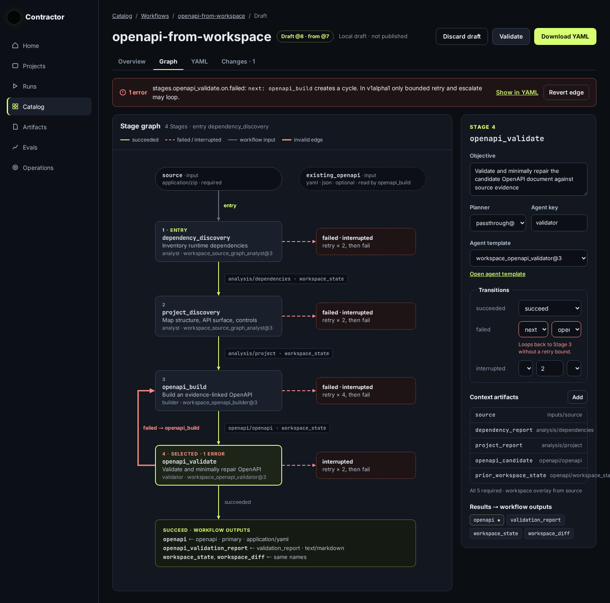
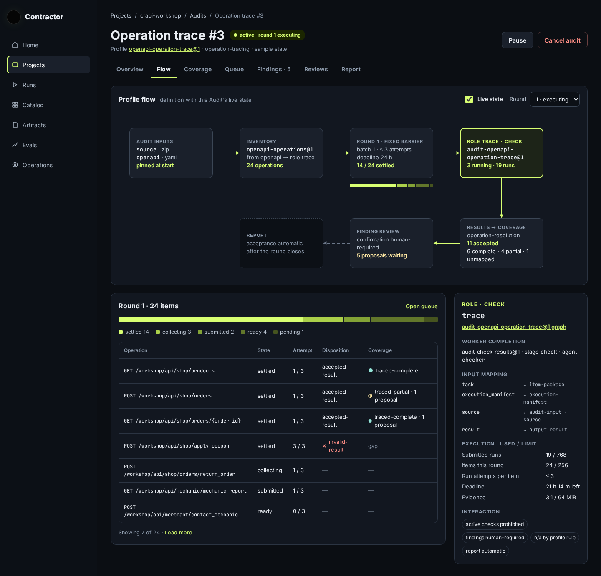
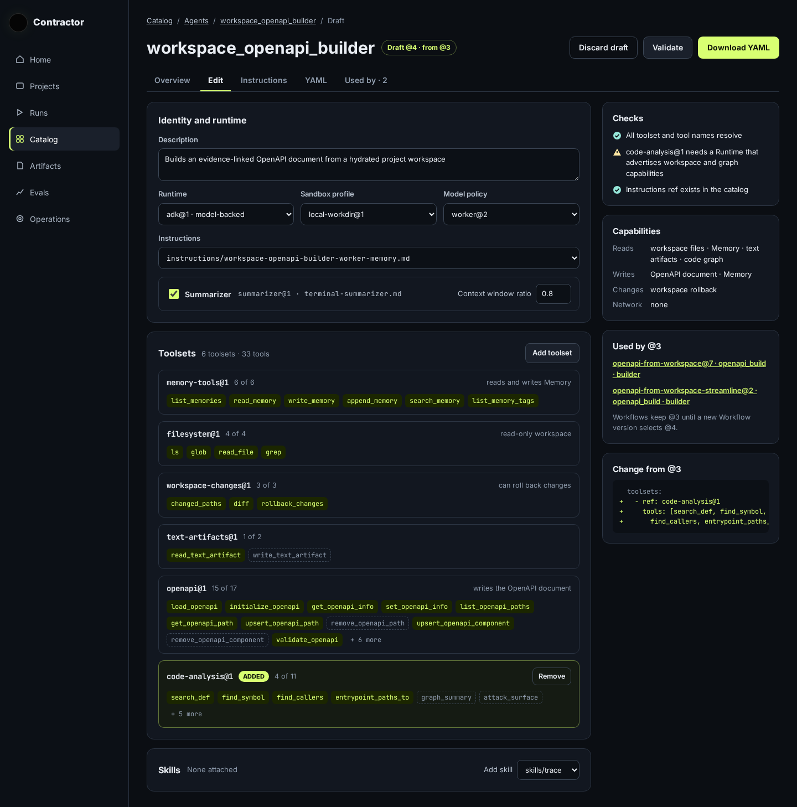
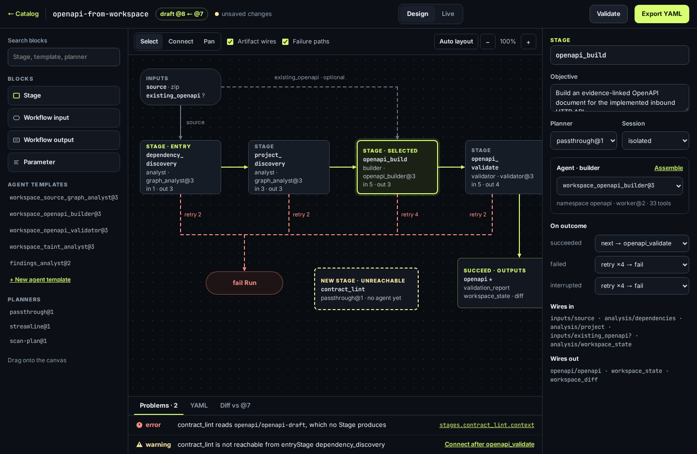
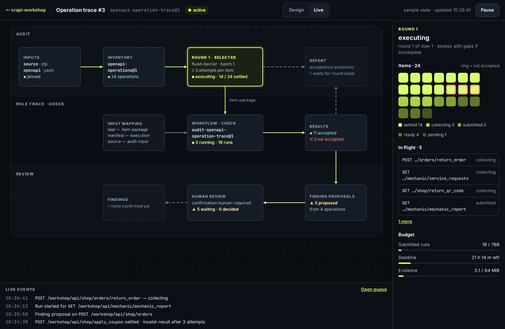
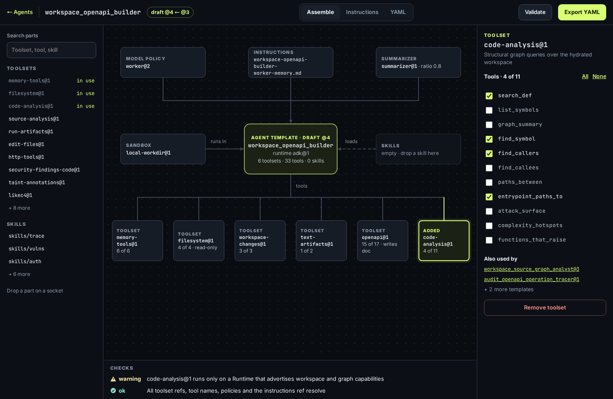
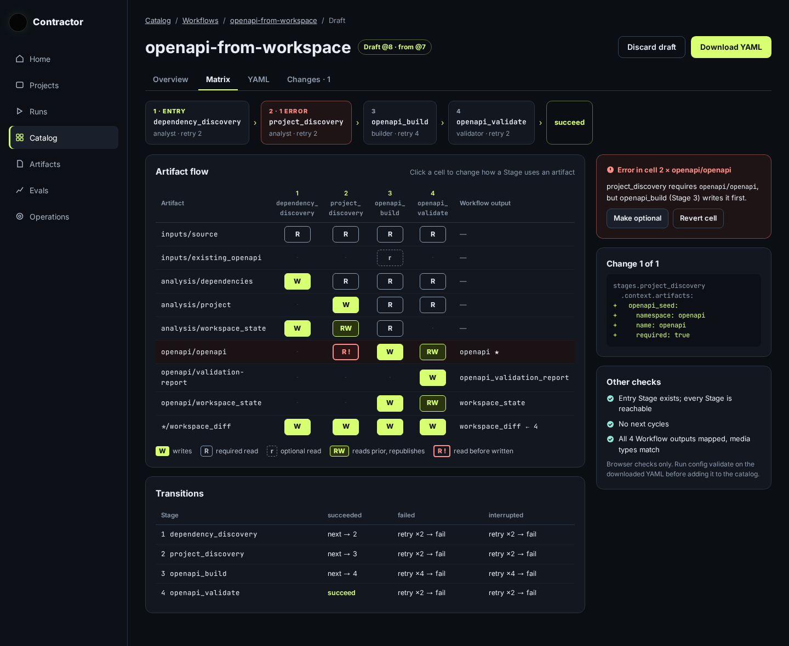
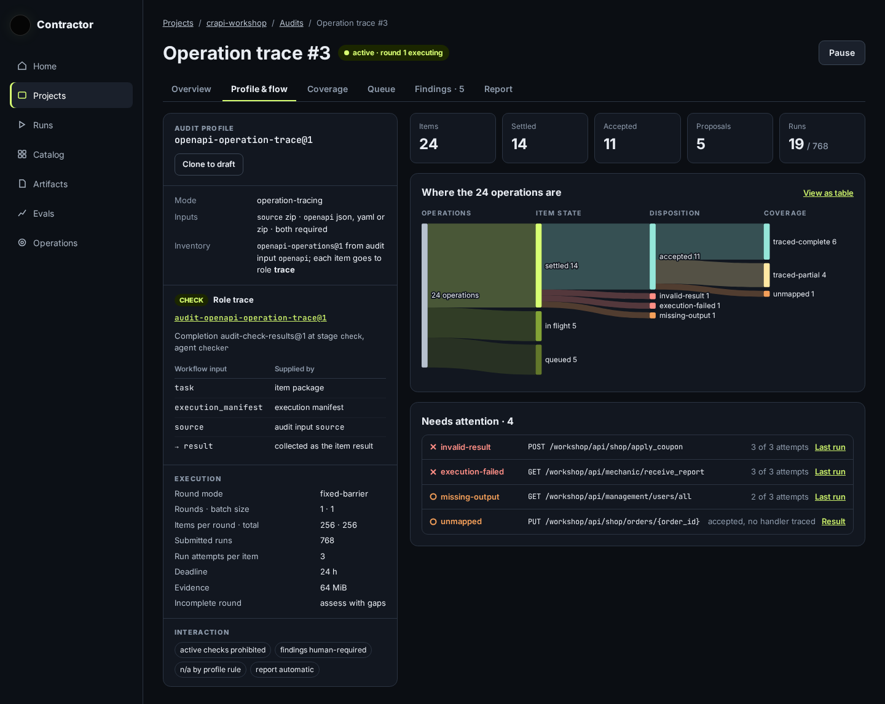
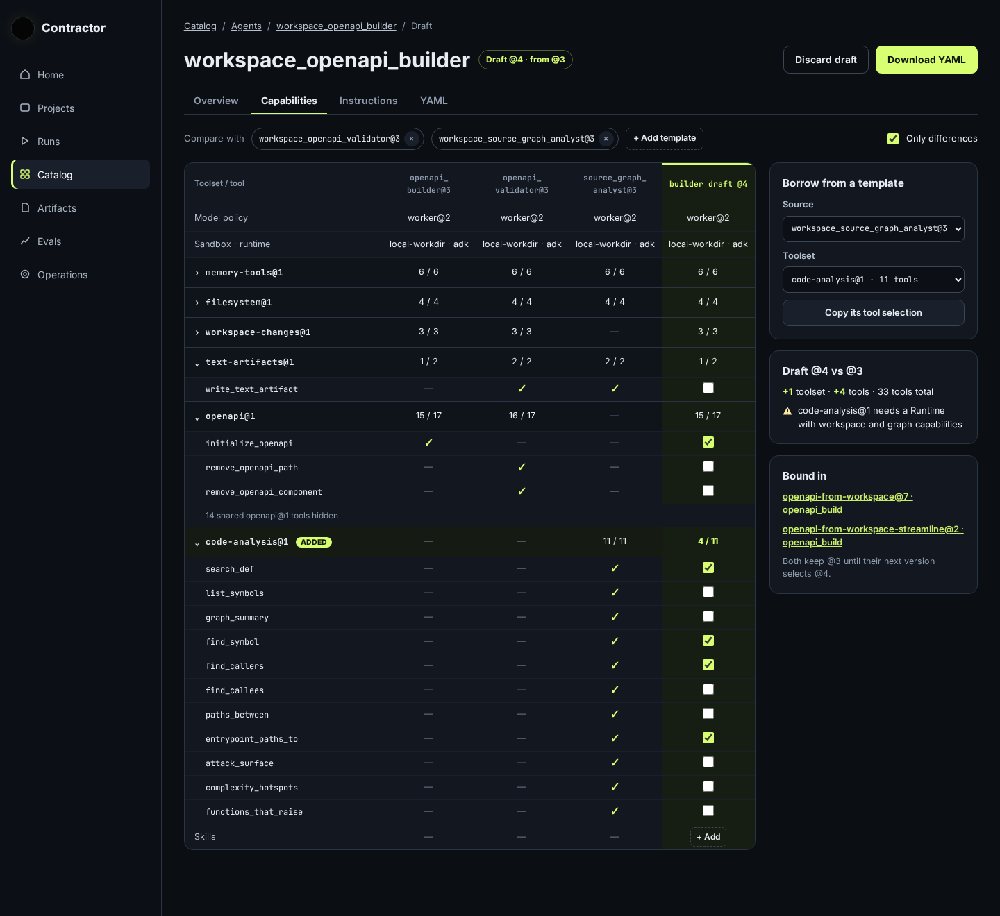

# Workflow, Audit and Agent editor ("studio")

[UI redesign explorations](README.md) · Mockups: [`mockups/studio/`](mockups/studio/)

A visualiser and editor for Workflow definitions, AuditProfiles with a live
Audit overlay, and Agent templates.

**Status:** direction **B (full-screen node studio)** was chosen on
2026-10-04. Implementation is paused until the [main journey
redesign](README.md) lands. The studio will then adopt the redesign's
vocabulary and [themes](themes.md). These mockups predate the palette decision
and use today's dark theme with the lime accent and Inter.

## Scope decisions

- **Draft locally, export YAML.** The editor shows a graph and keeps a local
  draft in the browser; the user exports YAML. There is no server publish and
  no new API.
- **Audits: definition and live state.** Audits show both the AuditProfile
  definition and a live overlay of a running Audit.
- **Authored YAML is the source.** The public `WorkflowResource` is a lossy
  projection: it has no workspace section and returns resolved execution
  configuration. The editor therefore loads authored YAML, by file or paste.
  "Open from published" is possible only with a visible warning that the
  result is incomplete. Agent templates round-trip almost losslessly.
- **Validation follows the real rules.** The mockups show:
  - no cycles through `next`;
  - every Stage reachable from `entryStage`;
  - no Artifact read before a Stage writes it.

The mockups use real configurations (`openapi-from-workspace@7`,
`openapi-operation-trace@1`, `workspace_openapi_builder@3`). The live Audit
state on `crapi-workshop` (24 operations, their states and times) is
illustrative.

## A · Graph tab inside the Catalog

The cheapest direction and the closest to today's UI; it needs no new
dependencies. The graph is read-only, and structure changes go through the
form.

**Workflow:** a vertical Stage graph. Retry → fail branches run on the right,
Artifact hand-offs are labelled on the edges, and an edge that forms a cycle
is marked red. A form panel on the right edits the selected Stage.

**Audit:** a new *Flow* tab on the Audit page. It shows the profile pipeline
(inputs → inventory → round → role → results → review → report) with live
counters, and the items table below.

**Agent:** a sectioned form, with toolsets shown as tool chips. A right column
lists checks, the agent's capabilities, where the template is used, and a diff.

## B · Full-screen node studio (chosen)

The most powerful direction for editing and for building a Workflow from
scratch. It is also the most expensive: it needs its own canvas engine, graph
layout, drag and drop, and a story for small screens.

**Workflow:** a block palette (Stage, Workflow input and output, Parameter,
Agent templates, planners) feeds a canvas of nodes with Artifact "wires" and a
shared failure bus. A draft Stage with no incoming transition is flagged as
unreachable. An inspector edits the selected Stage: planner, session, agent,
outcome transitions and wires in and out. A bottom console has *Problems*,
*YAML* and *Diff vs @7* tabs. *Validate* and *Export YAML* sit in the header,
next to a Design / Live switch.

**Audit:** Live mode with Audit / Role / Review swimlanes, a matrix of the 24
items coloured by state (not-accepted items ringed), and an event stream.

**Agent:** the template in the centre, with slots around it for the model
policy, instructions, sandbox profile, skills and toolsets.

## C · Matrix and flows

The densest and most precise direction, and good for review. It is weaker at
showing execution order and transition logic than a graph.

**Workflow:** an Artifact × Stage matrix (W, R, r, RW; an error cell shows
"R !") plus a transitions table. Data-flow errors that a graph hides become
obvious here.

**Audit:** the profile as a text outline on the left, a Sankey on the right
(operations → state → outcome → coverage), and a *Needs attention* list.

**Agent:** a tool-by-tool comparison with neighbouring templates and an
"only differences" filter. The draft is edited in its own column, and a
toolset can be copied whole from another template.

## Possible combinations

The direction was chosen as a whole, but individual screens can be mixed. For
example, C's Artifact matrix could be a second tab of the B Workflow studio,
and C's agent comparison could sit next to B's assembly view.
