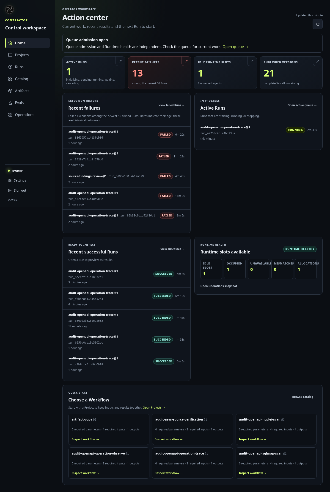
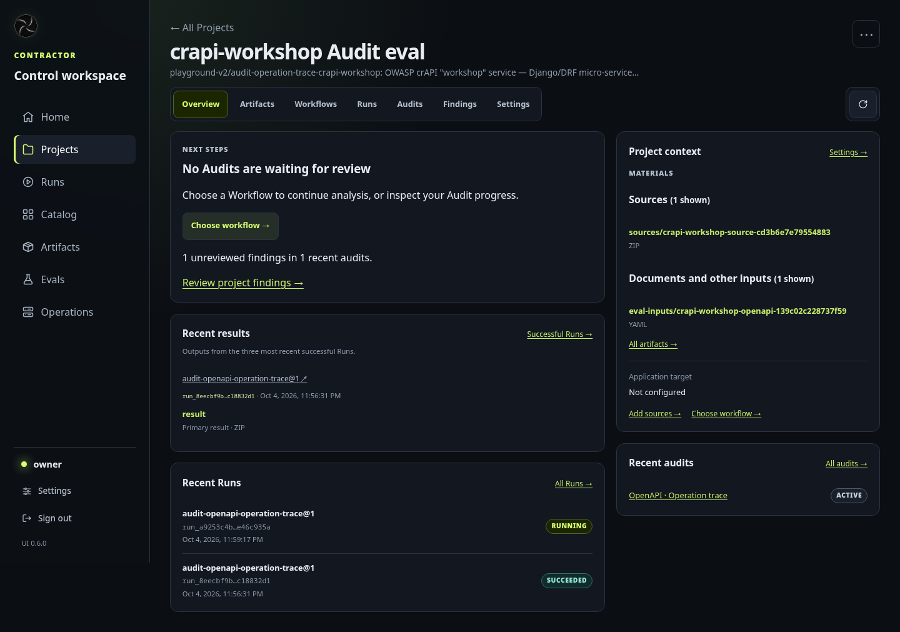
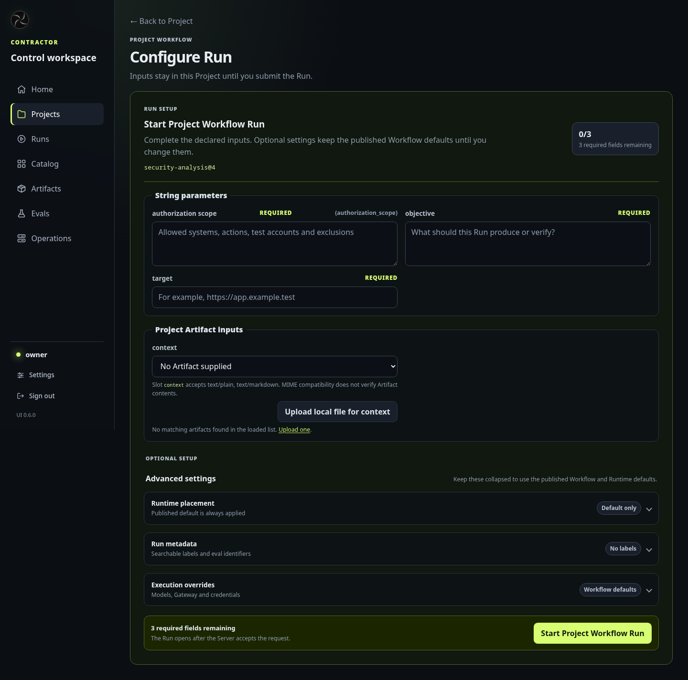
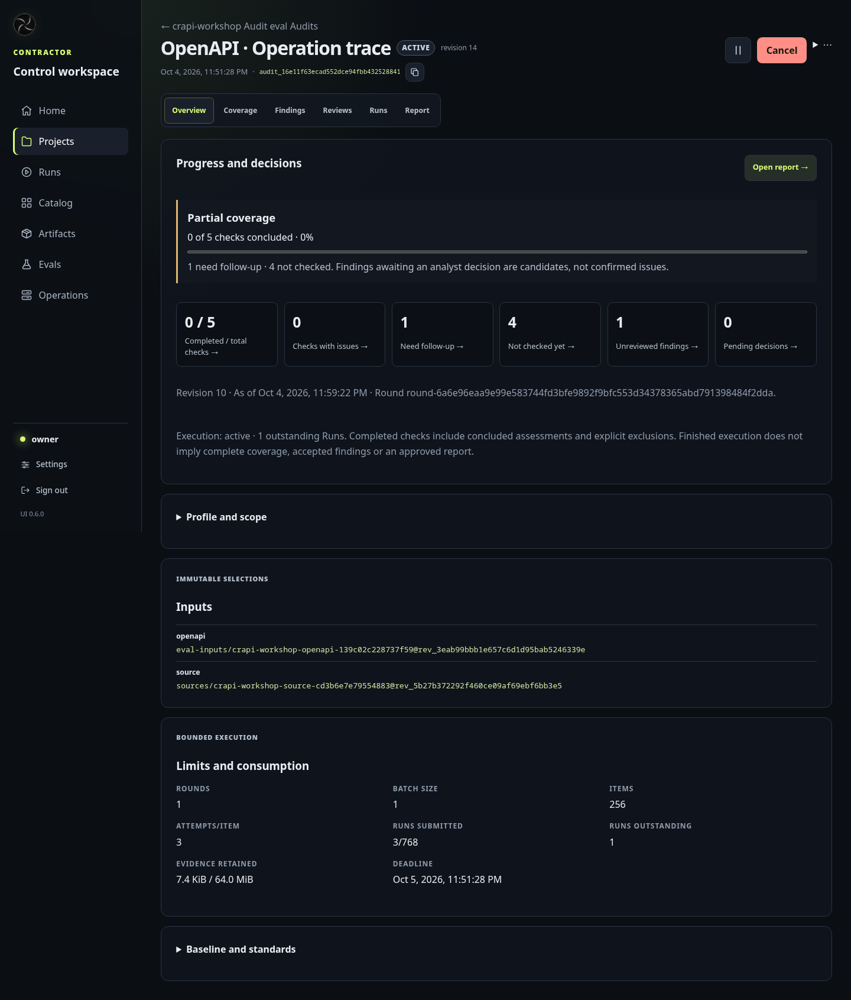
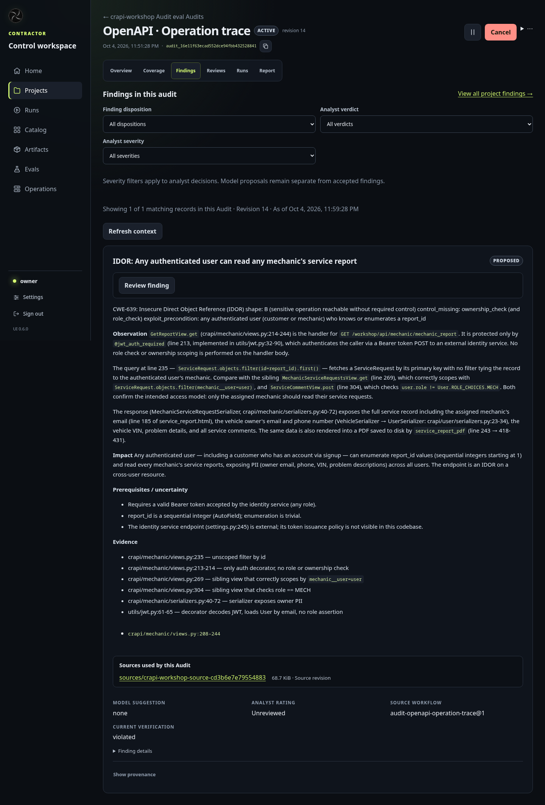
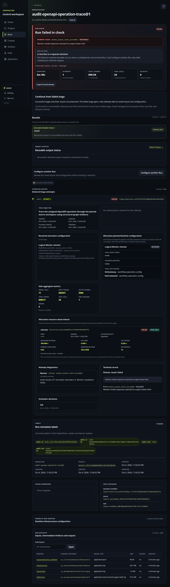

# Original: today's UI

[UI redesign explorations](README.md)

Screenshots of the demo stand as of 2026-10-04, dark theme only, at 1440 px.
These are the pages that every variant redraws. The problems listed are the
ones the redesign removes.

## Home

An operator "Action center": queue admission, idle runtime slots, published
Workflow versions, recent failed Run IDs and a link to the Workflow catalog. It does not say which
possible issue waits for a decision, or that a check on `crapi-workshop` is
running.

## Project

Artifact references with revision IDs
(`sources/crapi-workshop-source-…@rev_…`), Run lists and Workflow technical
names. Nothing on the page says what can be checked with these materials.

## Configure Run (start a check)

To start, the user picks a Workflow by name and version, then fills string
parameters, Project Artifact inputs described by MIME slots, runtime placement
and execution overrides.

## Audit overview

Revision and round hashes, six counters, paragraphs explaining semantics
("Finished execution does not imply complete coverage…"), immutable input
references ("Immutable selections") and a limits table (rounds, batch size,
attempts per item, evidence retained).

## Audit findings

Filter forms, then one long proposal card full of field names: disposition,
verdict, model suggestion and provenance.

## Run detail

About 5,000 px of scheduler, allocation, RSS and token diagnostics. Every
variant moves this behind a *Technical details* link for admins and debugging.
