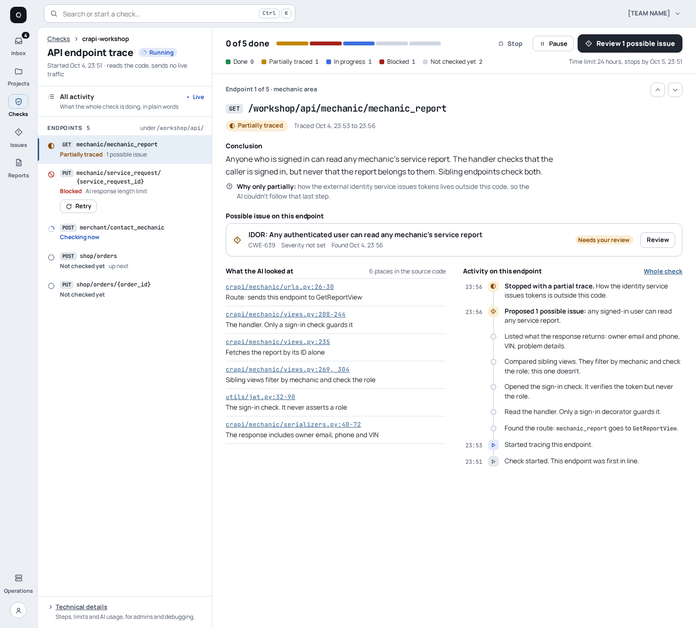
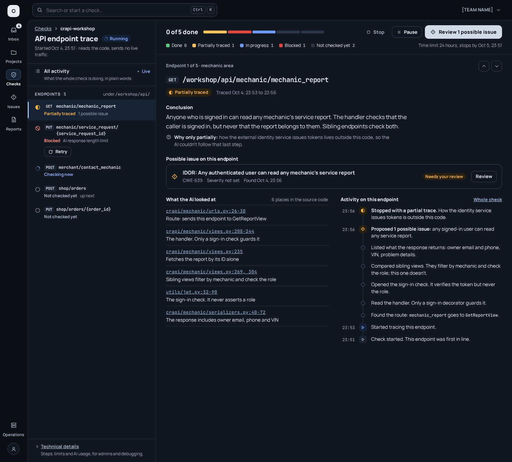
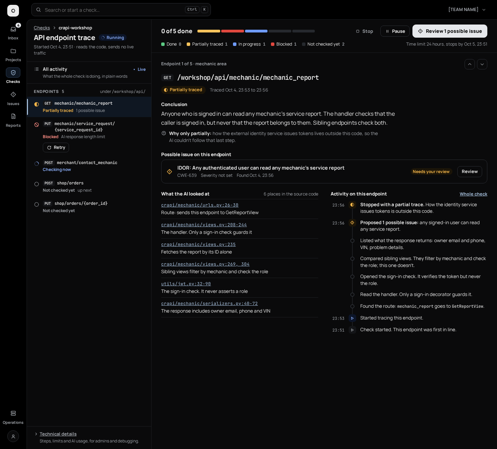

# Themes and palette

[UI redesign explorations](README.md)

**Status:** accepted on 2026-10-05. The redesign replaces today's lime accent
(`#d8ff72`) with a neutral system and ships three themes: light (default),
dark and black.

| Dark | Black |
| --- | --- |
|  |  |

## Rules

- **Neutral accent.** Primary buttons are graphite on light, and pale grey with
  dark text on dark and black. Links, focus and selection use a muted steel
  blue (`#2f5d8a` on light, `#9fbde0` on dark). No neon or lime accents.
- **Three themes.**
  - Light is the default and is designed as a theme of its own, not an inverted dark.
  - Dark keeps today's navy-charcoal family (`#0b0e13` ground, `#121720` surfaces).
  - Black is a pure `#000` ground for OLED screens, with surfaces at `#0a0a0b`–`#141518` and hairlines around `#1e2024`.
- **Tokens only.** Each theme is a set of CSS custom properties on a root class
  (`.t-light`, `.t-dark`, `.t-black`). Page styles use `var(--token)` only,
  never a raw colour, so switching the class recolours everything.
- **Status colours are reserved.** Amber means needs review or partial, red
  blocked, blue in progress, green done. They are never reused for decoration,
  and they always come with an icon and a word.
- **Contrast.** Text is at least 4.5:1 against every ground it sits on, in all
  three themes. Progress segments and the selection bar are at least 3:1
  against the surface.

## V3B token set

V3B Panes is the variant chosen for implementation, and its five pages share
one token block. All V3 variants use the same token roles; V3A and V3C differ
mainly in ground and surface values.

| Token | Light | Dark | Black |
| --- | --- | --- | --- |
| `--bg` | `#eceff3` | `#0b0e13` | `#000000` |
| `--surface` | `#ffffff` | `#121720` | `#0a0a0b` |
| `--sunken` | `#f4f6f9` | `#0e131a` | `#050506` |
| `--chrome` | `#e3e8ee` | `#1b2331` | `#141518` |
| `--chrome-2` | `#d6dde6` | `#243044` | `#1c1e22` |
| `--sel` | `#e6eef7` | `#172334` | `#0f1722` |
| `--sel-bar` | `#2f5d8a` | `#9fbde0` | `#a9c3e0` |
| `--sel-line` | `#b3c6dc` | `#3a5677` | `#2c3e55` |
| `--text` | `#10151d` | `#e9edf3` | `#ececec` |
| `--muted` | `#4a5466` | `#a8b3c3` | `#a3a7ad` |
| `--faint` | `#56606f` | `#99a5b7` | `#94989f` |
| `--line` | `#dde2e9` | `#222b38` | `#1e2024` |
| `--line-strong` | `#c3cbd6` | `#344155` | `#2d3036` |
| `--accent` | `#1f2630` | `#d3dbe6` | `#e6e8eb` |
| `--accent-kbd` | `#3b4451` | `#b4c0cf` | `#c6cbd1` |
| `--on-accent` | `#ffffff` | `#0b1017` | `#000000` |
| `--accent-ink` | `#2f5d8a` | `#9fbde0` | `#a9c3e0` |
| `--good` | `#17703a` | `#72d895` | `#72d895` |
| `--good-bg` | `#e2f2e7` | `#10261a` | `#0a1a10` |
| `--warn` | `#8a4a00` | `#f3b54a` | `#f3b54a` |
| `--warn-bg` | `#fbeed6` | `#2a2010` | `#1c1508` |
| `--bad` | `#b3261e` | `#ff8e85` | `#ff8e85` |
| `--bad-bg` | `#fbe5e2` | `#311614` | `#200c0b` |
| `--info` | `#1d4fbf` | `#8fb3ff` | `#8fb3ff` |
| `--info-bg` | `#e3eafb` | `#14213b` | `#0c1529` |
| `--m-idle` | `#cfd6e0` | `#2b3546` | `#26292e` |
| `--m-partial` | `#c08600` | `#f6c35c` | `#f6c35c` |
| `--m-progress` | `#3f6fe0` | `#6f9bff` | `#6f9bff` |
| `--m-blocked` | `#a3221a` | `#e0483f` | `#e0483f` |
| `--m-done` | `#1f8a4c` | `#5cc983` | `#5cc983` |
| `--code-bg` | `#f6f8fa` | `#0e131a` | `#050506` |
| `--code-hl` | `#e6eef7` | `#172334` | `#0f1722` |
| `--badge-bg` | `#10151d` | `#d3dbe6` | `#e6e8eb` |
| `--badge-ink` | `#ffffff` | `#0b1017` | `#000000` |
| `--shadow` | `0 1px 2px rgba(16,21,29,.06), 0 10px 28px -14px rgba(16,21,29,.22)` | `0 1px 2px rgba(0,0,0,.4), 0 16px 40px -16px rgba(0,0,0,.7)` | `0 1px 2px rgba(0,0,0,.6), 0 16px 40px -16px rgba(0,0,0,.9)` |

Roles:

| Tokens | Role |
| --- | --- |
| `bg` | Page ground |
| `surface` | Panes and cards |
| `sunken` | Insets and quiet boxes |
| `chrome`, `chrome-2` | Method chips and rail states |
| `sel`, `sel-bar`, `sel-line` | Selected row tint, its left bar and outline |
| `accent`, `on-accent` | Primary button and its label |
| `accent-ink` | Links |
| `good`, `warn`, `bad`, `info` (and their `-bg`) | Status text and status chips |
| `m-*` | Progress segments in endpoint order |
| `badge-*` | Count badge on the rail |

Measured contrast for V3B: the lowest text pair is 5.17:1 (`--faint` on
`--chrome`, light). The lowest progress segment is 3.16:1 (`--m-partial` on
white). Hairlines (`--line-strong`) are decorative and not held to 3:1.

## Typography

| Variant | Text | Mono |
| --- | --- | --- |
| V1 Guided | Geist | Geist Mono |
| V2 Workspace | IBM Plex Sans | IBM Plex Mono |
| V3, V3A, V3B, V3C | Manrope | JetBrains Mono |

Mono is used for endpoints, file:line references, code and key hints only,
never for titles.
