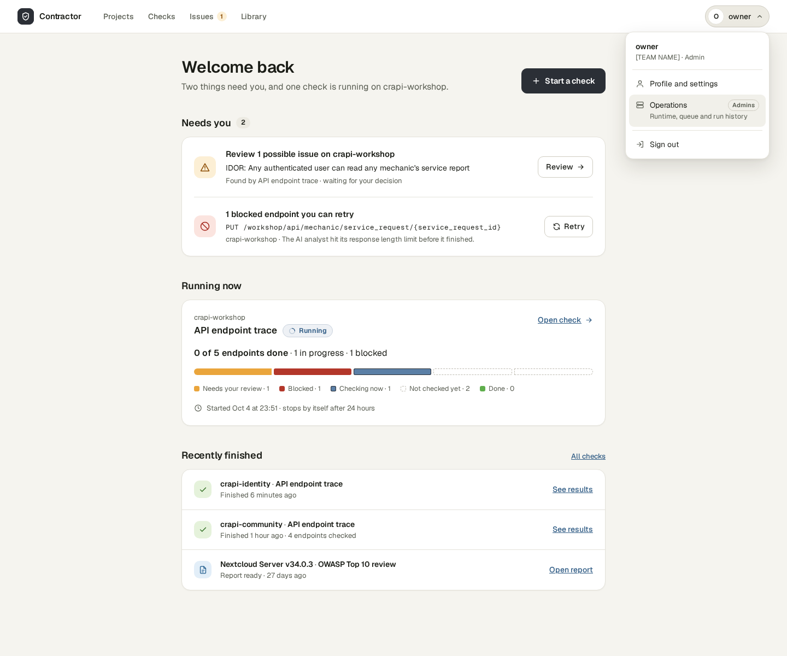
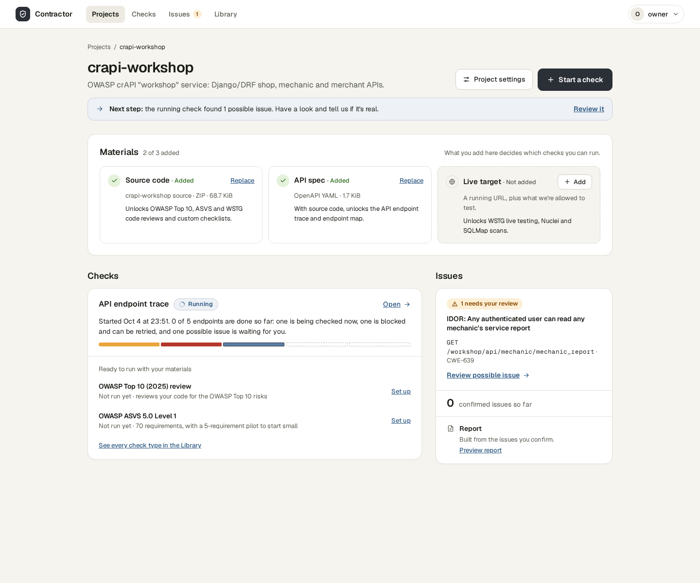
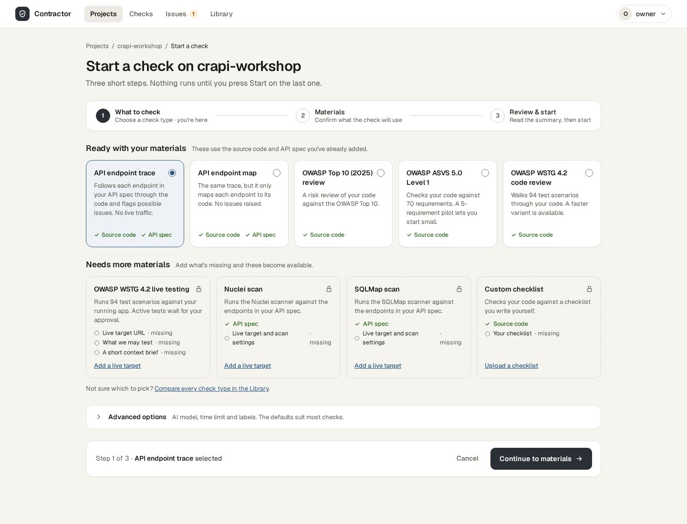
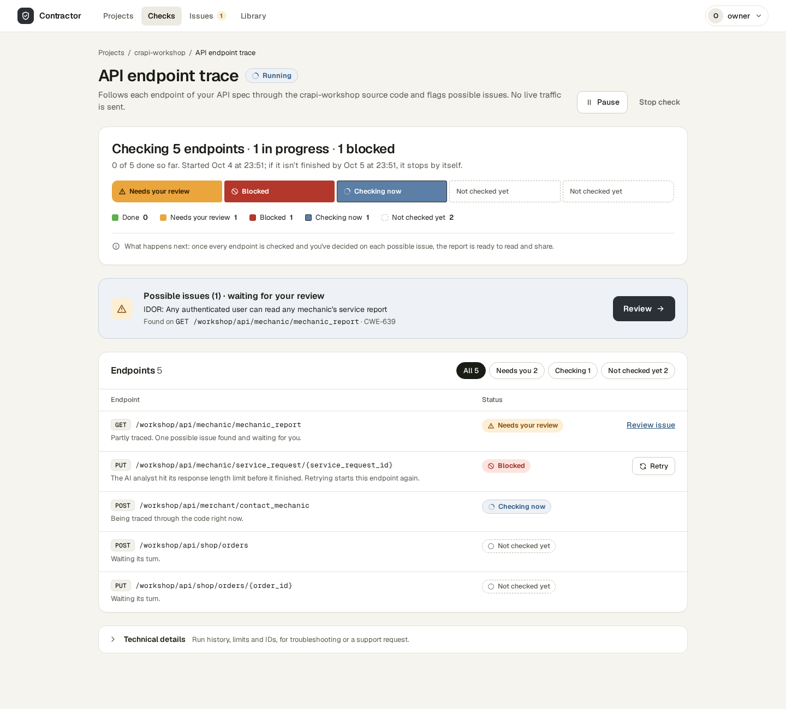
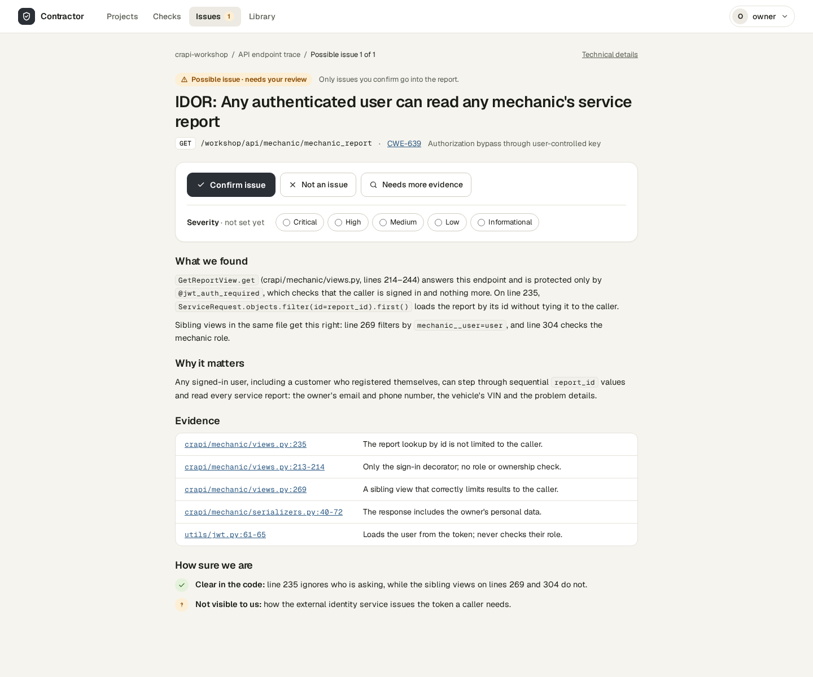

# V1 Guided

[UI redesign explorations](README.md) · Mockups: [`mockups/v1/`](mockups/v1/)

**Idea:** a task-first product for someone who runs a check now and then. It
uses generous spacing, plain sentences, wizards for anything with more than one
decision, and one obvious next step on each page.

| | |
| --- | --- |
| Navigation | Slim top bar: Projects · Checks · Issues (with a count badge) · Library; account menu on the right, which holds *Operations* for admins |
| Type | Geist and Geist Mono |
| Palette | Warm neutral ground `#f5f4ef`, white surfaces, graphite primary buttons, steel-blue links; dark and black themes |
| Status | Words plus an icon; "Not checked yet" is a dashed outline |
| Decision state | Not chosen; V3 was preferred |

## Home

A calm single column replaces the operator dashboard: a greeting, then *Needs
you* (review the IDOR, retry the blocked endpoint), *Running now* with a
5-segment bar, and *Recently finished*. "Start a check" is the only primary
action. The account menu is drawn open on this page only, to show that
Operations lives there for admins.

## Project

Artifact references, Runs and Workflow names become a plain header and a
three-item Materials checklist: Source code ✓, API spec ✓, and Live target with
"Add". Each material says in one line which checks it unlocks. Below the
checklist are a *Next step* hint, a Checks list in plain sentences with
suggested checks that are ready to run, and an Issues summary with the report.

## Start a check

"Configure Run" becomes step 1 of a three-step wizard (what to check →
materials → review and start). Check types are cards in two groups: *Ready
with your materials* (5) and *Needs more materials* (4). Each card says what
the check does and which materials it needs, marked ✓ or missing. Advanced
options are collapsed.

## Check in progress

The six counters, revision and round hashes, immutable inputs and the limits
table give way to one status sentence ("Checking 5 endpoints · 1 in progress ·
1 blocked") over a labelled segmented bar. Below it are the *Possible issues
(1) → Review* call-out, which is the page's primary action, and an endpoint
table with human statuses. The blocked row carries Retry and its plain reason.
Run IDs, limits and the check ID live only in a collapsed *Technical details*.

## Review a possible issue

The dense finding card becomes an article. It opens with the title, the
endpoint and CWE-639, and a decision bar (Confirm issue / Not an issue / Needs
more evidence) with a severity picker. Then come *What we found*, *Why it
matters*, *Evidence* (file:line references in mono) and *How sure we are*.

## Trade-off

The first journey is easy. A user who already knows what they want sees fewer
endpoints, checks and details per screen, and needs extra clicks to reach
technical detail.
