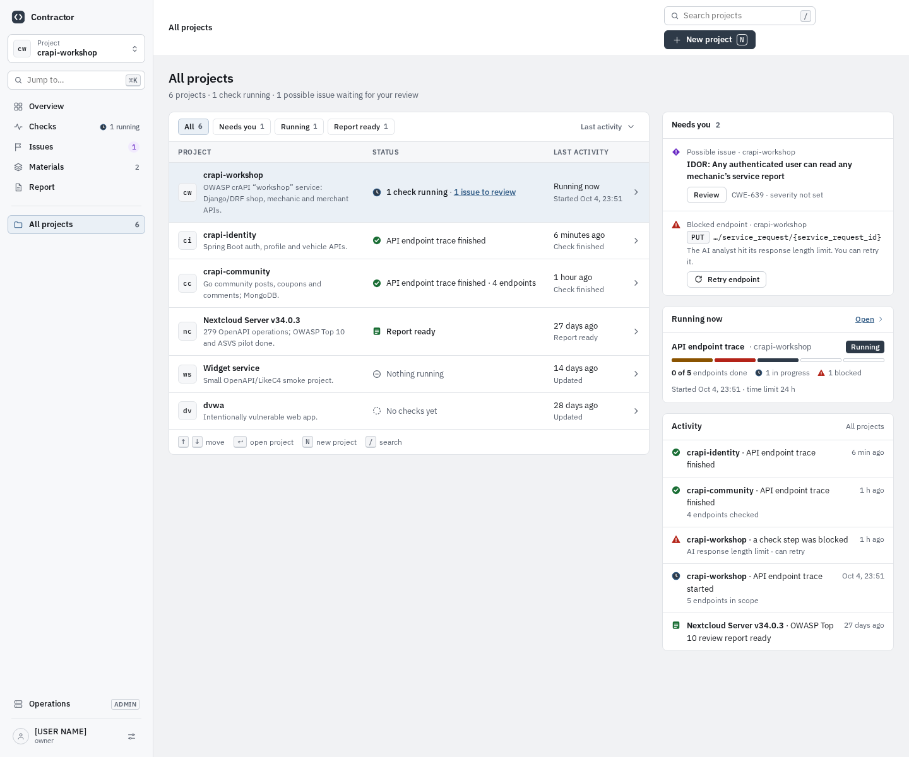
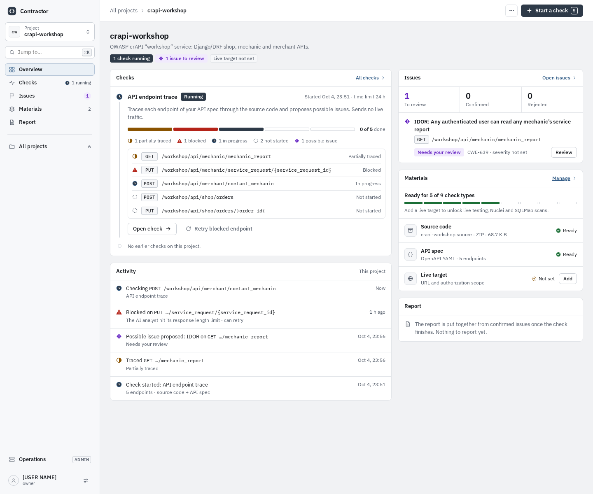
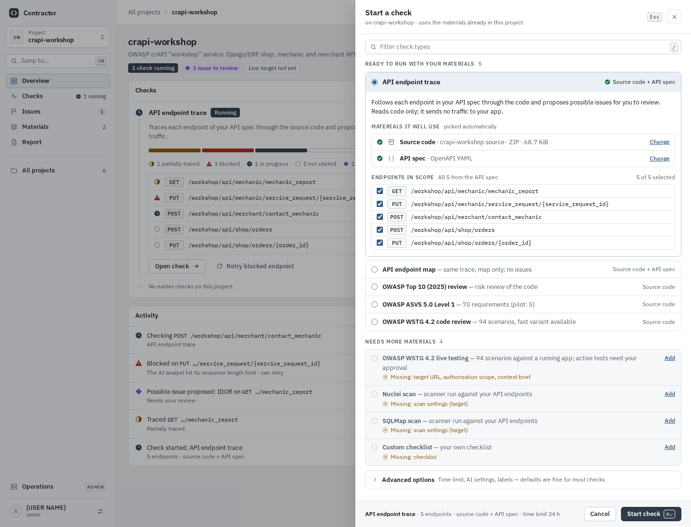
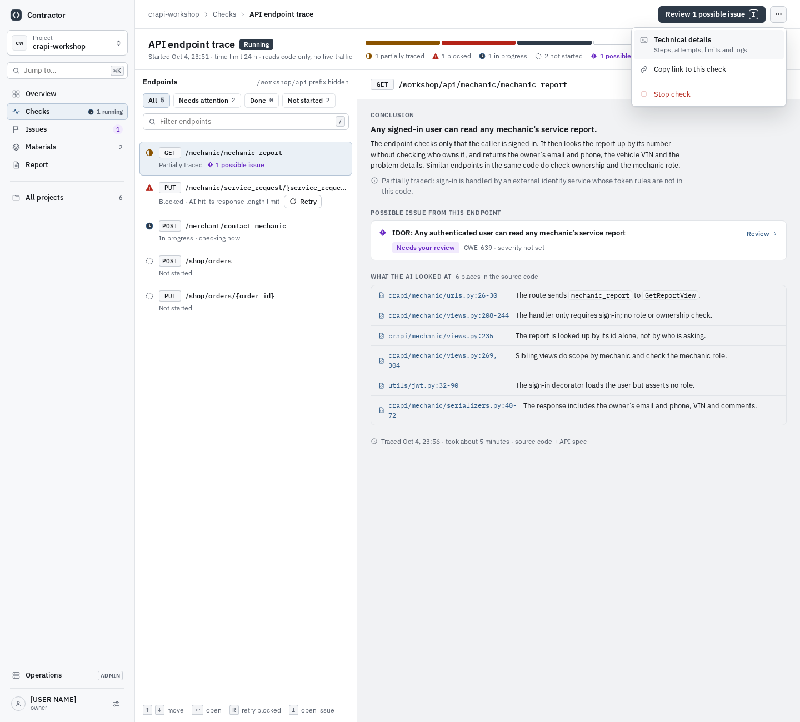
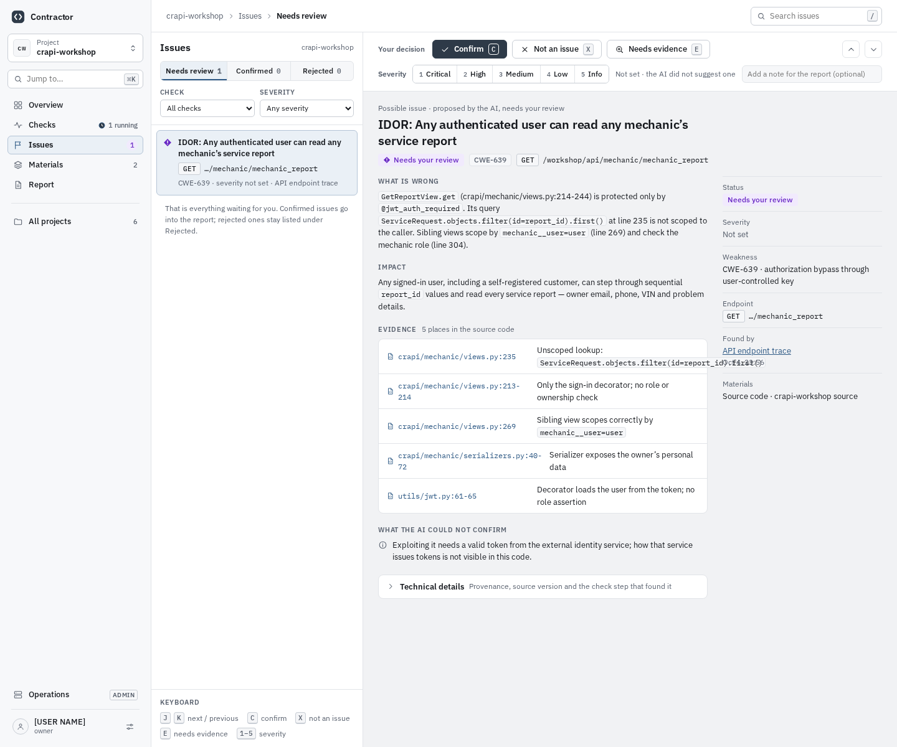

# V2 Workspace

[UI redesign explorations](README.md) · Mockups: [`mockups/v2/`](mockups/v2/)

**Idea:** a project-centric workspace for a regular user. A persistent project
sidebar and split panes put the endpoint list and the selected item side by
side, so the user moves through a check without changing pages.

| | |
| --- | --- |
| Navigation | Left sidebar with a project switcher, *Jump to…* (⌘K), project sections (Overview · Checks · Issues · Materials · Report) and *All projects*; Operations at the bottom, marked ADMIN |
| Type | IBM Plex Sans and IBM Plex Mono |
| Palette | Cool grey ground, graphite primary, steel-blue links and selection, violet for "needs review"; dark and black themes |
| Keyboard | ↑↓ move, ↵ open, R retry blocked, I open issue; review: C confirm, X not an issue, E needs evidence, 1–5 severity |
| Decision state | Not chosen; V3 was preferred |

## Home (All projects)

The operator dashboard becomes a table of the six projects, each with a
one-line status and last activity, and filter chips (All · Needs you · Running
· Report ready). A right column holds *Needs you* (the IDOR to review, the
blocked endpoint to retry), *Running now* and a cross-project activity feed.

## Project

Four panels replace Workflow names, run IDs and artifact paths:

- **Checks:** the running trace with progress for each of the 5 endpoints.
- **Issues:** 1 to review, 0 confirmed, 0 rejected, with the IDOR listed.
- **Materials:** Source code and API spec ready, live target not set ("Ready for 5 of 9 check types").
- **Activity:** a feed of what happened in the project.

"Start a check" is the only primary action.

## Start a check

"Configure Run" becomes a right-hand drawer over the dimmed project. Check
types are split into 5 *Ready to run* and 4 *Needs more materials*, each saying
what is missing. *API endpoint trace* is expanded to show a plain summary, the
automatically picked materials and all 5 endpoints in scope. Advanced options
are collapsed, and *Start check* sits in a pinned footer.

## Check in progress

A one-line progress strip reads "0 of 5 done, 1 in progress, 1 blocked, 1
possible issue". Below it is a split view. On the left is the endpoint list
with All / Needs attention / Done / Not started chips and an inline Retry. On
the right is the selected `GET …/mechanic_report` with a plain conclusion, its
linked issue and the six file:line places the AI looked at. *Technical details*
and *Stop check* live in the header overflow menu, which the mockup draws open.

## Review a possible issue

The issue page becomes a triage split view. The left list has Needs review 1 /
Confirmed 0 / Rejected 0 tabs and keyboard hints. On the right, a sticky
decision bar holds Confirm (C), Not an issue (X), Needs evidence (E), a 1–5
severity picker and an optional note. Below the bar, the issue is split into
*What is wrong*, *Impact*, five evidence links, *what the AI could not confirm*
and a facts sidebar. Provenance sits behind a collapsed *Technical details*.

## Trade-off

The persistent sidebar and split panes make moving between endpoints and
triaging issues fast and calm. The shell is dense and assumes one project at a
time: cross-project work exists only on *All projects*, and the narrow list
panes truncate long endpoint paths.
