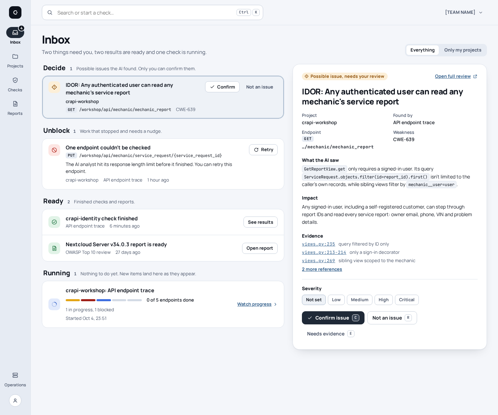
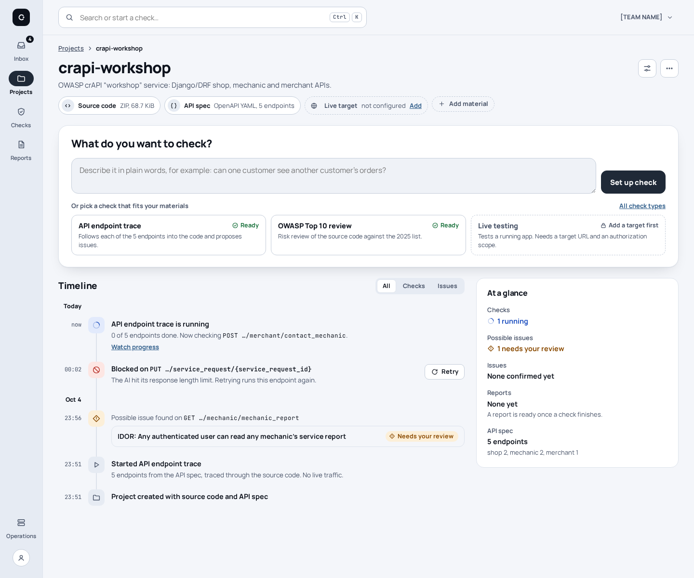
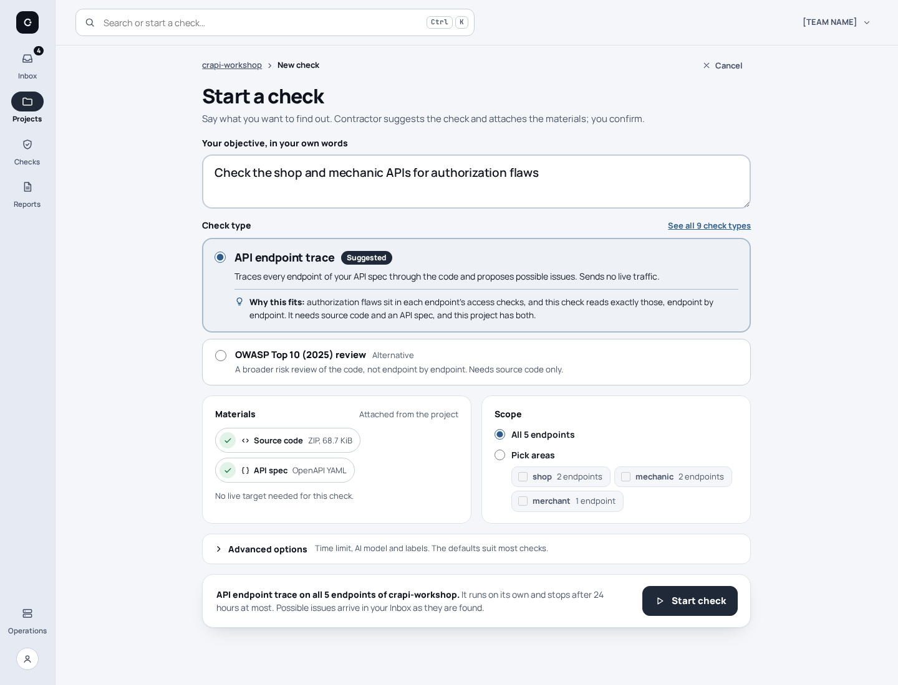
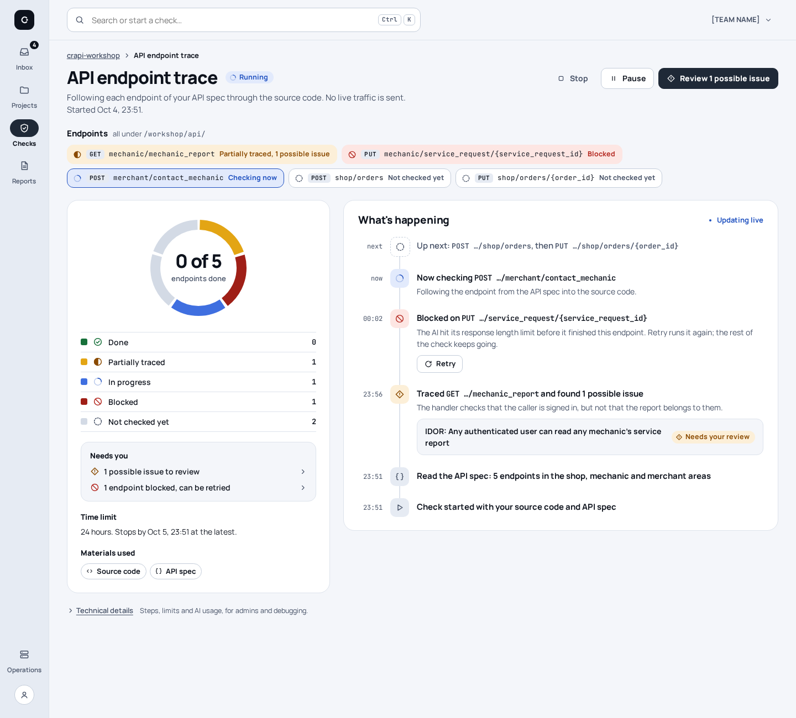
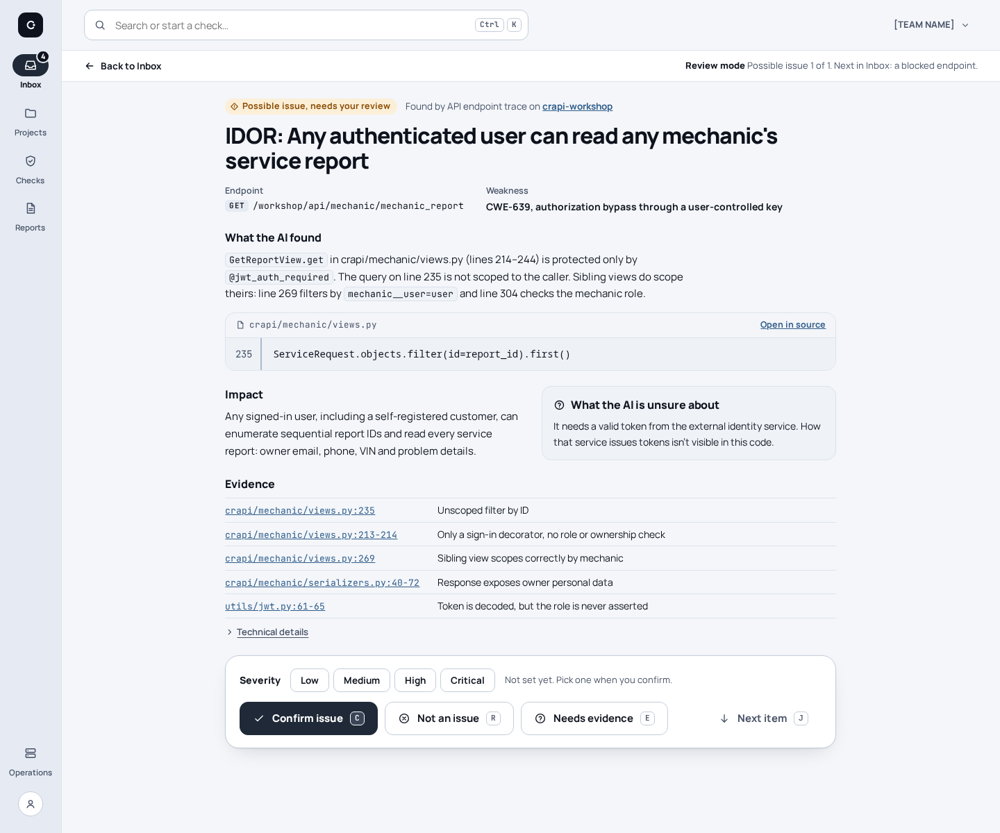

# V3 Inbox

[UI redesign explorations](README.md) · Mockups: [`mockups/v3/`](mockups/v3/)

**Idea:** decisions first. Home is an inbox of what the user has to do, and
items are acted on where they are shown. A check starts from an objective
written in plain words, and the running check reads as a narrative.

**Status:** chosen as the base for the redesign. Three variations of it are
documented in [V3A Focus](v3a-focus.md), [V3B Panes](v3b-panes.md) and
[V3C Board](v3c-board.md); V3B was chosen for implementation.

| | |
| --- | --- |
| Navigation | Narrow icon rail (Inbox with a count · Projects · Checks · Reports; Operations and account at the bottom) and a command bar "Search or start a check…" (Ctrl K) |
| Type | Manrope and JetBrains Mono |
| Palette | Cool light ground `#f4f6fa`, graphite primary `#1f2937`, steel-blue links `#2f5d8a`; dark and black themes ([tokens](themes.md)) |
| Keyboard | Review: C confirm, R not an issue, E needs evidence, J next |

## Home (Inbox)

The inbox is sorted by what the user has to do:

- **Decide:** the IDOR, with inline Confirm and Not an issue.
- **Unblock:** the blocked endpoint, with its plain reason and Retry.
- **Ready:** the finished crapi-identity check and the Nextcloud report.
- **Running:** crapi-workshop at 0 of 5.

A preview pane on the right shows the selected item in full, with severity and
the decision buttons, so a user can decide without opening the review page.

## Project

Three things replace tabs, artifact paths and run lists:

- Materials as chips, including "Live target: not configured · Add".
- A *What do you want to check?* box with check suggestions based on those materials.
- One timeline that mixes checks, the blocked step and the possible issue.

## Start a check

Starting is one screen. The user writes an objective in plain words, gets a
suggested check type with a *Why this fits* line and one alternative, and sees
the materials attached automatically. Scope is a single choice: all 5
endpoints, or pick areas (shop · mechanic · merchant). Advanced options stay
collapsed, and one *Start check* button finishes the flow.

## Check in progress

A 5-segment progress ring with a labelled legend replaces the counters and
hashes. Endpoint chips carry an icon and a word for their status. A
plain-language log ("Now checking…", "Blocked on… Retry", "Traced… found 1
possible issue") is the live view. *Technical details* sits behind a quiet
link.

## Review a possible issue

A focused review mode: one reading column, the single relevant code line
(`views.py:235`) in mono, file:line evidence, and the AI's uncertainty in its
own box. A decision bar at the bottom holds a severity picker and large
Confirm (C), Not an issue (R), Needs evidence (E) and Next (J) buttons.

## Trade-off

The inbox gets the user to decisions fast and makes acting in place easy.
Browsing becomes second-class: seeing the full state of a project or check
takes an extra hop. Acting from the preview pane can also encourage quick
confirmations without reading all the evidence.
