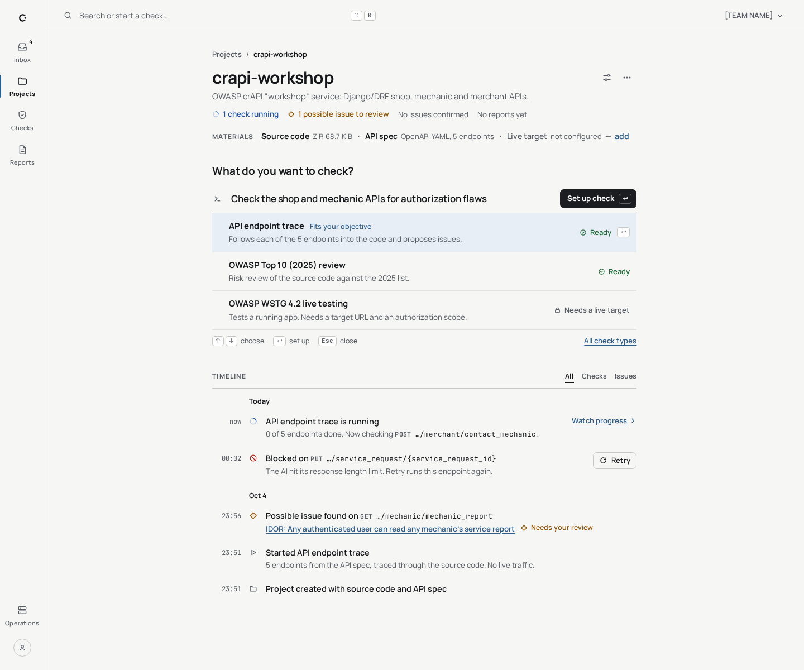
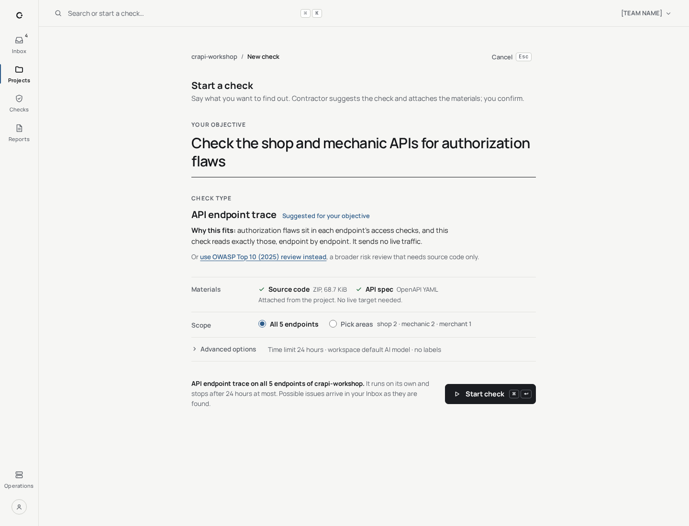
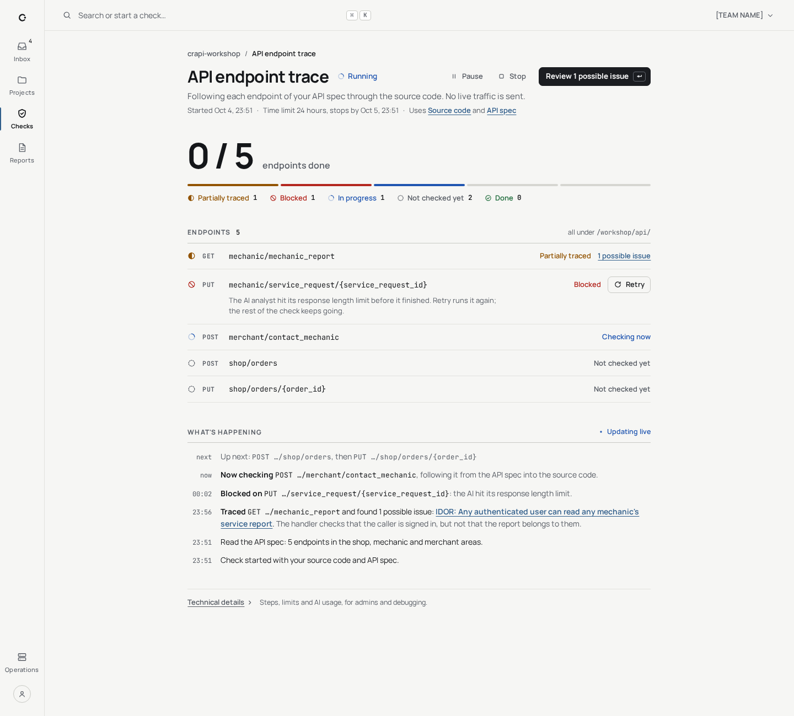
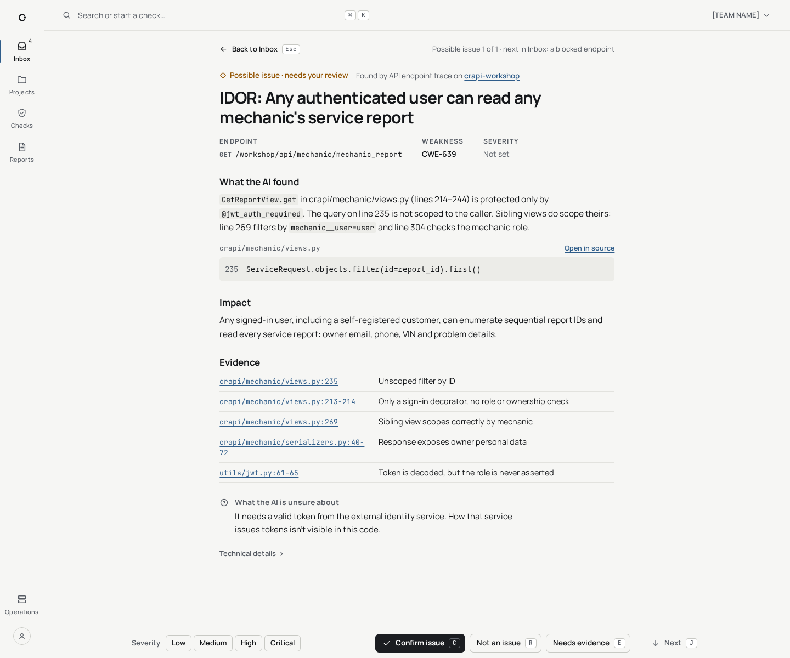

# V3A Focus

[UI redesign explorations](README.md) · Base: [V3 Inbox](v3-inbox.md) ·
Mockups: [`mockups/v3a/`](mockups/v3a/)

**Variation axis:** V3 with the containers taken out. Cards, pills and boxed
panels become hairline-separated rows in one centred reading column. Grouping
comes from type weight and spacing, and rows expand inline. It is designed to
be driven from the keyboard.

| | |
| --- | --- |
| Navigation | Quiet icon rail with a thin active bar; the command bar is a button that opens a command palette (⌘K) |
| Layout | One centred column, 720–760 px |
| Type | Manrope and JetBrains Mono, as V3 |
| Palette | Near-white ground `#f6f6f4`, ink primary `#1b1d21`, steel-blue links; one faint selection tint; dark and black themes |
| Decision state | Not chosen; V3B Panes was chosen |
| Keyboard | J/K move, ↵ open, C/R/E decide, ⌘↵ start, Esc back, ⌘K palette; a key legend sits at the bottom of Home |

## Home (Inbox)

V3's two-column inbox with its preview pane becomes one centred 760 px column.
Rows sit under quiet uppercase labels with counts: Decide / Unblock / Ready /
Running. The IDOR row opens inline on a pale steel-blue tint, with a two-line
summary, a severity picker, *Confirm C*, *Not an issue R*, *Needs evidence E*
and *Open full review ↵*.

## Project

Material pills, the boxed intent card, the "At a glance" panel and the
icon-tile timeline all become plain lines:

- A one-line status summary.
- An inline list: "Source code · API spec · Live target — add".
- A single underlined command input, with three suggestions beneath it showing ready or needs-a-target state and ↑↓/↵/Esc hints.
- A quiet timeline of time, glyph and text.

## Start a check

A 720 px composer. The objective is set in 30 px type on an ink underline. The
suggested type takes one line with *Why this fits*, and the alternative is a
text link. Materials and scope are hairline rows, *Advanced options* is a
one-line disclosure, and a single *Start check* button carries a ⌘↵ hint.

## Check in progress

A large "0 / 5 endpoints done" figure sits over a thin 5-segment line and a
legend of glyphs and words. Endpoints are mono rows with a coloured status
word, and the blocked row has Retry inline. A condensed, time-stamped activity
log sits underneath, above a quiet *Technical details* link.

## Review a possible issue

A pure 720 px reading column: a bare mono line 235, file:line evidence rows,
and the uncertainty as an indented aside with a hanging "?" glyph. A slim,
full-width sticky bar at the bottom holds severity, *Confirm C*, *Not an issue
R*, *Needs evidence E* and *Next J*. *Back to Inbox* is bound to Esc.

## Trade-off

Taking out containers and colour makes the pages calm and fast to scan from
the keyboard. But what is actionable is shown only by type weight, spacing and
one faint selection tint. The pages feel sparser and explain themselves less
well to occasional mouse users than V3's cards and pills.
