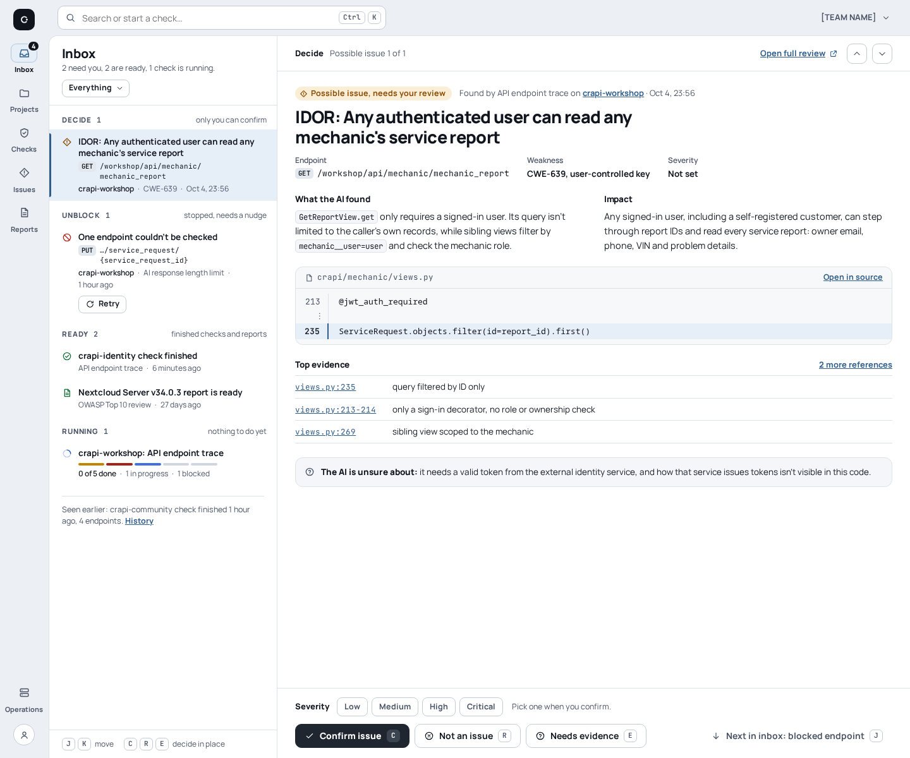
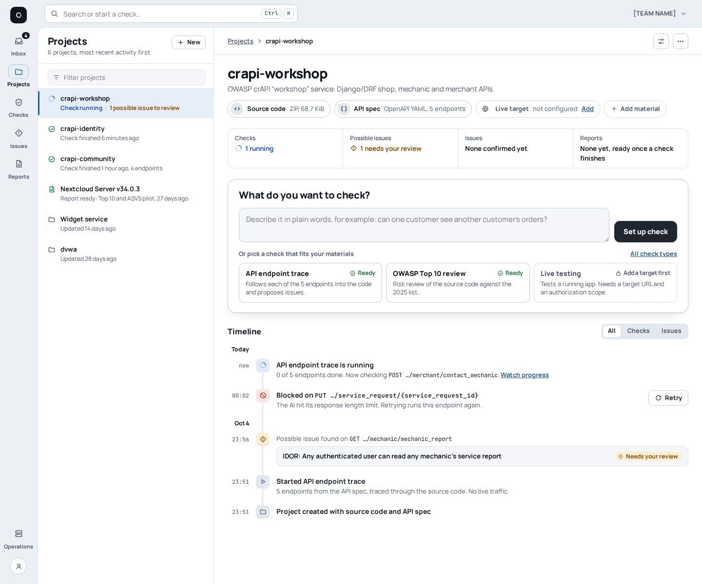
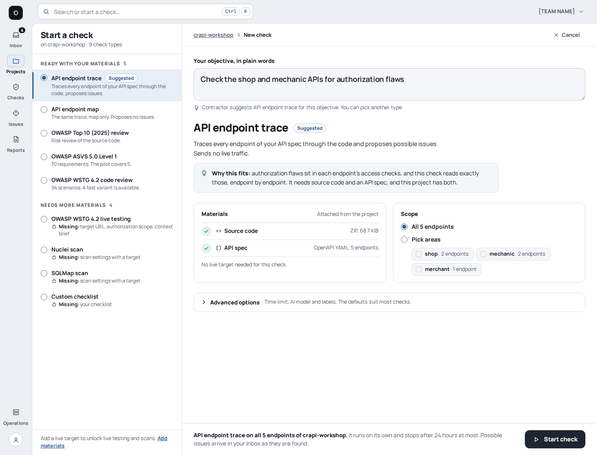
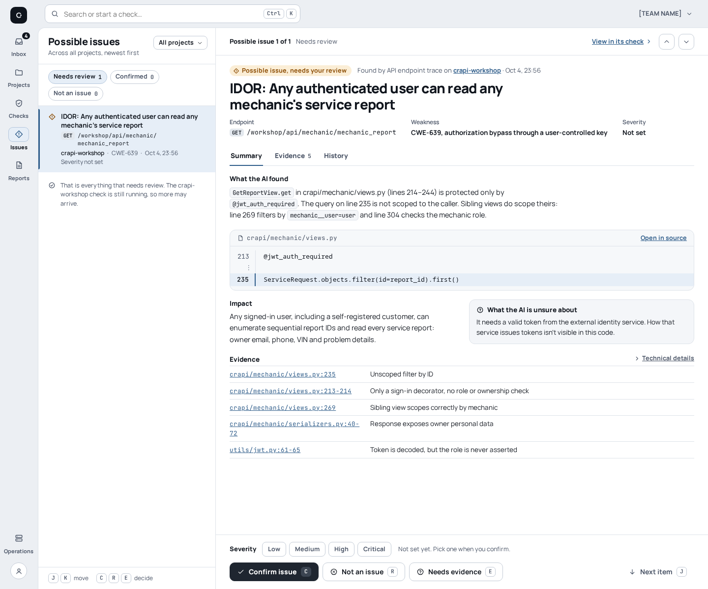

# V3B Panes

[UI redesign explorations](README.md) · Base: [V3 Inbox](v3-inbox.md) ·
Mockups: [`mockups/v3b/`](mockups/v3b/)

**Variation axis:** every page is the same three-part layout: rail, list pane
and detail pane. The user moves through a list with J/K and decides in the
detail pane without changing pages.

**Status:** chosen on 2026-10-05 as the target for the `ui/` redesign. Two
borrowings remain open: V3A's quieter rail and typography, and V3C's lanes as
an alternative view of a running check.

| | |
| --- | --- |
| Navigation | Icon rail (Inbox · Projects · Checks · **Issues** · Reports; Operations and account at the bottom), command bar (Ctrl K) |
| Layout | Rail · list pane (about 360 px) · detail pane; the panes wrap into one column on narrow screens |
| Type | Manrope and JetBrains Mono, as V3 |
| Palette | Cool grey ground `#eceff3`, white panes, graphite primary, steel-blue selection bar `--sel-bar`; dark and black themes ([tokens](themes.md)) |
| Keyboard | J/K move in the list, C/R/E decide, J next item; hints pinned at the bottom of the list pane |

## Home (Inbox)

V3's card stack and floating preview become a compact inbox list pane (Decide
/ Unblock / Ready / Running, with counts). Retry sits right in the Unblock
row. The full-height detail pane holds the whole IDOR review: summary, impact,
the real code line, the top evidence and an "unsure" note. A decision bar is
pinned at the bottom with severity, C / R / E and *Next in inbox: blocked
endpoint (J)*.

## Project

The list pane shows all six projects, each with a one-line status, with
`crapi-workshop` selected. The detail pane keeps the material chips, the *What
do you want to check?* composer with its three suggestions, and the timeline.
V3's "At a glance" sidebar becomes a four-cell strip.

## Start a check

V3's centred form is split in two. The list pane shows all 9 check types as
radio rows in two groups: *Ready with your materials* (5, with API endpoint
trace selected and marked Suggested) and *Needs more materials* (4, each saying
what is missing). The detail pane holds the objective, *Why this fits*, the
auto-attached materials, scope (all 5 or pick areas), collapsed advanced
options and a pinned *Start check* bar.

## Check in progress

- **List pane:** the check's name and state, an *All activity* row (the live narrative), and the 5 endpoints with a status glyph and word. The blocked row has Retry inline.
- **Detail header:** "0 of 5 done", a segment line in endpoint order, the legend, Stop / Pause and *Review 1 possible issue*.
- **Selected endpoint** (`GET …/mechanic_report`): a plain conclusion with why it is only partial, the linked possible issue, the 6 file:line places the AI looked at, and that endpoint's own slice of the log.

The header sits at the top of the detail pane, not across both panes. That
way the list pane starts at the same height on every page.

## Review a possible issue

V3's single centred article becomes a cross-project *Possible issues* list
with filter chips (Needs review 1 · Confirmed 0 · Not an issue 0). The detail
pane has Summary · Evidence 5 · History tabs. Summary shows code lines 213 and
235, impact, the "unsure" note and all 5 evidence rows, with a decision bar
pinned at the bottom. This list is why V3B adds an *Issues* entry to the rail.

## Trade-off

Every page becomes a fast triage surface that needs no navigation and works
well from the keyboard. The rail and list take about 440 px from the detail
column, so long titles, paths and evidence get tighter. Pages with few items,
such as Issues with one possible issue, leave visibly empty list space.
