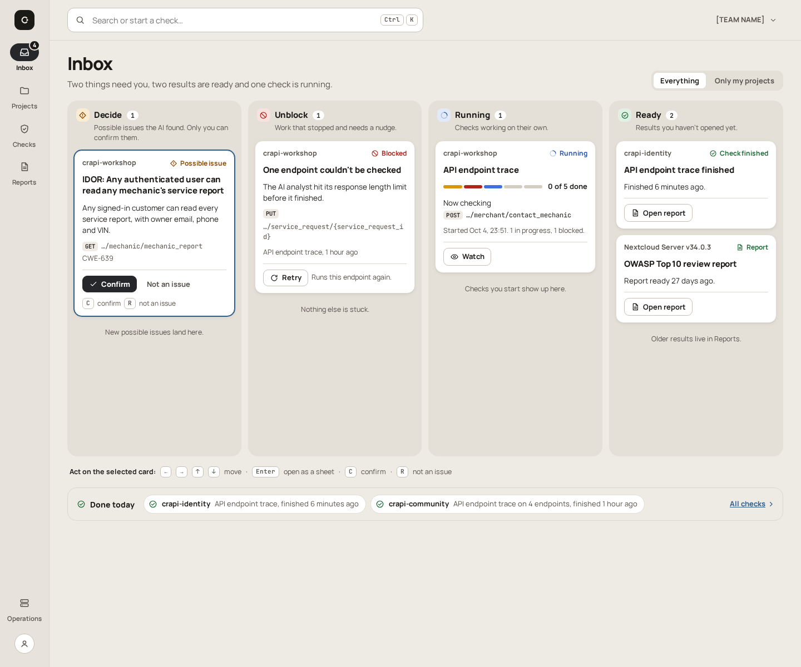
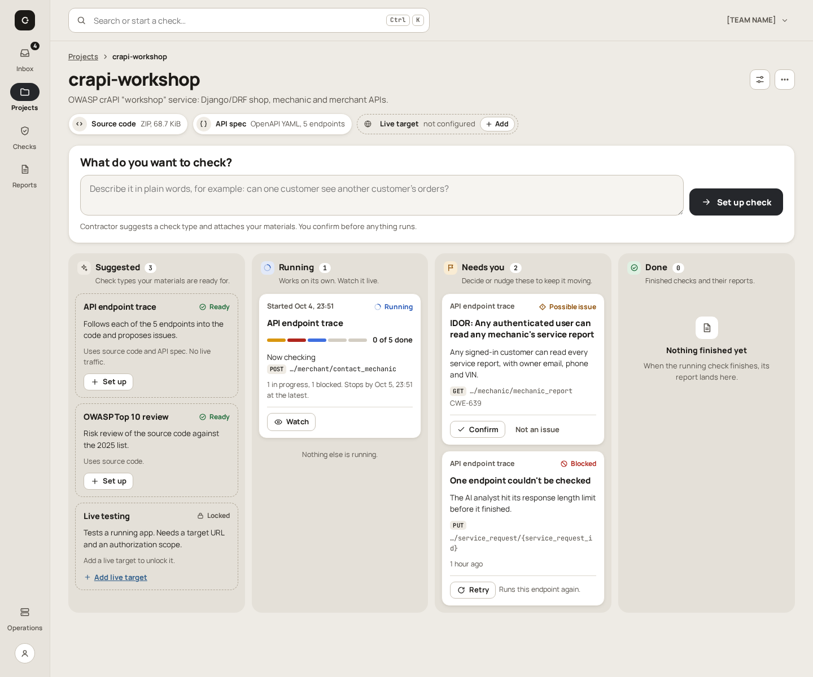
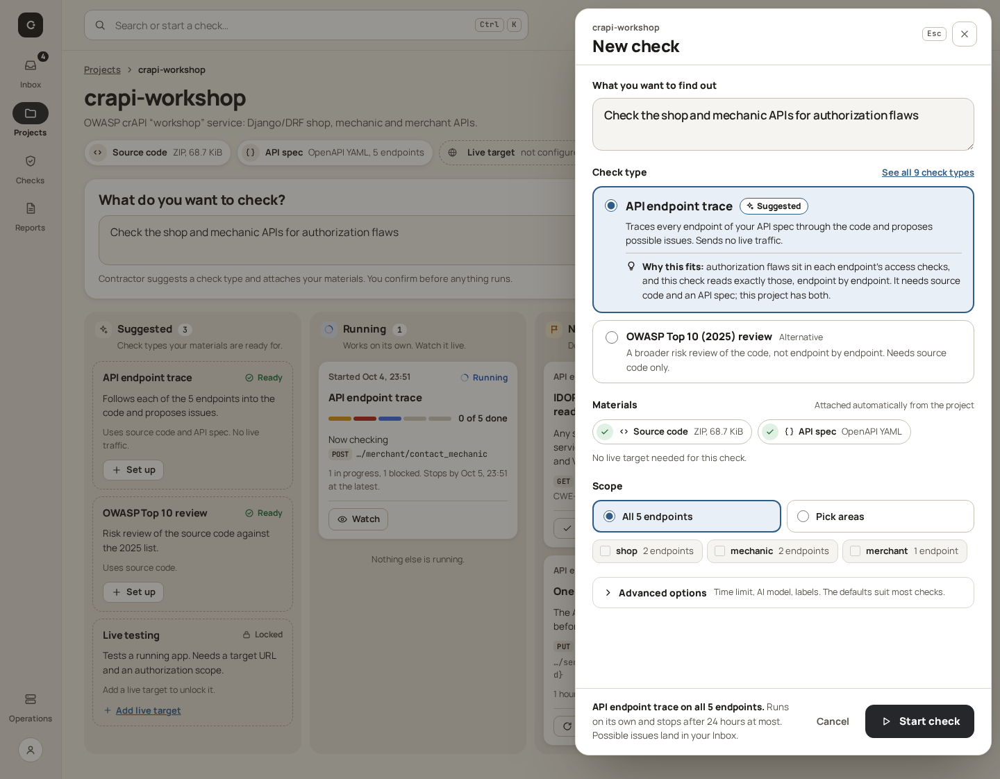
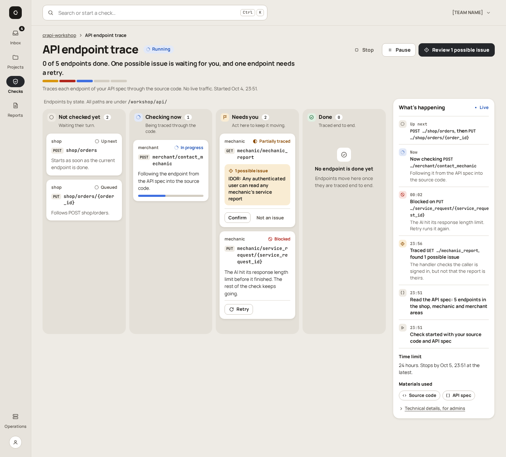
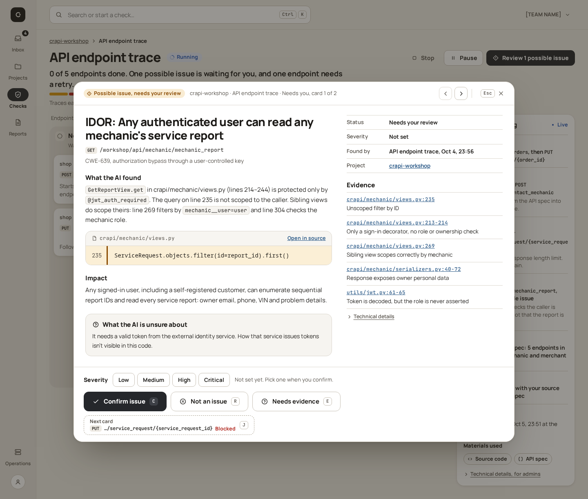

# V3C Board

[UI redesign explorations](README.md) · Base: [V3 Inbox](v3-inbox.md) ·
Mockups: [`mockups/v3c/`](mockups/v3c/)

**Variation axis:** state as lanes of cards that the user acts on directly.
Starting a check and reviewing an issue open as a sheet or dialog over the
board, so the board stays in view.

| | |
| --- | --- |
| Navigation | Icon rail and command bar, as V3 |
| Layout | Side-by-side lanes; detail as a right-hand sheet (Start) or a large centred dialog (Issue) over a dimmed board |
| Type | Manrope and JetBrains Mono, as V3 |
| Palette | Warm paper ground `#eeebe5`, darker lanes, white cards, graphite primary, steel-blue links; dark and black themes |
| Decision state | Not chosen; V3B Panes was chosen |
| Keyboard | ←→↑↓ move between cards, ↵ open as a sheet, C confirm, R not an issue, J next card, Esc close |

## Home (Inbox)

V3's stacked inbox becomes four lanes: Decide 1, Unblock 1, Running 1 and
Ready 2. Each card shows the project, a plain title, one key fact and its
action (Confirm / Not an issue, Retry, Watch, Open report). Under the board are
a line of keyboard shortcuts and a *Done today* strip.

## Project

Below the header and the *What do you want to check?* box is a project board
with four lanes:

- **Suggested:** dashed cards for the ready check types, with Live testing locked behind "Add live target".
- **Running:** the trace with a 5-segment bar.
- **Needs you:** the IDOR card and the blocked endpoint card.
- **Done:** an empty state in plain words.

## Start a check

*New check* is a full-height sheet on the right, over the dimmed project
board. It has the objective, the suggested type with *Why this fits*, one
alternative, auto-attached materials, scope, and advanced options. *Start
check* is pinned in the sheet footer.

## Check in progress

Endpoints are cards in four state lanes: Not checked yet 2, Checking now 1,
Needs you 2 (with Confirm and Retry on the cards) and Done 0 (an empty state).
The header carries a plain-language status sentence, and the live log is
reduced to a slim right column.

## Review a possible issue

The review is a large centred dialog over the dimmed check board. It has a
reading column with the real line 235, evidence rows by file and line, and the
uncertainty box. A pinned decision bar carries C / R / E and a *Next card*
button that names the blocked endpoint (J). Previous/next card buttons and Esc
to close sit at the top.

## Trade-off

The board shows state and lets the user act in one glance. But lanes are
narrow and side by side, so long titles and endpoint paths wrap into tall
cards. On a phone the user scrolls the lanes sideways instead of reading one
list from top to bottom.
