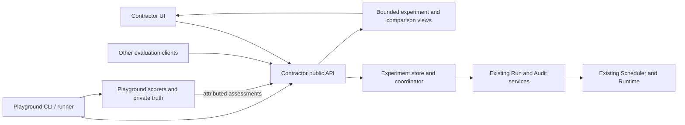

# Evals: experiment setup, execution and comparison

Status: **V38-001–010 implemented and deterministically verified: native setup, comparison/review, optional Playground client and independent process acceptance.**
The user selected the complete browser journey and explicitly required Contractor
to remain independent of Playground. The managed Playground service proposed in
the earlier draft is superseded.

[US-10](spec/ui-user-stories.md#us-10--compare-variants-through-evals) ·
[V38-001](../tasks/v38/v38-001-evals-experience-contract.yml) ·
[Managed Evals contract](spec/30-managed-evals.md) ·
[Portable format](spec/26-portable-evaluation-format.md)

## Product and ownership decisions

1. **Evals is an experiment list.** An evaluation Project is its owner/storage
   container and can contain multiple experiments. A single experiment identifies
   one frozen matrix; its expected attempts are known before submission. Existing
   evaluation Projects and unassociated labelled Runs remain available as legacy
   history, without invented comparisons.
2. **The browser supports setup, launch, control and comparison.** A native
   experiment continues after the browser closes. Contractor owns its durable
   plan, attempts and lifecycle. Its coordinator submits ordinary Runs/Audits;
   the existing Scheduler alone owns Run execution, placement and resource limits.
3. **Playground is an optional external client and data producer.** It owns its
   datasets, private expectations and scorers, and calls public APIs to register
   cases/experiments, submit attempts and publish assessments. Contractor never
   calls Playground or imports its Python code. No Playground process, URL,
   checkout or dataset path is required to run Evals from the UI.
4. **Execution control is explicit and immutable:** `server` or `external`.
   The UI and external clients can both create server-controlled experiments.
   An independent runner can also retain dispatch control in external mode.
   Both modes appear in the same UI; there is no silent takeover of a runner's
   private journal or simultaneous dispatch by two owners.
5. **The initial comparison has exactly two variants.** A is baseline, B is
   candidate; cases and repeat count are shared. Each variant selects one exact
   Workflow or AuditProfile and compatible execution settings. Both arms use the
   same execution kind. An AgentTemplate is inspected/selected through its
   executable Workflow binding; changing it requires an explicit versioned
   Workflow/test wrapper. A model comparison uses supported execution overrides,
   not label-driven prompt selection.
6. **Latest is only a draft convenience.** Use the catalog's existing version
   ordering to propose the latest available compatible version. The user sees the
   exact selection; preparation freezes versions/digests. Resume never upgrades
   versions. Duplicate creates a new draft; it does not mutate a frozen plan.
7. **Assessment is separate from execution.** First native delivery supports
   explicitly registered deterministic artifact checks and explicit human review.
   Human judgment has a pinned rubric and an attributed immutable decision.
   Playground/custom evaluators can submit attributed external assessments.
   No implicit LLM judge, arbitrary uploaded scorer code or universal quality score.
8. **No automatic tightening of execution budgets.** Use existing format bounds
   and user-selected concurrency/time allowances. Token observation thresholds
   are optional, labelled as observed thresholds, and never sold as hard spend
   caps. Existing per-Run and Audit policies stay authoritative.

## Relationship with Playground



There are two independent implementations of orchestration when an external
runner retains control. They share a documented API, identity/pairing semantics
and conformance examples, not runtime code or storage. The server provides the
same per-member submission operation to both drivers, centralizing creation
idempotency and verified execution association.

For a native experiment, cases can be authored in the UI or imported from an
external catalog. Import is a push of a versioned safe dataset revision, never a
server callback to the source. Editing imported cases creates a new revision and
retains provenance. Private Playground truth and journals stay in Playground.
Import alone is not proof that a provider supports the case or that a score was
independently verified by Contractor.

Existing Playground CLI/local bundles remain valid. Its optional Contractor
integration adapts public manifests and registers managed submissions. Unmodified
legacy Runs can still be inspected as history. They do not acquire strict paired
membership by matching labels. Details and compatibility are in
[spec 30](spec/30-managed-evals.md#compatibility-and-external-clients).

## User journey and screens

### Workflow and Audit experiments

The setup starts with Workflow or Audit. Both support native UI launch and an
external runner, exact A/B versions, the same case/repeat matrix and the same
comparison screens. A Workflow attempt is one Run; an Audit attempt is the entire
Audit. Its child Runs, rounds and items remain drill-down evidence, not additional
samples. Mixed Workflow-versus-Audit A/B comparisons are outside the first slice.

Audit variants use exact AuditProfiles, compatible inputs and unchanged trusted
inventory/importer rules. Each Audit member gets its own execution Project of
kind `project`; the evaluation Project stores the experiment association. Quality
comes from the selected checks/review, never from Audit completion alone. Token
charts include all owned execution roles once; Audit duration measures its parent
interval rather than summing possibly overlapping child Runs. Missing child metrics
remain partial. The authoritative details are in
[Workflow and Audit parity](spec/30-managed-evals.md#workflow-and-audit-parity).

### List and navigation

`/evals` lists experiments: name, A/B variants, case/repeat count, control mode,
execution progress, assessment coverage, conclusion and updated time. Filters
cover lifecycle, dataset/suite, evaluation Project and control mode. New experiment
is the primary action. Dataset management and legacy evaluation workspaces are
secondary destinations, not more primary buttons.

Routes are `/evals/new`, `/evals/datasets`, and
`/evals/experiments/{experimentId}/{overview|comparison|attempts|setup}`.
Pair detail is `/evals/experiments/{experimentId}/pairs/{pairId}`.
Existing `/evals/{projectId}` and its artifact links continue to resolve as legacy
workspace views; migration must not reinterpret a Project ID as an experiment ID.

### Setup in four steps

1. **Variants:** execution kind, name/workspace and comparison purpose; exact A/B Workflow or
   AuditProfile, applicable execution overrides, resolved Agent/Skill details.
   The purpose presets declared equal/different dimensions; the review shows them.
   A workflow comparison can allow model differences. An instruction-only
   comparison cannot pretend unknown model/tool/runtime pins are equal.
2. **Cases and inputs:** choose a registered dataset revision and cases, or author
   cases with shared task/input definitions. Source ZIPs, seeds and other visible
   inputs are exact artifact revisions. Unknown source roles/missing required
   inputs are shown before launch. Scoring rubrics are kept outside Run inputs.
3. **Assessment and repetitions:** select registered checks and/or human review;
   show their scope and provenance, repeat count, concurrency, time allowance and
   optional token threshold. Explicitly review candidate-pass and allowed-quality-drop
   gates, with a token-ratio gate optional; freeze those separately from execution
   budgets. Show `selected cases × 2 × repetitions` immediately.
   Unsupported members remain in the proposed denominator with explanations.
4. **Readiness:** show the complete matrix size, actual resolved differences,
   equality-pin coverage, missing dependencies and exact limits. Prepare freezes
   a plan without executing a model or starting a target. Start is a separate
   explicit action against that plan/revision. A stale draft/readiness response
   cannot launch an unseen plan.

Mutable drafts are saved on the server with CAS. Browser reload restores them;
local storage contains only safe navigation/mutation correlation, not private
cases, model credentials, bearer tokens or expected answers. Draft edits invalidate
readiness. An experiment can be frozen only once; revise through Duplicate.

### Experiment detail

Four tabs keep the page short:

- **Overview:** lifecycle/control source, expected/terminal counts per arm,
  assessment coverage, readiness or recovery issue and the current conclusion.
- **Comparison:** paired case/sample rows, quality and cost/time coverage,
  regressions/unresolved filters and side-by-side evidence.
- **Attempts:** every expected attempt including not submitted, blocked, failed,
  cancelled, unknown or conflicting; links to normal Run/Audit diagnostics.
- **Setup:** read-only exact inputs, variants, checks, equality policy, repeat
  count, limits, producer provenance and plan identity. Native experiments offer Duplicate.

```text
Trace instructions                  Interrupted · 7 / 8 attempts terminal
Baseline @6 / Candidate @7          2 cases × 2 variants × 2 repeats

Overview    Comparison    Attempts    Setup

Quality passed     A 3/4        B 2/4
Scored             A 3/4        B 3/4
Token coverage     A 4/4        B 2/4
Conclusion         Insufficient evidence

Case / sample      Baseline       Candidate       Difference / evidence
unsafe-query / 1   Pass · 80      Pass · 70        −10 tokens; open pair
unsafe-query / 2   Pass · 100     Not submitted    Pending
safe-query / 1     Pass · 50      Fail · —         False positive; open pair
safe-query / 2     Run failed     Pass · 60        Failure remains counted
```

These are the illustrative spec 26 trace numbers, not measured instruction
quality. The default comparison prioritizes regressions and unresolved pairs;
All pairs is one click away. Display pair counts beside each cost/time delta.
User-visible labels distinguish Failed execution, Failed check, Awaiting review,
External assessment and Missing measurements.

Use current Project/Operations tabs, dialogs, tables, empty/error states and
contextual back links. On narrow screens a case/sample becomes a paired card
with A/B labels retained; evidence opens a dedicated page. Keyboard navigation,
focus return and 390px/1280px layouts are acceptance requirements. Filters,
snapshot and cursor survive a trip to Run/artifact detail.

### Charts

Add five views over the same selected experiment snapshot. Overview contains a
compact quality comparison and execution progress. Comparison offers Tokens,
Duration and Case differences through a metric selector, followed by the existing
pair table; it does not become another long dashboard of expanded charts.

| Chart | Question answered | Presentation |
| --- | --- | --- |
| Quality A/B | Does the candidate pass the declared checks more often? | Two horizontal bars: end-to-end passed / expected, with exact counts and scored coverage beside each bar. Conditional scored quality is a separately labelled toggle. |
| Tokens | Which variant consumes more tokens, and how variable are attempts? | A/B distributions with shared bins, sample counts and p50/p90 markers; complete comparable pairs only. |
| Duration | Which variant takes longer, and are there slow attempts? | The same distribution view for elapsed execution time, labelled with its exact measurement scope including queue time where applicable. |
| Case differences | Where does the candidate get better or worse? | A paginated diverging plot of B minus A tokens or duration per case/sample, centred on zero. Quality regressions have explicit textual badges. |
| Execution progress | Is the experiment advancing? | A/B step lines for observed terminal members against expected counts over elapsed wall time, with pause/restart observation gaps shown honestly. Assessment coverage stays separate. |

A is blue and B orange throughout; labels, point shapes and line styles identify
variants without relying on colour alone. Quality/status colours keep their normal
meaning. Charts have keyboard-accessible details and a Show data table alternative.
Clicking a distribution bin opens the matching filtered attempt/pair list; clicking
a case difference opens that exact pair and retains filters/back navigation.

Each chart shows its scope, included/expected count and exclusions. Comparisons
use matching measurement scopes and never substitute zero for absent usage or
failed collection. p50/p90 describe observed variation, not confidence intervals;
one sample is a labelled point, and zero samples are not a flat zero line. A
missing metric hides its plot and leaves a compact coverage explanation in the
summary. Incomparable scopes are explained instead of overlaid.

In the worked example, quality is A 3/4 versus B 2/4. The token comparison contains
only two complete pairs: A 80/45 and B 70/60. Their differences are -10 and +15;
paired totals 125 versus 130 do not represent the complete experiment. B's known
130 over 2/4 remains visibly partial. Pagination cannot change chart totals.

At 390px show one chart at a time with tap/keyboard access to the same details;
at 1280px the two Overview charts fit side by side. Reuse Operations chart visual
conventions and shared primitives where appropriate. Cross-experiment history
trends are a later extension: differing datasets/pins must not form a misleading
single performance line. API bounds and aggregation semantics are owned by
[spec 30](spec/30-managed-evals.md#chart-projections).

### Controls

Server-controlled: Start when ready; Pause stops further dispatch while resolving
already accepted attempts; Resume uses the original limits; Cancel stops dispatch
and cancels linked live executions, remaining Cancelling until drain is confirmed.
Do not call a cancellation request a completed cancellation. A cancelled or
budget-exhausted experiment cannot reset itself; Duplicate creates a new run.

Externally controlled: show the producer and latest update. The UI can inspect,
review, export and navigate attempts, but cannot Start/Resume/Cancel the external
experiment. Existing individual Run/Audit controls remain available with a clear
explanation that they do not stop the producer from submitting future attempts.
External finalization and Project deletion fences are enforced by the API.

## Worked example and reviewed failure cases

Use spec 26's two cases, two repetitions and A/B, eight members. A has 4 submitted
and terminal, 3 successful/scored/passed; B has 3 submitted and terminal, all three
successful/scored but only two passed. A's failed attempt uses 45 known tokens;
B's false positive has unavailable usage. B's fourth member was not submitted.

| Case | Expected behavior and recovery | Contract reference |
| --- | --- | --- |
| Partial submission | Keep all 8 members. Native coordinator resumes only pending attempts; an external driver must reconnect. | Spec 30 execution control |
| Lost submit response | Replay the same member/submission operation and exact body/key; return the same execution. Persist uncertainty until reconciled. | Spec 30 submissions |
| Failed A execution | Count it in expected and execution metrics; preserve its known usage, with quality unscored. | Spec 26 comparison |
| Unrelated matching labels | Display only in legacy history; no membership or score contribution. | Spec 30 compatibility |
| Conflicting execution association | Quarantine the member/pair; no best-score or latest-Run choice. | Spec 30 identity |
| Missing B usage | Show unavailable, exclude it only from that paired dimension. B total 130 covers 2/4 members. | Spec 30 read model |
| Scorer failure | Record assessment error separately from Run success; reassess exact retained outputs without model replay. | Spec 30 assessments |
| Changed source/model/tools | Reject required pin mismatch, preserve existing records; corrected plan gets a new ID. | Spec 30 preparation |
| Browser close / coordinator restart | Durable command receipts, lease and submission intents recover independently of UI; no Playground service needed. | Spec 30 ownership |
| Pause racing with submission | Fence new intents; reconcile already committed intents, then reach Paused after accepted work settles. | Spec 30 execution control |
| Cancel / deadline / unknown terminal state | Stop dispatch, cancel owned live work and retain draining/unknown until proven terminal. Original denominators and usage remain. | Spec 30 execution control |
| External runner disappears | Keep authoritative attempt states and the last producer activity time; no automatic takeover or fabricated completion. | Spec 30 external clients |
| Foreign workspace or evidence | Owner-safe 404 before any import/submit/assessment effect. Private Runtime APIs cannot mutate eval control or scores. | Spec 30 authorization |
| Project deleted mid-run | Fence new submissions first, drain executions, then purge private eval records with their workspace. | Spec 30 retention |
| Publication/projection interrupted | Keep previous complete view generation and resume projection, without rerunning models or scorers. | Spec 30 read model |
| Evidence later unavailable | Retain the historical judgment but invalidate current evidence completeness; no reconstructed proof. | Spec 30 retention |
| More pairs than a page | Frozen full-experiment aggregates remain identical on every page; stale snapshot cursors reload explicitly. | Spec 30 pagination |

Reviewed arithmetic: execution success A=3/4, B=3/4; end-to-end pass A=3/4,
B=2/4; conditional scored quality A=3/3, B=2/3. There are 3 terminal pairs,
2 fully scored quality pairs and 2 complete token pairs. B's known 130 tokens
cannot support a total saving claim. The result remains inconclusive.

## Implementation plan and closure of the design task

| Task | Deliverable |
| --- | --- |
| [V38-002](../tasks/v38/v38-002-eval-contract-fixtures.yml) | Managed DTOs, portable identity mapping and shared conformance fixtures |
| [V38-003](../tasks/v38/v38-003-eval-store.yml) | Owner-scoped datasets, drafts, immutable plans, members and durable commands |
| [V38-004](../tasks/v38/v38-004-eval-coordinator.yml) | Native coordinator and common replay-safe per-member Run/Audit submission |
| [V38-005](../tasks/v38/v38-005-eval-public-api.yml) | Public authoring/control/import APIs and safe capability/readiness catalog |
| [V38-006](../tasks/v38/v38-006-eval-assessment-comparison.yml) | Attributed assessments, exact selection and complete paginated comparison views |
| [V38-007](../tasks/v38/v38-007-eval-setup-ui.yml) | Dataset/setup/readiness UI and experiment lifecycle actions |
| [V38-008](../tasks/v38/v38-008-eval-comparison-ui.yml) | Experiment list, comparison, evidence, review and legacy navigation |
| [V38-009](../tasks/v38/v38-009-playground-eval-client.yml) | Optional Playground client using only the public protocol |
| [V38-010](../tasks/v38/v38-010-eval-release-gate.yml) | Independent-server and external-client process, fault and browser gates |

The source code review establishes the initial gap; the screen/ownership choices,
API examples and walkthrough above address V38-001 A1. The indexed tasks with
explicit dependencies and acceptance address A2. No product choice remains open.
These are design checks, not a claim that the planned endpoints or UI already work.

V40-002 live metadata/mapping/normalization gaps and V40-003 quality experiments
remain separate. First V38 delivery uses one binding per arm and does not silently
solve the six-program pilot, launch its targets, publish candidate defaults or
change an existing frozen Playground experiment.

### Implementation verification — 2026-09-20

V38-002–010 are complete. The [implementation record](plans/2026-09-20-managed-evals-ui.md)
contains exact commits, commands, environment and evidence. Real native and
independent external Workflow/Audit journeys each retain eight members, with
restart, response-loss replay, review, comparison and owner isolation. The
required PostgreSQL and process gates pass without skips; mocked browser and
optional Playground client checks are recorded separately.

At 390px Overview selects one chart with keyboard access; at 1280px both charts
remain side by side. All five chart views retain complete server cohorts and
equivalent tables. The [user guide](guides/evals.md) describes setup and review;
the [release gate](testing/evals-release-gate.md) provides reproduction commands.

The following dated sections retain the original design-time status. Their
pending-task statements describe 2026-09-19, before this implementation.

### Design verification — 2026-09-19

- Reviewed the eight-member example and all 17 fault rows against ownership,
  exact membership, recovery, private-data separation and bounded reads. Recomputed
  the arm/pair counts and B's partial token total independently; they match spec 26.
- Ran V38-001's exact `design-artifact` and `planning-validation` commands: passed.
  Parsed 336 indexed tasks and checked the complete dependency graph for missing
  IDs/cycles; all ten V38 tasks have indexed files, valid milestones and acceptance
  coverage. V38-002 through V38-010 remain pending.
- Resolved every new local Markdown reference and anchor; parsed the API JSON
  examples. The unchanged documentation landing-page link to the missing
  `reviews/architecture-review-2026-09-15.md` is a pre-existing issue outside this
  design. No new broken links were found.
- Confirmed the delivered spec 26 bytes are unchanged. The optional external
  client and Go implementation will share protocol fixtures, not runtime imports.

This section records design-time verification. Implementation evidence is tracked
separately in the individual tasks; it does not claim a tested browser journey or
model-quality result.

### Chart and execution-kind consistency review — 2026-09-19

The chart extension is assigned to V38-002 (DTOs/fixtures), V38-003 (observation
storage), V38-006 (collection/projections), V38-008 (UI) and V38-010 (release
verification). Setup, public API and Playground client tasks explicitly cover
both Workflow and Audit; implementation statuses remain pending.

The review checked spec 19 Audit authority and spec 26 identity/accounting against
current Contractor Audit creation/response routes and Playground provider code.
It made two integration requirements explicit: Audit execution Projects use kind
`project`, and item pages alone cannot prove that all discovery/assessment/check
executions were collected. V38-006 therefore provides the bounded authoritative
member execution inventory used by V38-009. A whole Audit remains one member;
parent duration and deduplicated child token accounting use existing semantics.

Verification passed: 336 indexed tasks and their complete dependency graph,
acceptance/test coverage for every V38 task, new local links/anchors, API JSON
examples, chart pair deltas and nearest-rank percentiles. The shared trace token
cohort has paired totals 125/130, differences -10/+15, p50 45/60 and p90 80/70;
those are partial paired statistics, not whole-experiment savings. Spec 26 bytes
and completed task evidence were preserved. Runtime/UI validation belongs to the
pending implementation tasks; this review does not claim those features work yet.
