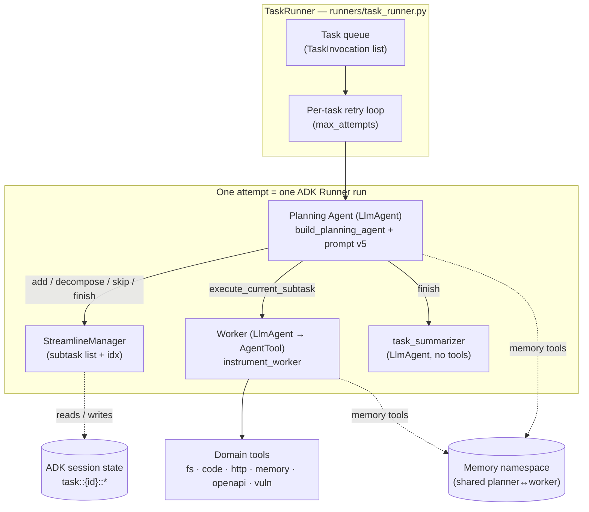
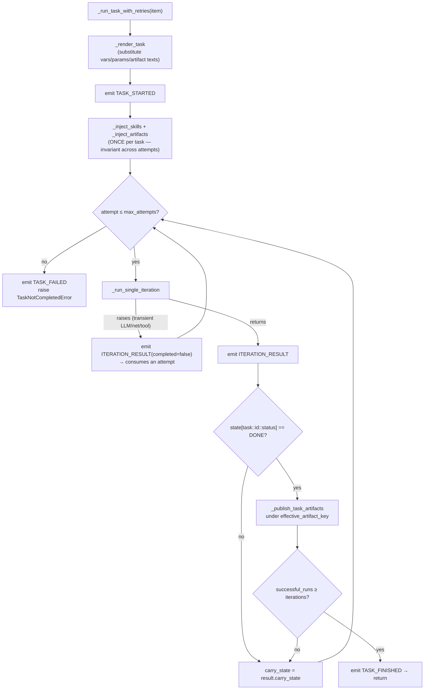
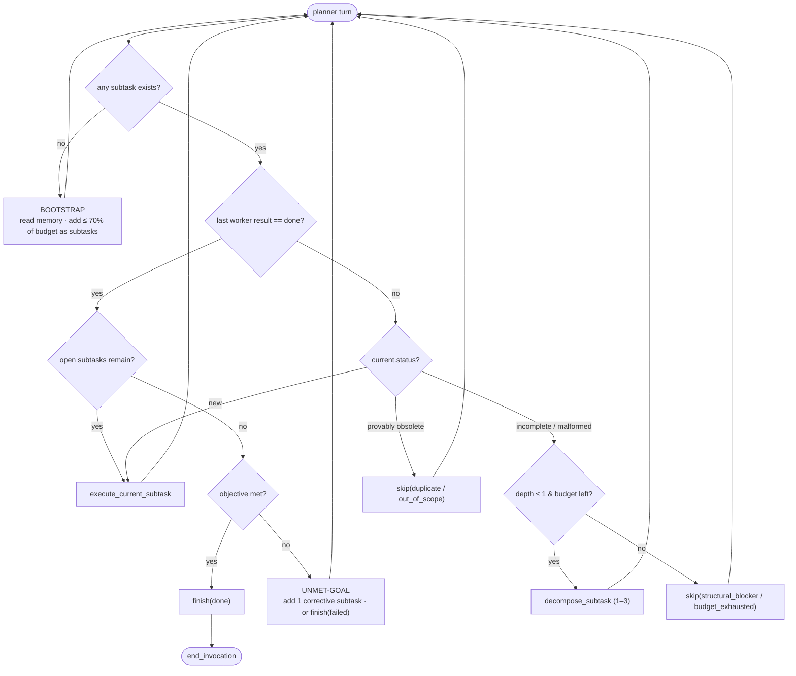
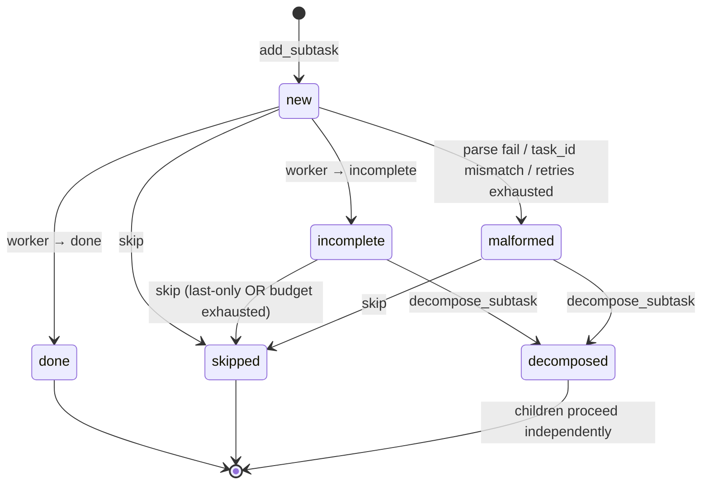
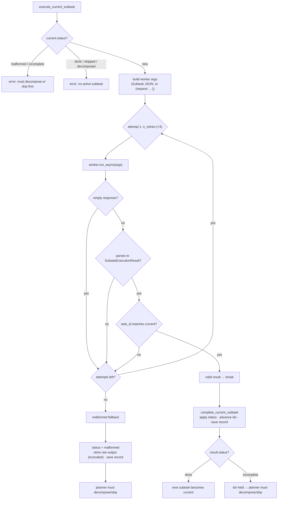
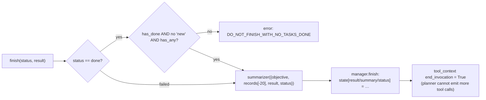
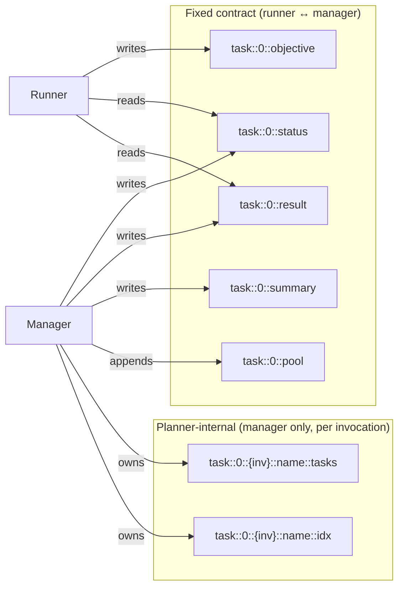
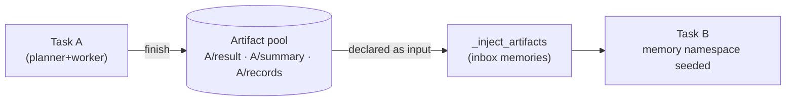
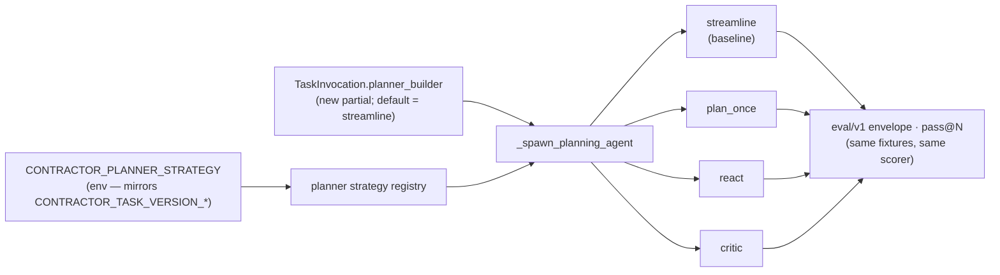

# The Streamline Planner & Task Runner

This document is a deep dive into the single most load-bearing mechanism in
Contractor: how a queued **task** is turned into a **planner + worker** loop,
how the planner decomposes work into **subtasks**, and how state, retries, and
artifacts flow through it.

It complements [README.md](README.md) (the broader architecture tour). Where
that doc surveys all the layers, this one stays inside
[`contractor/runners/task_runner.py`](../contractor/runners/task_runner.py),
[`contractor/agents/planning_agent/`](../contractor/agents/planning_agent/),
and [`contractor/tools/tasks/`](../contractor/tools/tasks/).

All diagrams are Mermaid and render on GitHub.

---

## 1. The cast

The planner is **not** the thing that reads code or calls HTTP. It is a
coordinator that decomposes an objective into verifiable subtasks and delegates
each one to a worker. Five objects collaborate:

| Object | File | Role |
| ------ | ---- | ---- |
| **TaskRunner** | [`runners/task_runner.py`](../contractor/runners/task_runner.py) | Owns the task queue; for each task spawns a fresh planner+worker per attempt, runs the ADK loop, publishes artifacts, emits lifecycle events. |
| **Planning Agent** | [`agents/planning_agent/agent.py`](../contractor/agents/planning_agent/agent.py) | An ADK `LlmAgent` whose tools are the streamline-manager operations + memory tools. Driven by prompt [`prompts/v5.md`](../contractor/agents/planning_agent/prompts/v5.md). |
| **StreamlineManager** | [`tools/tasks/manager.py`](../contractor/tools/tasks/manager.py) | The deterministic core: holds the subtask list + current index in ADK session state, enforces the status state machine, appends execution records. The planner's tools are thin wrappers over it. |
| **Worker** | any `build_<agent>` | An `LlmAgent` (SWE, OAS builder, trace, …) `instrument_worker`-ed with `Subtask`/`SubtaskExecutionResult` schemas and wrapped as an `AgentTool`. |
| **Summarizer** | created in [`tools/tasks/tools.py`](../contractor/tools/tasks/tools.py) | A tool-less `LlmAgent` (shares the worker's model) that condenses the run into a handoff summary at `finish`. |



The hard separation — **planner plans, worker acts** — is enforced by the prompt
("You NEVER read code, files, schemas, or HTTP yourself") and by construction:
the planner is only given the streamline + memory tools, never the domain tools.

---

## 2. TaskRunner: the per-task lifecycle

`TaskRunner.run()` walks its queue and calls `_run_task_with_retries` for each
`TaskInvocation`. A task is a *unit of retry*; each retry is an *attempt*; an
attempt that reaches terminal `done` is a *successful run*. A task is only
finished after `iterations` successful runs (cumulative across attempts, not
necessarily consecutive); attempts keep going until `max_attempts` is spent.



Three things worth calling out:

- **Skills and inbox artifacts are injected once**, before the attempt loop —
  the memory namespace, skill list, and artifact texts don't change between
  retries, so re-injecting would just rewrite the same memory YAML.
- **An exception inside an iteration consumes an attempt** rather than aborting
  the whole workflow. It is reported on `ITERATION_RESULT(completed=False)` with
  the error type/message, and the loop continues. (`asyncio.CancelledError` is
  the one exception — it unwinds the run.)
- **Artifacts publish under `effective_artifact_key`** — the template key by
  default, or a per-invocation `artifact_key` for fan-out workflows that queue
  many tasks from one template. See §7.

### 2.1 One iteration

`_run_single_iteration` is where a fresh planner is built and handed to an ADK
`Runner`. It seeds the session state, runs the agent until `finish` ends the
invocation, then reads the terminal state back out.

```mermaid
sequenceDiagram
  participant R as TaskRunner
  participant ADK as ADK Runner
  participant P as Planner (LlmAgent)
  participant M as StreamlineManager
  participant W as Worker (AgentTool)
  participant S as Summarizer

  R->>R: _spawn_planning_agent → fresh planner + worker
  R->>R: _build_task_initial_state<br/>(build_active_state + carry, minus stale planner keys)
  R->>ADK: create_session(state) + run_async(rendered task text)
  loop planner turns, until finish() sets end_invocation
    ADK->>P: model turn
    P->>M: add_subtask / get_current_subtask / list_subtasks
    P->>W: execute_current_subtask
    W-->>P: SubtaskExecutionResult {task_id, status, output, summary}
    Note over P,M: manager applies status, advances idx, appends record
    alt status incomplete / malformed
      P->>M: decompose_subtask (1–3 children)  ·or·  skip
    end
  end
  P->>S: finish → summarize {objective, records, result, status}
  S-->>P: summary text
  P->>M: finish writes result / summary / status; end_invocation = True
  ADK-->>R: final session state
  R->>R: completed = (task::id::status == DONE)
```

The planner is **stateless across attempts**: `_spawn_planning_agent` builds a
brand-new planner+worker pair every iteration, and the manager scopes its
subtask list per ADK *invocation* (§6), so a retry always starts from an empty
plan — only the fixed task-scoped keys and inbox memory carry forward.

---

## 3. The planner loop (prompt v5)

The planner is an LLM following [`prompts/v5.md`](../contractor/agents/planning_agent/prompts/v5.md).
Its behaviour is an **action picker**: each turn it scans a priority-ordered
table and takes the first matching action. This is the streamline planner's
control flow.



Key policies the prompt layers on top of the manager's mechanics:

- **Budget discipline.** `<<MAX_SUBTASKS>>` (`max_steps`, default 15) is the
  total subtask budget; `add_subtask` *and* `decompose_subtask` both spend it.
  Spend ≤ 70% on the initial plan, reserve ≥ 30% for adaptation.
- **Acceptance lines.** Every subtask description must end with
  `Acceptance: <observable evidence>`. This is what makes a subtask
  *verifiable* — the worker has a concrete completion oracle.
- **Decompose to unblock, not to explore.** Over-decomposition is the primary
  failure mode; the prompt repeatedly biases toward *executing* a focused
  subtask over splitting it.
- **Depth limit of 1.** A subtask may be decomposed at most once. This is a
  *prompt-level* rule (Rule 5) — the manager itself does not track depth, it
  only enforces the budget and the status state machine. If a child of a
  decomposed parent fails again, the planner is told to `skip` with a
  `structural_blocker:`, not decompose again.

> The depth-1 limit living in the prompt rather than the code is deliberate: the
> manager stays a pure state machine, and decomposition policy is tunable by
> swapping the prompt version without touching the runner.

---

## 4. Subtasks: the state machine

Every subtask moves through a strict lifecycle defined by
`SUBTASK_STATUS_TRANSITIONS` in
[`tools/tasks/models.py`](../contractor/tools/tasks/models.py). Invalid
transitions raise `InvalidStatusTransitionError`, which the tools surface back
to the planner as a tool error (never a crash).



| From | Allowed → | Notes |
| ---- | --------- | ----- |
| `new` | `done`, `incomplete`, `malformed`, `skipped` | The only executable state. Cannot be re-executed in place once resolved. |
| `incomplete` | `decomposed`, `skipped` | Worker made partial progress. Must decompose; `skip` only allowed if it's the last subtask **or** the budget is exhausted. |
| `malformed` | `decomposed`, `skipped` | Runtime fallback when worker output can't be parsed. Raw output is preserved in the record. |
| `done` / `skipped` / `decomposed` | — (terminal) | `decomposed` is the resolved parent state; only its children run. |

The critical invariant: **`incomplete` and `malformed` can never be
re-executed** — only decomposed or skipped. Re-running a partially-failed
subtask in place is exactly the loop the streamline design exists to prevent.

---

## 5. `execute_current_subtask`: delegation + parsing

This is the bridge from planner to worker, in
[`tools/tasks/tools.py`](../contractor/tools/tasks/tools.py). It guards the
current subtask's status, calls the worker with a small retry budget, and
either applies a validated result or records a `malformed` fallback.



Details that matter:

- **`n_retries` (default 3) is the total attempt budget**, not extra tries on
  top of a first call. A retry is triggered by an *empty*, *unparseable*, or
  *`task_id`-mismatched* worker response — each is logged.
- **Workers are schema-instrumented.** `instrument_worker` sets
  `worker.input_schema = Subtask` and `worker.output_schema =
  SubtaskExecutionResult`, and appends a worker-instructions trailer (status
  rules, output rules, a `done` and an `incomplete` example) to the worker's own
  system prompt. So any agent in the repo becomes a planner-compatible worker
  with no per-agent glue — and its reply is parsed deterministically into
  `{task_id, status, output, summary}`.
- **Malformed is a first-class outcome, not a crash.** On retry exhaustion the
  raw output is truncated (`_MAX_RECORD_FIELD_LEN`, 20k chars) and stored in the
  record so the planner can still salvage partial information by decomposing.
- **Advancing the index.** On `done`/`skipped`/`decomposed` the manager advances
  `idx` to the next subtask; on `incomplete`/`malformed` it holds, forcing the
  planner to resolve before it can proceed.

### 5.1 Decomposition layout

`decompose_subtask` is *flat insert-after-parent*, not recursive tree surgery.
The parent transitions to `decomposed`, 1–3 children are inserted immediately
after it with dotted IDs, and the current index moves to the first child:

```
before:   [ 0:done ]  [ 1:incomplete* ]  [ 2:new ]
                            │ decompose into 2
                            ▼
after:    [ 0:done ]  [ 1:decomposed ]  [ 1.1:new* ]  [ 1.2:new ]  [ 2:new ]
                                              ▲ idx now here
```

The total subtask count after insertion must not exceed the budget
(`max_tasks` / `max_steps`); the tool reports remaining capacity so the planner
can retry with fewer children instead of being wrongly told the budget is spent.

### 5.2 `finish` and the summarizer

`finish(status, result)` is the only way to set `task::{id}::status = done`. It
refuses `done` when **any subtask is still `new`**, when **no subtasks exist at
all**, or when **not a single subtask reached `done`** — three guards that stop
the planner declaring victory over an empty or all-failed plan.

On a valid `finish`, a tool-less summarizer agent condenses the run into a
handoff summary. Its payload is capped to the most-recent `max_records` (20)
records, each truncated, so a long run can't blow the summarizer's context:



---

## 6. Session-state shape

All planner/worker state lives in one flat ADK session-state dict. There are two
tiers of keys.

**Fixed task-scoped keys** — written by the runner via `build_active_state`,
read by the runner to detect completion, written by `StreamlineManager.finish`:

```python
{
  "_global_task_id": 0,
  "task::0::objective": "...",          # the rendered objective
  "task::0::status":    "running" | "done",
  "task::0::current":   None,           # current-subtask pointer
  "task::0::result":    "",             # written by finish
  "task::0::summary":   "",             # written by finish
  "task::0::pool":      [ ...records ], # appended per executed subtask
}
```

**Planner-internal subtask keys** — owned entirely by `StreamlineManager`, keyed
*per ADK invocation* (`_state_key`):

```python
"task::{gid}::{invocation_id}::{name}::tasks"  # the subtask list
"task::{gid}::{invocation_id}::{name}::idx"    # current index
```

Because each attempt is a new ADK invocation, the `{invocation_id}` segment
differs every retry, so a fresh attempt starts with an empty plan — and
`_build_task_initial_state` explicitly strips the previous attempt's deep
planner keys (anything under `task::{id}::` with a further `::`) from the carried
state, keeping only the fixed contract above. This is the boundary that lets the
planner own its keyspace while the runner only ever reads the terminal
`status`/`result`/`summary`.



---

## 7. Artifacts: how a task hands off to the next

When an attempt completes, `_publish_task_artifacts` persists three artifacts
under the invocation's key via `save_result_artifacts`
([`runners/artifacts.py`](../contractor/runners/artifacts.py)):

```
{key}/result     ← finish's `result` text
{key}/summary    ← the summarizer's output
{key}/records    ← the JSON-encoded execution records (the pool)
```

`{key}` defaults to the template key; fan-out workflows that queue several tasks
from one template pass a unique per-invocation `artifact_key` so the tasks don't
clobber each other. A downstream task declares `artifacts: ["<key>/result", …]`;
the runner loads those texts and re-injects them into the next task's memory
namespace tagged `inbox` / `previous-task-result` (via `_inject_artifacts`).
This artifact pool is the *only* channel between tasks — there are no shared
globals.



---

## 8. Variations worth testing

Everything above describes **one point** in a large design space. The streamline
planner makes a specific, defensible set of choices — but most of them are
hypotheses, not laws, and the project's mission (getting useful work out of
small 27–80b models via context-decomposition) makes them worth measuring rather
than assuming. The variations below are the ones that change *how* decomposition
and worker-judging happen — not knobs like `max_steps` (those are already
sweepable; see [tuning.md](tuning.md)).

Each is a distinct hypothesis with a metric that can confirm or kill it, run
through the same `eval/v1` pass@N harness as the baseline.

### 8.1 Control-flow / plan-shape variants

| # | Variant | What changes vs. baseline | Hypothesis (small-model lens) | Metric |
| - | ------- | ------------------------- | ----------------------------- | ------ |
| **V0** | **Direct (no planner)** | `AgentRunner`, single worker, no subtask machine (already exists for `trace-direct`) | The decomposition tax isn't worth it on small/medium tasks | f1 + tokens/run — the honest floor |
| **V1** | **Plan-once** | `decompose_subtask` disabled; the planner must lay out the whole plan upfront, no mid-run re-planning | Reactive decomposition is mostly churn/loops on a small model; upfront planning is cheaper and no worse | malformed/retry count, steps/task, f1 |
| **V2** | **ReAct / interleaved** | Drop the explicit subtask list; think→act→observe loop, subtasks emerge | Committing to a plan before the model has seen the code hurts; emergent beats pre-planned | f1, recall, step-budget hit-rate |
| **V7** | **Proactive complexity-gated decompose** | Planner estimates subtask size *before* executing and splits big ones upfront, rather than waiting for `incomplete` | Catches "too big to finish in one worker pass" before the wasted attempt | first-pass `done` rate, malformed count |

### 8.2 Verification variants

| # | Variant | What changes vs. baseline | Hypothesis | Metric |
| - | ------- | ------------------------- | ---------- | ------ |
| **V3** | **Critic-in-the-loop** | After a worker returns `done`, a verifier agent gates accept/redo (lift the existing `trace_verifier_agent` *inside* the loop) | The baseline trusts the worker's self-reported status; a gate catches both over-claiming (precision) and silent misses before `finish` | precision, verdict accuracy, false-`done` rate |
| **V4** | **Best-of-N worker** | Run the worker N× on the same subtask; planner merges/picks (self-consistency) | The recall lever for hard fixtures (the crApi-workshop BOLA/injection misses) | recall@N, unique-findings union, cost |

### 8.3 Context-passing variants

| # | Variant | What changes vs. baseline | Hypothesis | Metric |
| - | ------- | ------------------------- | ---------- | ------ |
| **V5** | **DAG / dependency-scheduled** | Subtasks declare dependencies; the runner topo-schedules and runs independent siblings in parallel (reuses the `trace_graph_pathpar` overlay fork/merge machinery) | Strict sequential execution wastes wallclock when subtasks are independent | wallclock, f1 parity |
| **V6** | **Rolling-summary context** | Replace the last-20 records pool fed to `get_records` with a continuously-compressed running summary | The records pool bloats context on long plans; continuous compression keeps a small model on-task | f1 on large fixtures, tokens/run |

---

## 9. Decisions after the current implementation

The current implementation is the baseline. Moving beyond it is a sequence of
deliberate decisions — what the baseline already commits to, which challenger to
build first, and the seam that makes any challenger A/B-able without forking the
workflows.

### 9.1 What the baseline already commits to

Each variant above revisits one of these committed decisions. Naming them makes
the experiments honest — you're testing a *decision*, not just trying a knob:

| Decision (today) | Embodied in | Revisited by |
| ---------------- | ----------- | ------------ |
| Plan is a flat, ordered list, executed strictly sequentially | `StreamlineManager` idx advance | V2, V5 |
| Decomposition is **reactive** (only on `incomplete`/`malformed`) and **flat** (insert-after-parent, depth-1 by prompt) | §5.1, prompt Rule 5 | V1, V7 |
| The planner **trusts the worker's self-reported status** — nobody re-checks the deliverable | `execute_current_subtask` | V3 |
| One worker pass per subtask | `execute_current_subtask` retry loop is parse-only | V4 |
| Context to the worker = seeded planner state + last-20 records pool | `get_records`, §6 | V6 |
| Whole-task retry; fresh planner per attempt (empty plan each time) | §2, §6 | (orthogonal — kept) |

### 9.2 Recommended first batch

Given the small-model mission and the existing failure data, the highest-signal
order is **V0 → V1 → V3**, with **V2** as the genuine architectural alternative:

- **V0 + V1 answer the foundational question** that isn't cleanly answered yet:
  *does the streamline planner beat no-planner, and does reactive decomposition
  earn its cost?* Both are nearly free — V0 already exists, V1 is one disabled
  tool.
- **V3 (critic)** is the likely biggest *quality* win. The trace-eval failure
  modes (over-annotation precision loss vs. complete misses) are exactly what a
  gate before `finish` addresses, and the verifier agent already exists — it's
  wiring, not new modeling.
- **V2 (ReAct)** is the only variant that tests whether *committed pre-planning*
  is the right paradigm at all. If it wins, that reframes the project.

V4/V5/V6 are second-wave — costlier to build and to run. V5 is attractive
because it reuses the `trace_graph_pathpar` overlay fork/merge machinery rather
than inventing scheduling.

### 9.3 The enabling seam (build this first, once)

None of these are A/B-able through the pass@N harness until the planner is
swappable the way the **worker** already is. Today the worker is a
`worker_builder` partial on `TaskInvocation`, but the **planner is hardwired** —
`_spawn_planning_agent` imports and calls `build_planning_agent` directly. The
seam is symmetric to the worker one:



Concretely:

1. **Add a `planner_builder` partial to `TaskInvocation`** (mirror
   `worker_builder`), defaulting to today's `build_planning_agent`.
   `_spawn_planning_agent` calls it instead of importing `build_planning_agent`.
2. **Register strategies and route by env** — `CONTRACTOR_PLANNER_STRATEGY=streamline|plan_once|react|critic|…`,
   exactly the pattern already used for `CONTRACTOR_TASK_VERSION_<NAME>` and
   prompt versions. A sweep becomes one env var; results land in the same
   `eval/v1` envelope, and the strategy becomes an axis in the experiment matrix.
3. **Keep the promotion discipline.** Production stays on `streamline` until an
   eval promotes a challenger — same rule as prompt-version naming: register the
   variant, leave the default active until the numbers say otherwise. Don't
   overfit a variant to a fixture's quirks (general planner behaviour only, not
   benchmark-specific decomposition).

> This keeps every variant honest (same fixtures, same scorer, same pass@N) and
> keeps a single mechanism — strategy-by-env — for the whole class of
> experiments, rather than a branch per idea.

---

## 10. Where to look next

| Topic | File |
| ----- | ---- |
| Per-task retry state machine | [`runners/task_runner.py`](../contractor/runners/task_runner.py) (`_run_task_with_retries`, `_run_single_iteration`) |
| Planner factory + prompt | [`agents/planning_agent/`](../contractor/agents/planning_agent/) (`agent.py`, `prompts/v5.md`) |
| Streamline manager (subtask FSM) | [`tools/tasks/manager.py`](../contractor/tools/tasks/manager.py) |
| Planner tools (add/execute/decompose/skip/finish) | [`tools/tasks/tools.py`](../contractor/tools/tasks/tools.py) |
| Subtask models + transitions | [`tools/tasks/models.py`](../contractor/tools/tasks/models.py) (`SUBTASK_STATUS_TRANSITIONS`) |
| Task-scoped state keys + active state | [`runners/models.py`](../contractor/runners/models.py) (`TaskScopedKeys`, `build_active_state`) |
| Artifact naming + persistence | [`runners/artifacts.py`](../contractor/runners/artifacts.py) |
| Broader architecture tour | [README.md](README.md) |
| Tunable budgets/caps that bound all of the above | [TUNABLE_PARAMS.md](TUNABLE_PARAMS.md), [tuning.md](tuning.md) |
