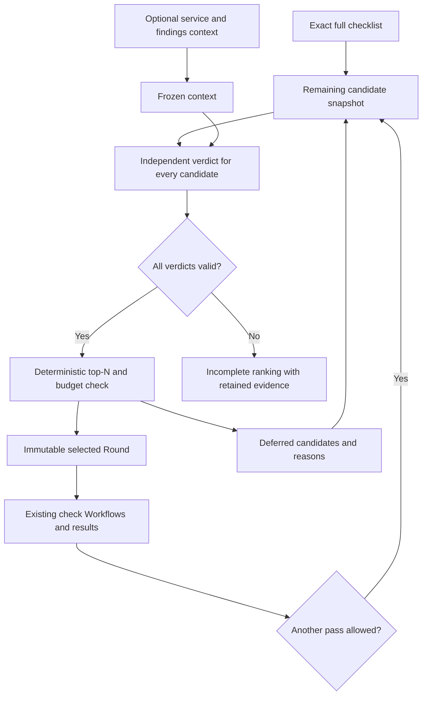

# Contextual Audit checklist prioritization

Date: 2026-09-20. Series: **V64**. Status: **V64-000 completed; opt-in Audit integration pending**.

The user requested optional service/finding context, independent checklist-item
priority verdicts and selection of at least ten highest-priority checks for each
Audit pass. Lower-ranked items must retain explanations. The user then requested
self-contained implementation tasks followed by a detailed review.

[Specification 34](../spec/34-audit-check-prioritization.md) owns the proposed
contract. This plan records decomposition and integration boundaries; individual
`tasks/v64-*.yml` own implementation status. Planning/review does not satisfy any
implementation acceptance criterion.

## Agreed outcome and design decisions

- Count distinct checklist checks: `selected = min(topN, remainingCandidates)`,
  default `topN = 10`, configurable only from 10 upward. All if fewer remain.
- Evaluate each item independently against one frozen optional context snapshot;
  apply the same rubric and store priority, confidence, rationale and evidence refs.
- Retain the full checklist separately from the selected Round. A deferred high
  priority stays high; selection, readiness, execution and finding severity differ.
- Freeze all verdicts and selection before checks. New findings influence the
  next pass; they do not change current membership or create checklist entries.
- Reuse ordinary audit-managed Runs, global scheduling, scopes, receipts and
  review. A dedicated zero-Worker planner executes the independent model calls.
- V1 requires complete ranking. Failed/unknown evaluations stop ranked admission,
  preserving partial verdicts without claiming a partial/fallback list is top-N.
  This is a deliberate refinement of the earlier scanner-ranking fallback idea.
- Missing optional context is accepted and does not itself lower priority. The
  proposed bounded slice supports up to 1,000 candidates and complete bounded
  context; overflow is explicit. No new service or paid provider is needed for tests.

The diagram's return edge only operates after the current Round settles and a
new cycle is permitted by the existing Audit limits. It is not a live changing
priority queue.

## Verified starting point

Inspection base: `cd2f377b` (2026-09-20). Concurrent work is not incorporated into
this planning change unless explicitly referenced.

- `internal/auditdomain/checklist.go` imports a finite complete checklist and
  sorts stable keys. It contains no priority evaluation.
- `internal/config/audit_profile.go`, `internal/auditservice/start.go` and
  `preview.go` currently compare the entire inventory with execution item bounds.
  This must change only for the opt-in path to allow 100 candidates / 10 checks.
- `internal/auditcontroller/dispatch_selection.go` executes immutable Round
  ordinals and preserves the existing review/attempt contracts.
- `internal/auditservice/next_round_selection.go` selects unscheduled finding
  proposals by inbox order. Deferred baseline checklist continuation is distinct
  and must work even with finding confirmation disabled.
- Current coverage/report/workspace paths are tied to admitted/current-round
  items. Full candidate and cumulative multi-pass coverage needs explicit work.
- All existing Planner shapes require Workers. Zero-Worker support must also
  change Scheduler reservation/recovery, which currently treats no allocations
  in a running Stage as lost state. It must still consume a global Run slot.
- Existing direct gateway adapter, pinned ModelPolicy and PostgreSQL journal
  patterns are reusable. Ordinary model-policy call bounds cap one cycle at
  1,000 evaluations; per-item call intents and unknown outcomes need new storage.
- V62 remains pending. Its first three tasks own shared contracts/store/control
  behavior before a Round exists. V64 consumes those foundations explicitly;
  it does not present planned V62 behavior as already implemented.

## Task decomposition

Implementation starts with the independent V64-000 core extracted from 001/006.
On 2026-09-20 concurrent V62 replanning placed the already in-progress V62-009
ahead of V62-001. The core has no pre-Round lifecycle dependency; this extraction
allows implementation without taking over that work. Tasks 001–011 remain
pending. Each implementation commit must satisfy its own acceptance checks and
keep unimplemented capabilities unavailable.

| Task | Deliverable | Dependencies |
| --- | --- | --- |
| [000](../../tasks/v64-000-audit-priority-core.yml) | Strict model verdicts, stable candidate identities and pure deterministic top-N | V25-002, V25-011 |
| [001](../../tasks/v64-001-audit-priority-contracts.yml) | Profile, context/verdict/selection contracts; lifecycle and old-byte compatibility | 000, V62-001, V25-011 |
| [002](../../tasks/v64-002-audit-priority-store.yml) | Full inventory, cycles, evaluation journal, reservations and retention | 001, V62-002 |
| [003](../../tasks/v64-003-planner-only-priority-execution.yml) | Explicit zero-Worker Planner shape through Scheduler/model accounting | 001 |
| [004](../../tasks/v64-004-audit-priority-context.yml) | Consistent bounded context snapshots and item inputs | 002 |
| [005](../../tasks/v64-005-independent-priority-verdicts.yml) | Independent model calls, validation, durable verdicts and recovery | 003, 004 |
| [006](../../tasks/v64-006-audit-priority-selection.yml) | Accepted verdict integration and immutable atomic Round admission | 000, 002 |
| [007](../../tasks/v64-007-audit-priority-controller.yml) | Initial/later pass coordination, budgets and no-Round controls | 005, 006, V62-003 |
| [008](../../tasks/v64-008-audit-priority-api-coverage.yml) | Full coverage, history, reports, API and generated clients | 007 |
| [009](../../tasks/v64-009-audit-priority-ui.yml) | Setup, progress, selected/deferred list and explanation journey | 008 |
| [010](../../tasks/v64-010-audit-priority-profile.yml) | Complete custom-checklist profile, Workflow, rubric and examples | 008 |
| [011](../../tasks/v64-011-audit-priority-release.yml) | Required database, real-process and browser release gate | 009, 010 |

The release task transitively depends on every task. Contract/shape/selector
work can proceed independently where the dependency graph allows it. This plan
does not assign or take over pending/in-progress V62 tasks; their statuses remain
authoritative.

## Delivery boundaries

- V64-000 implements pure calculation and the model-verdict codec only. It does
  not authenticate context, accept Run receipts, persist or dispatch a Round.
- V64-001 promotes the precise feature contract and executable schemas; the
  draft above is not evidence that new authoring or public API fields work now.
- V62-001–003 supply common pre-Round lifecycle foundations. V64 must name their
  additive hooks and preserve existing `prepare` semantics; neither series may
  create a second conflicting Audit startup or cleanup state machine.
- Supplied checklists are the first runnable profile. Generated checklist/OpenAPI
  integration is a later explicitly scoped bridge requiring V62-004. Existing
  findings may inform priority without requiring V62's proposed-check routing.
- No feature dependency on V54/specification33 autonomous pentest, V55-009
  scanner ranking or V62-008 source generation is introduced. V62-001's current
  dependency on V62-009 orders delivery; the supplied-checklist prioritization
  feature does not require OpenAPI or a scan adapter as its input.
- Existing scanner Workflows and `scan-plan@1` are unchanged. Verification may
  use controlled check Workers; no production scan or stand update is requested.
- Profile activation comes after implemented contracts, journal, selection,
  orchestration and full-inventory coverage/report projections. Full end-user readiness is owned by V64-011.

## Review and verification record

Detailed review is recorded in
[the V64 review](../research/2026-09-20-audit-check-prioritization-review.md).
Review examines user semantics, architecture/lifecycle, bounded model input and
cost, coverage/retention, migration/compatibility, task dependency completeness
and executable acceptance tests. Findings are resolved in these drafts before
recording the review result; unresolved implementation work remains pending.
