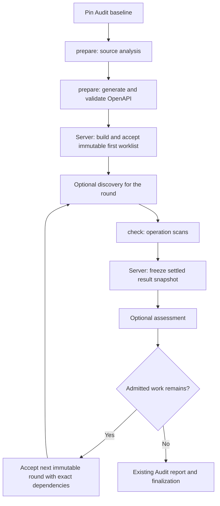

# Audit preparation and Workflow composition

Date: 2026-09-20. Series: **V62**. Status: **planned; not implemented**.

The user requested implementation tasks after discussing Audit roles and the
sequence source analysis → OpenAPI generation → scanning. This plan proposes
one new role kind, `prepare`, and explicit data contracts around existing
`discovery`, `check` and `assessment` roles. Task authoring does not start
implementation or change current profile semantics.

V62-001 owns promotion of the proposed syntax and lifecycle into the normative
[Audit specification](../spec/19-audits.md). Later tasks depend on that contract.
The [task index](../../tasks/index.yml) and individual V62 files own execution
status; this document does not establish feature readiness.

## Intended user outcome

A user supplies a source archive, target and existing authorization settings,
selects one AuditProfile and starts an Audit. Preparation analyzes the project
and generates validated OpenAPI. Server derives the bounded initial worklist
from the retained OpenAPI revision. Checks consume that same revision, prepare
concrete requests, scan the selected operations and publish Audit results.
Assessment receives a consistent snapshot of settled results. Later checks may
reuse exact retained dependencies and select a profile-approved check Workflow.

## Verified starting point

- `internal/auditservice/start.go` builds the initial inventory at start, before
  discovery. Its accepted worklist cannot be extended in place.
- `internal/config/audit_profile.go` validates explicit role kinds and retained
  output dependencies. Check outputs cannot be a generic `retained-output`
  producer; role names never classify behavior.
- `internal/auditcontroller/builder.go` resolves retained outputs in the current
  round. Non-check roles receive an empty item execution manifest; there is no
  declared input containing the complete settled round result set.
- `internal/auditimport/importer.go` retains accepted role outputs in protected
  Audit-managed ProjectScope. Workers receive ordinary exact RunScope inputs.
- Later proposal checks in `internal/auditservice/next_round.go` currently use
  `inventory.itemWorkflowRole`. Standard-package mappings already have their
  own per-item role selection and must retain it.
- `openapi-from-analysis@4`, OpenAPI-to-RequestSet preparation, scan planning
  and scanner Workers exist. A standalone source-analysis producer and an
  Audit check adapter for the complete generated-OpenAPI journey are missing.

## Proposed contracts and ownership

### Preparation and inventory

`prepare` is an Audit-level binding, completed once before the first worklist
is accepted. Each role can have bounded attempts; once its accepted result is
committed, resume/recovery and later rounds reuse it. This is not a promise of
exactly-once external side effects. Ordinary Run retry and unknown-outcome rules
continue to apply.

Start pins original inputs, scope, configuration, Skills, runtime settings and
credentials before dispatch. Generated artifacts are derived, immutable inputs
with provenance; they do not rewrite the original baseline. Preparation uses
ordinary audit-managed Runs and global Scheduler concurrency. No synthetic
Round or AuditItem is created to satisfy old foreign-key assumptions.

Introduce a durable preparation phase with explicit API projections, claims,
intents, receipts, attempt bounds and terminal reasons. Until inventory is
accepted, `currentRound` may be absent and coverage is pending rather than an
empty successful assessment. Pause, deadline, cancel, deletion, exhausted
attempts and restart apply before a Round exists. Count preparation attempts,
time and retained bytes against the same existing Audit budgets.

The proposed inventory source is an explicit choice of existing Audit input or
accepted preparation output. Preserve the current `sourceInput` form for old
profiles; reject simultaneous or contradictory source declarations. The exact
new field shape is fixed and tested in V62-001 before dependent implementation.
Support both OpenAPI-operation and checklist inventories from preparation.
Server retains its deterministic parser/expansion and bounds; a Worker cannot
create items or approve a worklist. Invalid or oversized generated documents
produce explicit failure, never a successful zero-item Audit.

Legacy profiles without preparation keep start-time inventory and canonical
snapshot bytes. Preparation is opt-in even for an already supplied checklist.

### Explicit input sources

The proposed names below are not currently accepted YAML:

| Source | Meaning and allowed consumers |
| --- | --- |
| `prepare-output` | Named accepted output of a prepare role; usable by dependent prepare roles, inventory, and all later round roles |
| `round-results` | One immutable, versioned snapshot of the settled current round; usable by assessment |
| `retained-dependency` | A named exact dependency from the accepted item's dependency manifest; usable by its check Run |

`retained-output` keeps its existing same-round semantics. Validate role kind,
execution scope, phase order, cycles, required outputs and media compatibility.
No input source means mutable latest, a Project artifact search, or a direct
Worker permission to read ProjectScope. Referencing an individual check result
requires an exact accepted item/attempt/result dependency. Reading all results
uses the bounded round snapshot; simply lifting the check-output prohibition
would leave batched and retried results ambiguous.

Round snapshots include every item and its selected result or explicit absence,
attempt/collection outcomes, coverage/gaps, retained evidence and proposal
identities. Analyst decisions, when included, are pinned to a revision. Later
reviews do not rewrite a consumed snapshot. Freeze only after the settlement
barrier; bound bytes/counts and define partitioning or an explicit limit failure.
Workers can read evidence only through inputs authorized for their Run.

### Later checks and routing

Reuse the typed `proposedChecks` mapping and `retained-dependency` direction in
[specification 33](../spec/33-autonomous-pentest-audits.md#8-profiles-hypotheses-and-immutable-rounds).
Generic routing belongs to V62; pentest recipe, predicate, proof and transport
semantics remain owned by that separate specification. Fix the shared contract
in V62-001 so the two implementations cannot create incompatible mechanisms.

A profile maps a validated plan schema and phase to an exact `kind: check`
binding. `verify` and `replay` remain check roles, not new lifecycle kinds.
Unknown/ambiguous mappings and unavailable capabilities have explicit decisions;
no inference from Workflow names, free text or model-supplied refs is allowed.
An accepted item pins role, dependencies, receipt/ordinal and budget/approval
requirements. Subsequent checks enter only a later immutable round. Preserve
the legacy default route for profiles without the new mapping.

### Runnable scanning profile

Publish standalone `project-analysis@1` using the existing source discovery
stages/templates and two required Markdown outputs. Reuse the existing
`openapi-from-analysis@4` unchanged for the second prepare role.

Add `audit-openapi-scan@1` and a complete profile only when all referenced
contracts resolve. Its adapter consumes the assigned operation task, exact
OpenAPI, execution manifest and explicit request/target settings; reuses
`internal/scanplan` and existing scanners; and produces a canonical Audit check
result package with trusted identities and exact evidence. Do not relabel the
standalone scanner JSON report as an Audit result or force a multi-stage/model-free
scan into the single-Worker `audit-check-results@1` completion contract.

Use one bounded SQLMap operation path for the first complete journey. Missing
concrete values, excluded test parameters, unavailable scanner, truncated output
and indeterminate observations remain gaps. Empty scanner output is not proof
of security. Preserve existing `approval-required` active-check behavior; V62
does not enable autonomous pentest authorization or change target transport.

## Task decomposition

All tasks are pending. Each file contains its own scope, dependencies,
acceptance and verification commands.

| Task | Deliverable | Depends on within V62 |
| --- | --- | --- |
| [001](../../tasks/v62-001-audit-composition-contracts.yml) | Normative contracts, compatibility, schemas and shared fixtures | — |
| [002](../../tasks/v62-002-audit-preparation-store.yml) | Durable preparation state, executions, retention and migration | 001 |
| [003](../../tasks/v62-003-audit-preparation-controller.yml) | Start and reconcile prepare Runs, recovery and controls before a Round exists | 002 |
| [004](../../tasks/v62-004-audit-prepared-inventory.yml) | Build and atomically accept inventory from exact prepare output | 003 |
| [005](../../tasks/v62-005-audit-round-result-snapshots.yml) | Settled round snapshots as assessment inputs | 004 |
| [006](../../tasks/v62-006-audit-retained-dependencies.yml) | Exact item dependencies across rounds and after source Run deletion | 004 |
| [007](../../tasks/v62-007-audit-check-routing.yml) | Profile-owned routing for proposed checks | 005, 006 |
| [008](../../tasks/v62-008-project-analysis-preparation.yml) | Reusable source analysis and chained OpenAPI preparation Workflows | 004 |
| [009](../../tasks/v62-009-audit-openapi-scan-profile.yml) | Audit scanner adapter and runnable generated-OpenAPI profile | 008 |
| [010](../../tasks/v62-010-audit-composition-api.yml) | Public lifecycle, provenance and coverage projections | 007 |
| [011](../../tasks/v62-011-audit-composition-ui.yml) | Prepare/progress/results/dependencies and control journey | 009, 010 |
| [012](../../tasks/v62-012-audit-composition-release.yml) | Mandatory database, process and browser release verification | 011 |

Implementation order starts with 001 → 002 → 003 → 004. Snapshot, dependency
and catalog work can then proceed independently subject to task dependencies.
Planning does not reassign existing in-progress tasks or start any implementation.

## Compatibility and delivery boundaries

- Do not modify existing exact profile/Workflow versions or reinterpret old
  serialized fields. New public behavior is versioned and capability checked.
- Existing audits, completion, review, coverage, retention and deletion gates
  remain required regressions. No separate Scheduler, mutable task DAG or
  general Project publication authority is introduced.
- V55 owns scanner execution, RequestSet and scan planning; V62 owns their
  Audit adapter. Reuse delivered V55 behavior without reopening those tasks.
- Specification 33 keeps its initial class inventory before discovery. It can
  reuse routing/dependency capabilities without adopting prepare-based inventory.
  Its scope enforcement, identities, live proof and independent replay remain
  separate implementation work.
- `finalize`, arbitrary conditional Workflow DAGs, automatic remediation,
  arbitrary check-to-check latest-output chaining and additional scanner
  adapters are deferred. Ordinary Audit reporting remains available.
- Use the next available migration number at implementation time. Do not reserve
  or rename migrations from concurrently developed series.

## Verification

The release task introduces `make test-audit-composition-e2e`; that target does
not exist yet. It must fail when mandatory prerequisites or cases are missing.
Run against disposable PostgreSQL and local target/scanner fixtures with real
Server/Scheduler/Runtime/public API boundaries and scripted model responses.
Record actual case counts and zero mandatory skips; no live model-quality claim
follows from deterministic tests. A real browser must start the profile and
observe preparation, approval, checks, gaps and retained evidence.

Planning validation only parses new YAML, checks index/dependency consistency,
acceptance/test coverage, local documentation links and whitespace. It does not
run or record future implementation tests as passed.
