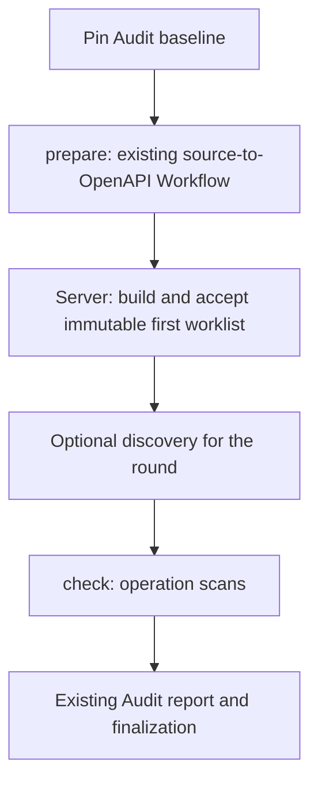

# Audit preparation and Workflow composition

Date: 2026-09-20. Series: **V62**. Status: **scanner-first implementation in progress; profiles not released**.

After review, the user requested explicit deferral of disputed work and accepted
the order supplied OpenAPI → useful scan results → source preparation. Nuclei
checks of pinned concrete OpenAPI URLs are included alongside SQLMap request
checks. V62-009 is the first active implementation task. No new profile is runnable
until its acceptance gates pass.

V62-009 owns the [scan contract](../spec/openapi-audit-scans.md), including
scan-specific coverage and repeat prevention across Audit attempts. V62-001 then
owns promotion of the proposed preparation syntax and lifecycle into the normative
[Audit specification](../spec/19-audits.md). Later tasks depend on that contract.
V62-009 now supplies the explicit `Workflow.auditTask` consumer contract and
executor Stage selection. V62-001 reuses these: it adds preparation before the
initial inventory, whereas surrounding Stages in a check Workflow run only after
that check's item already exists. The preparation contract must extend exact
input mappings to accepted outputs without coupling an inventory implementation
to a particular Workflow name or graph shape.
The [task index](../../tasks/index.yml) and individual V62 files own execution
status; this document does not establish feature readiness. Tasks V62-005/006/007/008
have status `deferred`, priority P2 and explicit reactivation conditions. Neither
dependency completion nor broad instructions to continue V62 reactivate them.

## Intended user outcome

The first slice accepts an exact existing OpenAPI and explicit scan settings:
target override, concrete operation values, authentication for supported request
checks and scanner selection. SQLMap consumes an exact HTTP request with explicit
test parameters. Nuclei consumes a fixed concrete URL with pinned template
selection; it does not claim to execute the OpenAPI method/body/authentication.
Gaps and unknown outcomes remain visible. Scripted process tests prove plumbing;
representative input checks are also needed to assess practical usefulness.

The second slice accepts a source archive, target and scan settings,
selects one AuditProfile and starts an Audit. Preparation analyzes the project
and generates validated OpenAPI. Server derives the bounded initial worklist
from the retained OpenAPI revision. Checks consume that same revision, prepare
concrete requests, scan the selected operations and publish Audit results.
Assessment snapshots and later routed checks are deferred extensions.

## Verified starting point

- `internal/auditservice/start.go` builds the initial inventory at start, before
  discovery. Its accepted worklist cannot be extended in place.
- `internal/config/audit_profile.go` validates explicit role kinds and retained
  output dependencies. Check outputs cannot be a generic `retained-output`
  producer; role names never classify behavior.
- `internal/auditcontroller/builder.go` resolves retained outputs in the current
  round. Non-check roles receive an empty item execution manifest; there is no
  declared input containing the complete settled round result set.
- `internal/auditimport/importer.go` retains accepted role outputs in protected
  Audit-managed ProjectScope. Workers receive ordinary exact RunScope inputs.
- Later proposal checks in `internal/auditservice/next_round.go` currently use
  `inventory.itemWorkflowRole`. Standard-package mappings already have their
  own per-item role selection and must retain it.
- `openapi-from-analysis@4`, OpenAPI-to-RequestSet preparation, scan planning
  and scanner Workers exist. A standalone source-analysis producer and an
  Audit check adapter for the complete generated-OpenAPI journey are missing.

## Proposed contracts and ownership

### Preparation and inventory

`prepare` is an Audit-level binding, completed once before the first worklist
is accepted. Each role can have bounded attempts; once its accepted result is
committed, resume/recovery and later rounds reuse it. This is not a promise of
exactly-once external side effects. Ordinary Run retry and unknown-outcome rules
continue to apply.

Start pins original inputs, scope, configuration, Skills, runtime settings and
credentials before dispatch. Generated artifacts are derived, immutable inputs
with provenance; they do not rewrite the original baseline. Preparation uses
ordinary audit-managed Runs and global Scheduler concurrency. No synthetic
Round or AuditItem is created to satisfy old foreign-key assumptions.

Introduce a durable preparation phase with explicit API projections, claims,
intents, receipts, attempt bounds and terminal reasons. Until inventory is
accepted, `currentRound` may be absent and coverage is pending rather than an
empty successful assessment. Pause, deadline, cancel, deletion, exhausted
attempts and restart apply before a Round exists. Count preparation attempts,
time and retained bytes against the same existing Audit budgets.

The proposed inventory source is an explicit choice of existing Audit input or
accepted preparation output. All profiles use explicit `source`/`settings`
mappings. V62-001 rejects `sourceInput`/`settingsInput` without a compatibility
reader, as requested by the user on 2026-09-20.
Support both OpenAPI-operation and checklist inventories from preparation.
Server retains its deterministic parser/expansion and bounds; a Worker cannot
create items or approve a worklist. Invalid or oversized generated documents
produce explicit failure, never a successful zero-item Audit.

Profiles without preparation keep start-time inventory; all profiles migrate
to the current mapping schema rather than preserving old canonical
snapshot bytes. Preparation is opt-in even for an already supplied checklist.

### Explicit input sources and deferred extensions

`prepare-output` is accepted by V62-001 validation and capability-gated for
execution. The other proposed additions below remain deferred:

| Source | Meaning and allowed consumers |
| --- | --- |
| `prepare-output` | Named accepted output of a prepare role; usable by dependent prepare roles, inventory, and all later round roles |
| `round-results` | One immutable, versioned snapshot of the settled current round; usable by assessment |
| `retained-dependency` | A named exact dependency from the accepted item's dependency manifest; usable by its check Run |

Only `prepare-output` belongs to the active preparation slice. The following
snapshot and cross-round dependency design is retained for review when
V62-005/006/007 are explicitly reactivated; V62-001 does not implement it.

`retained-output` keeps its existing same-round semantics. Validate role kind,
execution scope, phase order, cycles, required outputs and media compatibility.
No input source means mutable latest, a Project artifact search, or a direct
Worker permission to read ProjectScope. Referencing an individual check result
requires an exact accepted item/attempt/result dependency. Reading all results
uses the bounded round snapshot; simply lifting the check-output prohibition
would leave batched and retried results ambiguous.

Round snapshots include every item and its selected result or explicit absence,
attempt/collection outcomes, coverage/gaps, retained evidence and proposal
identities. Analyst decisions, when included, are pinned to a revision. Later
reviews do not rewrite a consumed snapshot. Freeze only after the settlement
barrier; bound bytes/counts and define partitioning or an explicit limit failure.
Workers can read evidence only through inputs authorized for their Run.

### Later checks and routing — deferred

Reuse the typed `proposedChecks` mapping and `retained-dependency` direction in
[specification 33](../spec/33-autonomous-pentest-audits.md#8-profiles-hypotheses-and-immutable-rounds).
Generic routing belongs to V62; pentest recipe, predicate, proof and transport
semantics remain owned by that separate specification. Fix the shared contract
when the deferred tasks are reactivated so the two implementations cannot create incompatible mechanisms.

A profile maps a validated plan schema and phase to an exact `kind: check`
binding. `verify` and `replay` remain check roles, not new lifecycle kinds.
Unknown/ambiguous mappings and unavailable capabilities have explicit decisions;
no inference from Workflow names, free text or model-supplied refs is allowed.
An accepted item pins role, dependencies, receipt/ordinal and budget/approval
requirements. Subsequent checks enter only a later immutable round. Preserve
the existing default route for profiles without the new mapping.

### Runnable scanning profile

First deliver supplied-OpenAPI scanning in V62-009. Then use the existing
`openapi-from-workspace@7` as one prepare role in V62-004. Standalone
`project-analysis@1` and its two-Workflow composition with
`openapi-from-analysis@4` remain deferred under V62-008 until report reuse is needed.

Add `audit-openapi-scan@1` and a complete profile only when all referenced
contracts resolve. Its adapter consumes the assigned operation task, exact
OpenAPI, execution manifest and explicit request/target settings; reuses
`internal/scanplan` and existing scanners; and produces a canonical Audit check
result package with trusted identities and exact evidence. Do not relabel the
standalone scanner JSON report as an Audit result or force a multi-stage/model-free
scan into the single-Worker `audit-check-results@1` completion contract.

Use bounded SQLMap request and Nuclei fixed-URL paths for the first complete journey. Missing
concrete values, excluded test parameters, unavailable scanner, truncated output
and indeterminate observations remain gaps. Empty scanner output is not proof
of security. Preserve existing `approval-required` active-check behavior; V62
does not enable autonomous pentest authorization or change target transport.

## Task decomposition

Each file owns its status, scope, dependencies, acceptance and verification.
The active sequence is 009 → 001 → 002 → 003 → 004 → 010 → 011 → 012.
Minimal no-Round public lifecycle support ships in 003; 010 adds richer provenance.

| Task | Deliverable | Depends on within V62 |
| --- | --- | --- |
| [009](../../tasks/v62-009-audit-openapi-scan-profile.yml) | **In progress:** supplied OpenAPI, SQLMap requests, Nuclei fixed URLs, coverage and retry contract | — |
| [001](../../tasks/v62-001-audit-composition-contracts.yml) | Preparation contracts, current schema and shared fixtures | 009 |
| [002](../../tasks/v62-002-audit-preparation-store.yml) | Durable preparation state, executions, retention and migration | 001 |
| [003](../../tasks/v62-003-audit-preparation-controller.yml) | Prepare Runs, recovery and minimal public controls before a Round exists | 002 |
| [004](../../tasks/v62-004-audit-prepared-inventory.yml) | Atomic generated inventory and a profile using existing source-to-OpenAPI Workflow | 003 |
| [005](../../tasks/v62-005-audit-round-result-snapshots.yml) | **Deferred:** settled round snapshots | 004 |
| [006](../../tasks/v62-006-audit-retained-dependencies.yml) | **Deferred:** cross-round item dependencies | 004 |
| [007](../../tasks/v62-007-audit-check-routing.yml) | **Deferred:** proposed-check routing | 005, 006 |
| [008](../../tasks/v62-008-project-analysis-preparation.yml) | **Deferred:** standalone analysis and two-Workflow preparation | 004 |
| [010](../../tasks/v62-010-audit-composition-api.yml) | Preparation provenance and scan coverage projections | 004 |
| [011](../../tasks/v62-011-audit-composition-ui.yml) | Prepare/progress/results/dependencies and control journey | 009, 010 |
| [012](../../tasks/v62-012-audit-composition-release.yml) | Mandatory database, process and browser release verification | 011 |

Deferred tasks retain their proposed scope but are excluded from eligible work.
Existing in-progress tasks outside V62 retain their owners and scope.

## Schema and delivery boundaries

### Current schema policy

On 2026-09-21 the user requested alignment of this plan and dependent V64 work
with the decision to drop legacy schemas. The following rules apply to contracts,
persistence, API clients and release acceptance throughout both series:

- Support one current Audit profile schema with explicit `source`/`settings`
  mappings. Reject `sourceInput`/`settingsInput` and obsolete persisted profile
  snapshots; do not add compatibility readers, aliases or implicit conversion.
- Migrate repository catalog resources, examples and fixtures to the current
  schema, keeping only current variants. Synchronize OpenAPI, generated clients
  and strict parsers together; supporting previous API shapes or client versions
  is not an acceptance requirement. Schema changes may change canonical bytes
  and digests; current-schema round trips must remain deterministic.
- Accepted baselines, Workflow snapshots, receipts and artifact revisions remain
  immutable. Catalog updates never rewrite a running Audit's pins. Obsolete
  snapshots fail explicit validation instead of being reinterpreted or silently
  upgraded. Current-schema Audits retain their recovery and deletion guarantees.
- Database upgrade fixtures exercise persisted Audits whose snapshots use the
  current schema, preserving identities, receipts, provenance and required holds.
  Forward storage migrations do not imply support for obsolete serialized data.
- Direct-input inventory, default `inventory.itemWorkflowRole` routing,
  same-round `retained-output` and Worker-owned Audit completion are current
  functionality. Their regressions remain mandatory. Absent `auditTask` on
  ordinary Workflows and current Worker-completion checks is valid; unifying
  these executors with the scan contract is outside this schema alignment.

These rules also apply to deferred task descriptions without reactivating them.
Historical verification records remain evidence for their original revisions.

### Delivery boundaries

- Current-schema Audit, completion, review, coverage, retention and deletion gates
  remain required regressions. New capabilities remain explicitly gated until
  implemented and verified. No separate Scheduler, mutable task DAG or
  general Project publication authority is introduced.
- V55 owns scanner execution, RequestSet and scan planning; V62 owns their
  Audit adapter. Reuse delivered V55 behavior without reopening those tasks.
- Specification 33 keeps its initial class inventory before discovery. It can
  reuse routing/dependency capabilities without adopting prepare-based inventory.
  Its scope enforcement, identities, live proof and independent replay remain
  separate implementation work.
- `finalize`, arbitrary conditional Workflow DAGs, automatic remediation,
  arbitrary check-to-check latest-output chaining and additional scanner
  adapters are deferred. Ordinary Audit reporting remains available.
- Use the next available migration number at implementation time. Do not reserve
  or rename migrations from concurrently developed series.

## Verification

The release task introduces `make test-audit-composition-e2e`; that target does
not exist yet. It must fail when mandatory prerequisites or cases are missing.
Run against disposable PostgreSQL and local target/scanner fixtures with real
Server/Scheduler/Runtime/public API boundaries and scripted model responses.
Record actual case counts and zero mandatory skips; no live model-quality claim
follows from deterministic tests. A real browser must start the profile and
observe preparation, approval, checks, gaps and retained evidence.

Planning validation only parses new YAML, checks index/dependency consistency,
acceptance/test coverage, local documentation links and whitespace. It does not
run or record future implementation tests as passed.
