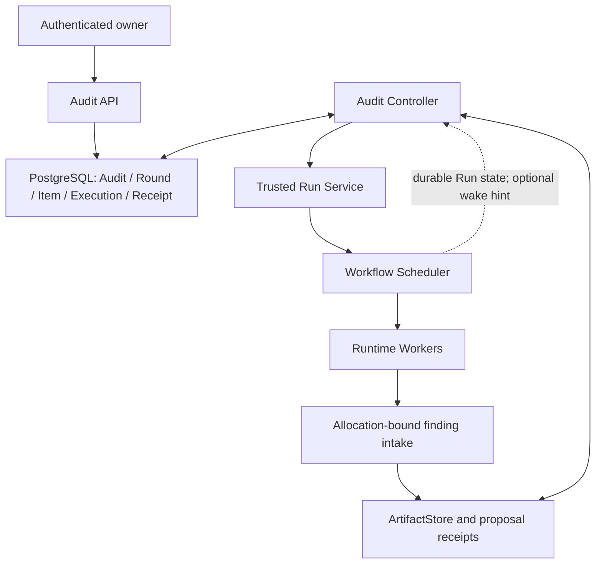
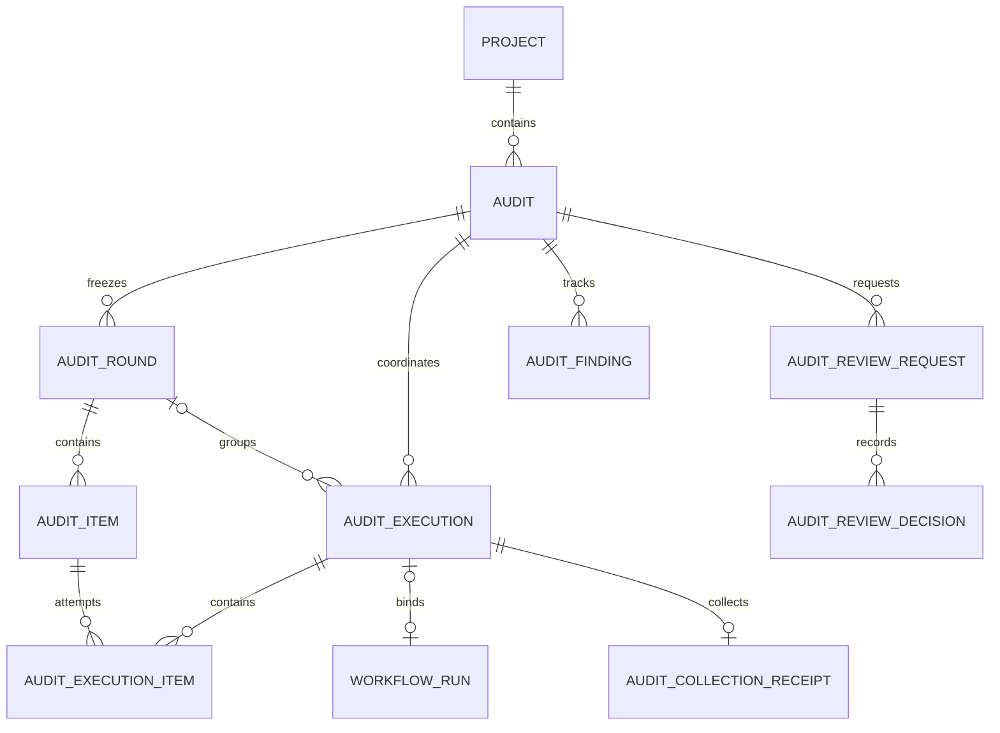
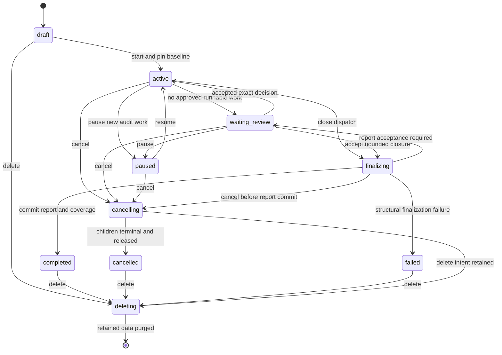

# 19 — Audits: checks, findings, and iterative assessment

Status: **Proposed working agreement**

Last implementation review: **2026-09-05**

## 1. Purpose

An `Audit` is a long-lived, Project-bound assessment performed against an
immutable baseline, a selected scope, and a versioned program. It coordinates
ordinary WorkflowRuns, deterministic inventory items, evidence, finding
proposals, rounds, and authenticated human decisions.

One ordinary Project may contain multiple independent Audits: an OWASP Top 10
risk assessment, an ASVS verification, a custom checklist, OpenAPI operation
tracing, or verification of findings proposed by earlier Runs. An Audit is not
a new Project kind. In the first release it belongs to an existing Project
whose `kind` is exactly `project`; `evaluation` Projects and standalone Audits
are rejected.

The Audit Controller owns coordination across Runs. The Workflow Scheduler
continues to own WorkflowRun and StageExecution progression. A Planner remains
local to one StageExecution. Workers may produce observations and propose
findings, but cannot create Runs, select an Audit, approve work, or mutate Audit
control state.

The first increment supports a deterministic inventory, one immutable round,
one logical item per execution, bounded independent check Runs, PostgreSQL
recovery, exact result collection, and a coverage report. The durable model
already separates items from executions so a later execution may carry a small
ordered batch without changing item identity. Later increments add finding
intake, human review, discovery, assessment, multiple rounds, and batching.

## 2. Ownership boundaries



| Participant | Owns | Does not own |
| --- | --- | --- |
| Audit API | Owner authorization, commands, review decisions | Stage execution |
| Audit Controller | Rounds, items, child Run intents, collection, coverage, Audit budgets | A2A dispatch or Runtime placement |
| Trusted Run Service | Atomic creation of a pinned ordinary Run and its Audit association | Audit policy or Stage progression |
| Workflow Scheduler | Run/Stage lifecycle, retry, escalation, output acceptance | ASVS, checklist, or finding semantics |
| Planner | Decomposition inside one Stage and candidate task/result production | Child Run creation or human approval |
| Worker and tools | Analysis, observations, result artifacts, finding proposals | ProjectScope or final Audit assessment |
| ArtifactStore | Exact revisions, scopes, CAS, lineage, and durable retention | AuditItem state |

Audit is an external state machine for coordinating multiple ordinary Runs. It
does not add a second task graph inside a WorkflowRun and does not alter the
StageExecution lifecycle.

Generic immutable Run metadata labels such as `audit.id`, `audit.round`,
`audit.item`, and `audit.role` MAY be attached to child Runs for search,
telemetry, and UI backlinks. They are caller-visible and therefore never
authoritative. Database foreign keys and trusted creation provenance are the
only Audit-to-Run authority; labels grant no access and cannot attach an
arbitrary Run to an Audit.

## 3. Alignment with the current implementation

The following boundaries already exist and are reused without reinterpretation:

- Project kinds are `project` and `evaluation`; Audit initially accepts only
  `project`.
- Project lifecycle is `active | deleting`; start and dispatch serialize with
  the existing Project deletion fence.
- ArtifactStore has `UserScope`, `ProjectScope`, and `RunScope`. No
  `AuditScope` is introduced and `ArtifactRef` does not carry a scope.
- An exact ArtifactRef has `namespace`, `name`, and a required `revision`.
  Audit baseline inputs always require exact refs.
- WorkflowRuns already persist a complete resolved Workflow snapshot and a
  pinned Run RuntimeConfig snapshot. Audit child Runs must use those same
  concrete forms rather than re-resolving mutable names or Run-label bindings
  at dispatch. Physical Agent-label settings remain an allocation-time layer,
  exactly as defined in [07](07-runtime-labels-and-infrastructure-config.md).
- Ordinary Run creation resolves each selected Skill name to an exact package
  revision and digest. Because Audit child Runs may be created long after
  start, Audit start must retain that exact Skill package set and the trusted
  Run Service must consume it without resolving the current `skills/<name>`
  binding again.
- Queue pause is an owner-wide Stage-admission gate. Audit coordination must
  continue to reconcile terminal Runs and perform cancellation/cleanup while
  that gate is paused.
- Project output publication currently targets create-only
  `outputs/<workflow-output>`. Repeated Audit check outputs would collide, so
  trusted Audit child Runs require an internal `audit-managed` publication
  mode. This mode is not accepted from the public Run-create API.
- Managed LLM and Runtime credential deletion is reference-aware for Runs.
  Audit start must add equivalent dispatch holds for credentials needed by
  future child Runs. Those holds end after dispatch is durably closed and all
  submission intents are resolved; exact evidence/artifact holds have a
  separate lifetime and remain until Audit deletion.

Everything else in this document is an additive contract. Until its owning
task is complete, it is not a description of current behavior.

## 4. AuditProfile

`AuditProfile` is a versioned, operator-authored configuration document with
identity `(name, version)`. The configuration loader validates it only after
all referenced Workflows are dependency-resolved. An Audit persists the full
resolved profile snapshot and its canonical digest; later catalog reloads do
not affect that Audit.

`audit-profiles` becomes the seventh fixed configuration subtree alongside
`workflows`, `agent-templates`, `model-policies`, `llm-gateways`,
`execution-configs`, and `instructions`. The configuration layer exposes an
internal read-only catalog; the Audit API adds a dedicated owner-safe read
projection for exact versions and Server compatibility. Generic managed
publication and the existing `/v1/configurations/{kind}` surface do not accept
AuditProfile until a separate API/versioning decision is implemented.

Profile modes compose one mechanism rather than creating Scheduler branches:

| Mode | Initial item source | Principal result |
| --- | --- | --- |
| `risk-assessment` | Risk categories, assets, and bounded discovery proposals | Assessed scenarios, findings, and gaps |
| `requirements-verification` | Exact versioned requirements and selected level/scope | Per-requirement evaluation and coverage |
| `custom-checklist` | Exact versioned user checklist | Per-item evaluation under its evidence contract |
| `operation-tracing` | Operations from an exact OpenAPI input | Trace reports, coverage, and proposals |
| `finding-verification` | Explicit exact finding candidates | Supporting, refuting, or inconclusive evidence |

A profile MAY combine sources, but it does not create a full Cartesian product
of requirements and operations unless the profile explicitly defines that
bounded expansion.

OWASP Top 10 is a risk-awareness document, not an exhaustive compliance
checklist. A risk-assessment report MUST NOT claim “OWASP certified” or infer
complete security from a lack of findings. ASVS assessments pin an exact
standard version, selected level, and included requirement set. References use
the version-qualified form recommended by ASVS, for example
`v5.0.0-1.2.5`. A new standard release requires a new profile version.

### 4.1 Authoring shape

```yaml
apiVersion: contractor/v1alpha1
kind: AuditProfile
metadata:
  name: api-security-review
  version: "1"
spec:
  mode: operation-tracing
  standards:
    - scheme: owasp-web-top10
      version: "2025"
  inputs:
    openapi:
      required: true
      mediaTypes: [application/json, application/yaml]
    source:
      required: true
      mediaTypes: [application/zip]
  inventory:
    implementation: openapi-operations@1
    sourceInput: openapi
    itemWorkflowRole: trace
  workflows:
    trace:
      ref: security-trace-operation@1
      inputs:
        source: {source: audit-input, name: source}
        task: {source: item-package}
      parameters:
        target: {source: item-field, name: subjectKey}
      outputs:
        result: trace_report
  execution:
    roundMode: fixed-barrier
    maxRounds: 1
    batchSize: 1
    maxItemsPerRound: 100
    maxItemsTotal: 250
    maxSubmittedRuns: 500
    maxItemRunAttempts: 2
    deadlineSeconds: 86400
    maxEvidenceBytes: 67108864
    incompleteRound: assess-with-gaps
  interaction:
    activeChecks: prohibited
    findingConfirmation: disabled
    notApplicable: profile-rule
    reportAcceptance: automatic
```

Workflow names in this example are proposed definitions, not claims that they
exist in the current catalog. A repository profile may only reference
Workflows that actually resolve in the same configuration snapshot.

Every workflow binding pins a complete `ResolvedWorkflow` closure. Its
`inputs`, `parameters`, and `outputs` maps are validated against the selected
Workflow:

- all required child inputs and parameters have exactly one mapping;
- unknown child slots and unknown logical output names are rejected;
- `audit-input` names exist and have at least one compatible media type;
- `item-package` is accepted only by an artifact slot compatible with the
  versioned Audit package media type;
- `retained-output` identifies a declared logical output of another bound role
  and cycles are rejected;
- literal parameter values are bounded strings; item/scope fields come from a
  closed trusted enum rather than model-selected object paths;
- every output consumed by the Audit importer is required by the child
  Workflow and has a profile-supported package media type.

All numeric limits, including `batchSize`, are finite positive values and are
jointly validated. Profiles cannot weaken Server-wide maxima. Catalog loading
may accept a bounded batch size greater than one, but the MVP start capability
requires exactly `batchSize: 1`. Model policies, execution budgets, Runtime
labels, and credentials are selected by the pinned child execution
configuration, not by finding content.

AuditProfile has no WorkflowRun concurrency limit. `maxSubmittedRuns` is a
cumulative budget over every child Run attempt, including retries and later
rounds; it does not bound simultaneous execution. The global Scheduler setting
in [20](20-scheduler-concurrency-control.md) is the sole execution-concurrency
authority for Audit and non-Audit Runs alike.

### 4.2 Server capabilities and start compatibility

Catalog validity and executable Server support are deliberately different.
The read-only catalog may retain a profile before every mechanism it requests
is installed. Profile reads and draft creation compute a closed, versioned set
of required Audit capabilities for presentation; start enforces that set
against the same profile snapshot it pins. A stale UI projection cannot bypass
the start check.

The one-round MVP supports only deterministic inventory, `maxRounds: 1`,
`batchSize: 1`, no discovery/assessment role, and interaction policies that do
not require a person. A Server-compatible passive profile uses `activeChecks:
prohibited`, `findingConfirmation: disabled`, `notApplicable: profile-rule`,
and `reportAcceptance: automatic`. `disabled` means finding proposals are not
an accepted result surface for that profile; it never turns proposals into
findings implicitly. Start rejects a disabled-finding profile whose resolved
Workflow outputs or AgentTemplates can emit finding proposals, and similarly
rejects active-check capabilities under `activeChecks: prohibited`. A Server
MAY advertise automatic active checks separately,
but absence of human approval support never downgrades `approval-required` to
automatic.

Profiles requiring active-check approval, manual applicability, finding
confirmation, report acceptance, discovery, multiple rounds, or batching stay
listable but cannot start until their owning capability is present. A
checklist containing a human-only item is also rejected at start while review
support is absent, because this requirement depends on the exact selected
input rather than profile metadata alone. The stable start error is
`audit_profile_unsupported`; its bounded reason codes distinguish the missing
capabilities. No unsupported policy is silently ignored or interpreted as an
automatic decision.

Initial reason codes are `discovery_unsupported`, `assessment_unsupported`,
`multiple_rounds_unsupported`, `batching_unsupported`,
`automatic_active_checks_unsupported`,
`active_check_approval_unsupported`, `finding_confirmation_unsupported`,
`manual_applicability_unsupported`, `report_acceptance_unsupported`, and
`manual_item_unsupported`. They describe Server features, not transient Worker
availability: a successfully started Audit may still wait in the ordinary queue for a
compatible Runtime Agent.

## 5. Baseline and scope

Audit belongs to exactly one `project_id` and owner. At `start`, one transaction
freezes:

- exact ProjectScope ArtifactRefs for source, OpenAPI, checklist, finding, and
  other declared inputs;
- a bounded target/scope snapshot, selected assets, exclusions, and permitted
  methods;
- non-secret credential identities plus durable usage holds;
- the resolved AuditProfile, every child ResolvedWorkflow closure, and one
  exact Run RuntimeConfig snapshot (default plus Audit-selected Runtime labels)
  reused by every child Run; physical Agent labels still resolve only after
  placement;
- the exact source revision, digest, validated metadata, and limits for every
  Skill package selected by any pinned child Workflow; later child creation
  forks these exact packages rather than resolving a current catalog binding;
- standard version, selected level, and requirement/asset selection rules;
- limits and human-interaction policy.

Draft input bindings may be edited with Audit revision CAS. After start, the
baseline is immutable. Changing target, credentials, selected input revisions,
or profile creates a new Audit. Additional human evidence may be accepted as
an exact retained input to a later round without rewriting the baseline.

For live HTTP observations, evidence also records observation time and an
available deployment marker. Pinned source does not prove that a live target
remained unchanged.

Scope is not encoded in ArtifactRef and never becomes a model-selectable
argument. The existing `ProjectScope -> RunScope` trust boundary remains: the
trusted Run Service resolves and forks exact inputs, and Runtime receives only
allocation-scoped Run authority.

## 6. Durable domain model



| Record | Minimum durable fields |
| --- | --- |
| `Audit` | id, owner_id, project_id, profile snapshot/digest, exact input/Skill sets, scope snapshot, runtime snapshots, state, revision, current_round_id, dispatch/hold state, deadline, limits/counters, stop reason, timestamps |
| `AuditRound` | id, audit_id, ordinal, exact accepted manifest ref/digest, state, expected_count, revision |
| `AuditItem` | id, round_id, item_key, ordinal, kind, subject_key, exact task package ref, workflow_role, state, final disposition, optional accepted result ref, optional last_execution_item_id |
| `AuditExecution` | id, audit_id, optional round_id, role, optional role_attempt, exact ordered execution manifest ref/digest, submission_key, optional run_id, state, optional terminal Run outcome/version |
| `AuditExecutionItem` | execution_id, item_id, batch_ordinal, item_attempt, exact task/input refs, collection disposition, optional exact result ref |
| `AuditCollectionReceipt` | id, execution_id, optional run_id, exact terminal observation, output disposition, optional source output ref/digest, retained refs/digests, bounded error code, timestamp |
| `AuditFinding` | id, audit_id, first proposal, current assessment, triage state, optional duplicate target, revision |
| `AuditProposalReceipt` | id, run_id, allocation_id, invocation_id, submission_id, payload digest, exact proposal ref, optional admitted audit_id, source status |
| `AuditArtifactLink` | audit_id, logical key, exact retained version, source provenance, display ref, timestamp |
| `AuditReviewRequest` | id, audit_id, kind, exact subject revision/digest, requested actions, state, optional expiry |
| `AuditReviewDecision` | id, request_id, actor_id, decision, exact subject revision/digest, bounded rationale, timestamp |
| `AuditEvent` | audit_id, monotonic sequence, kind, entity id/revision, bounded safe summary |

Execution roles are `discovery | check | assessment`. A check execution has an
ordered set of `AuditExecutionItem` rows; discovery and assessment belong to
the Audit or Round and do not create fake items. Each execution has at most one
Run and one immutable execution-input manifest. One Run can belong to at most
one AuditExecution.

In the MVP every check execution contains exactly one item because the start
capability requires `batchSize: 1`. This is a policy constraint, not a schema
shortcut. A later bounded execution may contain several compatible items while
each item retains its own ordinal, attempt, result, evidence, coverage, and
settlement. Retry creates a new AuditExecution and a new AuditExecutionItem for
each retried item; later batching may regroup retries without changing item
identity. Items with different Workflow/configuration, baseline, workspace, or
permission envelope cannot share an execution. Workspace reuse never implies a
shared Worker conversation.

Required uniqueness includes `(audit_id, round.ordinal)`,
`(round_id, item_key)`, `(round_id, ordinal)`, `submission_key`, non-null
`run_id`, `(execution_id, batch_ordinal)`, `(execution_id, item_id)`,
`(item_id, item_attempt)`, `(allocation_id, invocation_id, submission_id)`, and
`(audit_id, event.sequence)`. Discovery/assessment attempts use explicit
PostgreSQL null-safe uniqueness over Audit, optional Round, role, and
`role_attempt`.

### 6.1 Result layers

| Layer | Meaning |
| --- | --- |
| Run outcome | Whether the technical Workflow contract completed |
| Check observation | What was observed, under which exact inputs and limits |
| Hypothesis assessment | `supported | refuted | inconclusive | blocked` |
| Requirement evaluation | `satisfied | violated | inconclusive | not-tested | not-applicable` |
| Finding triage | `proposed | confirmed | rejected | duplicate | needs-evidence` |
| Audit completion | Whether the bounded program closed, with what coverage and gaps |

A succeeded Run never automatically confirms a finding or satisfies a
requirement. A failed/cancelled Run does not refute a hypothesis. `supported`
describes evidence; `confirmed` is a policy-authorized triage decision.
Severity and confidence are distinct fields. The MVP may disable finding
production; the first finding-capable release requires human confirmation. A
future profile may allow deterministic auto-confirmation only under an explicit
evidence contract.

## 7. Audit packages and schemas

ArtifactStore remains the sole artifact plane. Related variable-sized sets are
transported as one versioned `application/zip` package containing
`manifest.json` and relative files. The manifest uses package-local IDs,
media types, sizes, and content digests. It contains no unqualified external
refs whose scope could change during a fork. External data is materialized
before acceptance or rejected.

Packages reuse the existing secure workspace/archive rules: bounded compressed
and expanded bytes, bounded file count/path length/depth, strict relative paths,
no traversal, no special files, no symlink escape, and no execution of package
content. A dedicated Audit package schema adds tighter per-document limits.

The first package schema is strict canonical JSON:

```json
{
  "schema": "contractor.audit.package.v1",
  "package_id": "task-0123",
  "kind": "item-task",
  "members": [
    {
      "id": "task-document",
      "path": "task.json",
      "media_type": "application/json",
      "size": 123,
      "digest": "sha256:..."
    }
  ]
}
```

`members` is ordered by path and every `id` and `path` is unique. The optional
`entrypoint` is permitted only for an `openapi-source` package and names one
declared member. Initial package kinds are `worklist`, `item-task`,
`execution-manifest`, `check-results`, `finding-proposal`, `evidence`,
`coverage`, and `openapi-source`. Unknown manifest fields, schema versions, or
kinds are rejected. Canonical export uses stored members, fixed ZIP metadata,
and the JCS manifest; import may accept stored or deflated members but always
checks their declared size and SHA-256 digest before exposing bytes.

Initial hard limits are 16 MiB compressed, 32 MiB expanded, 1,024 members,
16 MiB per opaque member, 512 KiB for `manifest.json`, 8 MiB per parsed JSON or
YAML document, 512 bytes and 16 components per package path, JSON/YAML depth
64, local-ref depth 32, 4,096 inventory items, and 64 MiB across all generated
item packages. Server deployments may lower these values but cannot accept a
package above them under this schema version.

Child Workflows declare fixed slots such as `task`, `result`, and `proposals`.
Variable lists live inside a package; Runtime cannot publish an unbounded
dynamic `outputs/vuln-*` namespace around Scheduler acceptance.

### 7.1 FindingProposal

```yaml
schema: contractor.audit.finding-proposal.v1
client_key: candidate-local-7
title: Possible ownership check gap
description: Evidence suggests an ownership decision may be missing on a traced path.
subject: {kind: openapi-operation, key: op-stable-key}
hypothesis: An actor may access an object outside the expected ownership rule.
preconditions: [Known actor role, Known expected ownership rule]
standard_refs: []
evidence_ids: [ev-12]
proposed_checks:
  - objective: Establish whether the ownership predicate dominates the selected data access.
    method: static-trace
severity_suggestion: medium
limitations: [Live behavior has not been verified]
```

Standard refs contain `scheme`, `version`, and `requirement_id`. Unknown IDs
are rejected when a standards package is configured. Missing mapping is shown
as unmapped, not interpreted as compliance. `client_key` is scoped to the
trusted invocation and never becomes a global finding ID.

### 7.2 CheckResultSet

```yaml
schema: contractor.audit.check-results.v1
execution_manifest_digest: sha256:...
results:
  - item_key: item-017
    subject_key: op-stable-key
    assessment: inconclusive
    summary: Route-to-handler mapping was found, but a required helper could not be resolved.
    evidence_ids: [ev-21]
    coverage:
      requested: [route-mapping, source-to-sink, validation-path]
      completed: [route-mapping]
      gaps: [unresolved-helper]
    proposals: [candidate-local-7]
```

The execution input contains an immutable manifest with an ordered list of
item keys and exact task/input refs. The importer verifies the manifest digest,
membership, `item_key`, and `subject_key`; rejects duplicate, foreign, missing,
or extra results; and requires exactly one result per input item after a
technically succeeded Run. The model does not choose the AuditItem receiving a
result. Run success does not imply success for any individual item.

Schema validity is not semantic evidence acceptance: the importer also checks
evidence references, requested coverage, and the profile evidence contract. An
invalid or incomplete result set creates a durable invalid collection receipt
independently of the technically succeeded Run. The MVP result set has exactly
one member, but this envelope remains unchanged when bounded batches are later
enabled.

### 7.3 WorklistManifest

```yaml
schema: contractor.audit.worklist.v1
round: 1
items:
  - item_key: item-017
    ordinal: 0
    kind: operation-trace
    subject_key: op-stable-key
    workflow_role: trace
    task_package_id: task-017
    approval_requirement: none
```

The Controller validates the entire manifest before creating the first child
Run. Duplicate keys, missing/duplicate ordinals, unknown roles, absent package
members, dependency gaps, and limit violations reject it atomically. The
normalized manifest and Round/Items commit together. A model may request more
approval, but cannot weaken the trusted profile requirement.

## 8. Deterministic inventories

Inventory generators produce finite subject/item lists and perform no network
side effects.

### 8.1 Requirements and custom checklists

Each checklist entry has a stable key, version, statement, applicability rule,
allowed methods, required evidence, and review policy. ASVS references carry an
exact version-qualified identifier. A selected level is expanded from the
pinned standards package, never from model memory.

Every selected requirement gets an initial `not-tested` coverage row, even
when no automated Workflow applies. Manual/documentary requirements create
review work rather than disappearing from the denominator. `not-applicable`
requires a rationale and a policy-authorized decision.

### 8.2 OpenAPI operations

`openapi-operations@1` accepts an exact OpenAPI 3.x JSON or YAML document, or a
bounded package containing it. Local `$ref` values resolve only inside the
pinned document/package under cycle, depth, and byte bounds. The generator
never performs a network request. A remote ref needed to resolve an enumerated
Path Item, operation, parameter, security declaration, or schema dependency
rejects the entire inventory before dispatch. Remote refs that occur only in
unsupported callbacks, webhooks, or other non-selected surfaces are not
followed and become explicit named coverage gaps.

The first inventory enumerates explicit HTTP operations in `paths`. Callbacks
and webhooks become named coverage gaps rather than counted checks. Path Item
refs resolve before enumeration. `operationId` is only a display label: missing
or duplicate operation IDs do not merge operations. Ordering is UTF-8
lexicographic path followed by a fixed HTTP-method order.

Identity and provenance use separate digests:

- `source_content_digest` is SHA-256 over the exact accepted source artifact
  bytes. It identifies provenance and changes after reformatting or conversion
  between JSON and YAML;
- `canonical_inventory_digest` is SHA-256 over a versioned JCS representation
  of the normalized inventory basis: enumerated paths/operations, their
  resolved local dependency closures, and normalized gap descriptors. It
  excludes source byte identity, mapping presentation order, comments, and
  `operationId` uniqueness;
- `operation_key` is SHA-256 over a domain-separated canonical tuple of
  `canonical_inventory_digest`, the exact path template, and the lowercase
  HTTP method.

The canonical inventory and operation keys are therefore stable for
semantically equivalent JSON/YAML inputs and mapping-key reorderings, while
task packages may differ because they retain exact source provenance. There is
no circular digest: the inventory basis contains no operation keys and the
worklist is derived only after its digest is known.

Task packages include both digests, the operation, relevant resolved schemas/
parameters/security declarations, an exact source descriptor
(`ArtifactRef`, media type, and content digest), and scope. The immutable
execution manifest repeats that exact source input. Source bytes remain in the
single pinned input artifact and are forked through the ordinary Run input
path; they are not copied into every item package. This keeps inventory memory
and storage bounded while a reformatted or replaced source still changes task
package provenance. The baseline ref in a task package is inert provenance,
not scope authority: the trusted Run Service consumes the server-side
execution manifest, forks it to `inputs/<workflow-slot>`, and Runtime receives
only that allocation-bound RunScope access.
Operation-to-handler mapping requires evidence; an unsupported mapping remains
an assumption. An unmapped endpoint or truncated graph yields an explicit
gap/inconclusive result,
never “no vulnerabilities found.” Taint annotations remain research artifacts,
not proof of reachability or exploitation.

### 8.3 Worker proposals

Worker proposals never alter an accepted Round. They enter a durable inbox and
may be triaged into a later Round. A proposal from a non-Audit Run remains
attached to that Run until an owner imports the exact revision into a compatible
Audit. The Server checks owner, Project, scope, and provenance. It never finds
an Audit by trusting Run labels.

## 9. `security-findings@1`

This optional AgentTemplate Toolset exposes:

```text
finding(client_key, title, description, subject, hypothesis,
        evidence_refs, proposed_checks?, standard_refs?, severity_suggestion?)
  -> {proposal_id, receipt_id}
```

The call registers a candidate. It does not confirm a vulnerability, create an
AuditItem or Run, publish to ProjectScope, or grant approval. Model-visible
arguments contain no `audit_id`, `project_id`, owner/run identity, or execution
override.

Runtime submits through the allocation-bound private route:

```text
POST /private/v1/allocations/{allocation_id}/finding-proposals
```

The trusted adapter supplies the correlated invocation and stable submission
IDs. Server derives Run and optional Audit identity from allocation and trusted
Run provenance, verifies Toolset selection, current write fence, exact evidence
refs in that Run, and all payload/count limits.

One transaction creates the immutable proposal artifact, pins its evidence,
and records the receipt. A generic artifact write cannot forge a receipt.
Replay of `(allocation_id, invocation_id, submission_id)` with the same
canonical digest returns the original receipt; a different digest conflicts.
Receipt replay remains readable after the write fence, while a new submission
is rejected. Intake and fence transition are serialized by the same durable
grant transaction used by ordinary private artifact writes.

## 10. Audit and Round lifecycle



An active Audit may enter `failed` only after dispatch is closed and owned Runs
are terminal/released. Budget or deadline exhaustion closes dispatch and tries
bounded finalization with explicit gaps; inability to form a structurally valid
report yields `failed`. Terminal continuation creates a new Audit with explicit
baseline provenance.

`completed` means the bounded Audit process closed, not that the application is
secure. Completion requires a durable collection receipt for every execution,
every item settled, no mandatory open review, and retention of every accepted
evidence revision. A profile that
allows partial completion may close review work as deferred/excluded with a
visible gap.

Round lifecycle is `proposed -> accepted -> executing -> assessing -> closed`.
Items are immutable after acceptance. Checks settle before one assessment
execution. A proposed next worklist becomes a new Round only after complete
validation and any required review.

Terminal observation and item settlement are separate durable transitions:

1. Controller observes an authoritative terminal Run version/outcome, records
   it on AuditExecution, and moves its items to `collecting`.
2. Collection validates the exact frozen output when one is expected and
   always commits one `AuditCollectionReceipt`. Receipt dispositions include
   `accepted-result`, `missing-output`, `invalid-result`, `execution-failed`,
   and `execution-cancelled`; a receipt may retain zero evidence revisions.
3. In that transaction, each AuditExecutionItem records its attempt outcome.
   An accepted final result settles its AuditItem. A retryable failed/invalid
   attempt with remaining policy returns the item to `ready`; it is not settled.
   Exhausted, non-retryable, cancelled, or explicitly excluded items settle
   with their truthful final disposition.

Item lifecycle is therefore `pending -> awaiting_review | ready -> submitted
-> collecting -> ready | settled`. A bounded retry creates a new
AuditExecution/AuditExecutionItem and preserves every earlier receipt. Only
settled items participate in the round barrier. Zero items yields an explicit
empty-inventory reason; it never proves compliance.

## 11. Submission, queueing, and fairness

Audit uses ordinary WorkflowRuns and the existing owner queue. The global
`maxConcurrentRuns` setting in [20](20-scheduler-concurrency-control.md) is the
only execution limit; Controller never reserves Runtime slots, owns execution
capacity, or bypasses queue ordering.

Controller avoids eagerly filling the queue through an internal per-Audit
dispatch look-ahead equal to the current global Scheduler value. The window
counts reserved submission intents plus associated nonterminal child Runs and
is enforced transactionally across Controller instances. It is Server-owned
producer backpressure rather than AuditProfile policy, is not pinned at Audit
start, and changes dynamically. Lowering the global value never cancels already
submitted Runs; dispatch waits for the outstanding count to drain. The pinned
`maxSubmittedRuns` budget separately limits total child Run attempts.

Audit pause always blocks new child Run submissions. The generic owner Queue
Pause gate may also block normal Stage admission of already-created Audit Runs;
it contains no Audit domain semantics. Active Stages drain normally, and
terminal reconciliation, cancellation, and cleanup proceed through all pause
states. Audit-specific UI wording remains exactly “Pause new Audit Runs,” not
“Pause execution.”

Controller dispatches items by immutable ordinal through a bounded window and
uses fair age/round-robin selection across Audits. It does not promise optimal
multi-host placement.

When batching is later enabled, selection groups only items with identical
pinned Workflow/configuration, baseline/workspace, and permission envelopes.
The Run receives one immutable ordered manifest and returns one complete result
set. If it terminates before accepted collection, the retry policy may repeat
the whole small batch. A normal intermediate artifact write is not durable item
completion; accepting partial in-flight progress requires the separately
deferred per-item checkpoint protocol.

Submission identity is derived from `audit_id`, round/role, the immutable
ordered execution-item/attempt set, and the execution manifest digest. The
trusted Run Service creates the immutable Run, authoritative AuditExecution
association, exact input forks, start-pinned exact Skill packages,
RuntimeConfig snapshot, and credential references under the normal
Project/credential lifecycle barriers. Direct Scheduler-table inserts are
forbidden.

An external call uses a durable submission intent and one stable idempotency
key until the original Run is recovered. The association is committed with Run
creation, so there is no orphan window based only on labels. Scheduler retry
and escalation remain inside one Run; an Audit-level retry creates another Run
only after the previous execution has a terminal observation and collection
receipt.

## 12. Recovery and events

PostgreSQL is authoritative. The Controller periodically claims and reconciles
a bounded number of nonterminal Audits. Process-local notifications are wake
hints only; loss, duplication, or reordering cannot prevent progress.

For deterministic profiles, start creates the accepted first inventory without
a discovery Run. A profile that requires model discovery instead creates one
stable discovery AuditExecution, waits for a frozen output, validates it
atomically, and only then creates the Round. Partial discovery output never
becomes a worklist.

One reconcile step:

1. obtains a short claim with expiry/epoch and reads Audit/Project fences;
2. resumes durable submission and collection intents;
3. reads authoritative state for associated Runs and records each new exact
   terminal observation without settling an item;
4. collects every observed execution exactly once: validates a frozen result
   set when present, retains accepted revisions, commits a receipt for accepted,
   missing, invalid, failed, or cancelled output, and then either requeues or
   settles each item according to its remaining attempt policy;
5. applies accepted exact review decisions;
6. creates only the next bounded set of allowed submissions;
7. creates at most one assessment execution after the barrier;
8. accepts a next Round or commits exact final report/coverage.

A claim alone does not authorize stale commits. Every mutation checks epoch or
revision plus uniqueness constraints. No network/model call occurs under a DB
row lock. Collection is unique by execution and exact terminal Run version;
accepted output identity additionally includes its exact revision and digest.
Public WebSocket is not an internal completion bus.

| Fault | Required result |
| --- | --- |
| Crash before child Run creation | Durable intent retries |
| Run created but response lost | Same submission key returns same associated Run |
| Crash after terminal Run before collection | Reconcile records the terminal version and one collection receipt |
| Partial package materialization | Staging is invisible; retry completes or records one invalid receipt |
| Terminal event lost/duplicated/reordered | Controller reads durable Run state and collects once |
| Worker dies after `finding` | Committed receipt remains; uncommitted proposal does not |
| Two Controllers start assessment | Unique execution identity admits one |
| Cancel races submission | Audit fence chooses; any committed Run joins cancellation set |
| Project delete races start/dispatch | Project deleting fence rejects new work |

## 13. Budgets and bounds

Every Audit has finite maxima for rounds, items per round, total items,
proposals, submitted Runs, simultaneous Runs, wall time, package bytes, and
retained evidence bytes. A submission reserves budget in the same transaction
as its intent; replay never consumes twice. Reserved and committed consumption
are recorded separately.

Model, token, Tool, HTTP, and context limits remain enforced by each pinned
child execution policy. Collected monetary/token metrics can be incomplete
after failure and therefore do not constitute a strict aggregate spending cap.
Any future hard aggregate token/spend limit requires conservative per-Run
reservations and must reserve unknown consumption rather than treating it as
zero. Until then, such UI totals are explicitly advisory.

When a limit prevents more hypotheses or executions, counts, omission reasons,
and coverage gaps are retained. No work is silently dropped.

## 14. Human review

Review kinds are `plan-approval`, `active-check-approval`, `provide-evidence`,
`finding-triage`, `requirement-applicability`, and `report-acceptance`.

A request pins an immutable subject revision/digest. A decision is accepted
only through the owner-authenticated Audit API with CAS and idempotency. Model
text or an artifact claiming “approved” has no authority. A new plan revision
requires a new decision. Active-check approval pins exact target, methods,
credential role, bounds, and expiry; Runtime adapters still enforce their own
scope and egress controls.

Waiting for a person holds no allocation, Controller claim, or DB transaction.
Human evidence is stored with actor/time provenance and passes the same exact
package validation. A decision never rewrites original observations.

## 15. Evidence, findings, and coverage

Every accepted observation records exact inputs, instrument/version, actor
role, observation time, output refs, scope, limitations, and truncation. Code,
documents, and HTTP responses are untrusted data; instructions embedded in them
grant no tools or approvals.

Finding fingerprints combine the scope snapshot, subject, and normalized issue
family only as a grouping hint. They do not merge identities automatically. A
human duplicate decision creates an acyclic link inside one Audit. One finding
may map to multiple requirements; a requirement may also be violated without a
technical vulnerability, for example because required documentary evidence is
absent.

Coverage starts with one row per selected requirement or operation.
Requirement states are `satisfied`, `violated`, `inconclusive`, `not-tested`,
and `not-applicable`; operation states are `traced-complete`, `traced-partial`,
`unmapped`, and `not-tested`. Exclusions and N/A rationales are reported
separately. Applicability coverage is
`(satisfied + violated) / selected applicable`; inconclusive remains a separate
count. A zero denominator is `N/A`, never 100%.

The report includes baseline/profile/standard versions, scope, coverage matrix,
confirmed and proposed findings separately, unresolved questions, exclusions,
incomplete evidence, human decisions, limits, and reproducible provenance. Any
ASVS statement is limited to the selected version, level, scope, and evidence
policy; partial automation is not described as complete compliance.

## 16. Retention, publication, and deletion

`AuditArtifactLink` retains exact immutable content independently of source Run
lifetime. In the first increment, trusted import forks accepted packages into
protected create-only ProjectScope bindings under an Audit-specific logical
namespace and records a receipt. Keys include Audit identity and version; a
collision never overwrites another result.

Workers continue to see only exact RunScope inputs and have no Audit or Project
Artifact authority. Ordinary public Project Artifact mutation cannot write or
delete Audit-managed bindings. This is an explicit reserved-prefix policy;
owner uploads continue through non-reserved namespaces.

Audit child Runs use trusted `publication_mode=audit-managed`, suppressing the
ordinary `outputs/<slot>` publication that would collide across checks. Frozen
Run outputs remain ordinary accepted outputs. Import failure does not rewrite
Run success.

An Audit-bound Run cannot be hard-deleted until all allocations have terminally
released and a durable `AuditCollectionReceipt` records the disposition of its
exact terminal observation. The receipt is required even when the Run failed or
was cancelled, produced no output, or produced an invalid package. Accepted
evidence is retained by exact revision; a receipt with no accepted evidence
records that fact rather than waiting for an impossible successful import.
After collection, Run deletion is allowed. AuditExecution and
AuditExecutionItem retain outcome, exact retained refs when any, and tombstone
provenance through a nullable non-cascading Run relation.

Audit-level credential dispatch holds and evidence holds are not released by
the same transition. Dispatch holds may be released once dispatch is durably
closed and no unresolved child submission intent can create another Run.
Per-Run credential holds follow the ordinary Run lifecycle. Exact Audit
evidence and accepted proposal pins remain until Audit deletion or an explicit
later retention policy transfers and releases them.

An ordinary non-Audit Run proposal is pinned by its proposal receipt until it
is either imported by exact revision into an Audit or durably discarded. Hard
deleting its source Run atomically marks every unimported proposal discarded,
releases its proposal/evidence pins, and retains only bounded tombstone
provenance; an imported proposal is protected by the destination Audit's own
exact holds. Run deletion therefore cannot leak abandoned proposal pins or
silently remove evidence already retained by an Audit.

For an Audit child Run, collection accounts for every committed proposal
receipt before making the Run deletable: an allowed proposal receives an exact
Audit-owned inbox link/hold, while a profile with finding production disabled
treats an unexpected proposal result as invalid rather than silently admitting
it. Source-Run pins may be released only after that durable disposition.

Deleting an Audit is a durable operation. It first closes dispatch and releases
future-dispatch credential holds, cancels/drains and collects owned Runs,
releases evidence/accepted-proposal holds, and only then purges Audit-managed
Project bindings and domain rows. Project deletion adds an
earlier Audit-cancellation/drain phase before its existing Run and ProjectScope
purge. No Audit work starts in a deleting Project and no Audit hold survives a
completed Project purge. Cleanup runs regardless of owner/Audit queue pause.

## 17. Public API and UI

The proposed endpoints join the single public OpenAPI and generated client.
Owner comes from authentication and Project membership, never a request body.

| Method and path | Purpose |
| --- | --- |
| `GET /v1/audit-profiles` | Paginated exact profile versions with mode, input contract, limits, and Server compatibility |
| `GET /v1/audit-profiles/{name}/versions/{version}` | One exact read-only profile projection and compatibility reason codes |
| `POST /v1/projects/{projectId}/audits` | Create idempotent draft from profile and exact input selections |
| `GET /v1/projects/{projectId}/audits` | Keyset list with state/profile filters |
| `GET /v1/audits/{auditId}` | Authoritative projection and revision |
| `POST /v1/audits/{auditId}/start` | CAS-pin baseline and enter active |
| `POST /v1/audits/{auditId}/pause` | Stop new Audit submissions; optionally gate admission |
| `POST /v1/audits/{auditId}/resume` | Resume reconcile/dispatch |
| `POST /v1/audits/{auditId}/cancel` | Close dispatch and bounded-cancel children |
| `GET /v1/audits/{auditId}/items` | Paginated items filtered by round/state/subject |
| `GET /v1/audits/{auditId}/findings` | Proposals/triage with exact evidence links |
| `GET /v1/audits/{auditId}/coverage` | Requirement or operation matrix |
| `GET /v1/audits/{auditId}/reviews` | Pending/completed review requests |
| `POST /v1/audits/{auditId}/reviews/{requestId}/decisions` | Idempotent exact-subject owner decision |
| `POST /v1/audits/{auditId}/imports` | Import owner-selected exact proposal/evidence |
| `GET /v1/audits/{auditId}/report` | Exact accepted report or generation state |
| `DELETE /v1/audits/{auditId}` | Begin/replay durable delete and return current deletion state |

Unknown and other-owner IDs return the same safe 404. Invalid transitions
return conflict with bounded stable codes. Nested route IDs must belong to the
same Audit. Filters apply before keyset pagination. Safe errors/events contain
no credential, raw provider response, package content, or model transcript.

Profile endpoints are a dedicated read-only projection, not generic managed
configuration publication. Every item identifies exact name/version/digest and
returns the declared input contract, mode, standards, execution/interaction
limits, `serverCompatible`, stable missing-capability reason codes, and whether
exact input-dependent validation is still required. Compatibility describes
the current Server only; project artifact and checklist-item compatibility are
evaluated separately by the draft UI where possible and authoritatively by the
start transaction. Start always revalidates both.

UI navigation is Project → Audits → Overview / Coverage / Findings / Checks /
Reviews / Runs / Report. It displays technical Run outcome separately from
semantic assessment, and proposed findings separately from confirmed findings.
Generic Runs/Queue UI remains authoritative for execution and links back to the
Audit; Audit does not create a second Runtime queue.

The MVP UI uses bounded polling of authoritative Audit/profile reads while an
Audit is nonterminal or deleting, keyed by Audit revision/ETag, and stops when
the route is inactive or terminal. It refetches immediately after a mutation
and after browser reconnect. Audit WebSocket subscriptions, authorization,
cursor/sequence replay, and resync are deferred as one complete later transport
feature; the existing Run event socket is not treated as an Audit invalidation
contract.

## 18. End-to-end examples

### 18.1 Top 10 risk assessment

1. Owner selects exact Top 10/profile version, baseline inputs, and scope.
2. Discovery proposes bounded hypotheses for selected categories/assets.
3. Controller validates an immutable worklist; policy requests active-check
   review where required.
4. Checks run as independent ordinary Runs and proposals enter the inbox.
5. Assessment records evidence, findings, and gaps; accepted new work forms a
   later Round.
6. Report is limited to explored scenarios and never presented as certification.

### 18.2 ASVS or custom checklist

1. A versioned requirements package defines the denominator.
2. Automatable requirements receive checks; others receive evidence/review work.
3. Trace, HTTP, and documentary evidence links to exact requirement IDs.
4. Assessment applies the evidence contract; N/A requires rationale/authority.
5. Report includes every selected item, including untested and inconclusive.

### 18.3 OpenAPI operation tracing

1. Deterministic inventory pins operations and stable keys.
2. One task package and AuditItem is created per operation. The MVP dispatches
   one item per execution; later bounded batching preserves independent results,
   attempts, evidence, permissions, and coverage for every operation.
3. Trace Run works against exact source and code-analysis capabilities.
4. `finding(...)` may register candidates independently of the terminal report.
5. Barrier closes the current Round before any candidate enters a later one.
6. Missing handler mapping or truncated graph becomes a gap, not a clean verdict.

### 18.4 Proposal from an ordinary Run

1. A non-Audit Worker with `security-findings@1` submits a proposal.
2. Proposal/receipt remains attached to its exact Run.
3. Owner imports that exact revision into a compatible Audit or creates a
   finding-verification Audit.
4. Import retains provenance; Worker never chooses the Project/Audit or starts work.
5. If the owner instead hard-deletes the source Run, unimported proposals are
   durably discarded and their pins are released; imported revisions remain
   held by their destination Audits.

## 19. Additive implementation changes

| Component | Required change |
| --- | --- |
| Configuration | Read-only AuditProfile catalog plus owner-safe compatibility projection with resolved Workflow closures and digest |
| Server model | Audit entities, API, Controller, package/import and intake services |
| PostgreSQL | Durable work, claims, uniqueness, events, receipts, and retention holds |
| Run Service | Trusted pinned Workflow/Runtime/Skill creation, Audit provenance, managed publication, deletion guard |
| Scheduler | Optional generic Audit eligibility gate and terminal wake hint; unchanged Stage semantics |
| Runtime | Selected `security-findings@1` adapter and bounded receipt reconciliation |
| Artifact plane | Package import, proposal/fence transaction, protected Audit bindings and retention |
| Project deletion | Cancel/drain Audits before existing Run/ProjectScope purge |
| Frontend | Audit views, review actions, coverage and finding distinctions |

Existing Planners need no Audit awareness. Discovery and assessment Workflows
produce normal fixed outputs. The schema permits a future small fixed batch in
one ordinary Run through AuditExecutionItem and CheckResultSet, but batching
cannot create Runs from a Worker, merge permission envelopes, or replace Audit
recovery. Durable per-item checkpoints inside a still-running Run require a
separate idempotent receipt contract and are not implied by artifact writes.

## 20. Acceptance gates

1. Multiple Audit modes coexist in one Project without crossing identities,
   baselines, reports, or queue state.
2. Exact replay of create/start/submission/collection returns the original result;
   same key with different payload conflicts.
3. OpenAPI canonical inventory and operation keys are stable under equivalent
   JSON/YAML and mapping-key reordering; exact source-content provenance still
   differs, method/path remain distinct, and `operationId` is not identity.
4. An invalid manifest creates zero child Runs; accepted manifests are immutable.
5. N checks create N logical items and N execution-item records. With
   `batchSize: 1` and `maxItemRunAttempts: 1` they create exactly N Runs; bounded
   retries create additional Runs without creating additional logical items.
   Proposals cannot alter the current barrier.
6. Crash injection around each submission/collection/assessment durable boundary
   neither loses work nor creates an extra Run.
7. Periodic reconcile recovers with all wake hints lost; two Controllers
   converge on the same accepted outcomes.
8. Finding submission survives response loss/Worker failure; stale replay does
   not create another artifact and write fence rejects a new submission.
9. Generic artifact content cannot forge a proposal receipt, review decision,
   Audit association, or confirmed finding.
10. `inconclusive` never confirms a finding; failed Run never satisfies a
    requirement.
11. A remote OpenAPI ref required by a selected operation, oversized package,
    foreign evidence, or mixed scope fails before dispatch/import; unsupported
    callbacks/webhooks and their untraversed refs become explicit gaps.
12. Review of an old subject revision cannot authorize a new revision and
    waiting review holds no allocation.
13. Owner pause, Audit pause, cancel, and Project delete have tested concurrency
    boundaries; all cleanup progresses while paused.
14. Child Run hard-delete is blocked before terminal release and a durable
    collection receipt, and is safe afterward even for missing, invalid,
    failed, or cancelled output; accepted exact evidence remains retained.
15. Public Project Artifact mutations cannot alter Audit-managed results.
16. Partial coverage, exclusions, manual items, and empty inventory are explicit;
    empty inventory never reports 100%.
17. Concurrent dispatch cannot exceed the current derived outstanding-Run
    window or finite item/proposal/total-Run budgets, and unknown crashed
    consumption is not counted as zero.
18. Specialist checks wait for compatible Runtime capability without downgrade
    and preserve coverage gaps on exhaustion.
19. Catalog-visible but unsupported profiles cannot start; profile reads expose
    stable compatibility reasons and start rechecks them atomically.
20. Exact Skill package revisions selected at Audit start are used by later
    child Runs even after the current Skill binding changes.

## 21. Delivery increments and deferred work

**Increment 1:** strict AuditProfile catalog and compatibility gate;
deterministic checklist/OpenAPI inventory; one fixed immutable Round;
`batchSize: 1`; bounded check Runs; PostgreSQL reconciliation; exact collection
receipts and package retention; coverage report; two executable demo profiles;
polling UI; mandatory ownership, deletion, Skill/credential, idempotency, and
Run-deletion gates.

**Increment 2:** `security-findings@1` for Audit and ordinary Runs; finding
triage; exact human review; bounded discovery/assessment and multiple rounds;
trace proposal to verification.

**Increment 3:** curated licensed versioned standards packages and mappings,
richer evidence contracts, comparison of Audits for the same system, retest of
accepted findings against a new baseline, and bounded multi-item executions.

Deferred: a generic event-driven workflow language, arbitrary nested Audit
graphs, mutable accepted worklists, semantic auto-merge, cross-Project analysis,
multi-owner RBAC, universal compliance certification, unapproved exploitation,
dynamic Worker-pool expansion, per-model-call recovery, and an external broker
without demonstrated need. Partial durable completion of items inside a
still-running batch is also deferred until its own receipt/pin protocol exists.

The YAML and package examples define domain envelopes, not complete JSON Schema
or currently installed Workflow definitions. Each production profile must pin
versioned evidence contracts, finite schema bounds, and source licenses before
publication.

## 22. Sources and decision status

- The current Contractor specifications, especially [00](00-workflow-and-planner.md),
  [02](02-runtime-and-a2a.md), [03](03-artifact-plane.md),
  [04](04-execution-lifecycle-and-metrics.md),
  [12](12-code-analysis-tools.md), [13](13-taint-annotations.md),
  [14](14-worker-results-and-live-state.md),
  [17](17-projects-and-queue.md), and
  [18](18-run-and-workspace-lifecycle-controls.md), and
  [20](20-scheduler-concurrency-control.md).
- [OWASP Top 10:2025](https://owasp.org/Top10/2025/), verified 2026-09-05.
- [OWASP ASVS](https://owasp.org/www-project-application-security-verification-standard/)
  and its [official repository](https://github.com/OWASP/ASVS), including stable
  version 5.0.0 and version-qualified requirement identifiers, verified
  2026-09-05.

Audit entities, schemas, APIs, lifecycle, limits, and increments are proposed
contracts until their owning tasks are completed.
