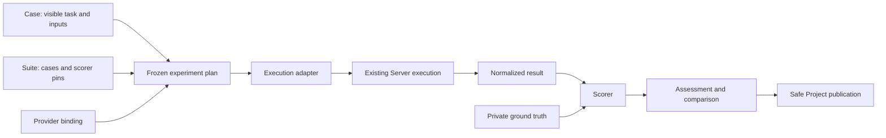

# 26 — Portable evaluation format and execution bindings

Status: **Implemented in playground-v2 and offline-verified through V41-008.**
The format, compatibility layer, execution bindings, recovery, assessment,
comparison and safe publication are delivered. The
[readiness report](../reviews/portable-eval-format-readiness.md) retains exact
implementation/schema pins and offline evidence. V38 Evals UX and V40 model
quality evaluations remain separate pending work; this delivery does not prove
instruction quality or a successful live target campaign.

This document owns the portable evaluation contract shared with `playground-v2`.
It supersedes the format choices in [the proposal](../agent-evals-proposal.md)
and the earlier V40 runner outline. [16](16-run-metadata-labels.md),
[17](17-projects-and-queue.md) and [19](19-audits.md) continue to own Contractor
execution, storage, identity and authorization. [V38](../../tasks/v38-001-evals-experience-contract.yml)
owns the eventual user-facing experiment/comparison journey; it consumes this
format rather than defining a competing identity or result envelope.

## 1. Ownership and first release

`playground-v2` owns datasets, hidden ground truth, suite definitions, experiment
planning, adapters, scorers, result serialization and comparison. Contractor
executes ordinary Workflows/Audits through public APIs. Its evaluation Projects,
Runs, artifact store, queue, retries and metrics are reused. No eval Scheduler,
direct database access, internal Contractor package import or per-case Server
process is introduced.

The implementation extends existing `playground_evals` modules. It retains the
current project/corpus/target manifests, source packager, scorers and upstream
oracles. A new format is not a new benchmark dataset or a new implementation of
all scorers. Current v1 suites and result files remain readable.

First release supports a Contractor execution provider with Workflow and Audit
bindings, plus a recorded-output provider used in conformance tests. The same
case and scorer must work with both. Provider configuration may describe real
differences in capability; the common contract must not require ADK, tool names,
Worker counts, Workflow stages or ArtifactStore namespaces.

External oracle protocols remain exact domain requirements. In particular,
WebExploitBench verification/judging must observe the same target instance under
the pinned CAGE contract. Portability does not replace that oracle with text
matching. Native annotated diffs may remain an explicitly required output format
for annotation-specific suites; ordinary trace-quality suites should consume
neutral trace evidence rather than require a particular comment syntax.

Implementation paths in V41 tasks refer to sibling `playground-v2` explicitly.
This specification stays canonical here until deliberately transferred; tasks
pin/copy it into a cross-repository handoff rather than maintain divergent specs.

## 2. Documents and immutable references

| Schema identity | Purpose | Publication |
| --- | --- | --- |
| `playground.case/v2` | One task, visible inputs, required capabilities/outputs, private expected data | Evaluator only; a visible projection crosses the adapter boundary |
| `playground.suite/v2` | Exact cases, scorer configuration, thresholds and required checks | Evaluator only; safe identity/digests may be published |
| `playground.binding/v1` | Provider selection and provider-specific execution/output mapping | Private authoring; publish an allowlisted resolved identity |
| `playground.experiment/v1` | Requested suites, variants, repeats and execution limits | Evaluator authoring |
| `playground.plan/v1` | Frozen, expanded experiment and expected member set | Private authority; a safe manifest projection may be published |
| `playground.submission/v1` | Durable per-member intent, receipt and recovery bookkeeping | Private authority; receipts may be projected |
| `playground.result/v2` | Observed execution and collected outputs, independent of quality | Portable record with a safe publication projection |
| `playground.assessment/v1` | Versioned scorer judgments over one exact result | Evaluator record; allowlisted score summary may be published |
| `playground.comparison/v1` | Expected denominators, pairing, completeness, quality and cost | Portable report and safe server projection |

Every document requires `schema_version`. Schemas are closed objects except
explicit provider/scorer configuration and namespaced `extensions`. Extension
data cannot change identities, execution state, denominators or score semantics.
Unknown schema versions fail with `schema_version_unsupported`; never guess v1
or silently discard required fields. New incompatible meanings require a new
schema identity. Optional additive extensions preserve existing meanings.

Authoring accepts JSON or a JSON-compatible subset of YAML: string object keys,
no custom tags, duplicate keys, aliases, non-finite numbers or implicit date
objects. Persist frozen records as UTF-8 JSON. JSON Schema plus semantic validation
is required: matching JSON types alone does not prove consistency or completeness.
Use the repository's JSON Schema 2020-12 dialect and a local schema registry;
validation must not fetch remote schemas or execute document-supplied code.

Common types:

- `Id`: 1–128 ASCII characters, `[a-z0-9][a-z0-9._-]*`; case-sensitive.
- `VersionedId`: `<Id>@<Id>`, at most 128 ASCII characters in total, for
  registered providers/scorers. Its version is opaque and matched exactly;
  the `@` separator is not accepted in ordinary member/case/variant IDs.
- `Digest`: `sha256:` followed by 64 lowercase hex digits.
- `DocumentRef`: `{resource, sha256}`. `resource` is a bundle-relative logical
  resource key, not an arbitrary host path or executable import.
- `BlobRef`: `{resource, sha256, media_type, size_bytes}`. Size is a nonnegative
  integer, digest covers exact bytes; physical/provider locators live in the
  resolver/adapter registry. Missing bytes are explicit, never an empty blob.
- Times: explicit UTC RFC3339 strings; durations: nonnegative integer milliseconds.
- Provider/scorer IDs use `VersionedId`, e.g. `contractor@1` or
  `openapi-coverage@1`. Registrations are local allowlists, not automatic imports.

Digests cover the **exact retained bytes**, not parsed YAML equivalence or a
cross-language canonicalization claim. A reserialization has a different digest.
Documents do not embed their own digest; referencing records/receipts carry it.
Mutable aliases may be used to author an experiment but are resolved before the
plan is frozen. An execution never follows a later `latest` input, suite or seed.
Source archives pin their produced bytes and packager/exclusion configuration,
not just the Git HEAD of a possibly dirty workspace.

Default format limits are 1 MiB per JSON/YAML document, nesting depth 32,
1,000 cases per suite, 16 variants, 100 repetitions, 10,000 expanded members,
128 input/output roles and 1,024 evidence refs per result. Validate the expanded
matrix before any submit. Scorer/provider configuration and failure messages
must fit within the enclosing document bound. Input/output blobs have separate
provider limits; the current Contractor artifact bound is checked by its adapter.
If both member count and byte limits cannot be met, split into explicit experiments;
never silently truncate a plan or comparison.

## 3. Case and suite

Required `case/v2` fields:

| Field | Contract |
| --- | --- |
| `id` | Stable case identity within a suite |
| `task` | `{kind, objective, parameters}`; kind is a domain identifier, parameters are bounded strings and carry no execution-provider fields |
| `inputs` | Map of logical role to exact `BlobRef`; only these inputs are visible to execution |
| `requires` | Unique versioned capability IDs, e.g. `source.archive@1`, `output.openapi@1` |
| `outputs` | Map of role to `{media_types, required}`; logical roles such as `document`, `report`, `trace`, `findings` |
| `evaluation` | Private `{ground_truth, assertions}` maps of logical roles to exact `BlobRef` |
| `provenance` | Dataset/source identity, exact revisions/digests and applicable subset/target/oracle refs |

An empty evaluation map is permitted only when the selected scorer does not
require expected data. A black-box case can provide public task/target descriptions
without providing target source. Target locators and lifecycle setup are resolved
by the evaluator's target service; private flags and oracle state are never task
inputs. Cases describe necessary capabilities, not how a Worker obtains them.

Build an explicit execution projection `{id, task, inputs, requires, outputs}`.
It contains neither `evaluation` nor raw project/corpus metadata. Adapters receive
only this projection plus their binding and target handle. Scorers receive
expected data separately. No upload path may serialize a full Case, Suite, Plan
or project manifest to the evaluated system. Source packaging must preserve
playground's existing truth-exclusion boundary.

Required `suite/v2`: `id`, `cases` (ordered exact Case DocumentRefs), `scoring`,
`provenance`. Duplicate case IDs or one ID resolving to different bytes in a
suite are errors. A suite groups cases with compatible output/scoring contracts;
experiments may combine several suites.

`scoring.checks` contains unique check IDs and, for each check:
`scorer` (exact version), `implementation_sha256`, `parameters`,
`ground_truth_role` (nullable), `required`, `allow_not_applicable` (default false).
The local scorer registration declares required output roles/media types,
accepted expected-data schema, metric definitions and `accepts_partial` (default
false). Provider statuses, tool counts and LLM names are not correctness criteria.
Domain conformance checks may explicitly require a particular output contract.

The suite decision is `all_required_pass`; at least one required check is needed.
Individual scorers may retain their documented weighted scalar metric; there is
no invented universal weighted score across unrelated suites. Parameter/threshold,
implementation, expected-data or validator/oracle changes produce a new pin and
cannot retroactively rewrite a previous assessment.

## 4. Binding and adapter contract

Required `binding/v1`: `id`, `provider`, `capabilities`, `connection`, `settings`,
`input_mapping`, `output_mapping`, `normalizers`. `connection` is a local credential
reference, never a token or credential-bearing URL. Generic schema validation
delegates `settings`/mappings to the selected provider's closed schema.

Mappings connect logical case roles to provider-specific inputs/outputs; all
required roles must resolve. Normalizers are allowlisted, versioned local functions
with pinned implementation digests. They may decode/project observed data and
preserve exact raw-evidence refs. They must not fabricate a finding, control,
verdict or missing artifact from hidden expectations.

Contractor settings use `mode: workflow | audit`; exactly one of `workflow` or
`audit_profile` must be present. Workflow selectors, AuditProfile name/version,
runtime labels, execution overrides, parameter mappings and artifact namespaces
exist **only here**, not in portable Cases or scorers. Keep runtime labels separate
from `eval.*` metadata. Current exact inputs, authorization and profile/task
authority rules apply unchanged.

Adapter operations:

| Operation | Required behavior |
| --- | --- |
| `preflight` | Resolve capabilities and exact effective config; report supported, unsupported or blocked with reason; no execution or target traffic |
| `prepare` | Produce visible input refs and persist a replayable submission intent; verify source/upload digests and exact revisions |
| `submit` | Submit that exact intent with its stable key; return opaque execution refs or uncertain outcome |
| `reconcile` | Recover an uncertain submission using that intent/key/authoritative receipt; never create a fresh sample implicitly |
| `observe` | Read authoritative execution state and available usage/evidence, with bounded pagination |
| `cancel` | Request cancellation; acceptance is not proof of remote termination |
| `collect` | Return normalized roles/evidence and completeness, including usable partial results on failure |

Common `ExecutionRef` is `{provider, connection_id, kind, id}` with opaque `id`.
Provider details belong in a private receipt. Core code and scorers do not parse
Contractor IDs or need to know how many child Runs an Audit created. Capability
IDs are versioned strings checked by provider/scorer registrations; an unknown
capability is unsupported, never silently ignored or auto-installed.
Binding capability claims must be checked against the registered adapter and
resolved provider configuration; an author cannot enable a capability by naming it.

The recorded-output provider supports the same interface and fixture result
contracts. Provider parity means unchanged case/scorer code over the same
observations, not an assertion that two different real systems behave identically.

## 5. Experiment, frozen plan and identity

Required `experiment/v1`: `id`, `suites`, `variants`, `repetitions`, `order`,
`budgets`, `comparison`, `publication`.

- `id` identifies one invocation, not a suite or remote Run. Editing a frozen
  experiment requires a new invocation ID.
- `suites`: exact Suite refs. `variants`: unique `{id, binding}` entries. A/B
  comparison requires exactly two variants in the first implementation; collection
  may support more but must not silently choose which pair to compare.
- `repetitions`: integer 1–100. `order`: `{kind: alternating | seeded_shuffle,
  seed}`; seeded_shuffle requires an integer seed. The plan records actual order.
- `budgets`: explicit `max_members`, `max_in_flight`, `wall_ms`,
  `max_observed_total_tokens` (nullable). No default permission to run without an
  execution budget. An authoring/validation command never starts an evaluation.
- `comparison`: `{baseline, candidate, required_equal, allowed_differences}`;
  explicit pin paths establish comparability rather than relying on variant names.
- `publication`: `{provider, connection, enabled}`; disabled/local publication
  must work for other execution providers without importing Contractor.

Required `plan/v1`: `experiment_id`, `created_at`, `experiment_ref`, resolved
`suites`, `variants`, `pins`, `members`, `execution_order`, `budgets`, `comparison`,
`publication`. Its exact JSON bytes are frozen before first submit. Each member
records `{member_id, suite_id, case_id, case_sha256, variant_id, sample,
binding_sha256, eligibility, reason}`. Samples are one-based integers.

Member identity is SHA-256 of UTF-8 JSON encoding of the array
`[experiment_id, suite_id, case_id, sample, variant_id]`, with no insignificant
whitespace. IDs have the ASCII restriction above, so identity encoding has no
Unicode/float ambiguity. Keep all 64 hex digits. A Contractor idempotency key is
`eval-` plus that digest; project/Audit create/start intents use distinct operation
suffixes within the provider's documented key bound.

The member matrix is expanded once, before submission. Eligibility is
`eligible | unsupported | blocked`; reasons are mandatory for the latter two.
Unsupported/blocked members remain in the expected denominator and capability
coverage report. Fixing a frozen eligibility/config/source mismatch creates a new
plan/invocation; it does not silently remove difficult cases. Transient transport
failure before a preflight completes leaves no executable plan.

Pins include dataset/ground-truth/scorer/normalizer/validator/oracle and source
bytes, target reset specification, model/provider identifier and exposed model
revision, sampling settings, resolved policy/budgets, tool declarations including
docstrings, instructions, Skill revisions and adapter/runtime build identities.
An unexposed model revision is explicitly unknown. Pin availability and evidence
origin (`observed | operator_supplied | unavailable`) are recorded per dimension.
An operator-supplied expected pin is not itself proof of the running provider.
Strict instruction A/B blocks when a required-equal dimension
cannot be established or has changed before submission; a declared exploratory
comparison retains unknowns and cannot claim that effect is isolated.

For instruction A/B, source, tasks, expected data, scorers, tools/docstrings,
Skills, model/sampling and effective budgets must match. Instruction bytes and
their dependent template/workflow/AuditProfile wrapper version/digest refs may
differ. Audit wrappers must preserve inventory, standards, evidence, execution
and interaction policy except for the explicitly changed child Workflow refs.
Compare the
resolved settings, not just catalog selectors. No raw secret or confidential
model request dump is required for this check; use safe metadata and digests.

## 6. Durable submission and recovery

The local experiment bundle is the evaluator authority: immutable plan/records
and a fsynced journal under an exclusive process lock. Server Runs/Audits remain
the authority for execution. Project artifacts are versioned publication copies,
not a second writable manifest authority. First release requires this bundle to
resume; reconstructing it from server labels/artifacts is unsupported. A copied
bundle must be handed over to one writer; shared-machine distributed writers are
out of scope. Same-key provider replay still protects against accidental duplicates.

Before each external mutation, persist `submission/v1` containing member ID,
plan digest, operation, stable idempotency key, exact request digest, secret-free
request payload/ref, and provider/connection identity. Credentials are resolved
at call time. Updates append immutable receipts/recovery observations; they do
not overwrite original intent. Snapshot/index replacement is atomic. An existing
key with changed request bytes is a conflict, not a retry strategy.

After a lost response, mark the submission `uncertain` and reconcile by identical
provider replay or an authoritative receipt lookup. Do not generate another key,
case/sample, WorkflowRun or Audit to hide the uncertainty. If the adapter cannot
prove/recover the outcome, stop that member with `submission_unknown`. Server
Stage retries and Audit child attempts stay inside the existing member; a new
statistical repetition is a different predeclared sample.

The runner has bounded client submission bookkeeping, not a second remote Run
state machine. It schedules no Workers and changes no provider retry policy.
Admission obeys `max_members` and `max_in_flight`. Wall/token observation limits
stop further submissions and request cancellation of owned active executions.
`max_observed_total_tokens` is an observation threshold, **not a guaranteed hard
spend cap**: usage may be delayed and in-flight work may overshoot. Preserve unknown
usage and report overshoot; hard per-Run policy limits stay with the execution
provider. Restart does not reset spent time/tokens or the original deadline.

Targets get explicit per-member lifecycle receipts and reset policy. Do not
reuse A's stateful target/session for B. A timeout is not proof a replay/Automate
job or target stopped; retain its receipt and actual cleanup outcome. Format
validation and the pre-live gate use recorded targets and deterministic stubs,
not model-driven target campaigns.

## 7. Execution result and assessment

Required `result/v2`: `experiment_id`, `member_id`, `plan_sha256`, `observed_at`,
`previous_result` (nullable DocumentRef), `execution`, `collection`, `outputs`,
`evidence`, `usage`, `provenance`, `diagnostics`.

`execution` contains opaque `refs`, `state`, `started_at`, `finished_at` and
`reason`. State is `not_submitted | accepted | running | succeeded | failed |
cancelled | unknown`. `finished_at` is null until provider terminal state is
confirmed. A local timeout/cancellation request produces a diagnostic and the
last known provider state (or unknown), not a fabricated terminal status.
Unsupported membership is in Plan eligibility, not a successful execution.

`collection` is `{status: complete | partial | unavailable, gaps}`. Completeness
refers to required output roles and their resolvable bytes; optional outputs do
not decide it. `outputs` maps logical roles to exact BlobRefs. `evidence` contains
bounded `{id, kind, blob, location}` entries. Locations use source-relative paths
and one-based inclusive line ranges, stable domain item keys, or opaque exchange
refs. A normalizer cannot synthesize a source location from a tool name.

Preserve raw output/evidence refs beside normalized data. Source citations must
refer to the pinned source snapshot. Scoring a post-annotation snapshot requires
its exact digest and explicit mapping, not silent reuse of changed line numbers.
Missing/invalid outputs remain explicit; a result can be collected from a failed
Run without asserting execution success. Later recovery produces a new result
revision linked by `previous_result`, preserving the earlier observation.

`usage` separates measures with `{value, unit, completeness, source_refs, scope}`.
Value is a nonnegative finite number or null. Completeness is
`complete | partial | unavailable`; unavailable requires null, and partial numbers
are lower/observed bounds, not full costs. Known zero requires complete observation.
Core measures: `input_tokens`, `output_tokens`, `total_tokens`, `cached_input_tokens`,
`model_calls`, `tool_calls`, `tool_failures`, `wall_ms`. Scope identifies the member
and included execution refs/attempts; it must include retries and all measured
planner/worker/finalizer work or state the missing portion.

`wall_ms` uses provider execution timestamps with a declared interval, preferably
creation/acceptance through terminal completion including provider queue time.
Do not mix it with evaluator packaging, polling, scoring or publication time;
those may be separate measures. Missing comparable timestamps make it unavailable.

Use authoritative cumulative totals once per execution/attempt; never add successive
poll snapshots. Audit parent/child counters must not be double-counted. Cached
input tokens are a subset, not an extra term in total tokens. Do not invent a
token price or monetary cost; an optional monetary measure pins currency, pricing
source/date and covered usage. Contractor `reportsComplete`/`truncated` propagate
into completeness. Its current MetricsSummary does not expose cached tokens.

Required `assessment/v1`: `id`, `member_id`, `result_ref`, `suite_ref`, `scorer_pins`,
private `expected_refs`, `created_at`, `checks`, `decision`. Checks contain
`id`, `status`, `metrics`, `failures`, `evidence_refs`. Status is
`pass | fail | not_applicable | not_scored | error`; reasons are required except
pass. Metrics declare name, finite value/null, unit, numerator/denominator when
applicable, and completeness. Score values are not mixed with execution usage.

Assessment decision over required checks has this precedence: `error`, then
`fail`, then `incomplete`, otherwise `pass`. Missing/not-scored checks and
disallowed not-applicable checks make it incomplete. Explicitly allowed N/A does
not create a factual positive result. Optional-check failures remain visible but
do not change the decision. Each scorer documents empty-denominator behavior;
for detection, zero expected positives means recall is N/A, while a clean fixture
still checks that there are no false positives. Never silently turn 0/0 into 100%.

Scoring incomplete output is allowed only for a scorer declaring `accepts_partial`.
Scorer errors do not rewrite provider state. Rescoring creates another immutable
Assessment against an exact Result and new scorer/expected pins; it never silently
updates an old score. Comparisons select assessment refs explicitly. An LLM judge,
if a suite deliberately uses one, is a separately versioned/pinned evaluator with
its own cost/provenance, not an implicit fallback in generic normalization.

## 8. Comparison and denominators

`comparison/v1` records experiment/plan refs, selected result/assessment refs,
baseline/candidate IDs, expected member counts, membership conflicts, eligibility,
execution/collection/scoring completeness, quality, paired differences, usage,
diagnostics and `conclusion: pass | regressions | inconclusive`. A conclusion
requires predeclared suite/experiment gates; missing required evidence or an
unresolved member conflict makes it inconclusive regardless of apparent averages.

Pair by `(suite_id, case_id, sample)`. Input/source/scorer pins and required-equal
execution dimensions must agree. Store per-family/per-suite denominators before
any overall view. Never silently compare only successful runs or the first page.

Report separately for each arm:

- expected, eligible, unsupported, blocked, submitted, terminal, missing,
  conflicting, collection-complete, scored and quality-passed member counts;
- execution success = succeeded / expected;
- end-to-end pass = eligible + succeeded + complete required outputs + passing
  assessment, counted once per member, divided by expected;
- conditional quality among fully scored members, with its explicit denominator;
- paired count for each comparison dimension and excluded-pair reasons.

`pass@N` may be a separately labelled secondary metric; it cannot replace
per-attempt results. There is no silent retry/resample exemption from the expected
denominator. Two distinct provider executions claiming one member are a conflict
until explicitly adjudicated by receipts; neither last-write-wins nor best-score
selection is allowed. A Run with matching labels but no matching intent/receipt
is quarantined as unassociated and cannot prove membership.

Compare quality only where both assessments support that dimension. Cost/latency
comparison requires matching measurement scopes and complete values in both arms;
include technical failures when those measurements are known. Report excluded
counts and observed partial values separately. Report p50/p90 using nearest rank
`ceil(p * n)` of sorted values for n > 0, otherwise null. Totals always state the
covered member count; incomplete totals cannot support a cost-saving conclusion.
Any confidence calculation records its method/sample size; the small pilot makes
no default claim of statistical significance.

## 9. Contractor transport and publication

Workflow mode reuses evaluation Projects and
`POST /v1/projects/{project_id}/runs`. Both variants use the same exact input bytes,
with distinct immutable Workflow/AgentTemplate versions where instructions change.
Upload/source reuse must resolve and verify exact revisions; a versionless ref
after a create-only conflict is insufficient. The existing
`put_exact_project_artifact` helper provides the basis for that check.

Labels are `purpose=eval`, `eval.name`, `eval.id`, `eval.leg`, `eval.fixture`,
`eval.case`, `eval.sample`; values follow the server's bounds. Labels are indexes,
not uniqueness, execution configuration, score storage or authority. The adapter
follows every page and uses authoritative receipts for membership. Sample outputs
come from exact RunScope outputs. Project `outputs/<slot>` is a create-only
publication convenience and does not identify each sample's output.

Audit mode calls ordinary Audit create/start/observe APIs and the real importer.
It does not forge trusted task/manifest inputs or bypass the Audit controller.
Collect every item/child Run page and map normalized item keys to authoritative
Audit refs in the adapter. Preserve existing stable-subject/ordinal matching;
do not replicate Contractor's canonical operation-key algorithm in a scorer.
If child eval labels are unavailable, use receipt membership; label propagation
is not a prerequisite. Existing Audit runner Project-kind behavior is retained
where required; an evaluation Project may index its references without pretending
the child Runs have a different membership. `audit-results@1` and the opt-in V39
completion versions are different bindings/experiments, not mixed samples.

Publisher takes an explicit allowlisted projection, not a raw `asdict` of private
records. It writes schema-versioned JSON/Markdown to non-reserved namespaces such
as `eval-manifests`, `eval-results`, `eval-assessments`, `eval-comparisons` using
existing owner Project artifact APIs. It must omit expected-data refs/paths/bytes,
secret-bearing requests/locators, credentials and raw private bindings. Source,
result/config digests, safe judgments and exact public execution refs may remain.
Projection has its own digest and a `source_record_sha256` linking it to the
private record; do not claim identical bytes when fields were removed.

Use content-addressed create-only artifact names within server limits. Exact replay
verifies bytes/digest/media type after a conflict; a different body at the same
name fails explicitly. A per-experiment index may advance with exact revision CAS
after all referenced records are durable. Lost write response is reconciled, not
blindly retried with a new logical identity. Publication failure leaves valid local
results and a pending receipt; resume publication without repeating model execution.
Publication is not score acceptance or execution completion.

No new Server eval endpoint or global aggregate query is required for the bounded
first release. Existing owner isolation, deletion and retention rules apply to
all published Project artifacts. Deleted/unavailable evidence makes a later
comparison explicitly incomplete; a cached score cannot silently recreate proof.

## 10. v1 compatibility

Converters are local, deterministic and side-effect free. Preserve original bytes
and their digest; never overwrite a v1 file in place or silently change its score.

| Existing data | v2 handling |
| --- | --- |
| `project/v1`, corpus/target manifests | Retain; materialize cases and source refs through existing loaders/packagers |
| `suite/v1` with workflow/adapter fields | Convert portable selection/scoring plus a generated explicit provider binding; preserve original suite provenance |
| `contractor-v2-audit` suite | Contractor provider, mode audit, exact profile and current input mappings |
| `result/v1` `contractor_*` IDs | Opaque provider execution refs; keep all child refs and source record digest |
| v1 `outcome=passed|failed` and scalar score | Preserve as a legacy assessment, not inferred provider success/failure |
| v1 `harness_error` | Diagnostic/legacy evaluator error, provider execution state unknown unless independently evidenced |
| Missing experiment/sample/usage/pins | Explicit unknown/legacy-unpaired; never derive sample identity from timestamps, array order or a random local run ID |

Legacy records can be displayed/scored under their legacy provenance, but cannot
enter strict paired A/B without explicit member association backed by receipts
and the required pins. An operator-supplied association is a new, attributed
record, never an unnoticed migration guess. Existing CLI commands remain usable
through the compatibility path. Unsupported legacy extension data is retained
privately and reported as such rather than lost or guessed.

## 11. Worked example and failure walkthrough

Illustrative data, not a runnable benchmark: suite `trace-small`, cases
`unsafe-query` and `safe-query`, two samples, variants `a` and `b`. The frozen
matrix has 8 members. Source/scorer/model/tools/Skills match; instructions differ.

| Case | Sample | A | B |
| --- | ---: | --- | --- |
| unsafe-query | 1 | succeeded, quality pass, 80 tokens | succeeded, quality pass, 70 tokens |
| unsafe-query | 2 | succeeded, quality pass, 100 tokens | not submitted after client interruption |
| safe-query | 1 | succeeded, quality pass, 50 tokens | succeeded, quality fail (false positive), usage unavailable |
| safe-query | 2 | failed, not scored, 45 tokens | succeeded, quality pass, 60 tokens |

Expected per arm is 4. A has 4 submitted/terminal, 3 scored/passed, execution and
end-to-end pass 3/4. B has 3 submitted/terminal/scored, 2 quality-passed,
execution success 3/4 and end-to-end pass 2/4. Conditional quality is 3/3 versus
2/3 and must not hide A's failed Run or B's missing member. There are 3 pairs
with terminal execution observations, 2 with fully scored quality, and 2 with
complete comparable token usage (unsafe-query sample 1, safe-query sample 2).
B's observed token sum 130 covers only 2 of 4 expected members; it is not evidence
of lower total experiment cost. The overall conclusion remains inconclusive.

Failure cases to freeze as conformance fixtures:

1. **Partial launch:** resume verifies the immutable plan and journal; submit only
   the unsubmitted member, preserving all existing sample IDs/results.
2. **Lost create response:** intent was fsynced before POST; replay the exact body
   and key, retain the same Run ID. Changed body/key is rejected locally.
3. **Duplicate labels:** an unrelated Run matches `eval.*` but has no valid receipt;
   quarantine it. Two authenticated receipts claiming one member create a conflict
   and block that pair, without choosing the better result.
4. **Unknown usage:** B safe-query sample 1 remains unavailable, not zero. Later
   authoritative recovery creates a new Result revision and a new Comparison.
5. **Scorer/validator failure:** record evaluator error separately from a succeeded
   Run; retain artifacts and retry scoring under a new Assessment without rerunning
   the model. An unavailable CLI is not a clean document.
6. **Changed source/Skill/policy:** required pin differs at resume/pre-submit;
   fail with `pin_mismatch`, do not silently continue the old experiment.
7. **Publication conflict/lost response:** recover exact public projection and
   index CAS, without overwriting another experiment or repeating execution.
8. **Ground-truth marker:** a sentinel in hidden expected files must be absent from
   archives, execution projections, adapter requests and server publication bodies.
9. **Unsupported capability:** keep that member and reason in capability coverage
   and expected denominator; no submission or silently reduced suite.
10. **Local observation timeout:** retain remote running/unknown state and cancel
    receipt; never assert that the remote action was undone or stopped.

Core diagnostics include `schema_version_unsupported`, `invalid_document`,
`pin_mismatch`, `capability_unsupported`, `submission_unknown`,
`submission_conflict`, `member_conflict`, `output_missing`, `output_invalid`,
`scorer_error`, `usage_incomplete`, `publication_conflict`. Codes are stable;
bounded explanatory text is not a machine-readable matching contract.

## 12. Delivery gate before evaluations

V41-001–008 deliver schemas, typed records, converters, adapter separation, frozen plans,
recovery, scoring/comparison and publication using **offline/recorded fixtures and
deterministic API conformance tests**. It does not run paid/model quality evals,
launch benchmark campaigns, publish candidate default configurations or change
running Audits. Ground-truth sentinels and fault fixtures are mandatory.

Delivered commands in `playground-eval experiment`:

- `plan --spec FILE --environment FILE --out DIR`: resolve/validate and freeze;
  read-only provider preflight must resolve required pins before execution.
- `run --plan FILE --environment FILE`: execute the selected frozen plan.
- `resume --plan FILE --environment FILE`: reconcile the same durable intents
  and observations, without creating an implicit replacement sample.
- `compare --plan FILE --selection FILE --environment FILE`: derive a comparison
  from explicitly selected retained records.
- `publish --plan FILE --selection FILE --environment FILE --project ID`:
  publish or resume safe projections; `--initialize-local` explicitly initializes
  a local publication target. Connections remain environment-local.

Assessment is available through the Python API; a generic assessment CLI is not
part of this delivery. Contractor and recorded execution adapters and local/
Contractor publication are implemented. Live target/oracle integrations, complete
live environment pins and measured instruction adoption remain outside the
offline evidence; the readiness report records those limits.

`validate` continues checking existing catalogs and gains v2 format support.
Invalid plans, missing required live settings and incompatible schemas fail
explicitly; an explicitly requested execution cannot silently skip and pass.

The completed release gate covers schemas/examples/negative fixtures, old v1 readers,
one unchanged case/scorer across Contractor and recorded providers, complete fault
walkthroughs, owner-safe publication and stable comparison arithmetic. It records
exact implementation/schema/scorer build digests in the readiness report. Those
pins identify the tested revision, including its retained specification bytes.
V41-008 has passed; V40 may prepare instruction fixtures/bindings and a frozen
pilot plan, but those tasks are still pending. V40-003 remains the separate future
model-evaluation task with its own explicit budget and environment. Compatibility passing is not evidence that new
instructions improve model quality.
