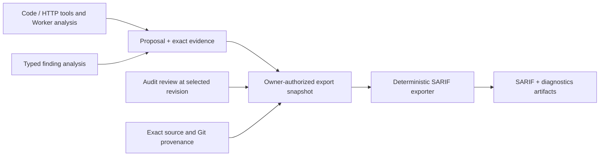

# 28 — Structured finding analysis and SARIF export

Status: **Draft; Specified target; not implemented.** Existing findings, collections,
code-analysis, annotation and HTTP tools retain their published contracts.

Depends on: [03](03-artifact-plane.md), [10](10-runtime-filesystems-and-edit-tools.md),
[11](11-http-and-caido-tools.md), [12](12-code-analysis-tools.md),
[13](13-taint-annotations.md), [19](19-audits.md),
[24](24-git-artifacts.md), [27](27-findings-tools-and-collections.md).

## 1. Ownership and decisions

This document owns portable structured analysis attached to a finding,
resolution against exact evidence, and deterministic SARIF 2.1.0 export.
Audit admission, review, duplicate decisions, coverage, Workflow execution and
Runtime placement remain owned by their existing contracts.

The design has three boundaries:

1. A producer publishes a proposal and exact evidence through `finding(...)`.
   An optional typed analysis document describes locations, paths and HTTP
   exchanges using that evidence.
2. An owner-authorized Server service freezes an explicit selection, applicable
   review revisions, evidence and source provenance into an export snapshot.
   It resolves identities and validates references before rendering.
3. A pure Go exporter transforms the frozen snapshot into SARIF. It performs no
   model reasoning, source discovery, tool execution, network access or review
   mutations. API, CLI and UI share this service.



The interchange target is [SARIF 2.1.0 with Errata 01][sarif]. A separate
`github-code-scanning` profile applies the documented [GitHub consumer
restrictions][github-sarif]. Generic validity does not imply consumer suitability.

## 2. Existing data and matching boundaries

| Existing producer or record | Available data | Permitted use and missing information |
| --- | --- | --- |
| FindingProposal v1 | Title, description, subject, standard references, severity suggestion, evidence links | Describes an observation. Subject keys/prose are not file locators or rule identities. |
| Audit finding and decision | Finding/review revisions, state, applicable analyst rating, duplicate target | Supplies triage at one revision; does not rewrite proposal claims. |
| FindingCollection v1 | Exact proposals/evidence, receipts, captured review IDs/state | Reuses retention and explicit selection. It does not contain full decisions or analyst severity. |
| `source-analysis@1` | An explicitly opened archive, paths and line windows | Resolves against that exact archive. A search hit is not a resolved symbol or data-flow edge. |
| Shallow `code-analysis@1` | Definition path, name, lines, column, language and parser node type | Describes a declaration in an effective workspace snapshot, not necessarily the vulnerable expression. |
| Trailmark graph tools | Allocation-local symbol IDs, symbol locations, call relationships and bounded paths | Provides call-graph evidence. Reachability does not establish argument propagation, sanitizer behavior or exploitability. |
| `taint-annotations@1` | Structured comments and declaration/annotation lines after mutation | Preserves Worker assertions. Comments alone do not establish an ordered source-to-sink path. |
| `http-tools@1` | Session response metadata and exact response-body artifacts | Retains body bytes; allocation history/request IDs are not durable exchange identities. |
| `caido@1` | Request/response projections and retained raw exchange artifacts | Requires an exact artifact and versioned decoder; external request IDs remain provenance. |
| Git artifact import | Exact source version, repository URL and resolved commit | Attribution follows version lineage; equal content digests do not merge repository identities. |

Every join uses an explicit identity: receipt, contribution, exact artifact
revision, document-local location ID or edge endpoints. Bare symbol names,
basenames, similar descriptions, equal CWE values, shared Runs and private
graph IDs never create durable relationships.

## 3. Compatible typed analysis evidence

Keep `contractor.audit.finding-proposal.v1`, `security-findings@1/@2` and
`contractor.findings.collection.v1` byte contracts unchanged. Introduce an
ordinary evidence document:

```text
media type: application/vnd.contractor.finding-analysis+json
schema: contractor.finding.analysis.v1
```

A proposal may reference zero or one such document. It and all its dependencies
must be explicitly present in that proposal's `evidence_refs`. Existing Artifact
tools can author the document. Optional Runtime capture helpers may automate
authoring without making source workspaces mandatory for `finding(...)`.

Dependencies use exact ArtifactRefs, not `evidence-1` ordinals: intake assigns
ordinals after sorting the complete evidence set. Publish dependency artifacts,
then analysis, then call `finding(...)` with all refs. The resolver maps refs
through the containing receipt's evidence table. The document cannot choose
another scope, grant access or cause recursive external fetches.

Existing immutable receipts are never enriched in place. A legacy proposal can
be exported as it is, or a new proposal can carry structured evidence and become
an explicit contribution/presentation choice under the existing Audit contract.

Analysis is a producer claim. Schema validity, matching file digests and a
Server-produced export establish structural consistency and provenance, not
the truth of the vulnerability. User-supplied bytes cannot mint trusted tool
observations or analyst decisions.

### 3.1 Document shape

Objects are closed. Unknown keys/versions, duplicate JSON keys, invalid Unicode,
non-finite numbers and dangling references fail. IDs use the Audit identifier
grammar, except `Rule.id`, which also permits `/` and is at most 160 ASCII bytes.
Optional fields are omitted; required arrays remain arrays when empty. Persist
new analysis documents as RFC 8785 canonical JSON.

| Object | Fields |
| --- | --- |
| Analysis | `schema`, `client_key`, `sources`, `locations`, `flows`, `http_exchanges`; optional `rule`, `primary_location_id`, `primary_http_exchange_id`, `correlation_key` |
| Rule | `id`, `version`, `name`, `description`; optional `help_uri` |
| Source | `id`, `kind: archive\|file`, exact `artifact_ref` |
| Location | `id`, `source_id`, `path`, `file_digest`; optional `region`, `symbol` |
| Region | `start_line`; optional `end_line`, `start_column`, `end_column` |
| Symbol | `name`; optional `qualified_name`, `language`, `kind`, `signature` |
| Flow | `id`, `kind: call-path\|data-flow\|execution-trace`, `description`, `completeness: complete\|partial`, `steps`, `edges`, `gaps`, `evidence_refs` |
| Step | `id`, `roles`, `message`, `evidence_refs`; optional `location_id`, `value`, `value_state` |
| Edge | `from`, `to`, `relation`, `basis: producer-asserted\|tool-reported`, `evidence_refs`; optional `argument_binding` |
| Gap | `after_step_id`, `before_step_id`, `reason` |
| HTTP exchange | `id`, exact `evidence_ref`, `decoder`; optional `operation`, `implementation_location_id` |

`client_key` equals the containing proposal's client key; the receipt supplies
authoritative invocation identity. Array IDs are unique within their containing
object. Both primary IDs must resolve when present. `correlation_key` is an
optional stable producer-defined issue discriminator, at most 160 bytes; it
does not authorize deduplication.

`Rule.id` denotes the check/issue family, for example `contractor/sql-injection`.
It is stable across Runs; finding ID, Workflow version, title and subject key
are separate. `Rule.version` identifies the definition. Pinned producer
configurations supply this metadata. Different definitions for one rule ID in
an export fail with `rule_definition_conflict`; the exporter does not invent
another ID to hide the conflict. `help_uri`, if present, is a bounded absolute
HTTPS documentation URI without userinfo and is never fetched during export.

Absent rules use the built-in `contractor/unclassified` descriptor. Standard
references remain classifications; a CWE number or prose does not implicitly
select a rule. Versioned mappings are covered in section 7.

### 3.2 Source and coordinate contract

An archive source references exact retained ZIP bytes admitted by the existing
source-archive validator. `Location.path` selects a regular member. A file
source references exact UTF-8 bytes; its path is a logical producer-supplied
path with no implicit repository attribution. Both refs are selected evidence.
`file_digest` is SHA-256 of exact file bytes, distinct from the ZIP digest.
All locations of one file source must agree on its logical path. Source identity
includes artifact scope/version; equal file bytes from different sources remain
distinct unless that exact source identity is shared.

Paths are relative, case-sensitive POSIX paths. Reject absolute paths, drive
prefixes, backslashes, control characters, empty/dot/dot-dot components and
archive symlinks. Preserve case and Unicode spelling, independently of the
exporting host. URI encoding escapes path components, including spaces, `#`
and `%`, without changing their source identity.

Lines and columns are one-based. Columns count Unicode code points and end
columns are exclusive. An absent end line means the start line when columns
are present. An end column requires a start column. Coordinates must be ordered
and fit the exact text or its valid exclusive end position. Empty files may
have file locations but no invented line 1. CRLF is one terminator and tabs are
one code point, not display width. Emit `run.columnKind: unicodeCodePoints`.

Adapters must specify upstream coordinate conventions. Tree-sitter byte columns
require decoding the exact UTF-8 line before conversion. Trailmark column units
require a pinned-adapter fixture; unproven columns are omitted with a diagnostic.
Do not copy zero-based columns directly. A definition location cannot be
relabeled as an exact sink expression or call argument.

Resolution is deterministic:

1. Resolve the source in the containing receipt; check recorded digest, media
   type and size against actual bytes.
2. Resolve the exact file/member without searching other archives/directories.
3. Check the file digest, UTF-8 and region bounds.
4. Retain supplied symbol metadata as descriptive context. It cannot override
   contradictory physical coordinates or establish a call edge.
5. Freeze the validated location and exact source identity.

Absent coordinates stay absent. Supplied invalid coordinates fail; they never
trigger a guessed fallback location.

### 3.3 Effective workspaces and annotations

ZIP digest, file digest and `WorkspaceSnapshot.digest` are different identities.
Graph IDs are bound to the effective workspace and erased on release. Resolve
them while valid into portable file/symbol projections; never persist them as
the identity of a finding location.

Before publishing workspace evidence, retain the exact source representation
the observation describes. After edits, the initial Run input is not necessarily
that representation. A copied tool response remains producer-supplied unless
a trusted capture adapter records tool/version, normalized arguments, snapshot,
bounded output and coverage at the operation's snapshot boundary. Current
model-facing graph responses are not durable observation receipts.

Annotations shift lines. Post-insertion coordinates address the annotated
source; earlier graph locations address the earlier snapshot. First release
performs no diff, line-offset, fuzzy-symbol or basename remapping. The producer
retains pre-edit source/coordinates or exports annotated source as its own root.
A future source-map adapter must verify both endpoint digests and mappings
before attributing edited coordinates to an original commit.

## 4. Structured source-to-sink paths

### 4.1 Path kinds and edge claims

`call-path` records reachability through call edges, including `paths_between`
and `entrypoint_paths_to` results. Declaration locations can describe this path,
but do not establish argument propagation.

`data-flow` records a claimed transfer of a particular value between expressions
or parameters. Steps identify input, propagation, transformations, checks and
sink argument as available. An optional `argument_binding` is
`{caller_value, callee_parameter}` with bounded descriptive strings. Equal
variable names or adjacent calls do not create this binding automatically.

`execution-trace` records a sequence from retained instrumentation/execution
evidence. A static call path or unrelated HTTP requests ordered by time cannot
be reclassified as an execution trace.

Step roles are `source`, `propagation`, `call`, `return`, `validation`,
`sanitizer`, `sink`, `observation`. Optional `value_state` is `unknown`,
`tainted`, `derived`, `validated` or `clean`. Neither `validated` nor a sanitizer
role establishes safety; preserve the claimed effect and limitations in the
step message and evidence.

Edge relations are `call`, `return`, `argument`, `assignment`, `transform`,
`control` or `observation`. A `tool-reported` basis requires retained output
from a recognized versioned decoder that reports that relation. A plain copied
document still has producer-supplied origin unless capture provenance is trusted.
Tool edge confidence does not become finding confidence or confirmation.

### 4.2 Connectivity, ambiguity and completeness

Steps are ordered. Each adjacent pair has exactly one explicit edge or gap;
edge/gap endpoints are consecutive step IDs. Branches and alternative paths
are separate Flows. Repeated visits to one location use distinct step IDs,
allowing loops without changing location identity.

A complete data-flow starts with a located source, ends with a located sink,
has evidence for every edge and contains no gaps. These are structural
requirements, not proof of the claimed semantics. Missing dispatch resolution,
required argument binding or coordinates makes that portion partial and explicit. An
unlocated step has gaps to its neighbors and cannot bridge located steps.
For other kinds, complete describes the represented sequence, not whole-program
or whole-Audit coverage.

The exporter never discovers a missing edge or chooses an overloaded function
by name. Original coverage/truncation flags remain limitations. A bounded list
can contain complete individual paths while being incomplete as a list of
alternatives.

For `handler -> service -> execute`, the baseline Trailmark projection is a
call path. A data-flow additionally identifies the request value, actual/formal
bindings, transformations and sink argument with explicit evidence. A retained
`@trace` comment supports a claim; `calls=execute` alone cannot resolve an
overloaded callee or prove that a particular value reaches it.

### 4.3 Rendering paths and primary locations

A complete located sequence of at least two steps becomes one `codeFlow` with
one `threadFlow`. Step order supplies `executionOrder`, starting at 1. Preserve
native flow kind and evidence basis in Contractor properties. Step roles map
to `kinds`; messages retain validation/sanitization qualifications. A single
located step remains a related location and native flow record.

Split partial paths into contiguous located segments at gaps. Segments of at
least two steps may become separate code flows, visibly labeled as partial
segments. Isolated locations remain related locations. Retain the complete
native path/gaps and an incomplete-trace message. Never connect the two sides
of a gap for presentation. Diagnostics distinguish segment counts from findings.

`primary_location_id` explicitly selects the result location. Taint producer
instructions should choose the actionable sink expression, or the vulnerable
entry point when that is where the fix belongs. The exporter never chooses
the first graph node, final declaration or first evidence file automatically.
Other validated relevant locations become related locations.

### 4.4 Matching existing taint annotations

An annotation adapter reads exact retained source and uses the structural
declaration/adjacent-block rules from [13](13-taint-annotations.md). Its target
is `(source identity, path, declaration, explicit trace target)`. A bare symbol
or comment elsewhere in the file cannot select a declaration. Multiple targets
on one declaration remain separate analysis contexts.

| Annotation data | Native projection | Additional evidence required |
| --- | --- | --- |
| `@trace target=...` | Explicit analysis context, retained as explanatory evidence | The target string alone does not identify a repository, source expression or rule. |
| `args=name:state` | Step `value` and `value_state` claim at that declaration | Caller-to-parameter transfer needs an explicit binding and location. |
| `calls=...` | Claimed relevant callees | Resolve each callee explicitly; list order does not establish a sequential data-flow or unique overloaded target. |
| `@validate arg=... kind=...` | Validation step with argument and claimed check in its message | Evidence must establish the relevant predicate/effect; syntax does not prove safety. |
| `@sink kind=... arg=...` | Sink role, value and claimed sink category | Select the actual sink expression when available; no automatic CWE or rule assignment. |

Marker/declaration coordinates belong to the annotated file. Precise expression
coordinates require a retained structural or source observation, and joining
another snapshot still follows section 3.3. Parsed comments remain producer
assertions even when the annotation tool originally inserted them successfully.

## 5. HTTP, OpenAPI and non-code findings

An exchange references retained evidence and an exact code-backed decoder ID.
Initial decoder implementations cover the current HTTP body and Caido exchange
envelopes, with fixtures for their media types and schemas. Unknown decoders
fail instead of invoking heuristic text parsing.

The HTTP body decoder exposes only available response fields; a body artifact
does not recover the request, session credentials or headers. Caido parsing
preserves truncation/malformed-data limitations; a preview never becomes a
complete exchange. Multiple exchanges remain distinct. Only an explicit primary
exchange supplies the result's `webRequest`/`webResponse`.

Optional `operation` is `{document_ref, pointer, method, path_template}`. The
exact OpenAPI document is selected evidence; its JSON Pointer must resolve to
the supplied method/path operation. An `operationId` in the source document is
descriptive, not a globally unique join key. The exchange-to-operation relation
remains a producer assertion unless a retained versioned matcher establishes it.
Target/deployment markers, source commit and specification revision remain
separate facts.

`implementation_location_id` explicitly links the exchange to a validated code
location. Handler names, paths and operation IDs never infer this relation.
HTTP target, specification location and implementation location are distinct.
An OpenAPI physical region requires coordinates in that exact document; a JSON
Pointer alone does not supply YAML line numbers.

Generic export supports HTTP-only, configuration, architecture and missing-
evidence findings without code coordinates. An arbitrary evidence file cannot
become a primary code location merely to satisfy a consumer.

The first HTTP projection includes method, sanitized URI, response status and
content type when known. It excludes bodies, query values, userinfo and
credentials/cookies. Record omitted field names and reason codes, never removed
values. Full exchanges remain ordinary access-controlled evidence. Export does
not query Caido or replay requests. Authored finding text is not claimed to be
automatically secret-free.

## 6. Frozen selection, presentation and identity

Reuse [27]'s owner checks, exact resolution, contribution expansion,
repeatable-read capture and atomic artifact publication mechanisms. A v1
collection alone is not a reviewed export snapshot: decision IDs do not contain
analyst severity/rationale, and one receipt can have reviews in several Audits.

Schema `contractor.findings.export-snapshot.v1` freezes:

- normalized request, snapshot time, exporter version and profile/policy versions;
- one typed result identity per selected Audit finding revision or direct
  receipt, and exact expanded contribution membership;
- presentation proposal/analysis, original text and exact refs/digests;
- trusted receipt/verification origins, including Run/invocation, Workflow
  version and resolved closure digest when available, independently of the
  exporter version and producer-supplied instrument claims;
- applicable review state, verdict, analyst severity, decision/rationale and
  assessment identity, preserving absence;
- resolved locations, source/file hashes, origin lineage and trusted Git
  metadata captured from exact artifact versions;
- rule definitions, classification mappings, native flow/HTTP data, rendered
  projections, limitations, diagnostics and provenance/evidence references.

The snapshot contains all rendering inputs. Re-rendering never reads current
reviews, mutable bindings or current source. Raw evidence refs remain provenance,
not promises of eternal availability or implicit download capabilities. All
selected evidence must be readable and validated before freezing the snapshot.

### 6.1 Findings, contributions and receipts

One Audit finding yields one result regardless of contribution count. Its
`FirstProposal` is the default presentation proposal. A request may select an
explicit contributing receipt instead; membership and revision are validated
together. That proposal supplies title, description, rule, main location and
paths. Other contributions remain supporting evidence/provenance and never
silently replace presentation fields or append conflicting paths. The selected
finding's applicable decision supplies triage.

A directly selected receipt yields one proposal result with receipt identity.
It has no invented finding ID or authoritative review. Other Audit reviews may
remain observations, but none is implicitly chosen as its effective decision.

Explicitly selecting both a receipt and its containing finding yields two
differently typed results; UI displays the overlap. Duplicate explicit selectors
are invalid under collection request rules; shared receipts in contribution
expansion are retained once and linked to each selected finding. Similar content
does not deduplicate distinct selected identities.

A duplicate finding retains its ID and target link. Selection does not select
its target implicitly, copy the target's rating or turn it into another confirmed
vulnerability.

### 6.2 Repository attribution and correlation

Generic output supports multiple deterministic virtual source roots derived
from exact source identity, with no Runtime host paths. Plain file artifacts
and ordinary uploaded archives have no inferred Git identity. Populate
`versionControlProvenance` only from trusted Git import/fork lineage of the exact
source version, captured in the snapshot.

For generic output, a root key is SHA-256 of the RFC 8785 array
`[scope.kind, scope.id, ref.namespace, ref.name, ref.revision, source.kind,
artifact_digest]`. Its base URI is `contractor-source://<hex-root-key>/`.
Declare bases in `originalUriBaseIds`; file URIs are relative paths paired with
their root's `uriBaseId`. These are logical addresses, not endpoints to fetch.
The GitHub profile uses a single synthetic `file:///src/` base for its explicitly
bound repository and keeps the original source identities in properties.

Generated/annotated archives do not inherit a commit by sharing a Run or paths.
First release requires verified exact-version Git origin for repository
attribution; edited workspace attribution and source maps are deferred.
Repository identity uses [24]'s normalized URL; SSH/HTTPS aliases do not become
equal by guessing. Any future alias mapping must be explicit and versioned.

Native result IDs, grouping hints and consumer fingerprints have distinct jobs.
Finding/receipt IDs and revisions stay in Contractor properties. Run/allocation
IDs never identify issues across scans, and fingerprints never mutate Audit
duplicate relations.

Emit generic fingerprint `contractor/issue/v1` only when the producer supplies
`correlation_key` and there is a stable repository and rule identity. Hash the
RFC 8785 array `["contractor/issue/v1", repository_identity, rule_id,
correlation_key]` with SHA-256. The key must distinguish independent issues
sharing subject, CWE or sink. Without it, omit this fingerprint and report
`fingerprint_unavailable`. Commit, source digest and line numbers are excluded
from this cross-scan key. It remains a correlation hint, not proof of identity.

## 7. Rule, rating and SARIF mapping

This table defines Contractor's projection policy; [SARIF][sarif] owns the
underlying object definitions.

| Contractor data | Export field/policy |
| --- | --- |
| Export implementation | `tool.driver.name = Contractor`, actual exporter version |
| Stable check definition | `tool.driver.rules[]`, `result.ruleId`, matching `ruleIndex` |
| Title, description, limitations | `message.text`; optional equivalent Markdown |
| Explicit primary location | `locations[0]` |
| Other relevant locations | `relatedLocations`, stable result-local IDs |
| Portable symbol | Location `logicalLocations`, known descriptive fields only |
| Exact file hash | `artifacts[].hashes["sha-256"]`, without the `sha256:` prefix |
| Native paths | `codeFlows` under section 4; explicit unresolved data |
| Primary HTTP exchange | `webRequest` / `webResponse` under section 5 |
| Known versioned classifications | `taxonomies` / `taxa`; original tuples retained |
| IDs, review, evidence, native details | Namespaced `properties.contractor` |

Preserve hypothesis, preconditions, proposed checks and limitations from the
complete original proposal in Contractor properties; messages include the
relevant explanatory text. Evidence references include exact scope/ref/digest
and origin, not just a mutable artifact name. Generated Markdown escapes link
labels and uses only validated documentation or explicitly configured UI URLs;
it does not publish credentials or signed access tokens in evidence links.

Classification adapters preserve `(scheme, version, requirement_id)`. CWE and
ASVS may both classify one finding. Unsupported tuples remain original refs
with `classification_unmapped`; do not guess or discard them. Include referenced
taxonomy entries with identities/versions, without embedding entire catalogs.
Classification does not assert causal checklist origin; only trusted Audit
backtrace establishes that origin.

The generic review/level policy is:

| Selected result | `kind` | `level` |
| --- | --- | --- |
| Confirmed, applicable analyst severity present | `fail` | informational/low → `note`; medium → `warning`; high/critical → `error` |
| Confirmed, applicable analyst severity absent | `fail` | `warning` with `severity_unrated`; native rating absent |
| Proposed, needs-evidence, rejected or duplicate | `review` | `none` |
| Direct proposal receipt | `review` | `none` |

Native state, verdict, rating and the distinct proposal `severity_suggestion`
remain visible in the message and Contractor properties. Proposal severity is
never an analyst rating. The unrated display default does not store a medium
severity. Rejection is not a successful check, and duplication is not a new
confirmed failure.

Do not infer `suppressions`, `baselineState`, fixes or pass results from triage.
They require separate suppression, comparison, remediation or check-result
contracts. Exporting confirmed findings does not establish that other items
were tested or passed.

## 8. GitHub Code Scanning profile

The profile applies [GitHub's supported subset][github-sarif] separately from
generic schema validation:

- Pin one target repository, full commit and stable analysis category. All
  results must be confirmed, with primary source location/start line in that
  repository at that commit.
- Referenced physical code-flow/related locations must resolve in that target.
  Cross-repository paths, HTTP-only results, unresolved origins and edited
  archives fail compatibility. Do not invent files or remap snapshots to commits.
- Use repository-relative URIs and a declared deterministic root. Freeze target
  and category. The category identifies scope/check family; it does not contain
  a finding ID or per-execution Run ID.
- Compute `partialFingerprints.primaryLocationLineHash` from pinned source with
  a version-pinned implementation compatible with [GitHub's algorithm]
  [github-fingerprints]. Freeze the implementation revision and fixtures; an
  arbitrary line SHA-256 is not advertised as compatible.
- Keep analyst severity in messages/properties and use section 7's result level.
  First release omits rule-level `security-severity`: ratings may differ among
  findings of one rule, so a shared score would misrepresent them. Native GitHub
  security-score classification is deferred.

No selected findings are silently skipped. Compatibility failure returns
diagnostics and publishes no SARIF. The user can explicitly narrow the selection
or choose generic output. Upload is a separate integration.

A subset export is not a complete scan of a category. A future uploader must
define coverage and replacement semantics before updating repository alert
inventory. Exporting one finding does not assert that absent findings were fixed.

## 9. Service and publication contract

Proposed boundaries:

```text
internal/findinganalysis       typed evidence codec and semantic validation
internal/findingexport         authorized selection, frozen projection/publication
internal/findingexport/sarif   pure profile rendering and validation
```

Use internal `ResolvedFinding`/`ExportSnapshot` types independent of SARIF. They
are projections, not another mutable finding store. Reuse ArtifactStore and
existing finding/Audit read boundaries; Scheduler and Planner gain no branches.

The target endpoint is `POST /v1/finding-exports`, with existing owner auth and
browser Origin/CSRF controls. The target public shape is:

```json
{
  "clientKey": "audit-report-sarif-1",
  "format": "sarif",
  "profile": "generic",
  "sources": [
    {
      "kind": "audit",
      "id": "audit-1",
      "receiptIds": [],
      "findings": [
        {
          "findingId": "finding-2",
          "revision": 3,
          "presentationReceiptId": "receipt-4"
        }
      ]
    }
  ]
}
```

`sources` follows collection selection semantics. `presentationReceiptId` is
optional for Audit findings only. Run sources have empty `findings`. Both arrays
are explicit: empty means none. There is no implicit all-pages query or current
state filter. UI/CLI can enumerate confirmed findings before submitting exact
IDs/revisions. GitHub additionally requires
`target: {repositoryUri, commit, category}`; generic requests reject `target`.
OpenAPI and generated clients will be updated during implementation.

Return `snapshot`, `artifact`, `diagnostics` as exact descriptors with
`{ref, digest, mediaType, sizeBytes}`, plus `snapshotAt`, `selectedCount`,
`resultCount`, `warningCount`, `replayed`. SARIF is an ordinary `application/json`
artifact downloaded with `.sarif`. CLI exposes `--format sarif --output <path>`;
UI uses the same download and diagnostic projection.

Atomically publish snapshot, SARIF, diagnostics and paired idempotency receipt
in the owner's existing artifact bindings:
`finding-export-snapshots/<clientKey>`, `finding-exports/<clientKey>`,
`finding-export-diagnostics/<clientKey>`, `finding-export-receipts/<clientKey>`.
No allocation or asynchronous job is needed for the bounded first release.

Replay compares normalized request digests and returns original exact artifacts
before reading current findings or selecting a new renderer version. Changed
requests conflict. Incomplete/corrupt prior publications fail explicitly; they
are not rebuilt from current state. New keys allow new snapshots.

Reuse collection transaction/retry discipline to capture revisions/contributions
together. Only authorized selected refs are read. Definite serialization aborts
can retry within a bound, rechecking requested revisions. Concurrent source
deletion or missing evidence cannot produce a successful partial export.

Sort results by typed identity, rules by ID, roots/artifacts by exact identity
and classifications by their full tuple. Preserve step order. Assign indexes
after sorting. Use captured time/version, no render-time clock or random GUIDs.
Emit deterministic UTF-8 JSON with one trailing LF. The same snapshot and pinned
renderer/profile produce identical bytes on Linux and macOS.

## 10. Bounds and diagnostics

First release reuses collection selection/evidence bounds: 64 sources, 256
selectors/expanded receipts, 1,023 documents and 16 MiB selected document bytes.
Source archives selected as evidence count; they cannot be fetched outside the
budget. Existing expansion/file limits also apply. Oversized selections require
explicitly smaller evidence packages or a separately specified limit increase.

Per analysis: at most 1 MiB, 32 sources, 256 locations, 32 flows, 128 steps per
flow, 32 HTTP exchanges, 16 KiB per text field and nesting depth 32. Snapshot
and SARIF are each at most 16 MiB. Aggregate validation precedes publication;
per-object maxima do not promise their Cartesian product fits. Source snippets
and HTTP bodies are not embedded by default; native messages remain bounded.

GitHub profile limits must remain below supported consumer retention ceilings
for results, locations and flow steps. Freeze numeric limits with the profile
implementation/fixtures; reject selections that would otherwise be truncated.
Original tool coverage/truncation still remains visible.

Diagnostics contain a code, severity, typed selection identity and bounded
field/document locator, without raw source, credentials or decoder exceptions.

| Condition | Outcome |
| --- | --- |
| Legacy proposal without analysis | Generic output; `analysis_missing` warning |
| Absent primary location, correlation key or classification mapping | Generic output with specific warnings |
| Partial path / original tool truncation | Preserve gaps/limitations; warning |
| Missing evidence, digest mismatch, duplicate analysis, invalid coordinates/refs/edges | Entire export fails |
| Conflicting definitions of one rule | Entire export fails; `rule_definition_conflict` |
| GitHub incompatibility | Entire export fails with per-selection diagnostics |
| Foreign/missing source or finding | 404 under existing non-disclosure rules |
| Stale revision / changed idempotency request | 409 |
| Malformed request | 400 |
| Semantic/profile/size validation failure | 422, bounded diagnostics |

Warnings never remove selected results: successful `resultCount` equals the
normalized selected identity count. Zero selections may produce an empty generic
run. GitHub rejects an empty selection because this endpoint does not establish
a complete clean scan.

## 11. Worked matching example

An Audit finding has two receipts. Its presentation receipt references analysis
and exact source ZIP. The applicable analyst decision rates it high.

```text
input: src/http/orders.py:42, request.args["sort"]
call:  src/http/orders.py:44, repository.list_orders(sort)
sink:  src/store/orders.py:87, connection.execute(query)

request-sort (data-flow):
  input [source, value=sort, state=tainted]
    -- argument propagation, explicit evidence -->
  call [propagation, value=sort, state=derived]
    -- callee binding / SQL construction, explicit evidence -->
  sink [sink, value=query, state=derived]
```

Locations resolve by source ref, member, file digest and region. Evidence must
support each asserted transfer, including argument binding and SQL construction;
the diagram itself is not an observation. Select sink explicitly as primary.
Output has one result, `kind: fail`, `level: error`, stable rule ID, primary sink
and one ordered code flow. Native severity remains high; both receipts remain
provenance. Intermediate expression steps can make the coarse example precise.

If only `handler -> list_orders -> execute` is available, emit a call path.
If a transfer is unresolved, emit a partial data-flow with a gap. If annotations
shift line 87, require the corresponding annotated snapshot or original
pre-edit coordinates; do not adjust it by guessing.

For an HTTP-only broken-authorization finding, preserve the exchange projection,
review and evidence without a fake code location. Generic export succeeds;
GitHub reports missing repository coordinates. A valid OpenAPI link enriches
the result but does not automatically resolve its implementation.

## 12. Delivery and conformance

1. **Native analysis/resolver:** schema and semantic validation, source/region
   checks, paths/gaps and shared Go/Python fixtures. Existing proposal/collection
   fixtures stay byte-identical. Add Artifact-based producer instructions and
   examples without requiring a new tool.
2. **Generic service/export:** frozen review/contribution/presentation selection,
   rendering, atomic replay, OpenAPI, CLI/UI download. Include legacy and
   HTTP-only findings from this stage.
3. **Structured producers:** optional snapshot-bound Runtime capture for code,
   annotations and HTTP. Capability/version changes are explicit amendments to
   owning specs. Trusted capture claims require exact snapshot provenance.
4. **GitHub profile:** target validation, compatible fingerprints and consumer
   limits. Upload, source maps, fixes, suppression sync, native security-score
   classification and complete-scan replacement are deferred.

Implementation acceptance includes:

- generated files validated against the locally pinned official [SARIF schema]
  [sarif-schema] and semantic rules, without schema downloads during export;
- golden data-flow, call-path, partial-flow, legacy and HTTP-only examples;
- identical output after selector/map reorder and on Linux/macOS;
- contribution/presentation choices, overlapping selections, multiple Audit
  reviews of one receipt and replay after triage/source deletion;
- Unicode column conversion, CRLF, tabs, URI escapes, same basename in multiple
  roots, overloads, stale graph IDs and annotation-induced coordinate changes;
- partial/alternative paths, unresolved nodes, original truncation and no
  promotion of producer assertions or sanitizer claims;
- distinct analyst/proposal severity, reject/duplicate/reopen semantics,
  unrated findings and conflicting rule metadata;
- owner isolation, dependency closure, malformed/cyclic refs, archive traversal
  and expansion bounds, aggregate limits and oversized source inputs;
- atomic concurrent publication, stale revisions, idempotent races, transaction
  aborts and corrupt/missing retained artifacts;
- GitHub target/cross-repository mismatch, absent locations, fingerprint
  compatibility and zero silent consumer truncation.

[27]: 27-findings-tools-and-collections.md
[sarif]: https://docs.oasis-open.org/sarif/sarif/v2.1.0/errata01/os/sarif-v2.1.0-errata01-os-complete.html
[sarif-schema]: https://docs.oasis-open.org/sarif/sarif/v2.1.0/errata01/os/schemas/sarif-schema-2.1.0.json
[github-sarif]: https://docs.github.com/en/code-security/reference/code-scanning/sarif-files/sarif-support
[github-fingerprints]: https://github.com/github/codeql-action/blob/main/src/fingerprints.ts
