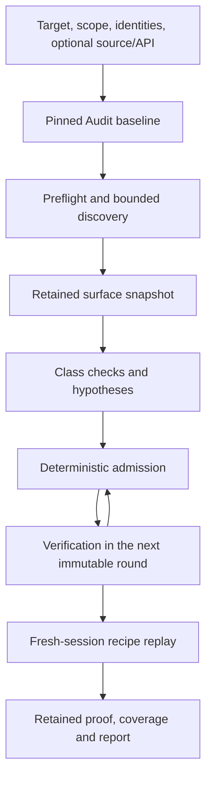

# 33 — Autonomous web and API pentest Audits

Status: **Draft; specified implementation target; not implemented.**

This specification defines a complete Audit program for testing a running
application, with or without source code. New contracts, capabilities, profile
versions and endpoints below are implementation requirements, not descriptions
of currently shipped behavior. Existing profiles retain their contracts.

## 1. Outcome and delivery boundary

A user supplies a target URL, authorizes a bounded scope, selects a budget,
and optionally supplies accounts, API descriptions, example requests and source
code. One start initiates reconnaissance, hypothesis generation, live checks,
independent PoC execution and a retained report. Actions within the authorized
scope do not require repeated approval. Scope expansion requires a new Audit.

Code access and application access are independent:

| Dimension | Values | Required behavior |
| --- | --- | --- |
| `accessMode` | `blackbox`, `source-assisted` | Blackbox receives no repository/source archive. Source-assisted requires exact source inputs and uses them to improve hypotheses. |
| Identity | `anonymous`, named target principals | Both modes support anonymous access and multiple accounts. Code access never supplies an authenticated session. |

Public HTML, JavaScript and other resources served by the target are observable
application data in both modes. OpenAPI is optional. URL-only discovery must
work without hidden endpoint hints; inaccessible or undiscoverable surface is
reported as a gap. Source analysis alone cannot establish a live vulnerability.
Source-only assessments continue to use their existing Audit profiles.

Delivery has two release boundaries:

1. **API profile v1:** HTTP(S) discovery, independent anonymous/A/B sessions,
   HTTP login, injection and authorization checks, session correctness,
   retained HTTP evidence and fresh-session replay.
2. **Web profile v2:** isolated browser contexts, SPA discovery, browser auth
   and XSS checks, controlled SSRF callbacks, and acceptance gates for injection,
   auth, authz, XSS and SSRF. Release new profile versions; do not add these
   capabilities to existing v1 snapshots.

Complex business-logic chains, GraphQL-specific semantics, WebSocket testing,
race exploitation, SSO/MFA automation, unrestricted network shell, broad port
scanning and targeted retesting of fixes are later extensions. Ordinary HTTP
observations of those interfaces remain retainable. SARIF/PDF export and the
full Evals UI are not prerequisites for either execution contract.

## 2. Ownership and compatibility

| Owner | Responsibility |
| --- | --- |
| [Audit](19-audits.md) | Baseline, immutable rounds, item admission, child Runs, collection receipts, review, retention and finalization |
| [Workflow/Planner](00-workflow-and-planner.md) | Ordinary Stage execution and bounded decomposition within assigned tasks |
| [Scheduler](20-scheduler-concurrency-control.md) | Run concurrency, allocation, cancellation and recovery; no pentest-specific scheduling branch |
| Runtime target adapter | Scope enforcement, identity isolation, bounded HTTP/browser execution and trusted capture |
| [Artifact plane](03-artifact-plane.md) | Exact content, forks, protected retained bindings and existing ownership rules |
| [Finding intake](27-findings-tools-and-collections.md) | Proposals, immutable receipts and contribution identity; no second finding store |
| This specification | Engagement, target action policy, pentest evidence/proof, program routing and release gates |



Implement additive, capability-gated changes to existing components:

- `pentest-engagement@1`: typed public engagement, private allocation projection
  and exact credential holds.
- `pentest-http@1`: new model-visible tools backed by a mandatory enforced
  target adapter; [HTTP tools v1](11-http-and-caido-tools.md) remain unchanged.
- `pentest-proof@1`: authenticated capture registration, deterministic predicate
  evaluation and trusted replay receipts.
- `audit-proposed-check-routing@1`: profile-owned role mapping and explicit
  retained dependencies across rounds.
- `audit-optional-finding-review@1`: permit machine-assessed findings while
  leaving analyst review unreviewed and nonblocking.
- Web v2 additionally requires `pentest-browser@1` and `pentest-callback@1`.

These are distinct capabilities. A generic MCP connection, installed scanner,
HTTP proxy, browser executable or successful UI Playwright test proves none of
them. Start rejects an unsupported Server contract. Placement and Runtime
prepare reject a missing or incompatible execution capability. Unknown fields
or versions must fail closed, never disappear during legacy decoding.

All private additions use the existing `contractor/v1alpha1` contract catalog
and authenticated Control Plane transport. They require matching Go/Python
schemas and fixtures before activation; no second private protocol is created.

## 3. Engagement document and immutable baseline

The user-facing engagement is an ordinary exact Project artifact:

```text
media type: application/vnd.contractor.pentest-engagement+json
schema: contractor.pentest.engagement.v1
```

Objects are closed; duplicate keys, unknown fields/versions, invalid Unicode,
nonfinite numbers and out-of-range integers are rejected. Numbers are bounded
integers. Arrays are present even when empty; optional fields are omitted,
not null. Public inputs contain references to credentials, never secret bytes.

| Field | Shape and meaning |
| --- | --- |
| `schema` | Exact schema identifier above |
| `accessMode` | `blackbox` or `source-assisted` |
| `target` | `{origins, seedUrls, deployment}`; deployment is optional `{marker}` supplied as a declaration; verification is a separate trusted observation |
| `scope` | `{routes, exclusions, actionClasses, callbackDestinations}` as defined in section 4 |
| `identities` | Identity descriptors from section 6; exactly one `anonymous` entry |
| `inputs` | Entries `{id, role, artifact, contentDigest}`; roles `source`, `openapi`, `request-examples`, `documentation` |
| `budgets` | Finite limits from section 5 |
| `policy` | `{version, activeChecks, retryPolicy, replayPolicy, requiredCapabilities, optionalCapabilities}` |
| `testData` | Bounded descriptors `{id, origin, identityIds, resourcePrefix, mutationAllowed, cleanupRequired}` for disposable test resources |

`artifact` always means the existing exact ArtifactRef, including revision;
`contentDigest` is `sha256:<64 lowercase hex digits>`. The containing owner and
service determine scope; the document cannot choose an Artifact scope or fetch
an arbitrary external reference. `source-assisted` requires at least one
`source` input. `blackbox` rejects source inputs and source/workspace tools in
its resolved child closures, including inherited Project inputs and Skills
that would supply repository content. Serving public source maps from the
application does not count as a repository input; record their HTTP provenance.

Policy v1 uses `activeChecks: automatic`, `retryPolicy: conservative@1` and
`replayPolicy: fresh-session@1`. It authorizes only the actions listed in scope.
An enabled capability is not itself authorization for a target or action.

At start, Server validates and retains the engagement plus every declared
input, profile, Workflow closure, tool/adapter contract, Skill, model policy,
Run-selected Runtime configuration and credential revision. Persist the authorizing owner,
authorization time, engagement digest and policy digest as trusted baseline
metadata. A user-authored `authorized: true` field is not accepted evidence.
The legacy textual `authorizationScope` is display context, not enforcement.

The public baseline stores non-secret credential identities/revisions and
holds. AllocationSpec receives a private projection restricted to its task,
identity set and allowed target route. Project target, credential alias,
configuration label or Skill changes cannot reinterpret a started Audit.
Changing scope, identity revisions, source mode or pinned inputs requires a
new Audit. The baseline extension is explicitly versioned; old baselines retain
their original decoding and semantics. Physical Agent labels still resolve at
placement under the existing infrastructure contract; retain their exact
effective projection with the allocation. They cannot override engagement
scope, credential identity or required enforcement, and an incompatible route
fails prepare rather than weakening the baseline.

Canonical JSON and SHA-256 follow the repository's existing canonicalization
contract. Identity hashes include normalized semantic content and exact input
refs, not display text, physical allocations or mutable labels. A digest of a
public projection must not be described as a digest of hidden secret bytes.

## 4. Enforced scope and target transport

### 4.1 Route policy

Each route is `{origin, pathPrefixes, methods, actionClasses, addressRanges}`.
Origins are exact scheme/host/effective-port triples; wildcard hosts are not
supported in v1. Paths use segment-prefix matching: `/api` matches `/api` and
`/api/items`, not `/api-admin`. Exclusions have the same shape and win over
allow rules. At least one route must authorize every seed URL. Credentials
have narrower origin bindings and never broaden routes.

The v1 URL parser accepts absolute HTTP(S) URLs with ASCII DNS A-labels or
canonical IPv4/IPv6 literals, optional query, and no userinfo or fragment.
Reject zone identifiers, alternative numeric IPv4 spellings, malformed escapes,
backslashes, control characters, ambiguous authority and empty hosts. UI input
may convert internationalized names before submission; the wire contract uses
ASCII names and shared fixtures rather than different Go/Python normalization.

Path validation produces one canonical path for both matching and transmission.
Reject dot segments, repeated separators, encoded slash/backslash/NUL, and
nested escaping that could change those decisions after another decode. Query
values remain request data, not path policy. Parameter fuzzing never weakens
normalization. Unsupported parser-differential tests receive a coverage gap
instead of bypassing policy. Every redirect is independently parsed and matched;
authorization headers and session state never cross origins implicitly.

Action classes are `read`, `probe`, `test-data-write`, `cleanup`, and, for web
v2, `callback-probe`. A recipe classifies every step by semantic effect; HTTP
method alone does not establish read-only behavior. Login and logout are
stateful session operations permitted only by the pinned login recipe.
Destructive operations, denial of service and mass credential guessing are
outside these profiles. Required but unauthorized steps yield `blocked_by_policy`.

### 4.2 Initial HTTP enforcement implementation

Implement `pentest-target-http@1` as an allocation-owned Runtime adapter with
one internal target client. All `pentest-http@1` operations use this client;
there is no raw client, model-selected proxy or alternate egress argument.

For every physical connection:

1. Validate the normalized origin, path, method, action and identity binding.
2. Resolve through the configured trusted resolver. Every candidate connection
   address must be in that route's explicit `addressRanges` and outside the
   protected destination set. An empty range list is invalid, not unrestricted.
3. Connect to a selected validated address without a second implicit DNS
   lookup. Preserve the approved Host header and HTTPS server name; validate
   certificates using the pinned trust configuration. Verify the peer address.
4. Key connection pools by engagement, identity, origin and policy generation.
   Reuse only a connection whose pinned peer and authorization remain valid.
5. Reserve a request permit before writing bytes and capture the outcome through
   the trusted action record. Apply the same sequence to redirects and retries.

Operator setup may supply suggested ranges, but the user must see and authorize
them in the draft; non-executing draft validation does not discover them through
target requests. A newly resolved address outside the
pinned ranges blocks that route; it does not silently expand the baseline.
Private RFC1918/ULA test networks are allowed only when explicitly listed.
Loopback, link-local, unspecified, multicast and metadata destinations are
always denied in v1; expose same-host lab targets on an explicit test network.

Server supplies a protected destination set for Artifact, LLM, Control Plane,
telemetry, Caido control and configured proxy endpoints. It includes hostnames
and resolved address/port pairs; matching an alias cannot bypass the deny.
Deployment must isolate target services from protected virtual hosts sharing
an indistinguishable permitted address/port. If that separation cannot be
verified, preflight rejects the route. User scope cannot override this deny.

The first release supports this direct controlled transport. A deployment that
requires an upstream proxy is unsupported until that proxy has the same
connected-address, path, identity, accounting and capture guarantees. Ordinary
CONNECT forwarding alone cannot enforce an HTTPS path policy. A proxy failure
never enables direct fallback.

### 4.3 Browser, scanner and MCP admission

A browser or subprocess requires enforced egress beyond its ordinary proxy
setting: a restricted network boundary must prevent direct sockets, alternate
DNS, QUIC, WebRTC and child-process bypasses. HTTPS subrequests must remain
visible to an HTTP-aware enforcement path. Validate navigation, redirects,
subresources, service workers and new windows, including requests caused by
scripts rather than explicit tool calls. Unsupported protocols are blocked
and recorded as gaps.

MCP control routing says nothing about the remote tool's target egress. Admit
an external tool only with a deployment-verified target enforcement and trusted
capture capability. Unverifiable external browser/scanner/MCP tools remain
unavailable to this autonomous profile.

Caido replay, automate and active workflows require this same integration gate.
Native scanner subprocesses do not inherit Podman's code-execution isolation.
A scanner with unaccounted requests cannot satisfy the shared request budget;
its binary's presence and its own timeout are insufficient.

## 5. Budgets and durable accounting

The first profile uses the following defaults and schema hard maxima. Operator
caps and user selections may lower them. Raising a hard maximum requires a new
contract/profile version and conformance fixtures; these are engineering bounds,
not empirical model-quality claims.

| Bound | Default | Hard maximum |
| --- | ---: | ---: |
| Cumulative active Audit time, seconds | 3,600 | 86,400 |
| Physical target requests, including auth/replay | 5,000 | 50,000 |
| Target requests per second, Audit-wide | 5 | 20 |
| Concurrent target requests, Audit-wide | 2 | 8 |
| Origins / routes / exclusions | 1 / 16 / 16 | 16 / 128 / 128 |
| Identities, including anonymous | 3 | 8 |
| Crawl depth / fetched pages | 3 / 200 | 8 / 2,000 |
| Surface variants / hypotheses | 1,000 / 100 | 4,096 / 1,000 |
| Rounds / total submitted Runs | 4 / 128 | 8 / 512 |
| Recipe steps, including setup/control/cleanup | 16 | 64 |
| Replay executions per accepted recipe | 1 | 2 |
| Login actions per attempt / attempts per identity per allocation | 8 / 2 | 16 / 3 |
| Request body / retained response body per exchange | 64 KiB / 256 KiB | 1 MiB / 1 MiB |
| Audit-retained evidence | 32 MiB | 64 MiB |
| Total model calls / total tokens | 200 / 1,000,000 | 2,000 / 10,000,000 |
| Target action intents, including denied/local actions | 10,000 | 100,000 |

Other existing Artifact/package, Stage/model, tool timeout and operator bounds
also apply; the lowest applicable limit wins. Request timeouts default to 30 s
and cannot exceed 120 s or the remaining lifecycle allowance. Redirect chains
have at most 5 hops; automatic retry has at most 1 additional attempt and is
restricted by section 11. At most 64 headers and 32 KiB aggregate header bytes
are accepted. URLs are at most 8,192 bytes. Typed documents are at most 4 MiB,
within the tighter package limit where applicable.

Server owns an Audit budget ledger updated under the Audit admission lock.
A permit binds baseline digest, action ID, allocation fence, identity, origin,
allowed action, maximum bytes and expiry. Runtime cannot mint or renew permits.
Before a hop, Server reserves one request and one concurrent-request slot, and
assigns the earliest start time. Request starts are spaced by at least `1/RPS`
Audit-wide. Expired or reused permits cannot authorize another write.

Reserve the maximum call/token budget for a child execution before dispatch;
settle only against trusted final execution accounting. Unknown usage keeps
its reservation charged. Missing exact token accounting cannot silently expand
the remaining budget. Model-specific limits remain enforced independently.

Retries, redirects, browser subresources, login, setup, control, cleanup and
replay each consume permits. Reserve enough remaining requests for required
cleanup before admitting a mutation; reserve the complete bounded replay plan
before calling an observation reproducible. Insufficient budget records a gap.

Unused reservations return only after a fenced acknowledgement proves no send
occurred. Unknown request outcomes consume their full reservation. A concurrency
slot stays occupied until transport termination is proven or the allocation is
quarantined; a timeout alone must not permit overlapping replacement traffic.
An unavailable ledger blocks new dispatch. Evidence bytes are charged for exact
retained revisions once; temporary upload failures do not grant extra allowance.

Pause/resume preserves cumulative consumption. The existing Audit admission
clock includes queue waiting and excludes Audit pauses. A pause stops new work;
in-flight operations drain under their permits and deadlines. A later deadline
override may shorten the remaining allowance but cannot exceed the pinned
cumulative cap or make it unlimited. Generic Audit zero-deadline behavior does
not apply to this profile. Exhausted non-time budgets finalize with gaps under
[19](19-audits.md); no resume silently resets them.

## 6. Identities, login and test data

An identity descriptor contains `id`, `kind`, `origins`, optional `role` and
`tenant`, and, for an authenticated identity, an exact `credential` revision
and optional exact `loginRecipe`. IDs use `[a-z][a-z0-9-]{0,63}` and are unique
within the engagement. Kinds are `anonymous`, `basic`, `bearer`, `http-login`,
and, in web v2, `browser-login`. The `anonymous` identity has no credential,
login recipe, inherited Authorization, cookies or browser storage.

Implement typed target credential kinds in the existing encrypted credential
store: `target-basic@1`, `target-bearer@1` and `target-login@1`. The login kind
contains a bounded map of named secret fields, at most 16 fields and 16 KiB
total. Revisions are immutable, owner-scoped and held while an active baseline
can use them. Public API/UI return field names and non-secret revision metadata,
never secret values. Existing mutable aliases must resolve to an immutable held
revision before start; unsupported revisions fail compatibility.

The model selects `identityId` and receives an opaque allocation-local session
handle. Tools inject credentials privately at the final allowed origin. Reject
caller overrides of Authorization, Cookie, proxy headers, Host, identity-owned
API-key fields and login-secret fields. A target response cannot create a new
credential binding. Auth-negative controls operate by selecting anonymous or
a declared test identity; arbitrary credential fabrication is not an implicit
capability of HTTP field fuzzing.

Each identity owns a separate cookie jar, token/CSRF state and session generation.
Explicitly suppress Project Authorization inheritance for every pentest request.
One identity's jar never seeds another's, and transport pooling cannot transfer
cookies. Session handles are invalid after release or replacement. No shared
mutable cookie artifact is published to Workers.

### 6.1 Login recipe

A login recipe is an exact `contractor.pentest.login-recipe.v1` document with
`identityId`, ordered `steps`, `successPredicate`, optional `refreshSteps`, and
`secretFields`. Steps use the request/extraction subset of section 9: no shell,
arbitrary JavaScript or model-generated hidden callbacks. Secret variables are
referenced by name and inserted only into declared fields at their bound origin.

Success requires an explicit authenticated control request and an identity
assertion, such as a JSON Pointer matching the expected user ID. A 200 response,
redirect to a home page or presence of a cookie alone is insufficient. Record
declared role/tenant separately from observed identity attributes. Missing an
identity assertion blocks authenticated checks rather than falling back to
anonymous. Refresh executes at most once per verification/replay invocation
and counts toward login/request limits; repeated failure is `auth_expired`.

Replacement allocations log in again within the original budget. The first
observation and replay always use separate session generations, even if they
run in the same physical Runtime process. Browser identities additionally use
separate profiles/contexts with storage cleared on teardown; shared browser
user-data directories are prohibited.

### 6.2 Stateful checks

A check that creates or changes target data must bind a `testData` descriptor.
Use deterministic resource names derived from the action ID and an explicit
setup/cleanup recipe. Where independent objects cannot be created, acquire a
fenced target mutation lock keyed by `(Audit, origin, identity relation,
resource key)`. Trusted admission derives the resource key from the normalized
recipe/resource binding; a Worker cannot evade a lock with an arbitrary label.
Within one owner, overlapping active engagements also require
a shared target/resource lock or explicit isolated test-data namespaces;
separate Audit IDs alone do not establish isolation.

Hold the lock through verification, replay preparation and cleanup as required
by the recipe. Unknown mutation outcome retains the reservation and prevents
conflicting work until bounded reconciliation or operator resolution. A new
session is not a target reset. Replay needs fresh equivalent objects or a
recipe-defined restoration step, with both recorded as evidence.

Cleanup failure is a retained residual effect with affected test resources and
safe recovery instructions. Whole-environment reset belongs to the test harness
or operator, outside Worker tools. It cannot be triggered from target content.

## 7. Preflight, reconnaissance and surface identity

Public draft validation is non-executing: it checks schemas, ownership, exact
refs, policy, configured capabilities and declared route compatibility. Target
reachability, DNS/connected-address verification, TLS and login preflight run
from the placed Runtime only after start authorization. Server/laptop access
does not establish Runtime reachability.

Required-capability failure prevents active testing. An optional missing
capability produces an explicit gap. Auth failure disables only the affected
identity when the profile can still make meaningful progress; it never converts
that identity's checks into anonymous checks. No reachable seeds yields
`discovery_failed`, with no claim of an empty secure application.

Discovery combines seed responses, bounded links/forms, permitted robots and
sitemaps, public JavaScript references and supplied API documents/examples.
Do not execute downloaded instructions, install dependencies, follow external
schema refs or expand authority from target content. Browser discovery adds
routes and requests observed through real UI actions. A crawler adapter is
optional and must satisfy section 4 before use.

The retained surface document uses:

```text
media type: application/vnd.contractor.pentest-surface+json
schema: contractor.pentest.surface.v1
```

| Member | Contract |
| --- | --- |
| `baselineDigest` | Exact owning baseline |
| `entries` | Sorted unique surface variants described below |
| `gaps` | `{subjectId, code, sourceRefs}` with bounded safe messages |
| `discovery` | `{startedAt, finishedAt, inputRefs, consumed, stopReason}` from trusted collection |
| `sourceAlignment` | `declared`, `verified` or `unknown`, plus separate source/deployment evidence refs |

A surface variant contains `id`, `origin`, `method`, `pathTemplate`,
`contentType`, parameter locations, `identityId`, `stateKey`, optional
`objectRelations`, `confidence` and exact `provenance`. Confidence is `observed`,
`declared` or `inferred`. A route in source code is not automatically observed.
Source/deployment verification requires a pinned deployment assertion from an
operator or a validated target marker; a Git commit alone is insufficient.

Compute variant IDs from the canonical origin, method, template, content type,
parameter shape, identity and state key. Preserve concrete request variants as
separate exact refs; do not hash away meaningful body/query differences or
combine A/B access contexts. Provenance identifies an exact exchange/trace,
OpenAPI document and pointer, or exact source artifact and location. The same
variant may have multiple contributions without losing their confidence.

Source enrichment runs separately and adds routes, guards and source-to-sink
hypotheses. A source mismatch restricts implementation-location claims while
still allowing a live vulnerability to be proved against the actual target.

[RequestSet v1](31-scan-request-preparation.md) is reused only for compatible
prepared HTTP inputs. It is not a surface map or a session recipe. Before an
authenticated scan, a versioned binding adapter replaces credential-bearing
fields with private bindings and supplies fresh CSRF/tokens at execution.
Existing RequestSet/scanner artifacts may contain credentials; they must not
be published as public engagement evidence without this projection.

Coverage denominators derive from the retained bounded surface, not an estimate
of unknown application endpoints. Record every crawl/count/depth/size/time limit,
parse failure, denied route, unavailable browser and auth limitation.

## 8. Profiles, hypotheses and immutable rounds

Publish `web-pentest-blackbox@1` and `web-pentest-source-assisted@1`, both with
`mode: risk-assessment`, `inventory.implementation: pentest-classes@1`, and
`batchSize: 1`. The deterministic initial inventory contains injection and
authorization class checks. Auth/session preflight is a prerequisite, not a
substitute for later dedicated auth testing in web v2.

Each check uses a single-Worker passthrough Stage and the existing
`audit-check-results@1`/`audit-results@2` completion contract. Discovery,
source enrichment, verification and assessment are ordinary pinned Workflow
roles. Physical Workers remain Scheduler-owned. Profiles declare exact roles;
Server never infers a role from its name or a model-selected Workflow reference.

Add a versioned profile `proposedChecks` mapping with entries:
`{planSchema, phase, workflowRole, requiredCapabilities}`. `phase` is
`verify` or `replay`; each entry must resolve to one compatible `kind: check`
role. No duplicate or ambiguous selector is accepted. Also add the explicit
input source `retained-dependency`, resolved from the accepted item's exact
dependency manifest. It never means “latest output” or a search of another
round by role name.

Add `findingConfirmation: optional` to the interaction policy. It admits
findings and machine assessments without making analyst decisions a completion
barrier. Existing `disabled` and `human-required` retain their meanings.
Use `activeChecks: automatic` only when engagement and transport capabilities
are supported. Use `reportAcceptance: automatic` for the autonomous profiles.
Neither choice creates a human true-positive or severity decision.

### 8.1 Typed hypothesis admission

A `contractor.pentest.check-plan.v1` evidence document contains:

- `class`: `injection`, `auth`, `authz`, `xss` or `ssrf`.
- `phase`, exact `surfaceRefs`, `identityIds`, `preconditions`, and a bounded
  `expectedViolation` including the authorization/security expectation source.
- Exact `recipe`, `predicateDigest`, control-step IDs, required capabilities,
  worst-case budget reservation, mutation keys and expected residual effects.
- `proposedCheckOrdinal`, matching one entry in the containing proposal.

Publish the plan and all dependencies before submitting the existing finding
proposal with their exact evidence refs. Do not alter FindingProposal v1 or
place executable JSON/shell in `ProposedCheck.method`. A proposal can contain
multiple typed plans only when ordinals are unique. Server binds the admitted
plan to the trusted intake receipt and ordinal; a document's self-declared
receipt ID has no authority. Malformed, missing, ambiguous or foreign dependencies
fail admission with a recorded reason.

Admission validates owner/Audit lineage, exact bytes, retention, scope,
identity readiness, recipe effects, predicates, required tools and budget.
Deduplicate by class, surface relation, identity relation, recipe/predicate
versions and security expectation. A CWE or URL alone never merges checks.
Equivalent sources remain separate contributions to one admitted check.

The model may rank proposals, but ordering is frozen in the assessment output
before selection. Trusted selection applies policy and budget in that order,
then uses the stable plan digest to break ties. No admission result can add
permission that the engagement lacks.

### 8.2 Round progression

1. Start pins the initial class worklist **before** discovery. Round 1 discovery
   produces a retained surface snapshot; class checks generate concrete plans.
2. Assessment records every proposal as admitted, rejected or deferred, with
   reasons. It never appends items to the accepted round.
3. The next round executes admitted verification plans. Each item package has
   a dependency manifest binding baseline, source round, surface, plan, recipe,
   hypothesis receipt and selected evidence refs/digests.
4. A successful observation produces an eligible replay plan with the same
   recipe/predicate digest and explicit observation dependency. The Controller
   derives this plan from the accepted verification receipt and records a new
   admission decision linked to the original hypothesis receipt/ordinal; it
   does not append evidence to an immutable intake receipt. API v1 executes
   replay through the next round's replay role in a separate Run and invocation.
5. New hypotheses discovered during verification enter only a later immutable
   round. Stop on no admitted work, exhausted budget/rounds, cancel, unavailable
   target or terminal policy failure. Deferred work remains in coverage.

Before each dispatch, validate all dependency refs against the Audit's retained
links, then materialize them into authorized child inputs. Preserve original
identity and fork mappings; do not reinterpret a Project ref as a Run ref.
The current same-round `retained-output` behavior remains unchanged for other
profiles. Missing retained input blocks the item; it cannot trigger a lookup
of a newer source binding.

Existing `direct-verifications.v1` may supply a finding already checked within
its source Run. Accept it without a synthetic discovery Run when its retained
evidence satisfies this specification. Its ordinary `supported` assessment
does not establish pentest proof; trusted observation and replay are still
required, with distinct invocation identities.

## 9. Recipe and deterministic predicate contract

A PoC recipe uses media type `application/vnd.contractor.pentest-recipe+json`
and schema `contractor.pentest.recipe.v1`. It contains `id`, `version`, ordered
`steps`, `predicate`, `cleanup`, and `requirements`. Canonical recipe bytes and
the predicate digest are frozen before the first verification action. Changing
payload, control or predicate creates a new recipe and new attempt; observed
responses cannot retroactively redefine success.

Every step has a unique `id`, `kind`, `identityId`, `actionClass`, and explicit
input references. V1 step kinds are `request`, `extract`, `assert`, and
`wait`. `wait` is bounded to 5 seconds per step and 30 seconds per recipe.
There are no loops, recursion, shell commands or arbitrary executable code.
A fixed list of repeated samples must fit the step and request budgets.

A request has an approved origin/path template, method, safe headers and an
optional bounded body. Variable interpolation is typed by destination:
path segment, query value, header value or JSON/form value. Reject variables
that change scheme, host or port, inject header syntax or escape path policy.
Server validates static structure; Runtime validates the fully resolved request
again immediately before sending it.

Extraction uses a bounded JSON Pointer, a named response header, a named cookie,
or a literal bounded text delimiter. No regular-expression engine or arbitrary
JavaScript is needed for API v1. Each value records its producing action and
session generation. Credential/token values remain private; handles cannot be
serialized into ordinary artifacts as recoverable secrets. Missing extraction
is an explicit blocked/inconclusive outcome, not an empty guessed value.

Predicates are a closed expression tree, maximum depth 8 and 64 nodes:

| Predicate | Meaning |
| --- | --- |
| `all`, `any`, `not` | Boolean composition over typed child predicates |
| `statusEquals` | One completed action returned the specified HTTP status |
| `jsonEquals` | JSON Pointer value equals a bounded typed literal or a captured test-object value |
| `textContainsMarker` | A complete selected response region contains the exact generated non-secret marker |
| `valuesEqual`, `valuesDifferent` | Compare compatible typed captures from explicitly named actions |
| `identityEquals` | A successful identity control establishes the expected principal |
| `browserMarker` | Web v2 trusted script execution observation in the specified origin/context |
| `callbackReceived` | Web v2 authenticated callback receipt matches the nonce, destination and time window |

Missing, truncated, redacted-away or type-incompatible operands evaluate as
`unknown`, not false. Use three-valued logic: `not unknown` is unknown;
`all` is false if any operand is false, true only if all are true; `any` is true
if any is true, false only if all are false. Otherwise the result is unknown.
Every proof predicate must also pass its class-specific contract below;
a lone status predicate cannot establish a vulnerability.

| Class | Required success and control evidence |
| --- | --- |
| Injection | Baseline/control plus a target-side effect or data response tied to the injected input; an error, scanner label or uncontrolled timing difference is insufficient. Timing-only proof is deferred from v1. |
| Authz/IDOR | Owner B's identity and test-object ownership, the expected access restriction, then A/anonymous successfully reading/changing that object despite the restriction; publicly shared data is not an IDOR. |
| Auth/session | Authenticated identity controls before/after the tested transition and access that violates the pinned session/auth expectation. |
| XSS | Runtime/browser-recorded execution of a fresh non-secret marker in the intended target origin and browsing context; HTML reflection and screenshots alone do not pass. |
| SSRF | Trusted callback receipt for a fresh unpredictable nonce tied to the exact target action and time window; ordinary model/browser requests cannot mint a callback receipt. |

The security expectation must have a retained source: user-supplied access
policy, exact API/source contract or the fixture's public task contract.
An inferred expectation remains explicit and cannot by itself prove unauthorized
access. Evidence may establish surprising behavior while leaving its security
interpretation inconclusive.

Replay executes the same recipe/predicate under a separate trusted invocation,
fresh session generations and prepared equivalent test objects. Random markers
and created object IDs may differ only through declared variable slots; their
provenance is captured. Target/deployment changes between observation and replay
produce `target_changed` and require a new observation attempt. A replay with
unknown identity, missing control or a different predicate is not successful.

One successful replay is required for `reproduced`. A failed replay cannot be
discarded in favor of a later success without appearing in the report. Repeated
mixed outcomes are `inconclusive` with a `non_repeatable` reason; there is no
best-of-N promotion. Replay is independent execution, not a claim of independent
expert reasoning or a fresh environment reset.

## 10. Trusted evidence, proof and retention

Add ordinary exact evidence documents with these contracts:

| Media type suffix after `application/vnd.contractor.` | Schema | Producer |
| --- | --- | --- |
| `pentest-check-plan+json` | `contractor.pentest.check-plan.v1` | Worker proposal; trusted admission validates it |
| `pentest-http-exchange+json` | `contractor.pentest.http-exchange.v1` | Runtime target adapter |
| `pentest-observation+json` | `contractor.pentest.observation.v1` | Trusted predicate evaluator |
| `pentest-verification+json` | `contractor.pentest.verification.v1` | Trusted collection over observation/replay receipts |
| `pentest-browser-trace+json` | `contractor.pentest.browser-trace.v1` | Web v2 browser adapter |
| `pentest-callback-receipt+json` | `contractor.pentest.callback-receipt.v1` | Web v2 callback service adapter |

These reuse ordinary Artifact storage, intake receipts, AuditArtifactLinks and
package limits. No independent evidence bucket, finding database or unbounded
trace store is introduced. [Structured finding analysis](28-finding-analysis-and-sarif.md)
may reference these documents through versioned decoders; implementing its
SARIF exporter is a separate delivery.

An HTTP exchange contains `actionId`, `attempt`, `baselineDigest`, `policyDigest`,
`recipeDigest`, `stepId`, `identityId`, `sessionGeneration`, `targetOrigin`,
optional deployment marker, timestamps/duration, request projection, response
projection, redirect/retry parent IDs, exact body refs, byte counts and
truncation/redaction descriptors. Trusted execution metadata binds Run, Stage,
allocation, invocation and tool contract. Network failure has a typed outcome
and no fabricated response status.

After capture, Runtime registers the exact artifact ref/digest through its
authenticated allocation authority. Server verifies the active fence, prepared
tool capability, action permit, invocation and baseline, then stores a capture
receipt. Uploading identical-looking JSON through ordinary Artifact APIs cannot
create such a receipt. Model-authored execution IDs are ignored as authority.
Accepted receipts are immutable and idempotent by action ID plus attempt;
conflicting bytes are rejected rather than overwriting earlier observations.

An observation contains the pinned predicate and recipe digests, exact input
capture receipts, typed operand results, control result and final
`true`/`false`/`unknown`. Replay has its own observation and invocation receipt.
A verification document references the hypothesis receipt/ordinal, observation,
replay attempts, cleanup results, semantic assessment, proof state and reasons.
Server recomputes admissibility and deterministic predicate results from the
retained safe evidence; a model-authored `success` boolean is not accepted.

### 10.1 Redaction and public projections

Remove Authorization, cookies, Set-Cookie, bound API keys, passwords, private
login variables and session tokens before exposing tool results, events,
artifacts or reports. References use binding placeholders and identity IDs.
The ordinary `http-tools@1` finding capture is not this projection: it keeps
credentials the model supplied itself and replaces only the Runtime-injected
project target credential with the placeholder `[runtime-target-credential]`
([27](27-findings-tools-and-collections.md#selected-http-evidence)); pentest
evidence applies the full redaction above.
Query/body/header extraction is taint-aware: values derived from credential or
session fields remain private regardless of their new variable name.

Retained bodies use a versioned projection policy. V1 retains only declared
non-secret evidence regions and test markers after credential/token redaction;
unclassified sensitive regions are omitted. Binary bodies are omitted unless
a reviewed decoder can produce the required safe evidence. Record original
length, retained length, omitted field paths and reason codes without removed
values. Screenshots, DOM snapshots and browser console/network traces require
the same projection; a screenshot is not exempt from credential handling.

Projection digests identify the bytes actually retained, not raw wire traffic.
Do not publish raw-secret hashes that enable password guessing. Raw buffers
are bounded, memory-only and erased during processing/teardown; retry and crash
recovery cannot rely on recovering them. The model never receives login-secret
values to redact later. If the retained projection cannot support a predicate,
that operand is unknown and proof stays inconclusive. A safe capture of a
non-secret derived test marker can be used only when its transformation is a
pinned deterministic part of the evidence contract.

### 10.2 Result dimensions

| Dimension | Values and rule |
| --- | --- |
| Execution | Existing completed/failed/cancelled/blocked state plus action `unknown_outcome`; completion does not imply a vulnerability |
| Semantic assessment | Existing `supported`, `refuted`, `inconclusive`, `blocked` |
| Proof | `not_observed`, `observed`, `reproduced`, `inconclusive`; accompanied by replay outcome `not_attempted`, `passed`, `failed`, `blocked`, `unknown` |
| Analyst review | Existing unreviewed/TP/FP, severity and duplicate decisions; never inferred from proof |

`reproduced` requires valid accepted observation, all required controls and a
successful independent replay, with no contradictory replay hidden from view.
An observed issue whose replay cannot run remains `observed` with the explicit
replay gap. A false vulnerability predicate with valid controls may refute only
that hypothesis under those conditions. Auth failure, missing evidence, failed
transport or unknown mutation cannot refute a vulnerability.

Retain dependency closure before accepting proof: recipe, plan, originating
receipt, surface/source refs used by the claim, observations, replay and capture
receipts. Charge evidence once under existing retained revision rules. Source
Run deletion must not break an accepted proof. Artifact holds and credential
holds are different: retaining a report never exports a secret. Once execution
is terminal, credential holds may follow existing release rules; a later fresh
Audit/retest must revalidate credential availability and authorization.

## 11. Action journal, cancellation and recovery

Server maintains a durable action journal within Audit ownership. Each record
contains an immutable action ID, recipe/step identity, baseline/policy digests,
allocation fence, budget reservation, mutation lock, effect classification and
safe request projection. Physical attempts have separate ordinals and outcomes.
No credential values are persisted in the journal.

```text
prepared -> authorized -> sending -> completed
                         sending -> failed
                         sending -> unknown_outcome
prepared/authorized -> denied or cancelled_before_send
```

Runtime must durably acknowledge `sending` before a network write. A crash after
that transition is conservatively unknown even if bytes might not have left.
Completed redelivery returns the accepted receipt. Prepared/authorized actions
may be released only after fencing proves the old executor cannot send.
Partial trace artifacts without an accepted receipt are not proof checkpoints.

Transport ambiguity is separate from a received HTTP error. An HTTP 500 can
have changed target state. Automatic retries require a recipe-declared read
operation and a failure proven to precede sending, or an explicit tested target
idempotency contract whose key/result reconciliation is pinned. Method GET alone
does not qualify. Stateful unknown actions are never automatically repeated.
Bounded read-only reconciliation may inspect a deterministic test-object key;
its own requests require permits and its observations do not rewrite history.

On lease loss/cancel, stop dispatch, cancel active target operations, kill
browser/scanner processes, close clients and erase sessions. Existing lifecycle
fencing rejects late publication from stale allocations. Failure to prove that
a child stopped quarantines capacity and leaves affected outcomes unknown.
Do not start conflicting replacement work merely because a lease expired.

A recovered Controller reopens exact baseline/dependency refs, keeps accepted
receipts and budget consumption, and reconciles journal state before dispatch.
It never repeats unknown actions to obtain a prettier report. Scheduler/Audit
retry policy must consult this journal even when the previous Run technically
failed and item attempts remain. Safe not-yet-started work can continue within
the original authorization and allowance.

Cancellation preserves already accepted evidence, outstanding intent records
and cleanup gaps. Existing Audit finalization/deletion owns draining and purge.
Target residue is reported before retained Audit data is deliberately deleted;
a deletion request is not an implicit target cleanup or replay command.

## 12. Browser and callback extension

`pentest-browser@1` adds bounded navigation, DOM inspection, element interaction,
network observation and screenshot capture. Tools use session handles, stable
bounded locators and approved URLs; they do not expose generic browser DevTools,
arbitrary process arguments or unrestricted JavaScript execution. XSS probes
use a reviewed marker harness and capture actual execution, not a model claim.
Host process access, downloads and filesystem mounts remain constrained by the
allocation contract. Browser input data is not instruction authority.

Every identity gets a separate context. New tabs inherit only that identity's
policy; workers/subresources remain subject to enforcement. On context reset,
all storage, cookies, service workers and pending requests are removed. Artifacts
retain only redacted traces and selected evidence. Browser-internal control
connections are not target traffic and cannot be reached through target URLs.

A callback destination is an operator-configured, exact origin plus an adapter
identity. The model cannot supply an arbitrary public collector. Callback setup
creates a random nonce of at least 128 bits, binds it to Audit/action/origin and
a window of at most 120 seconds, and exposes only the payload URL needed by the
target probe. Collection uses a separate authenticated control path unavailable
to Workers and target application requests.

A callback receipt binds nonce, observation time, safe source metadata and
adapter provenance. The target adapter denies direct Worker/browser/scanner
requests to the collector destination; inserting its URL into an authorized
SSRF test field is permitted only under `callback-probe`. Validate that the
selected test mechanism cannot directly manufacture the oracle observation
through another enabled tool. Nonces expire and cannot be reused across tests.

An absent callback yields inconclusive/not-observed status, not proof that SSRF
is absent. Unreachable callback infrastructure is a coverage gap. Callback
resources are closed on completion/cancel, with bounded late-arrival handling
that never changes an already frozen report. Web v2 must pass browser egress,
identity, callback authenticity and teardown tests before being advertised.

## 13. API, CLI, UI and reports

Extend existing Audit APIs and services rather than adding a separate pentest
job lifecycle. The exact engagement artifact is a declared Audit input. Draft
creation validates its owner and syntax; start repeats all authoritative checks.
Existing CAS/idempotency rules apply to start, resume, cancel and mutations.

| Surface | Required addition |
| --- | --- |
| Profile catalog | Access mode, release boundary, required/optional capabilities, supported identity kinds and finite limits |
| `POST /v1/audits/{auditId}/preflight` | Non-executing validation of the current draft, with `If-Match`; returns baseline-input digest, compatible/missing capabilities and bounded reason codes, without contacting target or resolving secrets into the response |
| Audit detail | Public engagement projection, cumulative budget use/reservations, phase, live preflight results and stop/gap reasons |
| `GET /v1/audits/{auditId}/surface` | Revision-pinned keyset pagination over retained surface variants, with identity/class/confidence filters |
| Existing coverage endpoint | Operation × identity × class outcomes and discovery denominator/provenance |
| Finding detail/provenance | Typed proof, observations, replay attempts, safe recipes, cleanup effects and separate analyst review |
| Existing report endpoint | Exact machine/Markdown report, proof and coverage limitations, frozen independently of later triage |

Public preflight is a bounded read computation despite its POST body; it creates
no action authorization, credential hold or target mutation. Its result may
become stale, so start never trusts a previous success. An active Audit exposes
its actual Runtime preflight through ordinary reads instead of rerunning it via
this endpoint. Unknown/foreign IDs retain the same safe 404 behavior. Invalid
states conflict; schema/input errors use the existing validation-error shape.

New list cursors bind Audit, retained revision, filters and sort key; stale
revisions require refetch, not a mixed snapshot. Follow existing OpenAPI,
generated TypeScript client and WebSocket invalidation contracts. Private
capture/journal/permit operations are internal Control Plane services; public
clients cannot register trusted observations or grant a Worker permit.

New Audit UI sequence:

1. Select target and `blackbox`/`source-assisted`; select exact source inputs
   only for the latter, with optional API documents/examples in both modes.
2. Choose anonymous and named identities; enter secrets through existing
   write-only credential flows and explain the expected identity assertions.
3. Review origins, network ranges, path/action scope, disposable test resources,
   exclusions, capabilities and finite budget.
4. Run non-executing validation, then start with one explicit authorization for
   the displayed engagement. Active checks need no repeated confirmation.
5. Observe discovery/check/replay phases, consumed/reserved budget and gaps.
   Read results through proof and coverage, with analyst review independently
   available after completion.

CLI and API use the same services and exact artifacts. Exported recipes contain
identity/binding placeholders and setup/cleanup instructions. Downloading a
recipe does not disclose credentials or grant a future replay authorization.

Reports are deterministically assembled from retained records. LLM narrative
may explain results but cannot change assessment, proof, severity decisions or
counts. JSON and Markdown include:

- Access mode, supplied account roles and input visibility, target/deployment,
  exact scope and profile/source/tool/model/Skill pins.
- Reproduced findings, observed-only issues and inconclusive hypotheses as
  separate groups, with all replay attempts and controls.
- Recipes, exact evidence links, identity relationships, source alignment and
  explicit limitations on implementation-location claims.
- Per operation × identity × class: planned, attempted, completed, blocked,
  skipped and inconclusive states; discovery gaps remain alongside the matrix.
- Used/reserved budgets, stop reason, unknown action outcomes, cleanup failures
  and residual test resources.

Coverage percentages, when shown, name the retained denominator. Unknown
application surface has no global completion percentage. A completed Audit with
zero findings and failed discovery/expired auth/exhausted budget must visibly
say that coverage is incomplete. It must not conclude that the application
has no vulnerabilities.

## 14. Delivery and existing work

Reuse existing work by contract, with task files retaining their own status.
This table does not mark any task complete or create new task records.

| Existing direction | Required integration |
| --- | --- |
| V54 proposed 001–004 | Implement the engagement, enforced target transport, identities and trusted evidence specified here; source is optional |
| V54 proposed 005–007 | URL-only discovery plus source enrichment, typed plans, explicit round routing, verification and replay |
| V54 proposed 008–010 | Shared API/UI, fixtures/scorer and API profile release gate |
| V54 proposed 011–012 | Browser and callback extensions with full web acceptance |
| V55 and [scan planning](32-scan-planning.md) | Reuse prepared inputs, fixed Workers and durable scan-job recovery only after scope/identity/capture integration; scan planner owns scanner fanout, Audit owns hypotheses |
| V55 crawler/ranking work | Optional discovery/ranking adapters; neither is required for direct HTTP MVP |
| V61 toolset configuration | Reuse exact settings, credential holds and MCP lifecycle; target principals are identities within a Run, not conflicting per-agent infrastructure settings |
| [Portable Evals](26-portable-evaluation-format.md), [managed Evals](30-managed-evals.md), V38 | Add pentest fixtures/scorers and attributed comparison through existing engines |
| V60 recovery/runtime/evidence/security reviews | Include the new invariants in their relevant checks; the full review backlog is not a prerequisite for contract work |
| [Finding analysis](28-finding-analysis-and-sarif.md) | Align evidence decoders and vocabulary; SARIF remains independently deliverable |

Implement in this dependency order:

1. Closed schemas, shared valid/invalid fixtures, profile extensions, baseline
   projection, credential revisions and permit/journal persistence contracts.
2. Enforced direct HTTP transport, shared accounting, cancellation and unknown
   outcome handling; prove denial/fault cases before model-driven probing.
3. Independent identities, login, redacted capture and trusted observation
   registration, including anonymous suppression of Project auth.
4. URL-only discovery and separate source enrichment with explicit coverage.
5. Typed hypothesis admission, retained cross-round dependencies, deterministic
   predicates and fresh-session replay.
6. Both API profile versions, UI/API/CLI projections and deterministic release
   gate; then frozen live quality evaluation.
7. Browser egress/context/trace capability and XSS/web-auth gates.
8. Callback lifecycle/SSRF proof and complete web v2 gate.

Fixtures and independent oracles can be implemented after step 1 while transport
work proceeds. Direct HTTP MVP does not wait for every scanner, MCP integration,
SARIF exporter or complete Evals browser journey.

## 15. Acceptance and evaluation gates

The release gate exercises the production service/transport path with real
Runtime processes and deterministic targets. Mocked model output may propose
plans but cannot manufacture accepted capture receipts or oracle success.

| Gate | Required positive and negative cases |
| --- | --- |
| Inputs and separation | URL-only with no source/OpenAPI; exact source-assisted input; anonymous/A/B in both modes; source/ground-truth inputs rejected from blackbox closures |
| Scope | Allowed HTTP and explicit private test network; denied redirect, rebinding, encoded path, protected alias, cross-origin credential transfer and alternate egress; unsupported adapter rejected before sending |
| Budgets | Concurrent Workers share request/rate/concurrency/token bounds; retries/login/subresources counted; duplicate settlement and restart cannot refund unknown usage |
| Sessions | Correct A/B controls, truly anonymous requests, cookie/storage separation, expiry/refresh failure, replacement login and replay generation separation |
| Reconnaissance | HTTP links/forms/JS and optional API inputs; missing surface, crawl limits, parse errors and denied routes produce retained gaps |
| Admission and rounds | Receipt/ordinal matching, exact role routing, dedup contributions, retained dependencies after source deletion, immutable accepted worklists and bounded later hypotheses |
| Proof | Injection/authz positives pass observation and replay; paired fixed/negative fixtures fail the same oracle; status-only, fabricated trace, missing control, changed predicate and inconsistent replay cannot yield reproduced |
| Evidence | Forged invocation/permit/receipt rejected; redaction/truncation propagates unknown; credential canaries absent from tool views, events, artifacts, reports and logs |
| Recovery | Crash before/after send and before/after capture receipt; duplicate delivery; lease loss; cancel; unknown mutation never automatically repeated; unproven teardown quarantines capacity |
| State and cleanup | Isolated objects or serialization; failed cleanup and unknown residue reported; fresh session not confused with fresh target |
| Reporting | Proof distinct from human TP/FP; incomplete zero-result Audit remains incomplete; deterministic report survives permitted source Run deletion |
| Browser/callback | Required for web v2: actual execution marker, isolated contexts, blocked subrequest bypasses, authentic nonce/window receipt, denied direct collector access, teardown and late-arrival behavior |

Use existing Playground target lifecycle and evaluation services. Start with
selected VAmPI injection/authz cases, then suitable DSVW/crAPI cases and small
fixtures for missing controls. A fixed branch is a negative control for its
specific case, not a declaration that an entire target is secure. Runtime
reachability is a separate setup assertion; localhost Compose URLs are not
assumed reachable from a placed Worker.

For an end-to-end authorization case, create a disposable object owned by B,
prove B's identity and ownership, attempt access as A and anonymous against
paired vulnerable/fixed endpoints, then replay on fresh sessions and objects.
The external evaluator checks actual target state and the report's proof chain.
The Worker receives the permitted task and account bindings, not private
verifier/reset hooks or expected answers. Injection fixtures similarly use a
controlled target-side marker and a matched negative case.

Keep protocol conformance separate from model quality. Deterministic gates
require every required case to pass, zero out-of-scope sends, zero leaked
credential canaries and zero unjustified proof promotions. A single failure
blocks release of the affected capability.

Before the first live experiment, freeze an evaluation manifest with exact
profiles/models/tools/Skills, fixture/scorer revisions, source/auth matrix,
repeat count, held-out cases, budgets, success criteria and numerical quality
thresholds. Quality thresholds are an experiment input; they are not invented
from the observed score. A missing manifest blocks a quality claim, not local
protocol development.

Compare the existing URL-only Workflow with the new Audit under equal inputs
and budgets. Compare source-assisted in a separate pair whose sole intended
change is source access. Measure unique externally confirmed findings, negative
control false positives, successful replay rate, attempted/completed/gap
coverage, time to first reproduced finding, requests, tokens and cost. Flag
capture remains a benchmark-specific metric rather than a replacement for
proof-chain/report quality. Retain every failed, cancelled and inconclusive
sample in the denominator.

Implementation readiness requires the schemas and gates above, published exact
profile closures and a recorded deterministic release result. Live quality
claims additionally require the frozen evaluation and its retained results.
Writing this specification establishes neither implementation nor measured
model quality.
